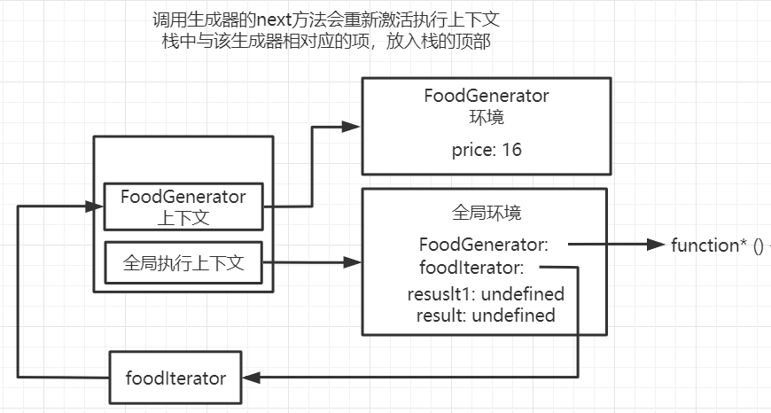
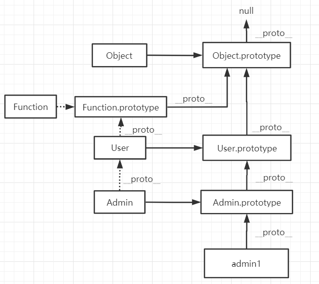

# 基础知识

## 变量声明

### 命名规则

1. JavaScript中的变量是弱类型的解释型语言，它可以保存所有类型的数据，即变量没有类型而值有类型。
2. 变量名可以以字母、$、下划线开始，后跟字母、数字、下划线

下面都是合法的命名

```javascript
let name = 'lsr';
let $ = 'ninjia';
```

JavaScript语言的关键字、保留字不能用作变量名，比如<code>true</code>、<code>if</code>、<code>while</code>、<code>class</code>等。

```javascript
// 错误示范
let class = 'lsr';
```

### 变量声明

可以使用多种关键字定义变量，比如<code>var</code>、<code>let</code>、<code>const</code>。

```javascript
let name = 'lsr'; 
```

以上的语句是声明和赋值的结合

```javascript
let name;
name = 'lsr';
```

使用<code>,</code>可以同时声明多个变量

```javascript
let n = 2, m = 3;
console.log(f);
```

下面演示了变量可以更换不同类型的数据

```javascript
// 变量可以更换不同类型的数据
let lsr = 'houdunren';
console.log(typeof lsr);
lsr = 100;
console.log(typeof lsr);
```

### 弱类型

在JavaScript中变量类型由所引用的值决定

```JavaScript
var web = 'hdcms';
console.log(typeof web); // string
web = 99;
console.log(typeof web); // number
web = {};
console.log(typeof web); // object
```

### 变量提升

通俗的来说，变量提升就是解析器会先解析代码，然后把声明的变量的变量声明提升到最前面

#### 注册标识符的过程

JavaScript是解释型语言。JavaScript引擎对代码的处理包括解析和执行两个步骤。在解析过程中会创建与代码结构相关联的词法环境（通俗的来讲就是作用域），并且JavaScript引擎会注册词法环境中所声明的变量和函数，具体步骤如下。

注意：词法环境是解析时创建的，是函数或者变量在创建时候的环境，词法环境可以在相应代码执行过程中进行完善或修改。

1. 如果是创建一个函数环境，那么创建`arguments`对象以及函数形参并将其初始化为`undefined`。如果是非函数环境，则跳过此步骤。
2. 如果是创建全局或函数环境，就扫描当前代码进行函数声明（不会扫描其他函数的函数体），但是不会扫描函数表达式或者箭头函数。对于所找到的函数声明，将创建函数，并绑定到当前词法环境与函数名相同的标识符上。若该标识符已经存在，那么该标识符的值将被重写。如果是块级作用域，则跳过此步骤。
3. 扫描当前的代码进行变量声明。在函数或全局环境中，找到所有在当前环境之内、其他函数之外通过<code>var</code>声明的变量，并找到所有在其他函数和代码块之外通过<code>let</code>或者<code>const</code>定义的变量。在块级环境中，仅查找当前代码块中通过<code>let</code>和<code>const</code>定义的变量，若该标识符不存在，进行注册并将其初始化为<code>undefined</code>。若该标识符已经存在，则保留其原来的值。


<center>注册标识符的过程取决于环境的类型</center>

注意：由于用<code>let</code>和<code>const</code>关键字定义的变量存在临时性死区（TDZ），要求用<code>let</code>和<code>const</code>声明的变量必须在人为显式声明后才能使用，因此在声明语句之前是无法读取到用<code>let</code>和<code>const</code>声明的变量的值的。这也就是使用<code>var</code>关键字声明的变量具有提升效果的原因。

下面的代码在解析过程中发现<code>class</code>不能作为变量名，因此没有到执行环节就出错了。

```javascript
var web = 'housunren';
console.log(web);
// 解析过程中发现class不能作为变量名，因此没有到执行环节就出错了
let class = 'lsr';
```

使用<code>var</code>声明的变量会被提升到当前作用域的最前面（实际上并没有改变声明语句的位置，提升效果是由于JavaScript引擎注册标识符的机制引起的）

```javascript
// var声明的变量具有提升效果
console.log(lsr); // undefined
var lsr = 'lxy';
```

下面是<code>if(false)</code>中用var声明的变量也会有提升效果（注意：JavaScript引擎不会将用<code>var</code>声明的变量添加到最近的块级作用域中，而是将它添加到最近的全局或者函数作用域中）

```javascript
var web = 'houdunren';

function test() {
  if (false) {
    // 注意 var 声明的变量不会添加到块级作用域中
    var web = '豆花米线';
  }
  console.log(web); // undefined
}
test();
console.log(web); // houdunren
```

使用<code>var</code>定义的变量，变量声明会被提升到当前作用域的最前面，赋值还在原来的位置（并没有真正改变语句位置，只是在第三步注册变量时，将它注册进了当前词法环境并被初始化为<code>undefined</code>，等代码执行时才执行了赋值语句给变量重新赋值）

```javascript
console.log(lsr);
var lsr = 'lxy';

// 为了便于理解，可以将以上代码看成如下解析过程
var lsr;
console.log(lsr);
lsr = 'houdunren';
```

以下的代码既存在了函数提升，也存在变量提升。代码注册标识符的过程如下：

1. 当前代码处于全局环境，因此跳过注册标识符流程的第一步骤。
2. 当前代码处于全局环境。扫描当前代码中的函数声明（不会扫描函数表达式和箭头函数），对于找到的函数声明(<code>rain</code>)，将创建函数（这里<code>rain</code>函数的解析过程同理）并将该绑定到当前词法环境与函数名相同的标识符上，若该标识符已经在词法环境中存在，则覆写该标识符的值。（这里变量（标识符）<code>rain</code>的值为定义的函数）
3. 扫描代码中当前环境之内、其他函数之外通过<code>var</code>声明的变量，接着找到所有在其他函数或代码块之外通过<code>let</code>或<code>const</code>声明的变量，最后将找到的变量注册到当前词法环境中，若该标识符有值，则保留原始值，若标识符在词法环境中不存在，则将其初始化为<code>undefined</code>。（这里<code>rain</code>标识符已经有值了，保留其原始值）

解析过程完成后，代码执行时，第一次读取<code>rain</code>的值自然就是自定义的<code>rain</code>函数，接下来又对<code>rain</code>变量重新赋值，也就覆盖了词法作用域中<code>rain</code>变量的值，第二次读取<code>rain</code>的值就变成了重新赋的新值

```javascript
console.log(rain); // function rain
var rain = 'lsr';
console.log(rain); // lsr
function rain() {
  console.log("Hi,I'm Rain!");
}
```

### TDZ

`TDZ`又称暂时性死区，指变量在作用域（词法环境）中已经存在，但必须在<code>let/const</code>声明语句之后才能使用。

`TDZ`可以让程序保持先声明后使用的习惯，可以让程序更稳定。

* 变量要先声明后使用
* 建议使用<code>let/const</code>而少使用<code>var</code>

使用<code>let/const</code>声明的变量存在临时性死区（`TDZ`），在声明语句之前调用会产生错误。

```javascript
console.log(x); // Cannot access 'x' before initialization
let x = 100;
```

在<code>run</code>函数作用域中产生`TDZ`，不允许变量在未声明前使用。

```javascript
hd = 'houdunren';
function run() {
  console.log(hd);
  let hd = 'hdcms';
}
run();
```

下面的代码中变量<code>b</code>没有声明赋值不允许直接使用

```javascript
function test(a = b, b = 3) {}
test();
```

因为<code>a</code>已经赋值，所以<code>b</code>可以使用<code>a</code>变量，下面代码访问正常

```javascript
function test(a = 3, b = b) {}
test();
```

## 块作用域

### 共同点

<code>var/let/const</code>共同点是全局作用域中定义的变量，可以在函数中使用

```javascript
var hd = 'hdcms';
function show() {
  return hd;
}
console.log(show()); // hdcms
```

函数中声明的变量，只能在当前函数及其子函数中使用

```javascript
function test() {
  var web = 'hahaha';
  function show() {
    console.log(web);
  }
  show(); // hahaha
  console.log(web); // hahaha
}
test();
console.log(web); // 全局访问：web is not defined
```

函数中声明的变量就像声明了自己的私有领地，在函数外部是无法访问的

```javascript
var web = 'hahaha';
function test() {
  var web = 'web';
  console.log(web); // web
}
test();
console.log(web); // hahaha
```

### var

使用<code>var</code>声明的变量存在于最近的函数作用域或者全局作用域中，不会添加到块级作用域中，因此使用<code>var</code>定义的变量没有块级作用域的机制。

没有块级作用域很容易污染全局环境，下面函数中的变量就污染了全局环境

```javascript
function run() {
  // 不加声明关键字相当于把变量添加进全局环境中
  web = 'haha';
}
run();
console.log(web); // haha
```

用<code>var</code>声明的变量由于没有块级作用域因此会污染全局环境

```javascript
// var没有块级作用域
for (var i = 0; i < 100; i++) {
  console.log(i);
}
console.log(i); // 100
```

使用<code>let</code>声明时则会将变量添加到最近的函数、全局或者块级作用域中，因此不会污染全局环境

```javascript
// 使用let时则会将变量添加到最近的函数、全局或者块级作用域中
let i = 100;
for (let i = 0; i < 6; i++) {
  console.log(i); // 0 1 2 3 4 5
}
console.log(i); // 100
```

下例中体验到<code>var</code>没有块作用域的概念，<code>do/while</code>定义的变量可以在代码块外部访问到

```javascript
var num = 0;
function show() {
  var step = 10;
  do {
    var res = 0;
    console.log(num = step++);
    res = num;
  } while (step < 20);
  console.log(`结果是：${res}`);
}
show(); // 19
```

<code>var</code>在全局环境中声明的变量也被添加到<code>window</code>全局对象中

```javascript
// var在全局环境中声明的变量也会添加到全局对象window中
var test = 'gagaga';
console.log(window.test);
```

可以使用立即执行函数来模仿块作用域

```javascript
(function () {
  var $ = this.$ = {};
  $.web = 'haha';
}.bind(window))();
console.log($.web); // haha
```

有了块级作用域后实现就简单多了

```javascript
{
  let $ = (window.$ = {});
  $.web = 'haha';
}
console.log($.web); // haha
```

### let

与使用<code>var</code>声明变量的区别是，使用<code>let/const</code>声明的变量会被JavaScript引擎添加到块级作用域中，下面代码演示了块外部是无法访问到<code>let/const</code>声明的变量的。

- 建议将<code>let</code>在代码块前声明
- 用<code>,</code>分隔可以同时定义多个变量
- 不允许重复定义同名变量

<code>let</code>存在块作用域的特性，变量只在块域中有效

```javascript
// let有块作用域特性
if (true) {
  let web = 'haha',
      name = 'gaga';
  console.log(web); // haha
  console.log(name); // gaga
}
console.log(web); // web is not defined
```

在块作用域的内部可以访问到上层作用域的变量（这里涉及词法环境的嵌套和引用，后面再讲）

```javascript
if (true) {
  let user = 'lsr';
  (function () {
    if (true) {
      console.log(`这是块内访问：${user}`);
    }
  })();
}
console.log(user); // user is not defined
```

每一层都是独立的作用域，里层作用域可以声明外层作用域的同名变量，但并不会影响外层作用域变量的值（因为变量所在的词法环境不同）

```javascript
function run() {
  let name = 'lsr';
  if (true) {
    let name = 'haha';
    console.log(name); // haha
  }
  console.log(name); //lsr
}
run();
```

### const

可以使用<code>const</code>关键字来声明常量，比如可以用来声明后台接口的URI地址。

- 常量名建议全部大写
- 不允许重复定义同名常量
- 声明时必须同时赋值
- 不允许再次给常量赋全新的值
- 拥有块、函数以及全局作用域

常量不允许赋全新的值

```javascript
try {
  const URL = 'hahaha.com';
  URL = 'xixixi.com'; // 出错
} catch (error) {
  throw new Error("出错了");
}
```

改变引用类型的常量的属性值

```javascript
// 改变引用类型的常量的属性值
const INFO = {
  url: 'wasser.net.cn',
  port: '8080'
};
INFO.port = '3000';
console.log(INFO);
```

在不同作用域中可以重名定义常量

```javascript
const NAME = 'lsr';
function show() {
  const NAME = 'hahaha';
  return NAME;
}
console.log(show());
console.log(NAME);
```

### 重复定义

使用<code>var</code>可能造成不小心定义了同名变量

```javascript
// 优惠价
var price = 90;
// 商品价格
var price = 100;
console.log(`商品的优惠价格是：${price}`); // 100
```

使用<code>let</code>可以避免上面的问题，因为<code>let</code>声明后的变量不允许在同一作用域内重新声明

```javascript
let name = 'haha';
let name = 'lsr'; // Identifier 'name' has already been declared
```

不同作用域可以重新声明

```javascript
let name = 'lsr';
if (true) {
  let name = 'haha';
  console.log(name); // haha
}
console.log(name); // lsr
```

与<code>const</code>声明的常量不同的是它可以随时改变变量的值

```javascript
let name = 'lsr';
name = 'haha';
console.log(name); // haha
```

与<code>var</code>声明变量不同，使用<code>let</code>在全局环境中声明变量不会将它添加到<code>window</code>对象中

```javascript
// let 在全局环境中声明的变量不会添加到全局对象window中
let ws = 'wasser';
console.log(window.ws); // undefined
```

### Object.freeze()

冻结引用类型的变量后，变量的属性和方法就不可以修改了，在严格模式下尝试修改冻结的变量属性和方法会抛出错误

```javascript
"use strict";
const INFO = {
  url: "http://wasser.net.cn",
  port: 8080
};
let name = 1;
// 冻结变量
Object.freeze(INFO);
INFO.port = 3000; // Cannot assign to read only property 'port' of object 
console.log(INFO);
```

### 传值与传址

基本数据类型指数值、字符串等简单数据类型，引用数据类型。

基本类型复制是值的复制，互相不受影响。下例中将变量<code>a</code>的值复制给变量<code>b</code>后，因为基本类型变量是独立的所以<code>a</code>的改变不会引起<code>b</code>变量值的改变

```javascript
// 传值
let a = 100;
let b = a;
a = 200;
console.log(b); // 100
```

对于引用类型来讲，变量保存的是引用对象的指针。变量间赋值时其实赋值的是变量的指针，这样多个变量引用的就是同一个对象

```javascript
// 传址
let user1 = {
  name: 'lsr'
};
let user2 = user1;
user1.name = 'lxy';
console.log(user2.name); // lxy
```

## undefined

对声明但未赋值的变量返回类型为<code>undefined</code>的值<code>undefined</code>表示值未定义

```javascript
let name;
console.log(name); // undefined
```

对未声明的变量使用会报错，但判断类型将显示<code>undefined</code>

```javascript
// 变量未声明
console.log(typeof age); // undefined
console.log(age); // age is not defined
```

我们发现未赋值与未定义的变量值都为<code>undefined</code>，建议在声明变量时设置初始值，这样就可以区分出变量状态了。

函数参数的默认值或默认返回值为<code>undefined</code>

```javascript
function test(name) {
  console.log(name); //undefined
}
console.log(test()); // undefined
```

### null

<code>null</code>用于定义一个空对象，即如果变量要用来保存引用类型的数据，可以在初始化时将其设置为<code>null</code>

```javascript
var user = null;
console.log(typeof user); // object
```

## 严格模式

严格模式可以让我们及早发现错误，使得代码更加安全规范，推荐在代码中一直保持严格模式运行。

### 基本差异

关键词不允许作为变量名

```javascript
"use strict";
var public = 'lsr';
```

函数参数不允许重复定义

```javascript
"use strict";   
// 不允许参数重名
function test(name, name) {} //Duplicate parameter name not allowed in this context
```

单独为函数设置严格模式

```javascript
function strict() {
  "use strict";
  return "严格模式";
}
function noStrict() {
  return "正常模式";
}
```

为了在多文件合并时，防止全局设置严格模式对其他没有使用严格模式文件的影响，可以将代码放在一个自执行函数中

```javascript
(function () {
  "use strict";
  let name = 'lsr';
  console.log(name);
})();
```

### 解构差异

非严格模式下可以不使用声明指令，严格模式下必须使用声明。所以建议使用<code>let</code>等关键字声明

```javascript
"use strict";
({name,age} = {name:'lsr',age:22}); // 报错
console.log(name, age);
```

# 运算符与流程控制

## 运算符

下面来讨论常用编程运算符的使用。

### 赋值运算符

使用<code>=</code>进行变量赋值

```javascript
// 使用 = 进行变量赋值
let name = 'lsr';
console.log(name); // lsr
```

### 算数运算符

包括以下几种算数运算符

| 运算符 | 说明   |
| ------ | ------ |
| *      | 乘法   |
| /      | 除法   |
| %      | 取余数 |
| +      | 加法   |
| -      | 减法   |

先来看一些简单的操作

```javascript
let a = 5,b = 3;
console.log(a*b); // 15
console.log(a%b); // 2
```

当操作数的类型为非数值类型时，不同的操作符有可能会触发不同的类型转换机制：

#### 乘法（*）

在处理特殊值的情况下，乘法操作遵循下列特殊的规则：

* 如果操作数都是数值，执行常规的乘法计算，即两个正数或两个负数相乘还是为一个正数，而只有一个操作数有符号，那么结果就是负数。如果乘积的数值超过了ECMAScript数值的表示范围，则返回<code>Infinity</code>或<code>-Infinity</code>
* 如果有一个操作数是<code>NaN</code>，则结果是<code>NaN</code>
* 如果是<code>Infinity</code>与0相乘，则结果是<code>NaN</code>
* 如果是<code>Infinity</code>与非0数值相乘，则结果是<code>Infinity</code>或<code>-Infinity</code>，取决于有符号操作数的符号
* 如果是<code>Infinity</code>与<code>Infinity</code>相乘，则结果是<code>Infinity</code>
* 如果有一个操作数不是数值，则在后台调用<code>Number()</code>将其转换为数值，然后在应用上面的规则

```javascript
console.log(Infinity * 0); // NaN
console.log(Infinity * Infinity); // Infinity
console.log(-1 * Infinity); // -Infinity
console.log(2 * {}); // NaN
```

#### 除法（/）

与乘法操作符类似，除法操作符对特殊的值也有特殊的处理规则。这些规则如下：

- 如果操作数都是数值，执行常规的除法计算，即两个正数或两个负数相除的结果还是正数，而只有一个操作符有符号，那么结果就是负数。如果商超过了ECMAScript数值的表示范围，则返回<code>Infinity</code>或<code>-Infinity</code>
- 如果有一个操作数是<code>NaN</code>，则结果是<code>NaN</code>
- 如果是<code>Infinity</code>被<code>Infinity</code>除，则结果是<code>NaN</code>
- 如果是任何有限数值被<code>Infinity</code>除，则结果为0
- 如果是0被0除，则结果为<code>NaN</code>
- 如果是非0的有限数被0除，则结果是<code>Infinity</code>或<code>-Infinity</code>，取决于有符号操作数的符号
- 如果是<code>Infinity</code>被任何有限数值除，则结果是<code>Infinity</code>或<code>-Infinity</code>，取决于有符号操作数的符号
- 如果有一个操作数不是数值，则在后台调用<code>Number()</code>将其转化为数值，然后再应用上面的规则

```javascript
console.log(100 / NaN); // NaN
console.log(Infinity / Infinity); // NaN
console.log(100 / Infinity); // 0
console.log(0 / 0); // NaN
console.log(100 / 0); // Infinity
console.log(Infinity / -0); // -Infinity
console.log(1 / {}); // NaN
```


#### 求模（%）

与另外两个操作符类似，求模操作符会遵循以下特殊规则来处理特殊的值：

- 如果操作符都是数值，执行常规的除法操作，返回除得的余数
- 如果被除数是无穷大的数值而除数为有限大的数值。则结返回<code>NaN</code>
- 如果被除数是有限大的数值而除数是0，则结果是<code>NaN</code>
- 如果是<code>Infinity</code>被<code>Infinity</code>除，则结果是<code>NaN</code>
- 如果被除数是有限大的而除数是无限大的，则返回被除数
- 如果被除数是0，则结果为0
- 如果有一个操作数不是数值，则在后台调用<code>Number()</code>将其转化为数值，然后再应用上面的规则

```javascript
console.log(Infinity % 100); // NaN
console.log(100 % 0); // NaN
console.log(Infinity % Infinity); // NaN
console.log(100 % Infinity); // 100
console.log(0 % Infinity); // 0
console.log({} % 100); // NaN
```

#### 加法（+）

加法操作符会根据下列规则来处理特殊的值：

- 如果两个操作符都是数值，执行常规的加法计算并返回结果
- 如果有一个操作数是<code>NaN</code>，则结果是<code>NaN</code>
- 如果是<code>Infinity</code>加<code>Infinity</code>，则结果是<code>Infinity</code>
- 如果是<code>-Infinity</code>加<code>-Infinity</code>，则结果是<code>-Infinity</code>
- 如果是<code>Infinity</code>加<code>-Infinity</code>，则结果是<code>NaN</code>
- 如果是+0加+0，则结果是+0
- 如果是-0加-0，则结果是-0
- 如果是+0加-0，则结果是+0
- 如果一个操作数为数值，另一个为对象，则调用对象的`valueOf()`方法并用返回值进行计算，若另一个操作数为布尔值、`null`或`undefined`，则先用`Number()`函数将其转换为数值，然后再进行计算

不过如果有一个操作数为字符串，就要应用如下规则：

- 如果两个操作数都是字符串，则将第二个字符串和第一个连接起来
- 如果只有一个操作数是字符串，则将另一个操作数转化为字符串，然后再将两个字符串连接起来

如果有一个操作数是对象、数值或布尔值，则调用他们的<code>toString()</code>方法取得相应的字符串值，然后再应用关于前面的字符串规则。对于<code>undefined</code>和<code>null</code>，则分别调用<code>String()</code>函数并取得字符串<code>"undefined"</code>和<code>"null"</code>。

注意：默认会先调用`valueOf()`方法。

```javascript
console.log(NaN + 100); // NaN
console.log(Infinity + Infinity); // Infinity
console.log(-Infinity - Infinity); // -Infinity
console.log(Infinity - Infinity); // NaN
console.log(+0 + 0); // +0
console.log(-0 - 0); // -0
console.log(+0 - 0); // +0
console.log("ame" + " haha"); // ame haha
console.log("ame" + true); // ametrue
console.log("ame" + undefined); // ameundefined
console.log("ame" + null); // amenull
```

#### 减法（-）

与加法操作符类似，ECMAScript中的减法操作符再处理各种数据类型转换时，同样要遵循一些特殊规则，如下所示：

- 如果两个操作数都是数值，则执行常规的算数减法操作并返回结果
- 如果有一个操作数是<code>NaN</code>，则结果是<code>NaN</code>
- 如果是<code>Infinity</code>减<code>Infinity</code>，则结果是<code>NaN</code>
- 如果是<code>-Infinity</code>减<code>-Infinity</code>，则结果是<code>NaN</code>
- 如果是<code>Infinity</code>减<code>-Infinity</code>，则结果是<code>Infinity</code>
- 如果是<code>-Infinity</code>减<code>Infinity</code>，则结果是<code>-Infinity</code>
- 如果是+0减+0，结果是+0
- 如果是-0减0，结果是-0
- 如果是-0减-0，结果是+0
- 如果有一个操作数是字符串、布尔值、<code>null</code>或<code>undefined</code>，则先在后台调用<code>Number()</code>函数将其转换为数值，然后在根据前面的规则执行减法计算。如果转换的结果为<code>NaN</code>，则结果为<code>NaN</code>
- 如果有一个操作数是对象，则调用对象的<code>valueOf()</code>方法取得表示该对象的数值。如果得到的值是<code>NaN</code>，则减法返回的结果为<code>NaN</code>。如果对象没有<code>valueOf()</code>方法，则调用其<code>toString()</code>方法并将得到的字符串转换为数值，接着应用上面的规则

```javascript
// 减法
console.log(1 + NaN); // nAn
console.log(Infinity - Infinity); // NaN
console.log(-Infinity - -Infinity); // NaN
console.log(Infinity - -Infinity); // Infinity
console.log(-Infinity - Infinity); // -Infinity
console.log(+0 - +0); // +0
console.log(-0 - 0); // -0
console.log(-0 - -0); // +0
console.log("1" - true); // 0
console.log(null - '1'); // -1
console.log(1 - undefined); // NaN
console.log({} - 0); // NaN
```

### 复合运算符

可以使用<code>*=、/=、+=、-=、%=</code>简写算数运算。

如<code>n *= 2</code>等同于`n *= 2`

```javascript
let n = 2;
n *= 2;
console.log(n); // 4
```

对变量加减相应数值

```javascript
let m = 2;
m += 3;
console.log(m); // 5
m -= 5;
console.log(m); // 0
```

`n += 3`是`n = n+3`简写形式

### 一元运算符

#### 前置操作

前置操作会在执行表达式前先执行，或者可以理解成在读取当前变量的值前先执行

```javascript
let n = 1;
++n;
console.log(n); // 2
--n;
console.log(n); // 1
console.log(1 + ++n); // 1 + 2 = 3
```

`++n`就是`n = n + 1`的简写形式.。

#### 后置操作

后置操作会在表达式执行后再执行，或者可以理解成获取当前变量值后再执行操作

```javascript
let n = 2;
let f = 30 + n++ + n++; // 30 + 2 + 3
console.log(f); // 35
console.log(n); // 4
```

### 比较运算符

| 运算符 | 说明               |
| ------ | ------------------ |
| >      | 大于               |
| <      | 小于               |
| >=     | 大于或等于         |
| <=     | 小于或等于         |
| ==     | 强制类型转换比较   |
| ===    | 不强制类型转换比较 |

#### 关系操作符

小于（<）、大于（>）、小于等于（<=）和大于等于（>=）这几个操作符属于关系操作符，与ECMAScript的其他操作符一样，当关系操作符的操作数使用了非数值时，也要进行数据类型转换或完成某些特殊的操作。以下就是相应的规则：

- 如果两个操作数都是数值，则执行常规的数值比较
- 如果两个操作数都是字符串，则比较两个字符串所对应的字符编码值
- 如果一个操作数是数值，则将另一个操作数转换为数值，然后执行数值比较
- 如果一个操作数是对象，则调用这个对象的`valueOf()`方法，用得到的结果按照前面的规则执行比较。如果对象没有`valueOf()`方法，则调用`toString()`方法，并用得到的结果根据前面的规则执行比较
- 如果有一个操作数是布尔值，则先将其转换为数值，然后再执行比较。
- `NaN`与任何数值比较都返回`false`

```javascript
// 关系操作符
console.log(1 > 2); // false
// 比较两个字符串的每个字符的编码值
console.log("AAa" > "ABA");
console.log(1 < '3'); // true
let test = {
  valueOf() {
    return 100;
  }
};
console.log(99 < test); // true
console.log(true < 2); // true
console.log(NaN > 0); // false
console.log(NaN <= 0); // false
```

#### 相等操作符

##### 相等和不相等

在转换不同的数据时，相等（==）和不相等（!=）操作符会遵循以下基本规则：

- 如果两个操作数为数值，则进行常规的比较
- 如果有一个操作数为布尔值，则在比较之前先将其转化为数值——`false`转化为0，`true`转化为1
- 如果一个操作数为字符串，另一个操作数为数值，则在比较相等性之前先将字符串转化为数值
- 如果一个操作数时对象，另一个操作数不是，则调用对象的`valueOf()`方法，用得到的基本类型值按照前面的规则碱性比较
- `null`和`undefined`是相等的
- 要比较相等性之前，不能将`null`和`undefined`转化为其他任何值
- 如果有一个操作数为`NaN`，则相等操作符返回`false`，而不相等操作符返回`true`。重要提示：即使两个操作数都是`NaN`，则相等操作符返回`false`；因为按照规则，`NaN`不等于`NaN`
- 如果两个操作数都是对象，则比较它们是不是同一个对象。如果两个操作数都指向同一个对象，则返回`true`；否则，返回`false`

```javascript
console.log(1 == 1); // true
console.log(true == 1); // true
console.log('2' == 2); // true
let test = {
  valueOf: () => 100
};
let test2 = test;
console.log(100 == test); // true
console.log(null == undefined); // true
console.log(0 == NaN); // false
console.log(NaN == NaN); // false
console.log(test2 == test); // true
```

##### 全等和不全等

全等操作符除了不会对操作数进行类型转换之外，其他和相等操作符没什么区别

```javascript
console.log(1 === 1); // true
console.log(NaN === undefined); // false
let test = {
  valueOf: () => 100
};
console.log(test === 100); // false
```

#### 例子

以下实例不允许年龄超过90岁

```html
<input type="text" name="age" />
<span id="msg"></span>

<script>
  // 不允许年龄超过90岁
  const span = document.querySelector("#msg");
  const input = document.querySelector("input[name='age']");
  input.addEventListener("keyup", function () {
    span.innerHTML = this.value >= 90 ? '年龄不能超过90岁' : `年龄：${this.value}`;
  });
</script>
```


### 位运算符

位操作符用于在最基本的层次上，即按内存中表示数值的位来操作数值。ECMAScipt中的所有数值都以IEEE-754 64位格式存储，但位操作符并不直接操作64位的值。而是先将64位的值转换成32位的整数，然后执行操作，最后再将结果转化为64位。

对于有符号整数，32位中的前31位用于表示整数的值。第32位用于表示整数的符号：0表示正数，1表示负数。这个表示符号的位叫作符号位，符号位的值决定了其他位数值的格式。

负数同样以二进制码存储，但是用的格式是二进制的补码。计算一个二进制的补码，需要经过以下三个步骤：

1. 求这个数值绝对值的二进制码
2. 求二进制反码，即将0替换成1，把1替换成0
3. 得到的二进制反码加1

当对数值应用位操作符时，会发生如下转化过程：64位的数值被转化成32位数值，然后执行位操作，最后再将32位的数值转化为64位数值。这样，表面看起来就好像是再操作32位数值，就像再其他语言中以类似方式执行二进制操作一样。但这个转化过程也导致了一个严重的副效应，即在对特殊的`NaN`和`Infinity`值应用位操作时，这两个值都会被当成0来处理。

如果对非数值应用位操作符，会先使用`Number()`函数将该值转化成一个数值（自动完成），然后再应用位操作。得到的结果将会是一个数值。

#### 按位非（NOT）

按位非操作符由一个波浪线（`~`）表示，执行按位非的结果就是返回该数值的反码

按位非操作的本质：操作数的负值减一

```javascript
let num = 2; // 二进制码：10
console.log(~num); // -3
```

#### 按位与（AND）

按位与操作符由一个和号字符（`&`）表示，它有两个操作数。从本质上讲，按位与操作就是将两个数值的每一位对齐，然后根据下表中的规则，对相同位置的两个数执行AND操作

| 第一个数值的位 | 第二个数值的位 | 结果 |
| -------------- | -------------- | ---- |
| 1              | 1              | 1    |
| 1              | 0              | 0    |
| 0              | 1              | 0    |
| 0              | 0              | 0    |

简而言之，按位与操作只在两个数值对应位都是1才返回1，任何一位是0，结果都是0

```javascript
console.log(3 & 2); // 2
```

#### 按位或（OR）

按位或操作符由一个竖线符号（`|`）表示，同样也有两个操作数。按位或遵循下面这个真值表。

| 第一个数值的位 | 第二个数值的位 | 结果 |
| -------------- | -------------- | ---- |
| 1              | 1              | 1    |
| 1              | 0              | 1    |
| 0              | 1              | 1    |
| 0              | 0              | 0    |

由此可见，按位或操作在有一个是1的情况下就返回1，而只有在两个位都是0的情况下才返回0

```javascript
console.log(3 | 2); // 3 
```

#### 按位异或（XOR）

按位异或操作符由一个插入符号（`^`）表示，也有两个操作数。下面是按位异或的真值表

| 第一个数值的位 | 第二个数值的位 | 结果 |
| -------------- | -------------- | ---- |
| 1              | 1              | 0    |
| 1              | 0              | 1    |
| 0              | 1              | 1    |
| 0              | 0              | 0    |

按位异或与按位或的不同之处在于，这个操作只有在两个数值对应位上只有一个1是才返回1，如果对应的两位都是1或者都是0，则返回0

```javascript
console.log(3 ^ 2); // 1
```

#### 左移

左移操作符由两个小于号（`<<`）表示，这个操作符会将数值的所有位向左移动指定的位数，向左移动后，原数值右侧多出来的空位会被0填充，以便得到一个完整的32位二进制数

```javascript
console.log(1 << 1); // 2
```

注意：左移不会影响操作数的符号位。比如将-2向左移5位，结果将是-64，而非64

#### 有符号右移

有符号右移操作符由由两个大于号（`>>`）表示，这个操作符会将数值向右移动，但保留符号位（即正负号标记）。有符号右移与左移操作恰好相反，即如果将64向右移动5位，结果将变为2。

同样，在位移过程中，原数值也会出现空位。只不过这次的空位出现在原数值的左侧，符号位的右侧。而此时ECMAScript会用符号位的值来填充所有空位，以便得到一个完整的值。

```javascript
console.log(-64 >> 5); // -2
```

#### 无符号右移

无符号右移操作符由3个大于号（`>>>`）表示，这个操作符会将数值的所有32位（包括符号位）向右移动。对正数来说，无符号右移的结果与有符号右移相同。对负数来说，情况就不一样了；首先，无符号右移是用0来填充空位，而不是像有符号右移那样以符号位来填充空位；其次，无符号右移操作符会把负数的二进制码当成正数的二进制码；而且，由于负数以其绝对值的二进制补码形式表示，因此就会导致负数的无符号右移结果非常大。

```javascript
console.log(-1 >>> 3); //536870911
```

### 逻辑运算符

#### 逻辑与

使用`&&`符号表示逻辑与，值符号两端的操作数都为`true`时返回`true`。逻辑与操作可以用于任何类型的操作数，而不仅仅是布尔值。在有一个操作数不是布尔值的情况下，逻辑与操作就不一定返回布尔值；此时，它遵循下列规则：

- 如果第一个操作数是对象，则返回第二个操作数
- 如果第二个操作数是对象，则只有在第一个操作数为`true`的情况下才会返回该对象
- 如果第一个操作数为`null`则返回`null`
- 如果第一个操作数为`NaN`则返回`NaN`
- 如果第一个操作数为`undefined`则返回`undefined`

逻辑与操作属于短路操作，即如果第一个操作数能决定结果（为`false`），那么就不会再对第二个操作数求值。

```javascript
// 逻辑与
console.log(true && true); // true
console.log(true && {}); // {}
console.log(null && 1); // null
console.log(undefined && 1); // undefined
```

#### 逻辑或

使用`||`符号表示逻辑或，指符号左右两端有一方为`true`，则返回`true`

与逻辑与操作相似，如果有一个操作数不是布尔值，逻辑或也不一定返回布尔值；此时，它遵循下列规则：

- 如果第一个操作数是对象，则返回第一个操作数
- 如果第一个操作数求值为`false`，则返回第二个操作数
- 如果两个操作数是对象，则返回第一个操作数
- 如果两个操作数为`null`，则返回`null`
- 如果两个操作数是`NaN`，则返回`NaN`
- 如果两个操作数是`undefined`，则返回`undefined`

逻辑或操作也属于短路操作。也就是说，如果第一个操作数为`true`，则不会对第二个操作数求值了。

```javascript
console.log(true || false); // true
console.log(false || {}); // {}
console.log({name:'lsr'} || {}); // {name:'lsr'}
console.log(null || null); // null
console.log(NaN || NaN); // NaN
console.log(undefined || undefined); // undefined
```

#### 逻辑非

使用`!`符号表示逻辑非，可以应用于ECMAScriipt中的任何值。无论这个值属于什么数据类型，这个操作符都必定会返回一个布尔值。逻辑非操作符首先会先将他的操作数转化成一个布尔值，然后再对其求反。逻辑非操作遵循以下规则。

- 如果一个操作数是对象，则返回`false`
- 如果一个操作数是一个空字符串，则返回`true`
- 如果一个操作数是一个非空字符串，则返回`true`
- 如果操作数为数值0，则返回`true`
- 如果操作数为任意非0数值（包括`Infinity`），返回`false`
- 如果操作数是`null`，则返回`true`
- 如果操作数为`NaN`，则返回`true`
- 如果操作数为`undefined`，则返回`true`

逻辑非操作符也可以用于将一个值转换为与其对应的布尔值。而同时使用两个逻辑非操作符，实际上就会模拟`Boolean()`转型函数的行为。

```javascript
// 逻辑非
console.log(!!{}); // true
console.log(!''); // true
console.log(!'1'); // false
console.log(!0); // true
console.log(!1); // false
console.log(!null); //true
console.log(!undefined); // true
console.log(!NaN); // true
```

#### 优先级

下列中因为`&&`的优先级高所以结果为`true`

```javascript
console.log(true || false && false); // true
```

可以使用`()`来提高优先级

```javascript
console.log((true || false) && false); // false
```

#### 密码对比实例

```html
<input type="text" name="password" />
<input type="text" name="confirm_password" />
<br />
<span name="msg"></span>

<script>
  function queryByName(name) {
    return document.querySelector(`[name = '${name}']`);
  }
  const inputs = document.querySelectorAll("[name = 'password'],[name = 'confirm_password']");
  [...inputs].map(item => {
    item.addEventListener("keyup", () => {
      let msg = '';
      if (queryByName('password').value.length < 5 || queryByName('password').value != 					queryByName('confirm_password').value) {
        msg = '两次密码不一致或密码长度小于5';
      }
      queryByName('msg').innerHTML = msg;
    });
  });
</script>
```


#### 短路运算

下例中的`a`为真值，已经知道了结果就不会再判断`b`的值了

```javascript
let a = true,b = false;
console.log(a || b); // true
```

同理当`b`为假值时，就已经可以判断`&&`的结果了，就没有判断`a`的必要了

```javascript
let a = true,b = false;
console.log(b && a); // false
```

使用短路特性赋值

```javascript
let sex = prompt("你的性别是：") || "保密";
console.log(sex);
```

当`opt.url`没有值时，使用短路特性设置`url`的值

```javascript
function getUrl(opt) {
  opt.url = 'wasser.net.cn';
}
opt.url || getUrl(opt);
console.log(opt.url); // wasser.net.cn
```

#### 表单协议实例

下面的例子在用户输入表单并接受协议后才可以提交

```html
<form action="http://wasser.net.cn" id="form">
  <label for="username">用户名：</label>
  <input type="text" name="username" id="username" />
  <hr />
  <input type="checkbox" name="copyright" id="copyright" />
  <label for="copyright">接受协议</label>
  <hr />
  <input type="submit" />
</form>

<script>
  function query(el) {
    return document.querySelector(el);
  }
  query('#form').addEventListener("submit", function (event) {
    let username = query('input[name="username"]').value;
    let copyright = query('input[name="copyright"]').checked;
    if (!username || !copyright) {
      alert("请填写用户名并接受协议！");
      // 阻止默认行为
      event.preventDefault();
    }
  });
</script>
```


## 流程控制

### if

当条件为真时执行表达式或代码块。判断条件可以是任意表达式；而且对这个表达式求值的结果不一定是布尔值；ECMAScript会自动调用`Boolean()`转换函数将这个表达式的结果转化为一个布尔值。

```javascript
let state = true;
if (state) {
  console.log("表达式成立");
}
```

如果代码块中只有一条语句，可以不写`{}`

```javascript
let state = true;
if (state) console.log("表达式成立！");
```

将对象转换成了布尔值`true`

```javascript
if ({}) {
console.log("将对象转换为了布尔值！");
}
```

### if / else

当前一个`if`条件判断不成立时，会执行`else`中的代码

```javascript
let num = parseInt(prompt("请输入一个数字："));
if (num > 25) {
  console.log("Greater than 25"); // num 大于 25，执行这条语句，不会往下判断了
} else if (num < 0) {
  console.log("num less than 0"); // num 不大于 25且 num < 0，执行这条语句
} else {
  console.log("Between 0 and 25"); // 前两个条件都不满足，执行这条语句
}
```

### 例子：判断密码强度

```html
<input type="password" name="password" />
<span></span>

<script>
  const input = document.querySelector("[name='password']");
  const span = document.querySelector("span");
  input.addEventListener("keyup", function () {
    let length = this.value.length;
    let msg;
    if (length > 10) {
      msg = '你的密码牛牛牛！';
    } else if (length > 6) {
      msg = '密码强度高';
    } else {
      msg = '垃圾密码';
    }
    span.innerHTML = msg;
  });
</script>
```


### 三元表达式

三元表达式是针对`if`判断的简写形式。注意三元表达式虽然简便，但不应该过多嵌套，因为这样会使代码易读性大打折扣，得不偿失。

```javascript
let n = true ? 1 : 2;
console.log(n); // 1
let m = true ? (1 == true ? 'yes' : 'no') : 'haha';
console.log(m); // yes
```

下面是创建DIV元素的示例，使用三元表达式赋初始值

```javascript
function appendDiv(options = {}) {
  const div = document.createElement("div");
  div.style.width = options.width ? options.width : "100px";
  div.style.height = options.height ? options.height : "100px";
  div.style.backgroundColor = options.bgColor ? options.bgColor : 'red';
  document.body.append(div);
}
appendDiv();
appendDiv({
  width: '200px',
  height: '200px',
  bgColor: 'blue'
});
```


### switch

可以将`switch`理解为`if`的另一种结构清晰的写法。

- 如果表达式等于`case`中的值，将执行此`case`代码块
- `break`关键字会终止`switch`的执行
- 没有任何`case`匹配时将执行`default`代码块
- 如果`case`执行后缺少`break`将接着执行后面的语句

```javascript
let name = 'lsr';
switch (name) {
  case 'hahaha':
    console.log("哈哈哈");
    break;
  case 'lsr':
    console.log("LiStarRain");
    break;
  default:
    console.log("Ame");
}
```

case合用示例

```javascript
let error = 'notice';
switch (error) {
  case 'notice':
  case 'warning':
    console.log('警告或提示信息');
    break;
  case 'error':
    console.log('错误信息');
}
```

在`switch`与`case`中都可以使用表达式

```javascript
function message(age) {
  switch (true) {
    case age < 15:
      console.log("熊孩纸");
      break;
    case age < 25:
      console.log("青少年");
      break;
    case age < 40:
      console.log("青年");
      break;
    case age < 60:
      console.log("中年");
      break;
    case age < 100:
      console.log("老年");
      break;
    default:
      console.log("年龄输出错误");
  }
}
message(10); // 熊孩纸
```

下面的例子缺少`break`后，会接着执行后面的代码

```javascript
// 结果 1 2 3
switch (1) {
  case 1:
    console.log(1);
  case 2:
    console.log(2);
  default:
    console.log(3);
}
```

### while

循环执行语句，需要设置跳出循环的条件，否则会进入死循环。

下面是循环输出表格的示例

```javascript
let row = 5;
document.write('<table border = "1" width = "100px" align="center">');
while (row--) {
  document.write(`<tr><td>${row}</td><tr>`);
}
document.write('</table>');
```


### do/while

后条件判断语句，无论条件是否为真都会先执行一次循环体。

下面通过循环输出三角形示例，要注意设置循环跳出的时机来避免死循环。

```javascript
function rain(row = 5) {
  let start = 0;
  do {
    let n = 0;
    do {
      document.write('*');
    } while (++n <= start);
    document.write('<br/>');
  } while (++start <= row);
}
rain();
```


### for

`for`循环可以用在知道循环次数的情况下使用。它可以在循环前初始化初始计算变量。

下面是使用`for`打印倒三角的示例

```javascript
for (let i = 10; i > 0; i--) {
  for (let k = 0; k < i; k++) {
    document.write('*');
  }
  document.write('<br/>');
}
```


### 例子：循环打印杨辉三角

下面是使用循环制作杨辉三角的案例

```javascript
for (let i = 1; i <= 5; i++) {
  for (let k = 5 - i; k > 0; k--) {
    document.write('-');
  }
  for (let m = 2 * i - 1; m > 0; m--) {
    document.write('*');
  }
  document.write('<br/>');
}
```


`for`的三个参数可以都省略或取几个

```javascript
let i = 1;
for (; i < 10;) {
  console.log(i++);
}
```

### break/continue

`break`用于退出循环，`continue`用于退出本次循环并开始下一次循环。

获取所有偶数，所有奇数使用`continue`跳过

```javascript
for (let i = 1; i <= 10; i++) {
  if (i % 2) continue;
  console.log(i);
}
```

获取三个奇数，超过3个时用`break`跳出循环

```javascript
let count = 0, num = 3;
for (let i = 1; i <= 10; i++) {
  if (i % 2) {
    console.log(i);
    if (++count === num) break;
  }
}
```

### label

标签`label`可以为程序定义位置，可以使用`continue/break`跳到该位置。

下面取`i+n`大于15时退出循环

```javascript
ame: for (let i = 0; i <= 10; i++) {
  lsr: for (let n = 1; n <= 10; n++) {
    if (n % 2) {
      continue lsr;
    }
    console.log(i, n);
    if (i + n > 15) {
      break ame;
    }
  }
}
```

### for / in

用于遍历对象的所有属性，`for/in`主要用于遍历对象，不建议用来遍历数组。

遍历数组操作

```javascript
let users = [{ name: 'lsr',age: 22},
             {name: 'ame',age: 21},
             { name: 'lxy',age: 90}];
document.write(`
<table border = '1' width='100%' align = 'center'>
<thead><tr><th>姓名</th><th>年龄</th></thead>
<tbody>
`);
for (let key in users) {
  document.write(`
<tr>
<td>${users[key].name}</td>
<td>${users[key].age}</td>
</tr>
`);
}
document.write('</tbody></table>');
```


遍历对象操作

```javascript
let user = {
  name: 'lsr',
  age: 22
};
for (const key in user) {
  // 注意 for-in 会遍历原型链
  if (user.hasOwnProperty(key)) {
    console.log(user[key]);
  }
}
```

遍历`window`对象的所有属性

```javascript
for (const name in window) {
  console.log(name);
}
```

### for / of

用来遍历Arrays（数组），Strings（字符串），Maps（映射），Sets（集合）等可迭代数据结构。

与`for/in`不同的是`for/of`每次循环会取其中的值而不是取索引。

遍历数组

```javascript
let arr = [1, 2, 3, 4, 5];
for (const value of arr) {
  console.log(value);
}
```

使用迭代器特性来遍历数组

```javascript
const users = ['ame', 'lsr', 'lxy'];
for (const [key, value] of users.entries()) {
  console.log(key, value);
}
```

使用`for/of`也可以用来遍历DOM元素

```html
<ul>
  <li>1</li>
  <li>2</li>
</ul>

<script>
  const lis = document.querySelectorAll("li");
  for (const li of lis) {
    li.addEventListener("click", function () {
      console.log(this.textContent);
    });
  }
</script>
```

# 基本类型

## 类型检测

### typeof

`typeof`操作符用于返回以下原始类型

- 基本类型：number/string/boolean
- function
- object
- undefined
- symbol

可以使用`typeof`用于判断数据的类型

```javascript
let a = 1;
console.log(typeof a); // number
let b = '1';
console.log(typeof b); // string
// 未赋值或不存在的变量返回 undefined
let ame;
console.log(typeof ame); // undefined
function run() {}
console.log(typeof run); // function
let c = [1,2,3];
console.log(typeof c); // object
let d = {name: 'lsr', age: 22};
console.log(typeof d); // object
```

### instanceof

`instanceof`运算符用于检测操作符右边构造函数的原型对象是否在操作符左边对象的原型链上。

可以简单理解为检测一个对象是否是某个构造函数的实例，`typeof`不能区分数组，但是`instanceof`可以。

```javascript
let ame = [];
let lsr = {};
console.log(ame instanceof Array); // true
console.log(lsr instanceof Array); // false

let c = [1,2,3];
console.log(c instanceof Array); // true

let d = {name: 'lsr'};
console.log(d instanceof Object); // true

function User() {}
console.log(new User() instanceof User); // true
```

### 值类型与对象

下面是使用字面量与对象方法创建字符串，返回的是不同类型

```javascript
let ame = 'ame';
let lsr = new String('lsr');
console.log(typeof ame); // string
console.log(typeof lsr); // object
```

正常情况下只有对象才可以调用方法，但在JS中却可以使用值来调用方法，这是因为每当读取值的时候JS会在后台创建一个对应的基本包装类型的对象，从而能够让我们调用一些方法来操作这些数据。基本包装类型有：`Number`、`String`和`Boolean`

## String

字符串类型是使用非常多的数据类型，也是相对简单的数据类型。

### 声明定义

使用对象形式创建字符串

```javascript
let ame = new String('ame');
// 获取字符串长度
console.log(ame.length); // 3
// 获取字符串
console.log(ame.toString()); // ame
```

字面量形式创建字符串。字符串使用单、双引号包裹，使用单、双引号结果没有区别

```javascript
let content = 'hahaha';
console.log(content); // hahaha
```

### 转义符号

有些特殊字符有双层含义，需要使用`\`转义符号来对特殊字符进行含义转换。下列符号引号为字符串定界符，如果需要输出引号，则必须要对它进行转义。

```javascript
let content = 'ame \'Ame\'';
console.log(content); // ame 'Ame'
```

常用转义符号列表如下：

| 符号 | 说明     |
| ---- | -------- |
| \t   | 制表符   |
| \n   | 换行     |
| \\   | 斜杠符号 |
| \\'  | 单引号   |
| \\"  | 双引号   |

### 连接运算符

使用`+`可以连接多个内容组合成的字符串，经常用于组合输出内容时使用。

```javascript
let year = 2020, name = 'ame';
console.log(name + '在' + year + '年');
```

使用`+=`可以在字符串上追加字符内容

```javascript
let web = 'wasser';
web += '.net.cn';
console.log(web); // wasser.net.cn
```

### 模板字面量

使用反引号（``）包裹的字符串可以写入引入变量与表达式

```javascript
let name = 'ame';
console.log(`姓名：${name}`); // 姓名：ame
```

支持换行操作不会产生错误

```javascript
let url = 'wasser.net.cn';
document.write(`网址：
${url}`);
```

使用表达式

```javascript
function show() {
  return 'hi';
}
console.log(`${show()}`);
```

模板字面量支持嵌套使用

```javascript
let users = [{name: 'ame'},{name:'lsr'},{name: 'lxy'}];
function template() {
  return `<ul>
${users.map(item => `<li>${item.name}</li>`).join('')}
</ul>`;
}
document.body.innerHTML = template();
```


### 标签模板

标签模板是提取出普通字符串与变量，交由标签函数处理

```javascript
let lesson = 'css';
let name = 'ame';
tag `一个叫${name}的人在学习${lesson}`;

function tag(strings, ...values) {
  console.log(strings); // ["一个叫","的人在学习",""]
  console.log(values); // ["ame","css"]
}
```

下面的例子将列表中的“炸鸡”使用标签模板加上链接

```javascript
let lessons = [
  {
    title: '我想吃炸鸡',
    author: 'ame'
  },
  {
    title: '啤酒和炸鸡',
    author: 'rain'
  },
  {
    title: '炸鸡真好吃',
    author: 'lsr'
  }
];

function links(strings, ...values) {
  return strings.map((str, index) => {
    return (str + (values[index] ? values[index].replace(/炸鸡/, $1 =>
                                                         `<a href='http://bilibili.com'>${$1}</a>`) :
                   ''));
  }).join('');
}

function template() {
  return `<ul>
${lessons.map(item => links `<li>${item.author}：${item.title}</li>`).join('')}
</ul>`;
}
document.body.innerHTML = template();
```


### 获取长度

使用`length`属性可以获取字符串长度

```javascript
console.log('ame'.length); // 3
```

大小写转换

使用`toUpperCase()`方法将字符转换成大写格式

```javascript
console.log("ame".toUpperCase()); // AME
```

使用`toLowerCase()`方法将字符转换成小写形式

```javascript
console.log("AME".toLowerCase()); // ame
```

### 移除空白

使用`trim()`方法删除字符串左右的空白字符

```javascript
let str = '  am e  ';
console.log(str.length); // 8
console.log(str.trim()); // am e
console.log(str.trim().length); // 4
```

使用`trimLeft()`方法删除字符串左边空白，使用`trimRight()`删除字符串右边空白

```javascript
let name = ' ame ';
console.log(name);
console.log(name.trimLeft());
console.log(name.trimRight());
```

### 获取单字符

根据从0开始的位置获取字符

```javascript
console.log('ame'.charAt(0)); // a
```

使用数组索引的方式获取字符串

```javascript
console.log('ame' [1]); // m
```

获取单字符的ASCII编码

```javascript
console.log('ame'.charCodeAt(0)); // 97
```

### 截取字符串

使用`slice()`、`substr()`、`substring()`方法都可以截取字符串，三个方法都不会改变原始字符串，而是会返回一个新的字符串。

- `slice()`、`substring()`第二个参数为截取的结束位置
- `substr()`第二个参数指定截取字符的数量

在传递给这些方法的参数是负值的情况下，它们的行为就不尽相同了。其中，`slice()`方法会将传入的负值与字符串的长度相加；`substr()`方法将负的第一个参数加上字符串的长度，将负的第二个参数转换为0；最后，`substring()`方法会把所有负值参数转化为0，但这个方法会将较小的数作为开始位置，将较大的数作为结束位置。

```javascript
let content = '我饿了，要吃饭';
console.log(content.slice(0, 2)); // 我饿
console.log(content.slice(-2, -1)); // 吃
console.log(content.substring(0, 3)); // 我饿了
console.log(content.substring(3, -1)); // 我饿了
console.log(content.substr(4, 2)); // 要吃
console.log(content.substr(-2, 2)); // 吃饭
```

### 查找字符串

`indexOf()`方法从字符串首开始查询字符串位置，检测不到时返回`-1`，第二个参数可以传入检测字符串的开始位置

```javascript
console.log('amea'.indexOf('a')); //  0
console.log('amea'.indexOf('a', 1)); //  3
```

`lastIndexOf()`从字符串结尾开始搜索字符串位置，检测不到时返回`-1`，第二个参数可以传入检测字符串的开始位置

```javascript
console.log('apple'.lastIndexOf("p")); // 2
console.log("apple".lastIndexOf("p", 1)); // 1
```

`search()`方法用于检索字符串中指定的子字符串，也可以使用正则表达式来搜索，检测不到时返回`-1`，`search()`方法始终从字符串开头向后查找

```javascript
let content = '我困了，想睡觉';
console.log(content.search("睡")); // 5
console.log(content.search("a")); // -1
console.log(content.search(/我/)); // 0
```

`includes()`方法可以检测字符串中是否包含指定的值，传入第二个参数可以指定检测的开始位置，找到时返回`true`，反之返回`false`

```javascript
// includes()方法
console.log("我倦了".includes("了", 1)); // true
console.log("我倦了".includes("哈")); // false
```

`startsWith()`方法可以检测字符串是否由指定的子字符串开始。第二个参数可以设置检测的开始位置

```javascript
// startWith() 方法
console.log("rain".startsWith("r")); // true
console.log("rain".startsWith("r", 1)); // false
```

`endsWidth()`方法用于检测字符串是否以指定的子字符串结尾，第二个参数可以设置检测的结束位置

```javascript
// endsWith() 方法
console.log("Ame".endsWith("m", 2)); // true 注意区间一般都是左开右闭
console.log("Ame".endsWith('e')); // true
```

下面是查找关键词的示例

```javascript
const words = ["厕所", "手机"];
const text = "我喜欢边上厕所边玩手机";
const status = words.some(word => text.includes(word));
console.log(status); // true
```

### 替换字符串

`replace()`方法用于字符串的替换操作

```javascript
const content = '多喝热水';
let message = content.replace("热水", "岩浆");
console.log(message); //多喝岩浆
```

默认只替换一次，如果想要全局替换可以使用正则表达式

```javascript
let str = '2020/11/28';
console.log(str.replace(/\//ig, '-')); // 2020-11-28
```

使用字符串替换来生成关键词链接

```javascript
// 生成关键词链接
const words = ['优惠券', '买东西'];
const content = '我喜欢抢优惠券但是不买东西';
const text = words.reduce((pre, word) => {
  return pre.replace(word, `<a href='?word=${word}'>${word}</a>`);
}, content);
document.body.innerHTML = text;
```


`replace()`方法的第二个参数也可以传入一个回调函数

```javascript
let message = "你吃了吗，我吃了";
let res = message.replace(/吃/g, () => '睡');
console.log(res); //你睡了吗，我睡了
```

### 重复生成

`repeat()`方法可以重复生成指定的字符串，参数传入需要重复生成的次数

下列是根据参数重复生成相应数量的星号

```javascript
function star(num = 3) {
  return '*'.repeat(num)
}
console.log(star()); //***
```

下列是模糊电话号码

```javascript
let phone = '13000000111';
console.log(phone.slice(0, 3) + '*'.repeat(phone.length - 6) + phone.slice(-3)); // 130*****111
```

### 类型转换

分割字符串，将其转换为数组

```javascript
const content = '啪的一下，很快啊';
console.log(content.split('，')); // ["啪的一下", "很快啊"]
```

隐式类型转换

```javascript
console.log(1 + '2'); // 12
```

使用`String()`构造函数显示转换字符串类型

```javascript
let num = 99;
console.log(typeof String(num)); // string
```

JavaScript中大部分类型都是对象，可以使用原型方法`toString()`转化为字符串

```javascript
let test = 99;
console.log(typeof test.toString()); // string
let arr = [1, 2, 3];
console.log(arr.toString()); // 1,2,3
```

## Boolean

布尔类型包括`true`与`false`两个值，这是我们经常使用到的数据类型

### 声明定义

使用构造函数创建布尔类型

```javascript
console.log(new Boolean(true)); // Boolean {true}
console.log(new Boolean(false)); // Boolean {false}
```

推荐使用字面量的形式来创建布尔类型的值

```javascript
let ame = true;
console.log(typeof ame); // boolean
```

### 隐式转换

基本上所有类型都可以转换为`Boolean`类型

| 数据类型  | true             | false            |
| --------- | ---------------- | ---------------- |
| String    | 非空字符串       | 空字符串         |
| Number    | 非0数值          | 0或NaN           |
| Array     | 数组不参与比较时 | 参与比较的空数组 |
| Object    | 所有对象         | 无               |
| undefined | 无               | undefined        |
| null      | 无               | null             |

当`Boolean`类型的值在比较时，会进行隐式类型转换，`true`转为1，`false`转为0

```javascript
console.log(3 == true); //false
console.log(0 == false); //true
```

下面是一个典型的例子，字符串在与`Boolean`类型的值比较时，两边都转换为数值后再进行比较

```javascript
console.log(Number('ame')); // NaN
console.log(Boolean('ame')); //true
console.log("ame" == true); // false
console.log("1" == true); //true
```

数组的表现与字符串原理一样，在比较时，会先将它转化为数值

```javascript
console.log(Number([])); // 0
console.log(Number([3])); // 3
console.log(Number([1, 2, 3])); // NaN
console.log([] == false); //true
console.log([1] == true); // true
console.log([1, 2, 3] == true); // false
```

引用类型的布尔值为真，如对象和数组

```javascript
if ([]) console.log(true); // true
if ({}) console.log(true); // true
```

### 显式转换

使用`!!`转换为布尔类型

```javascript
let test = '';
console.log(!!test); //false
test = 0;
console.log(!!test); // false
test = null;
console.log(!!test); // false
test = new Date();
console.log(!!test); // true
```

使用`Boolean()`函数可以显式转换为布尔类型

```javascript
let ame = '';
console.log(Boolean(ame)); // fasle
ame = 0;
console.log(Boolean(ame)); // false
ame = null;
console.log(Boolean(ame)); // false
ame = new Date();
console.log(Boolean(ame)); // true
```

### 实例操作

下面使用`Boolean`类型判断用户的输入，并给出不同的反馈

```javascript
while (true) {
  let answer = prompt("请输入我的名字：").trim().toLowerCase();
  if (!answer) continue;
  alert(answer === 'ame' ? '回答正确' : '回答错误');
  break;
}
```


## Number

### 声明定义

使用构造函数声明定义

```javascript
let ame = new Number(3);
console.log(ame); // Number {3}
console.log(ame + 3); // 6
```

`Number`用于表示正数和浮点数，数字是`Number`实例化的对象，可以使用对象所提供的丰富方法（因为他也是基本包装类型）。

```javascript
let num = 99;
console.log(typeof num); // number
```

### 基本函数

`isInterger()`静态方法可以判断一个数是否为整数

```javascript
// 判断是否为整数
console.log(Number.isInteger(100)); // true
```

`isFinite()`静态方法可以判断一个数是否为有限数

```javascript
console.log(Number.isFinite(100 / 0)); // false
```

`isNaN()`静态方法可以判断一个数是否不是一个数值

```javascript
console.log(Number.isNaN(NaN)); // true
```

### NaN

`NaN`表示无效的数值，下列计算的结果为`NaN`

```javascript
console.log(Number('ame'));
console.log(1 / 'ame');
console.log(3 * 'q');
```

注意`NaN`与任何数比较都为`false`，且`NaN`不等于`NaN`，因此它不能使用`==`来比较

```javascript
console.log(NaN == NaN); // false
if (Number.isNaN(2 / 'ame')) {
  console.log("error");
}
```

也可以使用`Object.is()`方法判断两个值是否完全相同

```javascript
console.log(Object.is(2 / 'ame', NaN)); // true
```

### 类型转换

#### Number

使用`Number()`函数基本上可以转换所有类型的数据，`Number()`函数的转换规则如下：

- 如果是`Boolean`值，`true`和`false`会被分别转换成1和0
- 如果是数字值，只是简单的传入和返回
- 如果是`null`值，返回0
- 如果是`undefined`值，返回`NaN`
- 如果是字符串，遵循下列规则：
- 如果字符串中只包含数字（包括前面带正号或者带负号的情况），则忽略前导0，将其转换为十进制数值
- 如果字符串中只包含有效的浮点格式，则忽略前导0，将其转换成对应的浮点数值
- 如果字符串中包含有效的十六进制格式，例如"0xf"，则将其转换为相同大小的十进制整数值
- 如果字符串是空的（不包含任何字符），则将其转换为0
- 字符串包含上述格式之外的字符，则将它转换为`NaN`
- 如果是对象，则调用对象的`valueOf()`方法，然后依照前面的规则转换返回的值。如果转换的结果是`NaN`，则调用对象的`toString()`方法，然后再依照前面的规则转换返回的字符串值。

```javascript
console.log(Number('1.5ame')); // NaN
console.log(Number('true')); // 1
console.log(Number('100')); // 100
console.log(Number([])); // 0
console.log(Number(['99'])); // 99
console.log(Number([1, 2, 3])); // NaN
console.log(Number(null)); // 0
console.log(Number(undefined)); // NaN
console.log(Number({})); // NaN
```

#### parseInt

`parseInt()`函数可以提取字符串开始去除空白后的数字并将其转为整数

```javascript
console.log(parseInt('1.5ame')); // 1
console.log(parseInt('  99ame')); // 99
console.log(parseInt('0xa')); //10 16进制
```

parseFloat

转换字符串为浮点数，忽略字符串前面的空白字符

```javascript
console.log(parseFloat(' 99ame')); // 99
console.log(parseFloat("1.11ame")); // 1.11
```

比如从表单获取的数字是字符串类型的，我们需要将其转换成数值类型的值才能对它进行计算，下面使用乘法进行隐式类型转换

```javascript
let num = document.querySelector("input[name='num']").value;
console.log(num + 6); // 996
console.log(num * 1 + 6); // 105
```

### 舍入操作

#### toFixed

使用`toFixed()`方法可以对数值进行舍入操作，参数指定保存的小数位，返回的是数值的字符串形式

```javascript
console.log(1.55.toFixed(1)); // 1.6
```

#### toExponential

该方法返回以指数表示法表示的数值的字符串形式。与`toFixed()`一样，`toExponential()`也接收一个参数，该参数指定了输出结果中的小数位数，此方法同样有舍入效果

```javascript
console.log(0.000156.toExponential(1)); // 1.6e-4
```

#### toPrecision

对于一个数值来说，`toPrecision()`方法可能会返回固定大小（fixed）格式，也可能返回指数（exponential）格式；具体规则看哪种格式更合适。这个方法接收一个参数，即表示数值的所有数字的位数（不包括指数）部分。

```javascript
let num = 99;
console.log(num.toPrecision(1)); // 1e+2
console.log(num.toPrecision(2)); // 99
console.log(num.toPrecision(3)); // 99.0
```

### 浮点精度

大部分编程语言在浮点计算时都会有精度误差问题，下面来看JS中的表现形式

```javascript
let ame = 0.1 + 0.2;
console.log(ame); // 0.30000000000000004
```

这是因为计算机是以二进制来存储和处理数值类型的值的，上面的0.1与0.2转换为二进制后是无穷的

```javascript
console.log((0.1).toString(2)); //0.0001100110011001100110011001100110011001100110011001101
console.log((0.2).toString(2)); // 0.001100110011001100110011001100110011001100110011001101
```

处理方式

一种方式是使用`toFixed()`方法进行小数截取

```javascript
console.log((0.1 + 0.2).toFixed(1)); // 0.3

console.log(1.0 - 0.9); // 0.09999999999999998
console.log((1.0 - 0.9).toFixed(2)); // 0.10
```

将小数转为整数进行计算后，再转为小数也是可以解决精度问题

```javascript
Number.prototype.add = function (num) {
  // 取两个操作数中最大的小数位数
  let n1 = this.toString().split('.')[1].length;
  let n2 = num.toString().split('.')[1].length;

  // 得到10的n次幂
  let m = Math.pow(10, Math.max(n1, n2));

  return (this * m + num * m) / m;
};
console.log((0.1).add(0.2)); // 0.3
```

注意：我们再日常开发中尽量不要直接用小数来进行比较，避免引起一些难以发现的错误

推荐做法

利用一些专门针对数学计算的库来进行运算，如mathjs、decimal.js等。

如利用decimal.js来进行浮点计算

```html
<script src="https://cdn.bootcdn.net/ajax/libs/decimal.js/10.2.1/decimal.min.js"></script>
<script>
  let res = Decimal.add(0.1, 0.2).valueOf();
  console.log(res); // 0.3
  console.log(typeof res); // string
</script>
```

## Math

JS内置的`Math`类型提供了众多方法来进行数学计算，下面介绍常用的方法。

### 取极限值

使用`Math`类型的`min()`与`max()`方法可以取得最小值和最大值

```javascript
console.log(Math.min(1, 2, 3)); // 1
// 他会把字符串类型的值自动转化为数值类型
console.log(Math.max('1', '2')); // 2
```

利用函数类型的`apply()`方法来从数组中取值

```javascript
console.log(Math.max.apply(Math, ['3', 2, 1])); // 3
```

### 舍入处理

使用`Math`类型的`ceil()`方法取最接近的向上整数

```javascript
console.log(Math.ceil(1.01)); // 2
```

使用`Math`类型的`floor`方法得到最接近的向下整数

```javascript
console.log(Math.floor(1.9)); // 1
```

使用`Math`类型的`round()`方法进行四舍五入处理

```javascript
console.log(Math.round(1.5)); // 2
```

### 随机数

使用`Math`类型的`random()`方法可以返回`>=0`且`<1`的随机数（包括0但不包括1）。

返回0~5的随机数，不包括5

```javascript
// 返回0~5的随机数，不包括5
const number = Math.floor(Math.random() * 5);
console.log(number);
```

返回0~5的随机数，包括5

```javascript
// 返回0~5的随机数，包括5
const number = Math.floor(Math.random() * (5 + 1));
console.log(number);
```

下面取2~5的随机数（不包括5），公式为：
$$
min + Math.floor(Math.random() * (max - min))
$$

```javascript
const number = Math.floor(Math.random() * (5 - 2)) + 2;
console.log(number);
```

下面取2~5的随机数（包括5），公式为：
$$
min + Math.floor(Math.random() * (max - min + 1))
$$

```javascript
const number = Math.floor(Math.random() * (5 - 2 + 1)) + 2;
console.log(number);
```

随机点名示例：

```javascript
const students = ['丘丘人', '史莱姆', '猪猪怪'];
let pos = Math.floor(Math.random() * students.length);
console.log(students[pos]);
```

随机取第二到第三间的学生，即数组索引为1或2处的值：

```javascript
// 随机取第二到第三间的学生
const students = ['丘丘人', '史莱姆', '猪猪怪'];
let pos = Math.floor(Math.random() * (2 - 1 + 1)) + 1;
console.log(students[pos]);
```

注意：`random()`方法产生的随机数是以当前的时间为种子而产生的伪随机数，可以手动传入参数设置随机数的种子。

```javascript
console.log(Math.random(new Date()));
```

## Date

在网站中处理日期时间是很常用的功能，通过`Date`类型提供的丰富功能可以非常方便地操作日期和时间

### 声明日期

获取当前日期时间。使用构造函数来初始化一个时间日期对象时会默认获取当前的日期时间

```javascript
// 获取当前的日期时间
let now = new Date();
console.log(now);
console.log(typeof now); // object
console.log(now * 1); // 获取时间戳（据1970年1月1日午夜至现在的毫秒数）
```

直接使用`Date()`函数获取当前的时间

```javascript
console.log(Date());
console.log(typeof Date()); // string
```

直接使用`Date`类型的`now()`方法获取当前时间戳 单位为毫秒

```javascript
console.log(Date.now());
```

计算代码执行时间

```javascript
// 计算代码执行时间
const start = Date.now();
for (let i = 0; i < 10000000; i++) {}
const end = Date.now();
console.log(end - start);
```

当然也可以使用控制台来进行测试

```javascript
console.time('testFor');
for (let i = 0; i < 10000000; i++) {}
console.timeEnd('testFor');
```

根据指定的日期与时间来定义日期对象

```javascript
// 根据指定的日期与时间来定义日期对象
let now = new Date("2020-11-29 10:40:11");
console.log(now); //Sun Nov 29 2020 10:40:11 GMT+0800 (中国标准时间)
// 月份从0开始算，0 对应 1月份
now = new Date(2020, 10, 29, 10, 42, 32);
console.log(now); // Sun Nov 29 2020 10:42:32 GMT+0800 (中国标准时间)
```

可以结合展开运算符来使用，更方便快捷

```javascript
let info = [2020, 10, 29, 10, 46, 29];
let date = new Date(...info);
console.dir(date); // Sun Nov 29 2020 10:46:29 GMT+0800 (中国标准时间)
```

### 类型转换

将日期转为数值类型就是将它转为时间戳，单位是毫秒

```javascript
let date = new Date('2020-11-29 10:52:12');
console.log(date * 1);
console.log(Number(date));
console.log(date.valueOf());
console.log(date.getTime());
```

将时间戳转换为标准日期的方法

```javascript
const params = [2020, 10, 29, 13, 55, 50];
const date = new Date(...params);
const timeStamp = date.getTime();
console.log(timeStamp);
console.log(new Date(timeStamp));
```

### 对象方法

格式化输出日期

```javascript
let time = new Date();
console.log(
  `${time.getFullYear()}-${time.getMonth()+1}-${time.getDate()} 				${time.getHours()}:${time.getMinutes()}:${time.getSeconds()}`
);
```

封装函数用于复用

```javascript
function dateFormat(date, format = 'YYYY-MM-DD HH:mm:ss') {
  const config = {
    YYYY: date.getFullYear(),
    MM: date.getMonth() + 1,
    DD: date.getDate(),
    HH: date.getHours(),
    mm: date.getMinutes(),
    ss: date.getSeconds()
  };
  for (const key in config) {
    format = format.replace(key, config[key]);
  }
  return format;
}
console.log(dateFormat(new Date(), 'YYYY年MM月DD日')); // 2020年11月29日
```

下面是系统提供的部分日期时间方法：

| 方法                 | 描述                                                       |
| :------------------- | ---------------------------------------------------------- |
| Date()               | 以字符串形式返回当日的日期和时间                           |
| getFullYear()        | 从Date对象中以四位数字的形式返回年份                       |
| getMonth()           | 从Date对象返回月份（0~11）                                 |
| getDate()            | 从Date对象中返回一个月的某一天（1~31）                     |
| getDay()             | 从Date对象中返回一周中的某一天（0~6），周天为0，以此类推   |
| getHours()           | 返回Date对象中的小时（0~23）                               |
| getMinutes()         | 返回Date对象的分钟（0~59）                                 |
| getSeconds()         | 返回Date对象的秒钟                                         |
| getMilleseconds()    | 返回Date对象的毫秒数（0~999）                              |
| getTime()            | 返回1970年1月1日至今的毫秒数                               |
| getTimezoneOffset()  | 返回本地时间与格林威治标准时间（GMT）的分钟差              |
| getUTCDate()         | 根据世界时从Date对象返回一个月中的某一天（1~31）           |
| getUTCDay()          | 根据世界时从Date对象中返回一周中的某一天（0~6）            |
| getUTCMonth()        | 根据世界时从Date对象中返回月份（0~11）                     |
| getUTCFullYear()     | 根据世界时从Date对象中返回四位数的年份                     |
| getUTCHours()        | 根据世界时从Date对象中返回小时（0~23）                     |
| getUTCMinutes()      | 根据世界时从Date对象中返回分钟（0~59）                     |
| getUTCSeconds()      | 根据世界时从Date对象中返回秒钟                             |
| getUTCMilliseconds() | 根据世界时从Date对象中返回Date对象的毫秒（0~999）          |
| parse()              | 该静态方法返回1970年1月1日午夜到指定日期（字符串）的毫秒数 |
| setFullYear()        | 设置Date对象中的年份（四位数字）                           |
| setMonth()           | 设置Date对象中的月份（0~11）                               |
| setDate()            | 设置Date对象中的某一天（1~31）                             |
| setHours()           | 设置Date对象的小时（0~23）                                 |
| setMinutes()         | 设置Date对象中的分钟（0~59）                               |
| setSeconds()         | 设置Date对象中的秒钟（0~59）                               |
| setMilliseconds()    | 设置Date对象中的毫秒（0~999）                              |
| setTime()            | 以毫秒数来设置Date对象                                     |
| setUTCFullYear()     | 根据世界时设置Date对象中的年份（四位数字）                 |
| setUTCMonth()        | 根据世界时设置Date对象中的月份（0~11）                     |
| setUTCDate()         | 根据世界时设置Date对象中月份的一天（1~31）                 |
| setUTCHours()        | 根据世界时设置Date对象中的小时（0~23）                     |
| setUTCMinutes()      | 根据世界时设置Date对象中的分钟（0~59）                     |
| setUTCSeconds()      | 根据世界时设置Date对象中的秒钟（0~999）                    |
| setUTCMilliseconds() | 根据世界时设置Date对象中的毫秒数（0~999）                  |
| toSource()           | 返回该对象的源代码                                         |
| toString()           | 把Date对象转换成字符串                                     |
| toTimeString()       | 把Date对象的时间部分转换为字符串                           |
| toDateString()       | 把Date对象的日期部分转换为字符串                           |
| toUTCString()        | 根据世界时，把Date对象转换为字符串                         |
| toLocaleString()     | 根据本地时间格式，把Date对象转换为字符串                   |
| toLocaleTimeString() | 根据本地时间格式，把Date对象的时间部分转换为字符串         |
| toLocaleDateString() | 根据本地时间格式，把Date对象的日期部分转换为字符串         |
| UTC()                | 该静态方法返回1970年1月1日午夜到指定日期的毫秒数           |
| valueOf()            | 返回Date对象的原始值（时间戳）                             |

```javascript
console.log(new Date().getTimezoneOffset()); // -400
console.log(Date.parse('2020-11-29')); // 1606608000000
console.log(new Date().toTimeString()); // 15:03:41 GMT+0800 (中国标准时间)
console.log(new Date().toLocaleDateString()); // 2020/11/29
console.log(Date.UTC(2020, 10, 29)); // 1606608000000
console.log(new Date().valueOf()); //1606633421322
```

# 数组类型 

## 声明数组

数组时多个变量值的集合，数组是`Array`构造函数的实例，而JS中函数本质上也是一个对象，是`Function`构造函数的实例，因此`Array`构造函数可以像对象一样调用方法。

### 创建数组

使用`Array`构造函数创建数组

```javascript
console.log(new Array(1, 'ame', true)); // [1, "ame", true]
```

推荐使用字面量形式来创建数组

```javascript
// 字面量形式创建数组
const users = ['ame', [1, 2, 3], true];
console.log(users); // ["ame", Array(3), true]
```

多维数组定义

```javascript
const array = [
  [1, 2],
  [3, 4]
];
console.log(array[1][0]); // 3
```

用`const`声明定义的数组，因为数组是引用类型的值，因此只要我们不改变它的地址，我们是可以修改它里面的值的

```javascript
const lessons = ['吃饭', '睡觉', '摸鱼'];
lessons[4] = '没想到吧';
console.log(lessons); // ["吃饭", "睡觉", "摸鱼", undefined, "没想到吧"]
```

使用原型的`length`属性可以获取数组中存储的元素数量

```javascript
const nums = [1, 2, 3, 1, , 31];
console.log(nums.length); // 6
```

数组的元素可以为任何值，下面是使用索引添加数组

```javascript
let users = ['史莱姆', ];
console.log(users); // ["史莱姆"]
users[1] = '丘丘人';
console.log(users); // ["史莱姆", "丘丘人"]
```

下面直接设置索引为3位置处的元素值，会将索引为1和2处的值初始化为`undefined`

```javascript
const foods = ['麦当劳'];
foods[3] = '油煸腿';
console.log(foods); // ["麦当劳", empty × 2, "油煸腿"]
console.log(foods.length); // 4
```

声明多个空元素的数组

```javascript
// 声明多个空元素的数组
let test = new Array(3);
console.log(test); // [empty × 3]
```

### Array.of

使用`Array.of()`与`new Array()`不同之处是`Array.of()`在只传入一个数值参数的时候不会创建空元素数组

```javascript
let ame1 = new Array(3);
let ame2 = Array.of(3);
let ame3 = Array.of(1, 2, '炸洋芋');
console.log(ame1); // [empty × 3]
console.log(ame2); // [3]
console.log(ame3); // [1, 2, "炸洋芋"]
```

### 类型检测

`Array.isArray()`方法可以检测变量是否为数组类型

```javascript
const ame = [1, 2, 3, null, true];
console.log(Array.isArray(ame)); // true
console.log(Array.isArray(9)); // false
```

## 类型转换

我们可以将数组转化为字符串也可以将其他类型的数组转化为数组

### 字符串

大部分数据类型都可以使用`toString()`方法转化为字符串

```javascript
console.log([1, 2, 3].toString()); // 1,2,3
```

也可以使用`String()`函数转换为字符串

```javascript
console.log(String([1, 2, , 3])); // 1,2,,3
```

或使用数组对象的`join()`方法将数组元素链接为字符串，可以传入参数作为连接符

```javascript
console.log(['我', '饿', '了'].join('@')); // 我@饿@了
```

### Array.from

使用`Array.from()`方法可将类数组转换为数组，类数组指包含`length`属性或可迭代的对象。

该方法的第一个参数为需要转换的数据，第二个参数为一个类似于`map()`方法的回调函数

```javascript
let str = '牛头人';
console.log(Array.from(str)); // ["牛", "头", "人"]
console.log(Array.from(str, item => item + '!')); //  ["牛!", "头!", "人!"]
```

当为对象设置`length`属性后也可以将其转换为数组，但是要求作为下标的键为数值或者数值字符串

```javascript
// 将对象转换成数组
let users = {
  "0": 'ame',
  1: 'lsr',
  length: 2
}
console.log(Array.from(users)); // ["ame", "lsr"]
```

我们可以将`NodeList`转换为数组后来使用数组的方法或者函数，第二个参数为一个类似于`map()`方法的回调函数，可对数组元素进行函数处理

```html
<button message="啤酒">click me</button>
<button message="炸鸡">click me</button>

<script>
  let btns = document.querySelectorAll('button[message]');
  let btns = document.querySelectorAll('button[message]');
  console.log(btns); // NodeList(2) [button, button] 包含length属性
  Array.from(btns, item => {
    item.addEventListener("click", (event) => {
      event.target.textContent = event.target.getAttribute('message');
      event.target.style.cssText = 'background-color: red; color: #fff';
    });
  });
</script>
```


使用展开语法将`NdeList`转换为数组操作

```html
<style>
  div {
    width: 100px;
    height: 100px;
    background-color: purple;
    transition: all 1s;
  }

  div:last-of-type {
    background-color: red;
  }

  .hide {
    opacity: 0;
  }
</style>

<body>
  <div></div>
  <div></div>

  <script>
    const divs = document.querySelectorAll("div");
    [...divs].map(div => {
      div.addEventListener("click", (e) => {
        e.target.classList.toggle('hide');
      });
      div.addEventListener("transitionend", function () {
        this.style.display = 'none';
      });
    });
  </script>
</body>
```


## 展开语法

### 数组合并

使用展开语法来合并数组相比使用`cancat()`方法来说要更简便，使用`...`可将数组中的多个值展开

```javascript
let a = ['汉堡', '可乐'];
let b = ['炸鸡', '米线', ...a];
console.log(b); // ["炸鸡", "米线", "汉堡", "可乐"]
console.log(...a); // 汉堡 可乐
```

### 函数参数

使用展开语法可以替代`arguments`对象来接受任意参数（因为为了避免匿名参数引起的混乱，`arguments`对象无法再严格模式下使用），它会把所有参数收集到一个数组中

```javascript
function eat(...args) {
  console.log(args);
}
eat('苹果', '菠萝', '西瓜'); // ["苹果", "菠萝", "西瓜"]
```

也可以用于接收部分参数

```javascript
function play(game, ...args) {
  console.log(game, args); // computer (2) ["ps4", "switch"]
  console.log(...args); // ps4 switch
}
play('computer', 'ps4', 'switch');
```

### 节点列表转换

可以将节点列表转为数组，下面例子不可以使用`map()`方法因为节点列表中没有这个方法

```html
<button message="吃">click me</button>
<button message="不吃">click me</button>

<script>
  const btns = document.querySelectorAll("button");
  btns.map(item => {
    console.log(item); // TypeError: btns.map is not a function
  });
</script>
```

使用展开语法将它转换为数组后就可以使用数组方法了，下列是根据类名对DOM节点进行过滤

```html
<body>
  <ul>
    <li class="fruits">西瓜</li>
    <li class="others">鸡腿</li>
    <li class="others">薯片</li>
    <li class="fruits">橘子</li>
  </ul>
  <button type="button" target="fruits">水果</button>

  <script>
    const ul = document.querySelector('ul');
    const lis = document.querySelectorAll('li');
    const btn = document.querySelector('button');
    const targetClass = btn.getAttribute('target');
    btn.addEventListener('click', function () {
      // 将NodeList转化为数组
      const newData = [...lis].filter(li => {
        return li.classList.contains(targetClass);
      });
      ul.innerHTML = '';
      ul.append(...newData);
      this.disabled = true;
    });
  </script>
```


或者是借用原型方法

```html
<body>
  <ul>
    <li class="fruits">西瓜</li>
    <li class="others">鸡腿</li>
    <li class="others">薯片</li>
    <li class="fruits">橘子</li>
  </ul>
  <button type="button" target="fruits">水果</button>
  <script>
    const ul = document.querySelector('ul');
    const lis = document.querySelectorAll('li');
    const btn = document.querySelector('button');
    const targetClass = btn.getAttribute('target');
    // 借用数组的原型方法
    const filtedData = Array.prototype.filter.call(lis, item => {
      if (item.classList.contains(targetClass)) {
        return item;
      }
    });
    filtedData.forEach(item => {
      console.log(item);
    });
  </script>
</body>
```


## 解构赋值

结构是一种更简洁的赋值特性，可以理解为分解一个数据的结构

- 建议使用`var/let/const`声明

### 基本使用

下面是基本使用语法，注意`=`两端的结构需要相同

```javascript
// 数组使用
let [name, age] = ['ame', 22];
console.log(name, age); // ame 22

// 对象使用
let {name:myName,age:myAge} = {name: 'ame', age:22};
console.log(myName,myAge); // ame 22

// let {foods:foods,price:price} = {foods: 'tea',price:18};
// 简写为
let {foods,price} = {foods: 'tea',price:18};
console.log(foods,price); // tea 18
```

结构赋值数组

```javascript
function run() {
  return [1, 2];
}
let [a, b] = run();
console.log(a, b); // 1 2
```

剩余解构指用一个变量来接收剩余参数

```javascript
let [a, ...b] = [1, 2, 3, 4, 5];
console.log(a); // 1
console.log(b); // [2,3,4,5]
```

字符串解构

```javascript
"use strict";
const [...a] = 'ame';
console.log(a); // ['a','m','e']
```

### 严格模式

非严格模式下可以使用声明指令，严格模式下必须使用声明指令。所以建议使用`let`等声明

```javascript
"use strict";
[name, age] = ['ame', 2];
console.log(name, age); //age is not defined
```

### 简洁定义

只赋值部分变量

```javascript
//只赋值部分变量
let [, age] = ['ame', 22];
console.log(age); // 22
```

使用展开语法获取多个值

```javascript
let [name, ...arr] = ['ame', 'lxy', 'lsr', 'rain'];
console.log(arr); // ["lxy", "lsr", "rain"]
```

### 默认值

为变量设置默认值

```javascript
let [name, age = 22] = ['ame'];
console.log(name, age); // ame 22

let [foods, price = 3] = ['tea', 19];
console.log(foods, price); // tea 19
```

### 函数参数

数组参数的解构赋值使用

```javascript
function test1([a, b]) {
  console.log(a, b);
}
test1([1, 2]); // 1 2
```

对象参数的解构赋值使用

```javascript
function test2({myName:name, myAge:age}) {
  console.log(name,age);
}
test2({myName:'ame',myAge: 22}) // ame 22
```

## 管理元素

### 基本使用

使用从0开始的索引来改变数组

```javascript
let arr = [1, 2, 3];
arr[1] = 'hi';
console.log(arr); // [1, "hi", 3]
arr[4] = 'haha';
console.log(arr); // [1, "hi", 3, empty, "haha"]
console.log(arr[3]); // undefined
```

向数组后追加元素

```javascript
// 向数组后追加元素
let arr = [1, 2, 3];
arr[arr.length] = 4;
console.log(arr); // [1,2,3,4]
```

### 展开语法

使用展开语法批量添加元素

```javascript
// 使用展开语法批量添加元素
let arr1 = [1, 2, 3];
let arr2 = [4, 5, 6];
arr1 = [...arr1, ...arr2];
console.log(arr1); // [1,2,3,4,5,6]
```

### push

`push()`方法可以将元素追加到数组的尾部，这个方法会直接改变元数组，返回值为数组元素的数量

```javascript
let arr = ['ame', 'rain'];
console.log(arr.push('lsr')); // 3
console.log(arr); //  ["ame", "rain", "lsr"]
```

可以一次性追加多个元素，传递的多个参数用`,`隔开

```javascript
let users = ['ame', 'lsr'];
let newUsers = ['rain', 'lxy'];
console.log(users.push(...newUsers)); // 4
console.log(users); // ["ame", "lsr", "rain", "lxy"]
```

根据区间创建新数组

```javascript
// 根据区间创建新数组
function rangeArray(begin, end) {
  const array = [];
  for (let i = begin; i < end; i++) {
    array.push(i);
  }
  return array;
}
console.log(rangeArray(2, 5)); // [2,3,4]
```

### pop

`pop()`方法可以从数组末尾弹出元素，这个方法会直接改变元数组，返回值为弹出的元素，这个方法一次只能弹出一个元素。

```javascript
let arr = ['ame', 'lsr', 'rain'];
console.log(arr.pop()); // rain
console.log(arr); //  ["ame", "lsr"]
```

### shift

`shift()`方法可以从数组的最前面取出一个元素，这个方法会直接改变元数组，返回值为取出的元素，同样这个方法一次只能取出一个元素。

```javascript
let arr = ['ame', 'rain'];
console.log(arr.shift()); // ame
console.log(arr); // ["rain"]
```

### unshift

`unshift()`方法可以在数组前面追加元素，这个方法会直接改变元数组，返回值为数组的长度；与`push()`方法一样，该方法也可以一次性往数组前添加多个元素，传递给该方法的多个参数用`,`隔开

```javascript
let arr = ['ame', 'rain'];
console.log(arr.unshift('lsr', 'lxy')); // 4
console.log(arr); // ["lsr", "lxy", "ame", "rain"]
```

### fill

使用`fill`方法可以以指定值来填充数组元素，这个方法会直接改变元数组，返回值为填充后的数组

```javascript
const arr = new Array(3);
console.log(arr.fill('ame')); // ["ame", "ame", "ame"]
console.log(arr); // ["ame", "ame", "ame"]
```

指定填充位置

```javascript
console.log([1, 2, 3, 4].fill('ame', 1, 3)); // [1, "ame", "ame", 4]
```

### slice

使用`slice()`方法可以从数组中截取部分元素组合成新数组，并返回这个新的数组（并不会改变原来的数组），不传第二个参数时默认截取到数组的最后一个元素。

```javascript
let arr = [1, 2, 3];
console.log(arr.slice(1, 3)); // [2,3]
console.log(arr); // [1,2,3]
console.log(arr.slice(1)); // [2,3]
```

不设置参数可以获取数组中的所有元素

```javascript
console.log(arr.slice()); // [1,2,3]
```

### splice

使用数组对象的`splice()`方法可以添加、删除、替换数组中的元素，这个方法会对元数组进行改变，返回的值为删除的元素所组成的新数组。

`splice()`方法的第一个参数指定从那个位置开始删除，第二个参数指定要删除元素的数量。

```javascript
let arr = [1, 2, 3, 4, 5];
console.log(arr.splice(1, 2)); // [2,3]
console.log(arr); // [1,4,5]
```

通过修改`length`属性删除最后一个元素

```javascript
// 通过修改 length 属性删除最后一个元素
const users = ['ame', 'lsr'];
users.length--;
console.log(users); // ["ame"]
```

可以通过指定第三个参数来设置在删除位置添加的元素。可以传入第三个参数以及第三个参数之后的参数来一次性添加多个元素

```javascript
const foods = ['咖喱鸡', '豆花米线', '拉面'];
console.log(foods.splice(0, 2, '炸薯条', '关东煮')); // ["咖喱鸡", "豆花米线"]
console.log(foods); //["炸薯条", "关东煮", "拉面"]
```

向数组末尾添加元素

```javascript
let arr = [1, 2, 3];
console.log(arr.splice(arr.length, 0, 4)); // []
console.log(arr); // [1,2,3,4]
```

在数组前面添加元素

```javascript
let arr = [2, 3, 4, 5];
console.log(arr.splice(0, 0, 0, 1)); // []
console.log(arr); // [0,1,2,3,4,5]
```

数组元素位置调整函数

```javascript
// 数组位置调整函数
function move(arr, before, to) {
  if (before < 0 || to >= arr.length) {
    throw new Error("指定位置错误");
  }
  const newArray = [...arr];
  const elm = newArray.splice(before, 1);
  newArray.splice(to, 1, ...elm);
  return newArray;
}
console.log(move([1, 2, 3], 1, 2)); // [1,3,2]
```

### 清空数组

将数组值修改为`[]`可以清空数组，如果有多个引用时数组在内存中会存在被其他变量引用。

```javascript
let users = ['ame', 'rain'];
let student = users;
users = [];
console.log(users); // []
console.log(student); // ["ame", "rain"]
```

将数组的`length`属性设置为0也可以清空数组

```javascript
let nums = [1, 2, 3];
nums.length = 0;
console.log(nums); // []
```

使用`splice()`方法删除所有数组元素

```javascript
let arr = [1, 2, 3, 4, 5];
arr.splice(0, arr.length);
console.log(arr); // []
```

使用`pop/shift`方法删除所有元素来清空数组

```javascript
let ame = [1, 2, 3, 4, 5];
while (ame.pop()) {}
console.log(ame); // ame
```

推荐使用前两种方法清空数组

## 合并拆分

### join

使用`join()`方法可以将数组元素以指定的连接符拼接成一个字符串

```javascript
let arr = ['ame', 'rain', 'lsr'];
console.log(arr.join('-')); // ame-rain-lsr
```

### split

`split()`方法用于将字符串分割成数组，类似于`join()`方法的反函数

```javascript
let price = '99,98,97';
console.log(price.split(',')); // ["99", "98", "97"]
```

### concat

`concat()`方法用于连接两个或多个数组，它相当于执行浅拷贝，元素是值类型的是复制操作，如果是引用类型的化还是指向同一对象。这个方法不会改变原数组，返回一个操作好的新数组。

```javascript
let arr = ['ame', 'rain'];
let arr1 = [1, 2];
let arr2 = [3, 4];
console.log(arr.concat(arr1, arr2)); // ["ame", "rain", 1, 2, 3, 4]
```

也可以使用展开语法进行连接

```javascript
let arr = ['ame', 'rain'];
let arr1 = [1, 2];
let arr2 = [3, 4];
// 使用展开语法
console.log([...arr, ...arr1, ...arr2]); // ["ame", "rain", 1, 2, 3, 4]
```

### copyWithin

使用`copyWithin()`方法可以从数组中复制一部分数据到同数组的另外位置，这个方法不会改变原数组，返回一个操作好的新数组

语法说明

```javascript
array.copyWithin(target, start, end);
```

参数说明

| 参数   | 描述                                                         |
| ------ | ------------------------------------------------------------ |
| target | 必需。复制到指定目标的索引位置。                             |
| start  | 可选。元素复制的起始位置。                                   |
| end    | 可选。停止复制的索引位置（默认为`array.length`）。如果为负值，则倒数 |

```javascript
let arr = [1, 2, 3, 4];
console.log(arr.copyWithin(2, 0, 2)); // [1,2,1,2]
```

## 查找元素

### indexOf

使用`indexOf()`方法可以从前向后查找指定元素首次出现的位置，如果找不到指定元素时返回`-1`。

```javascript
let arr = [1, 2, 3, 4, 5];
console.log(arr.indexOf(2)); // 1
```

下面代码中。使用`indexOf()`方法查找指定字符串时将无法找到，因为`indexOf()`方法查找元素时使用的是类似于`===`一样的严格类型约束。

```javascript
let arr = [1, 2, 3, 4, 5];
console.log(arr.indexOf('1')); // -1
```

第二个参数用于指定查找的开始位置

```javascript
let nums = [1, 4, 2, 1, 4, 5, 2];
console.log(nums.indexOf(2, nums.indexOf(2) + 1)); // 6
```

### lastIndexOf

使用`lastIndexOf()`方法可以从后往前查找指定元素首次出现的位置，如果找不到则返回`-1`。

```javascript
let arr = [3, 1, 2, 4, 2, 3, 2];
console.log(arr.indexOf(2)); // 2
console.log(arr.lastIndexOf(2)); // 6
```

第二个参数用于指定查找开始的位置

```javascript
let arr = [3, 1, 2, 4, 2, 3, 2];    
// 从索引为5的元素开始向前查找
console.log(arr.lastIndexOf(2, 5)); // 4
// 从最后一个元素开始向前查找
console.log(arr.lastIndexOf(2, -1)); // 6
```

### includes

使用`includes()`方法可以判断数组中是否包含指定的元素，如果包含则返回`true`，否则返回`false`。

```javascript
let arr = [2, 1, 3, 4, 2, 3];
console.log(arr.includes(3)); // true
console.log(arr.includes('3')); // false
```

`includes()`方法不能直接查找引用类型的元素，因为它们你的内存地址是不一样的。

```javascript
const users = [
  {
    name: 'ame',
    age: 22
  },
  {
    name: 'rain',
    age: 21
  },
  {
    name: 'lsr',
    age: 100
  }
];
console.log(users.includes({name:'ame',age:22})); //false
```

`includes()`方法原理

```javascript
function includes(arr, item) {
  for (const value of arr) {
    if (item === value) return true;
  }
  return false;
}
console.log(includes([1, 2, 3], 2)); // true
```

### find

`find()`方法可以将从数组中首次找到符合条件的元素给返回出来，如果找不到时则返回`undefined`。

返回第一次查找到的值，不会继续向后查找；参数传入一个判断元素返回条件回调函数，该回调函数的默认参数为当前值、索引以及操作数组；我们可以利用`find()`方法查找复合相应条件的引用类型元素

```javascript
const users = [
  {
    name: 'ame',
    age: 22
  },
  {
    name: 'rain',
    age: 21
  },
  {
    name: 'lsr',
    age: 100
  }
];
let find = users.find(function (item, index, array) {
  console.log(item); // {name: "ame", age: 22}
  console.log(index); // 0
  console.log(array); // users数组
  return item.name === 'ame';
});
console.log(find); // {name: "ame", age: 22}
```

### findIndex

`findIndex()`方法与`find()`方法的区别是该方法返回的是元素的索引值而不是元素本身，当没找到对应元素时返回`-1`。回调函数的参数也是当前值、索引以及操作数组。

```javascript
let arr = [1, 2, 12, 3];
// 从前向后查找第一个出现的偶数，返回它的索引值
let index = arr.findIndex(value => value % 2 === 0);
console.log(`索引：${index}----元素值：${arr[index]}`); // 索引：1----元素值：2
```

### find方法原理

下面使用自定义的`find()`函数

```javascript
let arr = [1, 2, 3, 4, 5];
function find(array, callback) {
  for (const value of array) {
    if (callback(value)) return value;
  }
  return undefined;
}
let res = find(arr, function (value) {
  return value % 2 === 1;
});
console.log(res); // 1
```

下面添加原型方法来扩展功能

```javascript
Array.prototype.findValue = function (callback) {
  for (const value of this) {
    if (callback(value)) return value;
  }
  return undefined;
};
let arr = [1, 2, 3, 2, 1];
let res = arr.findValue(function (item) {
  return item % 2 === 0;
});
console.log(res); // 2
```

## 数组排序

### reverse

使用`reverse()`方法可以反转数组中元素的顺序，这个方法会直接改变元数组

```javascript
let arr = [1, 2, 3];
arr.reverse();
console.log(arr); // [3,2,1]
```

### sort

使用`sort()`方法可以对数组进行排序，该方法默认会比较字符编码来对数组元素进行排序；我们可以传入一个回调函数来自定义数组排序时的元素间的比较规则。这个方法会直接改变元数组。

`Array.sort((a,b) => a-b)`

- 回调函数返回负数时`a`排在`b`前面，从小到大
- 回调函数返回正数时表示`b`应该排在`a`前面，互换元素位置
- 相等时返回0，不做变动

总而言之就是回调函数返回负数或0时元素位置不变，返回正数时会互换元素位置

默认按照字符编码排序

```javascript
let arr = [3, 2, 1, 11];
arr.sort();
console.log(arr); //[1, 11, 2, 3]
```

使用`sort()`方法进行降序排序

```javascript
let arr = [3, 2, 1, 11];
arr.sort(function (pre, cur) {
  return cur - pre;
});
console.log(arr); // [11, 3, 2, 1]
```

下面是按点击量从高到底进行降序排序

```javascript
const data = [
  {
    title: '松果弹抖闪电五连鞭',
    click: 200
  },
  {
    title: '🥧的一下很快啊',
    click: 199
  },
  {
    title: '不讲武德',
    click: 3012
  }
];
data.sort(function (pre, cur) {
  return cur.click - pre.click;
});
console.log(data);
```

### 排序原理

```javascript
function sort(array, callback) {
  // 选出一个最小或者最大值然后再依次换位
  for (const n in array) {
    for (const m in array) {
      if (callback(array[n], array[m]) < 0) {
        let temp = array[n];
        array[n] = array[m];
        array[m] = temp;
      }
    }
  }
  return arr;
}
let arr = [1, 3, 12, 3];
// 由于传入的arr是引用类型，所以会直接影响到函数外部的arr
sort(arr, function (pre, cur) {
  return cur - pre;
});
console.log(arr); // [12,3,3,1]
```

## 循环遍历

### for

根据数组长度结合`for`循环来遍历数组

```javascript
const users = [
  {
    name: 'ame',
    age: 22
  },
  {
    name: 'rain',
    age: 21
  }
];
for (let i = 0; i < users.length; i++) {
  users[i] = `姓名：${users[i].name}-年龄：${users[i].age}`;
}
console.log(users); // ["姓名：ame-年龄：22", "姓名：rain-年龄：21"]
```

### forEach

`forEach()`方法可以遍历数组中的每一个元素，该方法没有返回值（或者说返回值为undefined）。参数为一个回调函数，回调函数是对每一个元素的处理规则；同样，回调函数的参数有当前值，当前值的索引以及操作数组。

下面例子将所有名字转换成大写。

```javascript
const users = [
  {
    name: 'ame',
    age: 22
  },
  {
    name: 'rain',
    age: 21
  }
];
users.forEach((item, index, arr) => {
  item.name = item.name.toUpperCase();
});
console.log(users);
```

### for / in

遍历时的`key`值为数组的索引

```javascript
const users = [
  {
    name: 'ame',
    age: 22
  },
  {
    name: 'rain',
    age: 21
  }
];
for (const key in users) {
  console.log(key);
  console.log(users[key]);
}
```

### for / of

与`for/in`不同的是`for/of`每次循环时取的是其中的值而不是索引。

```javascript
const foods = ['apple', 'hamburger'];
for (const value of foods) {
  console.log(value); // apple hamburger
}
```

使用数组的迭代对象遍历获取索引和值（生成器和迭代器后面再讲）

```javascript
// 使用数组的迭代器
const foods = ['apple', 'hamburger'];
const iterator = foods.entries();
let value1 = iterator.next(); // {value: Array(2), done: false}
console.log(value1.value); // [0,"apple"]
let value2 = iterator.next();
console.log(value2.value); // [1,hamburger]
```

再结合我们的解构特性与`for/of`来遍历获取索引与值

```javascript
const foods = ['炸鸡', '薯条'];
for (const [index, value] of foods.entries()) {
  console.log(index, value);
}
```

取数组中的最大值

```javascript
// 取数组中的最大值
function arrayMax(array) {
  let max = array[0];
  for (const elm of array) {
    max = max > elm ? max : elm;
  }
  return max
}
console.log(arrayMax([2, 31, 4, 1, 2, 1])); // 31
```

### for / of 原理

实际上`for/of`只不过是语法糖，其底层原理是通过检测生成器返回的值中的`done`属性来判断生成器是否完成了值的生成，若没有完成，返回`false`；反之，返回`true`。

关于生成器与迭代器在函数章节再做详解。

下面为`for/of`循环的实现原理

```javascript
// 定义生成器函数
function* createNum() {
  yield 1;
  yield 2;
}
// 产生迭代器
const iterator = createNum();
// 遍历 这里就是语法糖 for/of 的原理
let result;
while (!(result = iterator.next()).done) {
  console.log(result.value); // 1 2
}
```

## 迭代器方法

数组中可以使用多种迭代器方法，迭代器与生成器后面再做详解。

### keys

使用`keys()`方法可以通过迭代器对象获取数组的索引值

```javascript
const users = ['ame', 'rain', 'lsr'];
const keys = users.keys();
console.log(keys.next().value); // 0
console.log(keys.next().value); // 1
```

获取数组的所有键

```javascript
const users = ['ame', 'rain', 'lsr'];
for (const key of users.keys()) {
  console.log(key); // 0 1 2
}
```

使用`while`遍历

```javascript
const users = ['ame', 'rain', 'lsr'];
const keys = users.keys();    
let res;
while (!(res = keys.next()).done) {
  console.log(res.value); // 0 1 2
}
```

### values

使用`values()`方法可以通过迭代器对象获取数组元素的值

```javascript
const foods = ['薯条', '鸡腿', '蛋挞'];
const iterator = foods.values();
console.log(iterator.next().value); // 薯条
console.log(iterator.next().value); // 鸡腿
console.log(iterator.next().value); // 蛋挞
```

获取数组中的所有元素值

```javascript
"use strict";
const arr = ['ame', 'rain'];
for (const value of arr.values()) {
  console.log(value); // ame rain
}
```

### entries

使用`entries()`方法可以通过迭代器对象返回数组的所有键值对。

下面结合解构语法来循环遍历

```javascript
const arr = ['ame', 'rain'];
const iterator = arr.entries();
let res;
while (!(res = iterator.next()).done) {
  let [key, value] = res.value;
  console.log(key, value); // 0 "ame" / 1 "rain"
}
// for/of 语法糖
for (const [key, value] of arr.entries()) {
  console.log(key, value); // 0 "ame" / 1 "rain"
}
```

## 扩展方法

### every

`every()`方法可以对数组中的每一项元素运行指定的函数，如果该函数对数组每一项的结果都为`true`，则`every()`方法返回`true`，要是有一项的运行结果为`false`，则该方法返回`false`。同样，传入的回调函数的参数有当前值，当前值的索引以及操作数组。

查看所有同学的数学成绩是否都及格

```javascript
// 查看所有同学的数学成绩是否都及格
const students = [
  {name:'rain',math:100},
  {name: 'ame',math: 59},
  {name: 'lsr', math: 65}
];
const result = students.every(item => item >= 60);
console.log(result); // false
```

标题的关键词检查

```javascript
// 标题的关键词检查
let words = ['ame', '吃'];
let title = 'ame在吃烤鸡腿';
let state = words.every(word => {
  return title.indexOf(word) > -1;
});
if (!state) {
  console.log("标题必须包含所有关键词");
}
console.log(state); // true
```

### some

`some()`方法可以对数组中的每一项运行给定函数，如果该函数对数组中任意一项的结果为`true`，则该方法返回`true`，每一项的结果为`false`则返回`false`。传入的回调函数同样有三个参数，当前元素，当前元素的索引以及所操作的原数组。

下面是使用`some()`方法检测敏感词的示例，如果匹配到一个词就提示违规

```javascript
let words = ['钱', '打'];
let message = '我，秦始皇，打钱';
let state = words.some(word => message.indexOf(word) > -1);
if (state) {
  console.log("违规，包含敏感词汇");
}
```

### filter

该方法可以对数组中的每一项运行给定函数，返回该函数会返回`true`的项组成的新数组，不会改变原数组。传入的回调函数同样有三个参数，当前元素，当前元素的索引以及所操作的原数组。

下面是获取所有价格大于1000元的商品

```javascript
const goods = [
  {good: 'iPhoneX', price: 8999, num: 1},
  {good: 'milk', price: 5, num: 24},
  {good: 'guitar', price: 9999, num: 1}
];
let highlyGoods = goods.filter(good => {
  return good.price * good.num > 1000;
});
highlyGoods.forEach(item => {
  console.log(item.good); // iPhonX guitar
});
```

咱们来自定义一个过滤函数

```javascript
function except(array, excepts) {
  const newArray = [];
  for (const element of array) {
    if (!excepts.includes(element)) newArray.push(element);
  }
  return newArray;
}
const array = [1, 2, 3, 4];
console.log(except(array, [3, 4])); // [1,2]
```

### map

`map()`方法可以对数组的每一项运行给定的函数，返回每次函数调用的结果组成的新数组，该方法不会改变原数组。传入的回调函数同样有三个参数，当前元素，当前元素的索引以及所操作的原数组。

获取数组中所有食物名称组成的新数组

```javascript
const foods = [
  {name: '面包', price: 6},
  {name: '薯片', price: 7},
  {name: '可乐', price: 3}
];
console.log(foods.map(item => item.name)); // ["面包", "薯片", "可乐"]
```

为所有网址前加上`http://`

```javascript
// 为所有网址加上 http://
let data = [
  {url: 'www.bilibili.com',description: '美食网站'},
  {url: 'wasser.net.cn', description: '个人网站'}
];
data = data.map(item => {
  item.url = 'http://' + item.url;
  return item;
});
console.log(data);
```

### reduce

使用`reduce()`与`reduceRight()`方法可以迭代数组的所有元素,`reduce()`从前开始往后迭代，`reduceRight()`从后往前开始迭代，返回最后迭代完成的结果。

该方法的第一个参数为回调函数，第二个参数为初始值。传入第二个参数时将从数组的第一个元素开始迭代，不传入第二个参数时将从数组的第二项开始迭代。`reduce()`方法接收初始值，对数组的每个元素执行回调函数，回调函数接收上一次回调结果、当前数组元素、当前数组元素索引以及操作数组作为参数。该方法不会改变原始数组。

回调函数的参数说明如下：

| 参数  | 说明                       |
| ----- | -------------------------- |
| prev  | 上次调用回调函数返回的结果 |
| cur   | 当前的元素值               |
| index | 当前元素的索引             |
| array | 原数组                     |

统计元素出现的次数

```javascript
function countArrayElem(array, elem) {
  return array.reduce((count, cur) => {
    // === 优先级大于赋值运算符
    return count += cur === elem ? 1 : 0;
  }, 0);
}
console.log(countArrayElem([1, 2, 2, 1, 3, 2], 2)); // 3
```

取数组中的最大值

```javascript
// 取数组中的最大值
function arrayMax(array) {
  return array.reduce((max, cur) => {
    return max > cur ? max : cur;
  }, array[0]);
}
console.log(arrayMax([2, 1, 3])); //  3
```

取得价格最高的商品

```javascript
// 取价格最高的商品
const goods = [
  {name: 'milk', price: 6},
  {name: 'noodles', price:20},
  {name: 'guitar', price: 1000}
];
function maxPrice(goods) {
  return goods.reduce((good,cur) => {
    return good.price > cur.price ? good : cur;
  },goods[0]);
}
console.log(maxPrice(goods)); // {name: "guitar", price: 1000}
```

计算购物车中的商品总价

```javascript
const cart = [
  {name: '维他柠檬茶', price: 3, num:24},
  {name: '趣多多', price: 8, num:6},
  {name: '面包', price: 12, num: 3}
];
let total = cart.reduce((total,cur) => {
  return total += cur.price * cur.num;
}, 0);
console.log(total); // 156
```

获取价格超过50的商品名称，这里也可以用`filter()`方法来实现

```javascript
// 获取价格超过50的商品名称
const cart = [
  {name: '维他柠檬茶', price: 3, num:24},
  {name: '趣多多', price: 8, num:6},
  {name: '面包', price: 12, num: 3}
];
const goods = cart.reduce((goods, cur) => {
  if (cur.price * cur.num > 50) {
    goods.push(cur);
  }
  return goods
}, []).map(item => item.name);
console.log(goods); // ["维他柠檬茶"]
```

使用`reduce()`方法实现数组去重

```javascript
// 数组去重
let arr = [1, 2, 3, 3, 1, 2];
let filterArr = arr.reduce((newArr, cur, index, array) => {
  if (!newArr.includes(cur)) newArr.push(cur);
  return newArr;
}, []);
console.log(filterArr); // [1,2,3]
```

## 动画案例

```html
<style>
  * {
    padding: 0;
    margin: 0;
  }

  body {
    width: 100vw;
    height: 100vh;
    display: flex;
    justify-content: center;
    align-items: center;
    background-color: #2c3e50;
  }

  div {
    color: #f0932b;
    font-size: 5em;
    font-weight: bold;
    cursor: pointer;
  }

  div>span {
    display: inline-block;
    position: relative;
  }

  .changeColor {
    animation-name: changeColor;
    animation-duration: 1s;
    animation-timing-function: linear;
    animation-iteration-count: 2;
    animation-direction: alternate;
  }

  /* 关键帧动画 */
  @keyframes changeColor {
    50% {
      color: #eb4d4b;
      transform: scale(1.5);
    }

    to {
      color: #f0932b;
      transform: scale(0.5);
    }
  }
</style>
</head>

<body>
  <div>RainJS</div>

  <script>
    const div = document.querySelector("div");
    [...div.textContent].reduce((pre, cur, index) => {
      // 开始时清空 div 内的内容
      pre == index && (div.innerHTML = '');
      const span = document.createElement('span');
      span.textContent = cur;
      div.append(span);
      span.addEventListener('mouseover', function () {
        this.classList.add('changeColor');
      });
      // 动画结束时把动画类删掉
      span.addEventListener('animationend', function () {
        this.classList.remove('changeColor');
      });
    }, 0);
  </script>
```


# Symbol

`Symbol`类型是用于防止属性名冲突而产生的。

`Symbol`类型的值是唯一的，独一无二的且不会重复的。

## 基础知识

### 声明定义

```javascript
let ame = Symbol();
let rain = Symbol();
console.log(ame); // Symbol()
console.log(ame == rain); // false
```

不可以给`Symbol`类型添加属性

```javascript
let ame = Symbol();   
ame.name = 'lsr';
console.log(ame.name); // undefined
console.log(typeof ame); // symbol
```

### 描述参数

可以在创建`Symbol`类型的对象时传入字符串参数用于描述`Symbol`，以便于在控制台区分不同的`Symbol`

```javascript
let rain = Symbol("my name");
console.log(rain); // Symbol(my name)
// 将 Symbol 转换成字符串
console.log(rain.toString()); // Symbol(my name)
```

即使传入相同的字符串参数`Symbol`也是独立唯一的，因为传入的参数只是用来描述它而已

```javascript
let rain = Symbol("my name");
let ame = Symbol("my name");
console.log(rain == ame); // false
```

使用`Symbol`类型值的`description`属性可以获取传入的描述参数

```javascript
let rain = Symbol("my name");
console.log(rain.description); // my name
```

### Symbol.for

根据描述获取`Symbol`，如果不存在就新建一个`Symbol`

注意：

- 使用`Symbol.for()`方法会在系统中将`Symbol`进行登记
- 而使用`Symbol()`函数则不会在系统中进行登记

```javascript
let ame = Symbol("my name");
let rain = Symbol("my name");
console.log(ame == rain); // false
let name = Symbol.for("lsr");
let myName = Symbol.for("lsr");
console.log(name == myName); // true
```

### Symbol.keyFor

`Symbol.keyFor()`方法根据使用`Symbol.for()`方法登记的`Symbol`返回描述内容，如果找不到的话就返回`undefined`

```javascript
let name = Symbol.for('rain');
console.log(Symbol.keyFor(name)); // rain
let ame = Symbol('rain');
console.log(Symbol.keyFor(ame)); // undefined
```

### 对象属性

`Symbol`是独一无二的，因此可以利用此特性来保证对象属性的唯一。

- `Symbol`值作为对象属性的键时使用`[]`（变量）形式操作
- 通过键名访问对象属性时不能使用`.`语法来访问，因为它会将`.`后面的当成普通字符串来处理

下面的写法时错误的，会将`symbol`当成字符串`symbol`处理：

```javascript
let symbol = Symbol('ame');
let obj = {
  symbol: "my name"
};
console.log(obj); // {symbol: "my name"}
console.log(obj.symbol); // my name
console.log(obj[symbol]); // undefned
```

正确的写法是以`[]`变量形式声明和访问：

```javascript
let symbol = Symbol('ame');
let obj = {
  [symbol]: 'my name'
};
console.log(obj); // {Symbol(ame): "my name"}
console.log(obj[symbol]); // my name
```

## 实例操作

### 缓存操作

使用`Symbol`可以解决在保存数据时由于名称相同而造成的耦合覆盖问题。

```javascript
// 解决在保存数据时由于名称相同而造成的耦合覆盖问题
class Cache {
  static data = {};
	static set(name, value) {
  	this.data[name] = value;
	}
	static get(name) {
  	return this.data[name];
	}
}
let user = {
  name: 'ame',
  key: Symbol('名字')
};
let cart = {
  name: '购物车',
  key: Symbol('购物车')
};
Cache.set(user.key, user.name);
Cache.set(cart.key, cart.name);
console.log(Cache.get(user.key)); // ame
```

### 遍历属性

`Symbol`不能使用`for/in`、`for/of`遍历操作

```javascript
let symbol = Symbol('myName');
let obj = {
  name: 'lsr',
  [symbol]: 'haha'
};
for (const key in obj) {
  console.log(key); // name
}
for (const key of Object.keys(obj)) {
  console.log(key); // name
}
for (const value of Object.values(obj)) {
  console.log(value); // lsr
}
```

可以使用`Object.getOwnPropertySymbols()`方法获取所有对象中的`Symbol`类型的键名

```javascript
let ame = {
  [Symbol('姓名')]: 'ame',
  age: Symbol('22')
};
for (const key of Object.getOwnPropertySymbols(ame)) {
  console.log(key); // Symbol(姓名)
}
console.log(ame);
```

也可以使用 `Reflect.ownKeys()`方法获取对象所有属性的键名包括`Symbol`类型的键名

```javascript
let ame = {
  [Symbol('姓名')]: 'ame',
  age: Symbol('22')
};
for (const key of Reflect.ownKeys(ame)) {
  console.log(key); // age Symbol(姓名)
}
```

如果对象属性不想被遍历，可以使用`Symbol`将它保护起来

```javascript
const site = Symbol('网站名称');
class User {
  constructor(name) {
    this[site] = 'ame';
    this.name = name;
  }
  getName() {
    return `${this[site]}----${this.name}`;
  }
}
const user1 = new User('丘丘人');
console.log(user1.getName());
for (const key in user1) {
  console.log(key); // name
}
```

# 集合

## Set

用于存储任何类型的唯一值，无论是基本类型还是引用类型.。

- 只能保存值，没有键的概念
- 严格类型检测如字符串数字不等于数值类型数字
- 集合中的每个元素是唯一的
- 遍历顺序为添加时的顺序，以便于我们往集合中保存回调函数

### 基本使用

对象的键名最终都会转换为字符串

```javascript
// 对象的键名最终都会转换为字符串
let obj = {
  1: 'ame',
  '1': 'rain'
};
console.log(obj); // {1: "rain"}
```

使用引用类型的值作为对象属性的键时，会自动将它转换为字符串后使用

```javascript
let obj = {
  1: 'ame',
  '1': 'rain'
};
let ame = {
  [obj]: '牛头人'
};
console.table(ame);
console.log(ame[obj.toString()]); // 牛头人
console.log(obj.toString()); // [object Object]
console.log(ame["[object Object]"]); // 牛头人
```

使用`Set()`构造函数来初始化集合，传入一个数组作为初始化参数

```javascript
// 使用数组来初始化集合数据
let ame = new Set([1, 2, 3, 4, 1]);
console.log(ame); // Set(4) {1, 2, 3, 4}
```

`Set`中的元素是严格类型约束的，下面的数值`1`与字符串`1`属于两个不同的值

```javascript
let set = new Set();
set.add('1');
set.add(1);
console.log(set); // Set(2) {"1", 1}
```

### 添加元素

使用`add()`方法可以向集合中添加元素，集合中不允许存在重复的元素

```javascript
// 集合中不允许存在重复的元素
let ame = new Set();
ame.add('rain');
ame.add('lsr');
ame.add('rain');
console.log(ame); // Set(2) {"rain", "lsr"}
```

### 获取元素数量

使用集合的`size`属性获取集合中的元素数量

```javascript
// 获取元素数量
let set = new Set(['ame', 'rain']);
console.log(set.size); // 2
```

### 元素检测

`has()`方法可以检测数组中是否存在指定元素

```javascript
// 使用 has() 方法可以检测数组中存在指定元素
let set = new Set(['rain']);
console.log(set.has('rain')); // true
console.log(set.has('ame')); // false
```

### 删除元素

使用`delete()`方法可以从数组中删除单个元素；若成功删除，返回`true`，否则返回`false`。

```javascript
let set = new Set(['ame', 'rain']);
console.log(set.delete('ame')); // true
console.log(set); // Set(1) {"rain"}
```

使用`clear()`方法可以清空集合中所有元素

```javascript
let set = new Set(['ame', 'rain']);
set.clear();
console.log(set); // Set(0) {}
```

### 数组转换

可以使用展开语法（`...`）或`Array.from()`静态方法将`Set`类型转换为数组类型，这样就可以用数组的方法来处理数据了

```javascript
// 数组转换
const set = new Set(['rain', 'ame']);
console.log([...set]); // ["rain","ame"]
console.log(Array.from(set)); // ["rain","ame"]
```

移除集合中大于5的数值

```javascript
// 移除大于5的数值
let set = new Set("123456789");
console.log(set); // {"1", "2", "3", "4", "5", …}
set = new Set([...set].filter(item => item <= 5));
console.log(set); //  {"1", "2", "3", "4", "5"}
```

### 去除重复

去除字符串重复

```javascript
// 去除字符串重复
console.log([...new Set("amea")].join('')); // ame
```

数组去重

```javascript
// 数组去重
const arr = [1, 2, 3, 2, 1];
console.log(...new Set(arr)); // 1,2,3
```

### 遍历数据

使用`keys()/values()/entries()`都可以返回一个有关于集合的迭代对象，由于`Set`类型只有值所以`keys()`和`values()`方法返回的结果一致。

```javascript
const set = new Set(['ame', 'rain']);
console.log(set.keys()); // SetIterator {"ame", "rain"}
console.log(set.keys()); // SetIterator {"ame", "rain"}
console.log(set.entries()); // SetIterator {"ame" => "ame", "rain" => "rain"}
```

此外，还可以使用`forEach()`方法遍历`Set`中的数据，默认使用`entries()`方法创建迭代器。

为了保持和遍历数组的参数统一，函数中的`value`与`key`是一样的

```javascript
const set = new Set('ame');
set.forEach((item, key) => console.log(item, key)); // a a m m e e
```

也可以使用`for/of`语法糖来遍历集合中的数据，默认会使用`values()`方法创建迭代器

```javascript
const set = new Set(['rain', 'ame']);
for (const value of set) {
  console.log(value); // rain ame
}
```

使用`while`循环检测迭代器返回值中的`done`属性来遍历集合

```javascript
const set = new Set(['rain', 'ame']);
const iterator = set.values();
let result;
while (!(result = iterator.next()).done) {
  console.log(result.value); // rain ame
}
```

### 搜索实例

下面通过历史搜索的示例加深对`Set`的理解

```html
<style>
  * {
    padding: 0;
    margin: 0;
  }

  body {
    width: 100vw;
    height: 100vh;
    display: flex;
    justify-content: center;
    align-items: center;
    background-color: #34495e;
    flex-direction: column;
  }

  input {
    width: 200px;
    border: 1px solid #e74c3c;
    outline: none;
    box-sizing: border-box;
    padding: 10px;
  }

  ul {
    list-style-type: none;
    width: 200px;
    padding-top: 20px;
  }

  ul li {
    font-size: 18px;
    color: white;
    padding: 3px;
  }

  ul li:nth-of-type(odd) {
    background-color: #e67e22;
  }
</style>

<body>
  <input type="text" />
  <ul></ul>

  <script>
    let obj = {
      words: new Set(),

      set keyword(word) {
        this.words.add(word);
      },

      show() {
        const ul = document.querySelector('ul');
        ul.innerHTML = '';
        this.words.forEach(word => {
          ul.innerHTML += `<li>${word}</li>`;
        });
      }
    };
    document.querySelector('input').addEventListener('blur', function () {
      obj.keyword = this.value;
      obj.show();
    });
  </script>
</body>
```


### 交集

获取两个集合中共同存在的元素

```javascript
let set1 = new Set(['apple', 'orange']);
let set2 = new Set(['cheery', 'apple']);
let newSet = new Set([...set1].filter(item => {
  return set2.has(item);
}));
console.log(newSet); // Set(1) {"apple"}
```

### 差集

在集合a中出现但不在集合b中出现的元素的集合称作集合a与集合b的差集

```javascript
let set1 = new Set(['rain', 'ame']);
let set2 = new Set(['ame', 'lsr']);
let newSet = new Set([...set1].filter(item => {
  return !set2.has(item);
}));
console.log(newSet); // Set(1) {"rain"}
```

### 并集

将两个集合合并成一个新的集合，这个新的集合就是集合a与集合b的并集，由于集合的特性并集中当然也不会出现重复的元素

```javascript
const set1 = new Set(['rain', 'ame']);
const set2 = new Set(['ame', 'apple']);
const newSet = new Set([...set1, ...set2]);
console.log(newSet); // Set(3) {"rain", "ame", "apple"}
```

## WeakSet

`WeakSet`结构同样不会存储重复的值，但它的成员必须只能是引用类型的值。

- 垃圾回收不考虑`WeakSet`，即被`WeakSet`引用时引用计数不加一，所以对象不被引用时不管值是否在`WeakSet`中它都终将被删除。
- 因为`WeakSet`是弱引用，由于其他地方操作成员时元素可能会不存在，所以不可以进行`forEach()`遍历等操作
- 因为弱引用的特性，`WeakSet`结构没有`forEach()`、`values()`、`entries()`等方法和`size`属性
- 因为弱引用的特性因此我们可以在当外部引用删除时，希望自动删除集合内的数据时使用`WeakSet`

### 声明定义

以下操作由于集合内的元素不是引用类型的因此会报错

```javascript
let set1 = new WeakSet(['ame', 'rain']); // Invalid value used in weak set
let set2 = new WeakSet('ame'); // Invalid value used in weak set
```

`WeakSet`当中的值必须为引用类型

```javascript
let set1 = new WeakSet([
  ["ame"],
  ["rain"]
]);
console.log(set1); // WeakSet {Array(1), Array(1)}
```

### 基本操作

下面是`WeakSet`的常用操作

```javascript
const set = new WeakSet();
const arr = ['rain', 'ame'];
// 添加操作
set.add(arr);
// 判断集合中是否有指定元素
console.log(set.has(arr)); // true

// 删除操作
set.delete(arr);
console.log(set.has(arr)); // false
```

### 垃圾回收

JavaScript具有垃圾收集机制，也就是说，执行环境会负责管理代码执行过程中使用的内存。垃圾手机机制的原理起始很简单：找出那些不在继续使用的变量，然后释放其占用的内存。为此，垃圾收集器会按照固定的时间间隔（或代码执行过程中预定的手记时间），周期性地执行这一操作。

#### 标记清除

JavaScript中最常用的垃圾收集方式是标记清除。当变量进入环境时，就将这个变量标记为“进入环境”。从逻辑上讲，永远不能释放进入环境中的变量所占用的内存，因为只要执行流进入到相应的环境，就可能会用到它们。而当变量离开环境时，则将其标记为“离开环境”。

垃圾收集器在运行的时候会给在内存中的所有变量都加上标记。然后，它会去掉环境中的变量以及被环境中的变量引用的变量的标记。而在此之后再加上标记的变量将被视为准备删除的变量，原因是环境中的变量已经无法访问到这些变量了。最后，垃圾收集器完成内存清除工作，销毁哪些带标记的值并返回它们所占用的内存空间。

#### 引用计数

另一种不太常见的垃圾收集策略叫作引用计数。引用计数的含义是跟踪记录每个值被引用的次数。当声明了一个变量并将一个引用类型值赋给该变量时，则这个值的引用次数就是1。如果同一个值又赋给了另一个变量，则该值的引用次数加1。相反，如果包含对这个值引用的变量又取得了另一个值，则这个值的引用次数减1。当这个值的引用次数变为0时，则说明已经没有办法再访问这个值了，因而就可以将其占用的内存空间回收回来。这样，当垃圾收集器下次再运行时，它就会释放那些引用次数为0的值所占用的内存空间。

#### WeakSet与垃圾回收

`WeakSet`保存的对象不会增加引用计数器，如果一个对象不被任何变量引用时它将会被自动删除。

- 下列中的数组被`arr`引用了，引用计数器加1
- 数据又添加到了`WeakSet`中，但由于它的弱引用的特性，因此该值的引用计数不会加1，因此它的引用计数还是1
- 当`arr`设置为`null`时，引用计数-1，此时该对象的引用计数为0
- 垃圾回收时将该对象删除，这时`WeakSet`中也就没有记录了

```javascript
const set = new WeakSet();
let arr = ['ame', 'rain'];
set.add(arr);
console.log(set.has(arr)); // true
arr = null;
// 此时还没进行垃圾回收，因此arr还没被清除
console.log(set); // WeakSet {Array(2)}
setTimeout(() => {
  console.log(set); // WeakSet {}
}, 1000);
```

### 案例操作

```html
<style>
  * {
    padding: 0;
    margin: 0;
  }

  body {
    width: 100vw;
    height: 100vh;
    display: flex;
    justify-content: center;
    align-items: center;
  }

  ul {
    list-style: none;
    width: 200px;
    display: flex;
    flex-direction: column;
  }

  li {
    height: 30px;
    border: 2px solid #e67e22;
    margin-bottom: 10px;
    display: flex;
    justify-content: space-between;
    align-items: center;
    padding-left: 10px;
    color: #333;
    transition: 1s;
  }

  a {
    text-decoration: none;
    width: 20px;
    height: 20px;
    background-color: #16a085;
    color: #fff;
    display: flex;
    justify-content: center;
    align-items: center;
    margin-right: 5px;
    cursor: pointer;
  }

  .removed {
    border: 2px solid #eee;
    opacity: 0.8;
    color: #eee;
  }

  .removed a {
    background-color: #eee;
  }
</style>
</head>

<body>
  <ul>
    <li>吃饭 <a href="javascript:;">x</a></li>
    <li>睡觉 <a href="javascript:;">x</a></li>
    <li>打游戏 <a href="javascript:;">x</a></li>
  </ul>

  <script>
    class Todos {
      constructor() {}

      run() {
        this.items = document.querySelectorAll('ul>li');
        this.lists = new WeakSet();
        this.record();
        this.addEvent();
      }

      // 向集合中添加数据
      record() {
        // 使用querySelectorALL()得到的是静态NodeList，有forEach()方法
        this.items.forEach(item => {
          this.lists.add(item);
        });
      }

      // 添加事件
      addEvent() {
        this.items.forEach(item => {
          item.querySelector('a').addEventListener("click", event => {
            // 检测 WeakSet 中是否存在LI元素
            const parentElement = event.target.parentElement;
            if (!this.lists.has(parentElement)) {
              alert("再点把你手剁了");
            } else {
              // 删除后从记录的lists中删除
              parentElement.classList.add('removed');
              this.lists.delete(parentElement);
            }
          });
        });
      }
    }

    new Todos().run();
  </script>
</body>
```


# 映射

## Map

`Map`是一组键值对的结构，用于解决以往不能用引用类型的值作为键的问题。

- 具有极快的查找速度
- 函数、对象、基本类型都可以作为键或值

### 声明定义

可以接收一个数组作为参数，该数组的成员是一个表示键值对的数组。

```javascript
let map = new Map([
  ['rain', 'ame'],
  ['lsr', 'lxy']
]);
console.log(map); // Map(2) {"rain" => "ame", "lsr" => "lxy"}
```

### 添加元素

使用`set()`方法可以向映射中添加元素，支持链式操作，参数为元素的键和值。

```javascript
let map = new Map();
let obj = {
  name: 'ame'
};
map.set(obj, 'rain').set('name', 'lsr');
console.log(map); // Map(2) {{…} => "rain", "name" => "lsr"}
```

使用构造函数`new Map()`创建的原理如下

```javascript
const map = new Map();
const arr = [
  ['rain', 'ame'],
  ['lsr', 'lxy']
];
// 解构赋值
arr.forEach(([key, value]) => {
  map.set(key, value);
});
console.log(map); // Map(2) {"rain" => "ame", "lsr" => "lxy"}
```

对于键是对象的`Map`。键保存的是内存地址，值相同但内存地址不同的视为两个键

```javascript
// 对于键是对象的Map。键保存的是内存地址，值相同但内存地址不同的视为两个键
let arr = ['rain'];
const map = new Map();
map.set(arr, 'ame');
console.log(map.get(arr)); // 'ame'
console.log(map.get(['rain'])); // undefined
```

### 获取元素数量

使用`size`属性可以获取映射中的元素数量

```javascript
const map = new Map([
  ['rain', 'ame']
]);
console.log(map.size); // 1
```

### 元素检测

使用`has()`方法可以检测指定元素是否在映射中

```javascript
const map = new Map([
  ['rain', 'ame']
]);
console.log(map.has('rain')); // true
```

### 读取元素

使用`get()`方法可以检测指定的元素是否存在于映射中，参数为元素的键名

```javascript
let map = new Map();
map.set('rain', 'ame');
console.log(map.get('rain')); // ame
```

### 删除元素

使用`delete()`方法可以根据键名从映射中删除单个指定元素

```javascript
let map = new Map();
map.set('rain', 'ame');
console.log(map.get('rain')); // ame
map.delete('rain');
console.log(map.size); // 0
```

使用`clear()`方法可以清除映射中的所有元素

```javascript
// 使用clear()方法清除元素
const map = new Map();
let obj1 = {
  name: 'rain',
  age: 22
};
let obj2 = {
  name: 'rain',
  age: 21
};
map.set(obj1, {
  title: '好吃懒做的坏东西'
});
map.set(obj2, {
  title: '一个普通的上班族'
});
console.log(map.size); // 2
console.log(map.get(obj1).title); // 好吃懒做的坏东西
map.clear();
console.log(map.size); // 0
```

### 遍历元素

使用`keys()/values()/entries()`都可以返回与映射相关的迭代器对象。

```javascript
const map = new Map([
  ['rain', 'ame'],
  ['lsr', 'lxy']
]);
console.log(map.keys()); // MapIterator {"rain", "lsr"}
console.log(map.values()); // MapIterator {"ame", "lxy"}
console.log(map.entries()); //MapIterator {"rain" => "ame", "lsr" => "lxy"}
```

可以利用`keys()/values()`方法遍历元素的键与值

```javascript
const map = new Map([
  ['rain', 'ame'],
  ['lsr', 'lxy']
]);

for (const key of map.keys()) {
  console.log(key); // rain lsr
}

for (const value of map.values()) {
  console.log(value); // ame lxy
}
```

使用`for/of`语法糖遍历，相当于使用了`entries()`方法，并借助`entries()`方法返回的值来获取元素的键和值

```javascript
const map = new Map([
  ['rain', 'ame'],
  ['lsr', 'lxy']
]);
for (const [key, value] of map) {
  console.log(key, value); // rain ame lsr lxy
}
```

使用`forEach()`来进行遍历

```javascript
const map = new Map([
  ['rain', 'ame'],
  ['lsr', 'lxy']
]);   
map.forEach((value, key) => {
  console.log(key, value); // rain ame lsr lxy
});
```

### 数组转换

可以使用`...`展开语法或`Array.from()`静态方法将`Map`类型转换为数组，这样就可以使用数组的方法来处理数据了

```javascript
let map = new Map([
  ['rain', 'ame'],
  ['lsr', 'lxy']
]);
console.log(...map); // (2) ["rain", "ame"] (2) ["lsr", "lxy"]
console.log(...map.entries()); // (2) ["rain", "ame"] (2) ["lsr", "lxy"]
console.log(...map.values()); // ame lxy
console.log(...map.keys()); // rain lsr
console.log([...map]); // [Array(2), Array(2)]
console.log(Array.from(map)); // [Array(2), Array(2)]
```

检索包含`小汉堡`的值组成新`Map`

```javascript
const map = new Map([
  ['rain', '小憨包'],
  ['ame', '小汉堡']
]);

let newMap = new Map([...map].filter((item) => {
  return item[1].includes('小汉堡');
}));
console.log(newMap); //  {"ame" => "小汉堡"}
```

### 节点映射

`Map`类型的键可以为任何类型的值，下面使用DOM节点作为键来记录数据

```html
<div desc="一种水果">苹果</div>
<div desc="一种饮料">可乐</div>

<script>
  const divMap = new Map();
  const divs = document.querySelectorAll('div');

  divs.forEach(div => {
    divMap.set(div, {
      content: div.getAttribute('desc')
    });
  });
  divMap.forEach((config, elem) => {
    elem.addEventListener('click', (event) => {
      console.log(divMap.get(event.target).content);
      console.log(config.content);
    });
  });
</script>

```

### 实例操作

当不接受协议时无法提交表单，并根据自定义信息提示用户。

```html
<form action="#" onsubmit="return post()">
  <label for="agreement">接受协议</label>
  <input type="checkbox" message="请接受协议" name="agreement" id="agreement">
  <label for="student">我是学生</label>
  <input type="checkbox" message="网站只对学生开放" name="student" id="student">
  <input type="submit">
</form>

<script>
  function post() {
    const map = new Map();
    const inputs = document.querySelectorAll('input[message]');
    // 存储数据
    inputs.forEach(input => {
      map.set(input, {
        message: input.getAttribute('message'),
        status: input.checked
      });
    });
    // 遍历Map数据
    return [...map].every(([item, config]) => {
      config.status || alert(config.message);
      return config.status;
    });
  }
</script>
```


## WeakMap

`WeakMap`对象是一组键值对的集

- 键名必须是对象
- `WeakMap`对键名是弱引用的，键值是正常引用
- 垃圾回收器不考虑`WeakMap`的键名，不会改变引用计数器，键在其他地方不被引用时被删除
- 因为`WeakMap`是弱引用，由于其他地方操作成员时成员可能会不存在，所以不可以使用`forEach()`等遍历操作
- 由于它的弱引用特性，`WeakMap`不能使用`forEach()/values()/keys()/entries()`等方法以及`size`属性
- 当键外部的引用被删除时，希望可以自动删除数据时可以使用`WeakMap`

### 声明定义

以下操作由于键不是对象类型而产生错误

```javascript
new WeakMap([
  ['rain', 'ame']
]); //  Invalid value used as weak map key
```

将DOM节点保存到`WeakMap`

```html
<div>rain</div>
<div>ame</div>

<script>
  const map = new Map();
  const divs = document.querySelectorAll('div');
  divs.forEach(div => {
    map.set(div, div.innerHTML);
  });
  console.log(map); //  {div => "rain", div => "ame"}
</script>
```

### 基本操作

下面是`WeakMap`常用基本操作

```javascript
const map = new WeakMap();
const arr = ['rain'];
// 添加操作
map.set(arr, 'ame');

// 获取元素
console.log(map.get(arr)); // amr

// 删除操作
console.log(map.delete(arr)); // true 删除操作

// 检索判断
console.log(map.has(arr)); // false
```

### 垃圾回收

`WeakMap`的键名对象不会增加引用计数器，如果一个对象不被引用了则会被自动删除。

- 下例当`arr`被删除时它的内存会被释放，因为`WeakMap`是弱引用不会产生引用计数
- 垃圾回收时将没有引用的对象清除，因为对象被删除了，所以`WeakMap`中键对应的数据也被删除了

```javascript
let arr = ['rain'];
const map = new WeakMap([
  [arr, 'ame']
]);
arr = null;
console.log(map); // WeakMap {Array(1) => "ame"}
setTimeout(() => {
  console.log(map); // WeakMap {}
}, 10000);
```

### 选课案例

```html
<style>
  * {
    padding: 0;
    margin: 0;
  }

  body {
    padding: 20px;
    width: 100vw;
    display: flex;
    justify-content: center;
    box-sizing: border-box;
  }

  div {
    border: 2px solid #ddd;
    padding: 10px;
    flex: 1;
  }

  div:last-of-type {
    margin-left: -2px;
  }

  ul {
    list-style-type: none;
    display: flex;
    flex-direction: column;
    width: 200px;
  }

  li {
    height: 30px;
    border: 2px solid #2ecc71;
    margin-bottom: 10px;
    display: flex;
    justify-content: space-between;
    align-items: center;
    padding-left: 10px;
    color: #333;
    transition: 1s;
  }

  a {
    text-decoration: none;
    border-radius: 3px;
    width: 20px;
    height: 20px;
    display: flex;
    justify-content: center;
    align-items: center;
    background-color: #2ecc71;
    color: #fff;
    cursor: pointer;
    margin-right: 5px;
  }

  .remove {
    border: 2px solid #eee;
    opacity: 0.8;
    color: #eee;
  }

  .remove a {
    background-color: #eee;
  }

  p {
    margin-top: 20px;
  }

  p span {
    display: inline-block;
    background-color: #2ecc71;
    padding: 5px;
    color: #fff;
    margin-right: 10px;
    border-radius: 5px;
    margin-bottom: 10px;
  }
</style>

<body>
  <div>
    <ul>
      <li><span>高数</span> <a href="javascript:;">+</a></li>
      <li><span>大物</span> <a href="javascript:;">+</a></li>
      <li><span>离散数学</span> <a href="javascript:;">+</a></li>
    </ul>
  </div>
  <div>
    <strong id="count">共选了2门课</strong>
    <p id="lists"></p>
  </div>

  <script>
    class Lesson {
      constructor() {
        this.lis = document.querySelectorAll('ul>li');
        this.countElem = document.getElementById('count');
        this.listElem = document.getElementById('lists');
        this.map = new WeakMap();
      }

      run() {
        this.lis.forEach(li => {
          li.querySelector('a').addEventListener('click', event => {
            const elem = event.target;
            const state = elem.getAttribute('select');
            if (state) {
              elem.removeAttribute('select');
              this.map.delete(elem.parentElement);
              elem.innerHTML = '+';
              elem.parentElement.classList.remove('remove');
              elem.style.backgroundColor = '#2ecc71';
            } else {
              elem.setAttribute('select', true);
              this.map.set(elem.parentElement, true);
              elem.innerHTML = '-';
              elem.parentElement.classList.add('remove');
              elem.style.backgroundColor = '#e74c3c';
            }
            this.render();
          });
        });
      }

      count() {
        return [...this.lis].reduce((count, item) => {
          return count += this.map.has(item) ? 1 : 0;
        }, 0);
      }

      lists() {
        return [...this.lis].filter(li => {
          return this.map.has(li);
        }).map(li => {
          return `<span>${li.querySelector('span').innerHTML}</span>`;
        });
      }

      render() {
        this.countElem.innerHTML = `共选了${this.count()}门课程`;
        this.listElem.innerHTML = this.lists().join('');
      }
    }

    new Lesson().run();
  </script>
</body>
```


# 函数

## 基础知识

函数是将复用的代码块封装起来的模块，在JavaScript中函数还有其他语言所不具有的特性，接下来我们将一起来探讨一下函数的使用技巧。

### 声明定义

在JS中函数也是第一类对象，因为它也是`Function`类创建的实例，因此我们可以把函数当作一个普通对象使用，给它添加属性和方法。

通过`Function`构造函数创建函数对象，`Function`构造函数可以接收任意数量的参数，但最后一个参数始终都被认为是函数体，而前面的参数则被看作新函数的形参。下面的例子方便理解函数也是对象。

```javascript
// 函数也是第一类对象
let sum = new Function('num1', 'num2', 'return num1 + num2');
console.log(sum(1, 2)); // 3
```

标准语法是使用函数声明来定义函数，函数名作为函数对象的唯一标识符

```javascript
// 函数声明
function sum(num1, num2) {
  return num1 + num2;
}
console.log(sum(1, 2)); // 3
```

除此之外，函数有以下几种调用方式：

- 作为函数直接被调用，如果一个函数没有作为方法、构造函数或者通过`apply()`和`call()`方法调用的话，我们就称之为作为函数被直接调用。通过可以计算得到函数的表达式加上`()`运算符调用一个函数，且被执行的函数表达式不是作为一个对象的属性时，就属于这种调用类型。
- 作为方法被调用。当一个函数被赋值给一个对象的属性，并且通过对象属性引用的方式调用函数时，函数就会作为对象的方法被调用。
- 作为构造函数调用。通过在函数调用之前使用关键字`new`可以将函数作为构造函数调用。（构造函数到对象的时候再详细讨论）。
- 使用`apply()`和`call()`方法调用，可以给函数传入指定的函数上下文。

作为对象的方法调用

```javascript
// 作为对象方法调用
let obj = {
  name: 'ame',
  getName() {
    return this.name;
  }
}
console.log(obj.getName()); // ame
```

全局函数声明时会默认添加到全局`window`对象中作为对象的方法，这并不太好，这有可能会覆盖原生`window`对象中的同名属性，我们以后可以使用模块化来处理

```javascript
console.log(window.screenX); // 2946
```

当我们定义了`screenX()`函数后就会覆盖原始的`screenX`属性

```javascript
function screenX() {
  return '哈哈';
}
console.log(window.screenX()); // 哈哈
```

可以使用函数表达式来声明函数，函数表达式就是将函数声明作为整个表达式的一部分（比如作为赋值表达式的右侧或者作为其他函数的参数），使用函数表达式时不会有提升效果（前面讲过），且使用`let/const`赋值的变量不会将其添加到全局对象`window`中

```javascript
// 函数表达式
let screenX = function () {
  return '哈哈';
};
console.log(screenX()); // 哈哈
console.log(window.screenX); // 2946
```

### 匿名函数

因为函数也是一种特殊类型的对象，所以可以通过赋值来获取指向函数对象的指针，当然指针也可以传递给其他变量，本质上就是将函数声明作为了赋值表达式的一部分，因此语句后也应该以`;`结尾。

下面使用函数表达式匿名函数赋值给变量。

```javascript
let sum = function (num1, num2) {
  return num1 + num2;
};
console.log(sum instanceof Object); // true
let test = sum;
console.log(test(1, 2)); // 3
```

标准的函数声明具有函数提升效果（原理在这儿：[注册标识符的过程](#注册标识符的过程)）

```javascript
console.log(show()); // 哈哈
function show() {
  return '哈哈';
}
```

而使用函数表达式声明的函数没有函数提升效果

```javascript
console.log(show()); // Cannot access 'show' before initialization
let show = function () {
  return "haha";
};
```

### 存储函数

存储函数是将函数作为对象灵活使用的一个应用例子。我们可以将函数存储到一个容器中，通过给函数添加一个唯一的标识符属性，我们就可以判断函数是否已经存储过了，这样就能避免重复存储相同的函数。比如我们在管理一个事件发生后需要调用的回调函数的集合，我们在存储这些回调函数时，需要判断哪个函数对于这个集合来说是一个新的函数，哪个函数是已经存在于集合中的；一般来说，我们并不希望存在重复函数，否则一个事件会导致同一个回调函数触发多次。

```javascript
const store = {
  nextId: 1,
  cache: {},
  add: function (fn) {
    // 判断函数唯一性
    if (!fn.id) {
      // 给函数添加标识符
      fn.id = this.nextId++;
      this.cache[fn.id] = fn;
      return true;
    }
    return false;
  }
};

function show() {
  console.log('haha');
}
console.log(store.add(show)); // true
console.log(store.add(show)); // false
```

### 自记忆函数

顾名思义，自记忆函数能够记住上次计算的结果，当函数计算出结果时就将该结果保存起来，如果之后调用这个函数又传入相同的参数时，自记忆函数将直接返回上次存储的结果，不在重新进行计算。这样当函数计算比较复杂时在一定程度上可以提高函数的性能。

下例是判断一个数是否是质数的自记忆函数

```javascript
function isPrime(num) {
  // 创建缓存
  if (!isPrime.answers) {
    isPrime.answers = {};
  }
  if (isPrime.answers[num]) {
    return isPrime.answers[num];
  }
  // 1 不是质数
  let prime = num != 0 && num != 1;
  const temp = Math.ceil(num / 2); // 缩小区间
  // 判断是否是质数（公因式法）
  for (let i = 2; i <= temp; i++) {
    if (num % i === 0) {
      prime = false;
      break;
    }
  }
  return isPrime.answers[num] = prime;
}
console.log(isPrime(3));
console.log(isPrime(4));
console.dir(isPrime);
```

### 立即执行函数

当想进行函数调用时，我们需要使用一个能够计算得到函数的表达式，其后跟着一对函数调用括号，括号内包含函数的参数。再最基本的函数调用中，我们把求值得到函数的标识符作为左值（如`test()`）。不过用于被`()`调用的表达式不必只是一个简单的标识符，它可以是任何能够求值得到函数的表达式。比如我们首先创建一个函数，然后立即调用这个新创建的函数，这种函数就叫作立即调用函数表达式（IIFE），或者简写为立即函数。

立即函数可以用来定义私有作用域以防止对全局作用域的污染

```javascript
(function () {
  function show() {
    console.log('haha');
  }
})();
show(); // show is not defined
```

由于函数在执行完毕后会销毁自己的作用域，因此可以发现立即执行函数和块级作用域有一些相似

```javascript
{
  let name = 'ame';
}
console.log(ame); // ame is not defined
```

### 函数提升

使用函数声明的方式声明的函数有函数提升效果，再解析过程中，由于它是在注册标识符过程的第二步就已经将函数绑定到词法环境中与函数名相同的标识符上了，如果接下来再声明同名变量的话，则会保留函数声明时绑定的值。因此，函数声明的提升优先级高于使用`var`关键字声明的变量（因为他要到执行赋值语句时才会重新覆盖在词法作用域中的绑定值）。

```javascript
console.log(ame()); // haha
var ame = 'rain';
function ame() {
  return 'haha';
}
console.log(ame); // rain
```

### 形参实参

形参是在函数声明时设置的参数，实参指在调用函数时传递的参数。

- 形参数量大于实参时，没有传参的形参值为`undefined`
- 实参数量大于形参时，多余的实参将忽略并不会报错

```javascript
// n1,n2 为形式参数
function sum(n1, n2) {
  return n1 + n2;
}
// 参数 1,2 为实际参数
console.log(sum(1, 2)); // 3
```

形参数量大于实参时，没有传参的形参值为`undefined`

```javascript
// 形参数量大于实参时，没有传参的形参值为 undefined
function sum(n1, n2) {
  return n1 + n2;
}
console.log(sum(1)); // NaN
```

实参数量大于形参时，多余的实参将忽略并不会报错

```javascript
// 实参数量大于形参时，多余的实参将忽略并不会报错
function sum(n1, n2) {
  return n1 + n2;
}
console.log(sum(1, 2, 3)); // 3
```

### 默认参数

当我们不给形参传值时形参会采用默认值，这样的参数就叫默认参数。

下面通过计算年平均销售额来体验以往默认参数的处理方式

```javascript
// 通过计算年平均销售额来体验以往默认参数的处理方式
function average(total, year) {
  year = year || 1;
  return Math.round(total / year);
}
console.log(average(2000, 3)); // 667
```

使用新版本的默认参数方式如下

```javascript
function avg(total, year = 1) {
  return Math.round(total / year);
}
console.log(avg(3000, 3)); // 1000
```

下面通过排序来体验新版默认参数的处理方式，下例中当不传递`type`参数时使用默认值`asc`

```javascript
// 数组排序
function sortArray(arr, type = 'asc') {
  return arr.sort((a, b) => type === 'asc' ? a - b : b - a);
}
console.log(sortArray([2, 3, 1, 4, 5])); // [1,2,3,4,5]
console.log(sortArray([2, 3, 1, 4, 5], type = 'desc')); // [5,4,3,2,1]
```

### 函数参数

JS中的函数同时也是`Function`类型的实例对象，因此可以将函数作为参数传递，这也是大多数语言支持的语法规则

```html
<button>click me</button>

<script>
  document.querySelector('button').addEventListener('click', function () {
    alert('哈哈哈哈哈哈');
  });
</script>
```


函数可以作为参数传递

```javascript
// 函数可以作为参数传递
function filterFun(item) {
  return item <= 3;
}
console.log([1, 3, 5, 7, 9].filter(filterFun)); // [1,3]
```

### arguments

`arguments`参数是隐式传递给函数的所有参数集合。无论是否有明确定义对应的形参，通过它我们都可以访问到函数的所有参数。注意`arguments`虽然有`length`属性，但他并不是数组，而只是一个类数组对象。

`arguments`对象的`length`属性可以获得传入实参的确切个数。

```javascript
function test() {
  console.log(arguments.length);
}
test(1, 2, 3); // 3
```

`arguments`参数可以作为函数参数的别名，例如，如果为`arguments[0]`赋一个新值，那么，同时也会改变第一个形参的值

```javascript
function test(n1, n2) {
  console.log(n1, n2); // 1 2
  console.log(arguments[2]); // 3
  arguments[0] = 100;
  console.log(n1, n2); // 100 2
}
test(1, 2, 3);
```

反之亦然。如果我们更改了某个参数的值，会同时影响参数和`arguments`对象

```javascript
function test(n1) {
  console.log(n1); // 1
  console.log(arguments[0]); // 1
  n1 = 100;
  console.log(arguments[0]); // 100
}
test(1);
```

`arguments`对象的`callee`属性指向拥有本`arguments`对象的函数

```javascript
function test(n1) {
  console.log('HAHA');
  console.log(arguments.callee.arguments[0]); // 1
}
test(1);
```

函数对象的`caller`属性指向调用此函数的函数

```javascript
function test() {
  console.log('test');
  run();
}
function run() {
  console.log('run');
  console.log(arguments.callee.caller.arguments[0]); // 1
}
test(1, 2, 3);
```

在非严格模式下使用`arguments`对象可以减少耦合性，但是我们并不推荐使用`arguments`对象，因为将`arguments`对象作为函数参数别名使用时会影响代码的可读性，因此在严格模式下将无法使用`arguments`对象。

```javascript
function test(n1) {
  'use strict'
  console.log(n1, arguments[0]); // 1 1
  arguments[0] = 100;
  // 第一个形参的值没有改变
  console.log(n1, arguments[0]); // 1 100
}
test(1);
```

我们更建议使用收集参数，因为收集参数会把参数收集成一个数组，使用起开会更方便

```javascript
function test(...args) {
  console.log(args); // [1,2,3,4,5]
}
test(1, 2, 3, 4, 5);
```

### 箭头函数

箭头函数是函数表达式的简化版，在使用递归调用、构造函数、事件处理器时不建议使用箭头函数。箭头函数没有`this`（函数上下文）。

没有参数时参数列表使用空括号即可

```javascript
// 无参数
let sum = () => {
  return 1 + 2;
};
console.log(sum()); // 3
```

函数体为单一表达式时不需要`return`关键字返回处理结果，它会自动返回表达式的计算结果

```javascript
let sum = () => 1 + 2;
console.log(sum()); // 3
```

多参数传递时参数列表中的参数使用`,`分隔开

```javascript
let sum = (n1, n2) => n1 + n2;
console.log(sum(1, 2)); // 3
```

只有一个参数时可以省略括号

```javascript
// 只有一个参数
let items = [1, 2, 3, 4, 5].filter(item => item < 3);
console.log(items); // [1,2]
```

有关箭头函数的作用域问题咱们后面再讲

### 递归调用

递归指函数内部调用自身的方式

- 主要用于数量不确定的循环操作
- 要有退出时机否则会陷入死循环

下面通过阶乘来体验递归调用（这里是归的时候处理）

```javascript
function factorial(num = 3) {
  return num == 1 ? 1 : num * factorial(num - 1);
}
console.log(factorial()); // 6
```

累加计算方法

```javascript
// 累加计算方法
function sum(...nums) {
  return nums.length == 0 ? 0 : nums.pop() + sum(...nums);
}
console.log(sum(1, 2)); // 3
```

递归打印倒三角

```javascript
function star(row = 5) {
  if (row == 0) return '';
  document.write('*'.repeat(row) + '<br/>');
  star(--row);
}
star();

*****
  ****
  ***
  **
  *
```

使用递归修改课程点击数（这里是递的时候处理）

```javascript
let lessons = [
  {
    title: '高等数学',
    click: 100
  },
  {
    title: '大学物理',
    click: 120
  },
  {
    title: '离散数学',
    click: 39
  }
];

function change(lessons, num, i = 0) {
  if (i === lessons.length) return lessons;
  lessons[i].click += num;
  return change(lessonbs, num, ++i);
}
```

### 回调函数

在某个时刻被其他函数调用的函数称为回调函数，比如处理键盘、鼠标事件的函数

```javascript
document.querySelector('button').addEventListener('click', function () {
  alert('hi');
});
```

使用回调函数递增计算

```javascript
// 使用回调函数递增计算
let ame = [1, 2, 3].map(item => item + 10);
console.log(ame); // [11,12,13]
```

### 展开语法

展开语法（点语法）体现的就是`收/放`特性。作为值时就是`放`，会把容器内的值全部拿出来；作为接收变量就是`收`，会把变量收集到一个新的数组中

```javascript
let ame = [1, 2, 3];
let [a, b, c] = [...ame];
console.log(a, b, c); // 1 2 3
[...ame] = [4, 5, 6];
console.log(ame); // [4,5,6]
```

使用展开语法可以替代`arguments`对象来接收任意数量的参数

```javascript
function test(...args) {
  console.log(args); // [1,2,3]
}
test(1, 2, 3);
```

也可以用于接收部分参数

```javascript
function test(site, ...args) {
  console.log(site, args);
}
test('rain', 1, 2, 3); // rain [1,2,3]
```

使用`...`可以将传入的多个参数收集到一个数组中，下面是使用点语法进行求和计算

```javascript
function sum(...params) {
  console.log(params);
  return params.reduce((total, cur) => {
    return total += cur;
  }, 0);
}
console.log(sum(1, 2, 3)); // 6
```

使用收集参数时手机参数必须放在函数参数列表的最后面，下面计算购物车商品折扣

```javascript
function sum(discount = 0, ...prices) {
  let total = prices.reduce((total, cur) => {
    return total += cur;
  }, 0);
  return total * (1 - discount);
}
console.log(sum(0.1, 100, 200, 199)); // 440.1
```

### 标签函数

标签函数可以用来解析标签字符串，第一个参数是字符串值得数组，其余得参数是标签变量。

```javascript
function ame(str, ...values) {
  console.log(str); // ["姓名：", "年龄：", "", raw: Array(3)]
  console.log(values); // ["rain", 22]
}
let name = 'rain',age = 22;
ame `姓名：${name}年龄：${age}`;
```

## 函数上下文（this）

当调用函数时，会向函数传递两个隐式参数，一个是`arguments`对象，而另一个是函数上下文（`this`），`this`指向与函数调用相关联的对象。注意`this`参数的指向不仅是由定义函数的方式和位置决定的，同时它还严重受到函数调用的影响。

### 作为函数调用

通过可以计算得到函数的表达式加上`()`运算符调用一个函数，且被执行的函数表达式不是作为一个对象的属性时，就属于这种调用类型。

非严格模式下，作为函数被调用时，`this`指向全局`window`对象

```javascript
console.log(this === window); // true
```

严格模式下，作为函数被调用时，`this`为`undefined`，这正是我们想要的，因为函数作为函数被调用时并没有指定函数被调用的对象。

```javascript
function test() {
  'use strict';
  console.log(this);
}
test(); // undefined
```

会被立即调用的函数表达式（立即执行函数），作为函数被调用，由于在非严格模式下，因此这里返回`window`对象

```javascript
let ame = {
  IIFEContext: (function () {
    return this;
  })()
};
console.log(ame.IIFEContext); // window
```


### 作为方法调用

当一个函数被赋值给一个对象的属性，并且通过对象属性引用的方式调用函数时，函数会作为对象的方法被调用。

函数作为某个对象的方法被调用时，该对象会成为函数的上下文，并且在函数内部可以通过隐式参数`this`访问到。

我们通过下面的例子来体验函数作为函数调用和作为方法调用的异同点：

当直接通过函数名调用，也就是将函数作为函数调用时，因为是在非严格模式下执行，因此这里返回`window`对象

```javascript
function whatsMyContext() {
  return this;
}
console.log(whatsMyContext()); // window
```

将该函数赋值给另一个变量，由于函数是第一类对象，因此相当于创建了`whatsMyContext`函数的一个引用，然后通过函数名直接调用，结果返回全局对象`window`

```javascript
let getMyThis = whatsMyContext;
console.log(getMyThis()); // window 
```

将`whatsMyContext`函数赋值给对象的`getMyThis`属性，并且通过方法引用调用该函数时，它的函数上下文会返回与函数调用相关联的`ame`对象。不要认为`whatsMyContext`函数成为了`ame`对象的一个方法，`whatsMyContext`是一个独立的函数，它可以有多种调用方式，它只不过是将函数的引用（地址）赋值给了对象属性。

```javascript
let ame = {
  name: 'ame',
  getMyThis: whatsMyContext
};
console.log(ame.getMyThis()); // ame对象
```

除此之外，我们经常会遇到方法调用与函数调用相结合的情况（如使用回调函数），这时候我们可以通过绑定作用域的方式来解决`this`指向不一的问题

```javascript
let foods = {
  brand: '星星超市',
  goods: ['薯条', '炸鸡腿', '可乐'],
  show() {
    // 绑定外层作用域
    const self = this;
    return this.goods.map(function (food) {
      // 该回调函数属于函数调用方式，因此this为window
      return `${self.brand}-${food}`;
    });
  }
};
console.log(foods.show()); // ["星星超市-薯条", "星星超市-炸鸡腿", "星星超市-可乐"]
```


### 作为构造函数调用

若要通过构造函数的方式调用，需要在函数调用之前使用关键字`new`。

注意不要把这些函数的构造器与构造函数混为一谈，通过函数构造器我们可以将动态创建的字符串创建为函数，而构造函数是我们通常用来创建和初始化对象实例的函数。

一般来讲，当调用构造函数时会发生一系列特殊的操作：

1. 创建一个新的空对象
2. 将该对象最为`this`参数传递给构造函数，从而成为构造函数的函数上下文。
3. 执行函数中的代码。
4. 将新构造出的对象作为函数的返回值（默认情况）

```javascript
function User(name, age) {
  this.name = name;
  this.age = age;
}
console.log(new User('rain', 22)); // User {name: "rain", age: 22}
```

我们知道构造函数默认会返回新生成的对象，但我们也可以人为地给构造函数设置一个返回值，构造函数返回值遵循以下规则：

- 如果构造函数返回一个对象，则该对象将作为整个表达式的值返回，而传入的构造函数的`this`将被丢弃。
- 如果构造函数返回的是非引用类型的值，则忽略自己设置的返回值，返回新生城的对象（`this`）。

返回值为引用类型

```javascript
function User(name, age) {
  this.name = name;
  this.age = age;
  return {
    name,
    age,
    getName() {
      return this.name;
    }
  };
}
const user1 = new User('ame', 21);
console.log(user1.getName()); // ame
```

返回值为非引用类型

```javascript
function User(name, age) {
  this.name = name;
  this.age = age;
  return `我的名字是${this.name}，今年${this.age}岁`;
}
console.log(new User('ame', 22)); // User {name: "ame", age: 22}
```

### 箭头函数

箭头函数没有单独的`this`值，箭头函数与声明时所在的上下文的`this`相同。由于箭头函数没有`this`，因此它会沿着作用域链一直往上寻找，直到找到`this`值。

下列匿名函数是作为函数被调用的，因此`this`指向`window`对象

```javascript
var name = 'lsr';
let obj = {
  name: 'ame',
  getName() {
    return function () {
      return this.name;
    }
  }
};
console.log(obj.getName()()); // lsr
```

使用箭头函数后`this`为定义该函数时的上下文，也可以理解为定义时父作用域中的`this`。这里通过对象调用`getName()`方法时箭头函数的父级作用域中的`this`指向与函数调用相关联的对象`obj`。

```javascript
var name = 'lsr';
let obj = {
  name: 'ame',
  getName() {
    return () => {
      return this.name;
    }
  }
};
console.log(obj.getName()()); // ame
```

在进行事件处理时，我们可以合理使用箭头函数

- 绑定事件处理函数时可以理解为为DOM节点对象的相应属性（如`onclick`）设置值，所以使用`function`声明的函数作为事件处理函数时，事件处理函数中的`this`默认指向注册该事件处理函数的DOM节点对象。
- 而使用箭头函数作为事件处理函数时，由于箭头函数没有`this`，因此它会沿着作用域链向父级寻找，直到找到`this`值（可以理解函数声明时所在的上下文的`this`）。

下面是使用普通方法声明的函数作为事件处理函数的例子，普通函数的`this`指向注册事件处理函数的DOM元素对象

```html
<button desc="哈哈">click me</button>

<script>
  let dom = {
    name: 'rain',
    bind() {
      const btn = document.querySelector('button');
      btn.addEventListener('click', function () {
        alert(this.getAttribute('desc'));
      });
    }
  }
  dom.bind(); // 哈哈
</script>
```

下面是使用箭头函数作为事件处理函数的例子，箭头函数的`this`为创建箭头函数时所在上下文的`this`

```javascript
let dom = {
  name: 'rain',
  bind() {
    const btn = document.querySelector('button');
    btn.addEventListener('click', event => {
      alert(this.name + event.target.getAttribute('desc'));
    });
  }
}
dom.bind(); //rain哈哈
```

利用对象的`handleEvent`属性绑定事件处理函数时，`this`指向当前对象而不是DOM元素对象

```javascript

let dom = {
  name: 'rain',
  handleEvent: function (event) {
    console.log(this);
  },
  bind() {
    const btn = document.querySelector('button');
    // 会默认将对象中的 handleEvent 属性作为事件处理函数
    btn.addEventListener('click', this);
  }
};
dom.bind(); // {name: "rain", handleEvent: ƒ, bind: ƒ}
```

## apply / call / bind

使用以上三种方法我们都能够显示地设置函数的函数上下文（`this`）

### apply / call

JavaScript为我们提供了一种调用函数的方式，从而可以显示地指定任何对象作为函数的上下文。我们可以使用每个函数上都存在的这两种方法（函数是由内置的`Function`构造函数所创建的实例对象）来完成：`apply()`和`call()`。

这两个方法的作用一样都是将函数的函数上下文（`this`）设置为指定对象，并执行函数中的代码，只是两个方法在传递参数上有所不同。

- `apply()`方法第一个参数为作为函数上下文的对象，第二个参数为作为函数调用所需参数的一个数组
- `call()`方法第一个参数同样也是作为函数上下文的指定对象，而第二个参数则是作为函数调用所需参数的一个参数列表

当把函数上下文设置为`null`或`undefined`时，非严格模式下`this`默认指向全局对象`window`。

基本语法

```javascript
function show(title) {
  console.log(`${title + this.name}`);
}
let ame = {
  name: 'ame'
};
let rain = {
  name: 'rain'
};
show.apply(ame, ['嘻嘻']); // 嘻嘻ame
show.call(rain, '哈哈'); // 哈哈ame
```

使用方法`call()`设置函数上下文

```html
<button message="炸鸡腿">button</button>
<button message="冰可乐">button</button>

<script>
  function show() {
    console.log(this.getAttribute('message'));
  }
  const btns = document.querySelectorAll('button');
  for (let i = 0; i < btns.length; i++) {
    btns[i].addEventListener('click', () => show.call(btns[i]));
  }
</script>
```

找数组中的数值最大值

```javascript
let arr = [1, 2, 3, 4, 5];
console.log(Math.max(arr)); // NaN
console.log(Math.max(...arr)); // 5
console.log(Math.max.apply(Math, arr)); // 5
```

### 隐藏/显示面板

```html
<style>
  * {
    padding: 0;
    margin: 0;
  }

  body {
    width: 100vw;
    height: 100vh;
    display: flex;
    justify-content: center;
    align-items: center;
  }

  dl {
    width: 400px;
    display: flex;
    flex-direction: column;
    justify-content: center;
    align-items: center;
  }

  dt {
    height: 50px;
    width: 100%;
    background-color: #ff7979;
    display: flex;
    justify-content: center;
    align-items: center;
    cursor: pointer;
    font-size: 1.5em;
    color: #fff;
    border-bottom: 2px solid #333;
  }

  dd {
    height: 200px;
    width: 100%;
    background-color: #e056fd;
    height: 200px;
    text-align: center;
    font-size: 5em;
    color: #fff;
    line-height: 200px;
  }
</style>  

<dl>
  <dt>Rain</dt>
  <dd>1</dd>
  <dt>ame</dt>
  <dd hidden="hidden">2</dd>
</dl>

<script>
  function panel(i) {
    const dds = document.querySelectorAll('dd');
    dds.forEach(item => {
      // 先全部隐藏
      item.setAttribute('hidden', 'hidden');
    });
    // 再显示对应项
    dds[i].removeAttribute('hidden');
  }
  document.querySelectorAll('dt').forEach((dt, i) => {
    dt.addEventListener('click', () => panel.call(null, i));
  });
</script>
```


### bind

`bind()`方法可以将函数的上下文设置为某个指定对象，并返回绑定后这个新生成的函数，这个方法绑定完函数上下文后不会立即就执行。

- 与`call()/apply()`方法不同`bind()`方法不会立即执行
- `bind()`不会更改原始函数，而是绑定完成后返回新生成的函数

`bind()`方法是复制函数行为

```javascript
let a = function () {};
let b = a;
console.log(a === b); // true
// bind会返回新生成的函数
let c = a.bind();
console.log(a === c); //false
```

绑定参数注意事项

```javascript
// 绑定参数注意事项
function test(a, b) {
  return this.f + a + b;
}
// 生成新函数，并将2赋值给形参a
let newFunc = test.bind({
  f: 1
}, 2);
// 1+2+3 3赋值给了b
console.log(newFunc(3)); // 6
```

在事件中使用`bind()`方法

```html
<button>click me</button>

<script>    
  document.querySelector('button').addEventListener('click', function (e) {
    console.log(e.target.innerHTML + this.msg);
  }.bind({
    msg: '哈哈'
  }));
</script>
```

### 我变色了

动态改变元素背景颜色

```html
<style>
  * {
    padding: 0;
    margin: 0;
  }

  body {
    width: 100vw;
    height: 100vh;
  }

  div {
    width: 100%;
    height: 100%;
    display: flex;
    justify-content: center;
    align-items: center;
    font-size: 3em;
    color: #ecf0f1;
    transition: .4s;
    background-color: #9b59b6;
  }
</style>

<div>RainJS</div>

<script>
  function Color(el) {
    this.el = el;
    this.colors = ['#16a085', '#27ae60', '#2980b9'];
  }
  Color.prototype.run = function () {
    setInterval(function () {
      let pos = Math.floor(Math.random() * this.colors.length);
      this.el.style.backgroundColor = this.colors[pos];
    }.bind(this), 500);
  };
  new Color(document.querySelector('div')).run();
</script>
```


## 生成器函数

生成器是一种特殊类型的函数。当从头到尾执行标准函数时，它最多只生成一个值。然而生成器函数会在几次运行请求中暂停（挂起），因此每次运行都可能会生成一个值，它常用来生成一系列值中的一个值。

### 声明定义

使用函数声明声明函数时，通过在`function`关键字后面增加一个`*`号可以定义生成器函数，在生成器函数中可以使用`yield`关键字来生成独立的值。

生成器函数能生成一组值的序列，但每个值的生成是基于每次请求的，并不同于标准函数那样生成。我们必须显示地向生成器请求一个新的值，随后生成器要么响应一个新生成的值，要么就告诉我们它之后都不会再生成新的值。最有特点的是，每当生成器生成了一个值，他都不会像普通函数一样停止执行，而是它会在上一次返回值的地方挂起等待，随后，当对另一个值的请求到来后，生成器就会从上次离开的地方恢复执行。

使用生成器函数生成一系列食物

```javascript
function* FoodGenerator() {
  yield '可乐';
  yield '炸鸡';
  yield '薯条';
}
// 使用 for-of 来循环遍历
for (const value of FoodGenerator()) {
  console.log(value); // 可乐 炸鸡 薯条
}
```

我们把执行生成器得到的结果放在`for/of`循环的右边，如果按正常标准函数理解，由于函数体中没有`return`语句，因此函数的最终结果应该为`undefined`，但是事实却不是这样，这是为什么呢？

这是因为生成器函数和标准函数非常不同。调用生成器函数并不会执行生成器函数，相反，它会创建一个叫作迭代器的（iterator)对象。

### 通过迭代器对象控制生成器

调用生成器函数不会执行生成器的函数体，而是会创建一个迭代器对象，通过我们创建的迭代器对象，可以实现与生成器通信。

通过迭代器对象的`next()`方法可以向生成器请求一个新的值；生成器会返回一个对象，其中包含着一个返回值以及一个指示器告诉我们生成器是否完成了值的生成。

例如，可以通过迭代器对象请求满足条件的值

```javascript
// 定义一个生成器，它能生成一个包含两个武器数据的序列
function* FoodGenerator() {
  yield '可乐';
  yield '炸鸡';
}
// 调用生成器得到一个迭代器，从而我们能够控制生成器的执行
const foodIterator = FoodGenerator();

// 结果为一个对象，其中饱含着一个返回值以及一个指示器告诉我们生成器是否完成了值的生成
const result1 = foodIterator.next();
console.log(result1); // {value: "可乐", done: false}

// 再次调用 next() 方法从生成器中获取一个新的值
const result2 = foodIterator.next();
console.log(result2.value); // 炸鸡

// 当没有可生成的新的值时，生成器的返回值为undefined，done为true，表示完成了值的生成
const result3 = foodIterator.next();
console.log(result3); // {value: undefined, done: true}
```

当调用了迭代器对象的`next()`方法后，生成器就开始执行代码，当代码执行到`yield`关键字时，就会生成一个中间结果（生成值序列中的一项），然后返回一个新对象，其中封装了结果值和一个指示完成的指示器。

每当生成一个当前值后，生成器就会非阻塞地挂起执行，随后耐心等待下一次请求的到达。

在本例中，第一次调用生成器的`next()`方法让生成器代码执行到第一个`yield`表达式的位置，然后返回了一个对象。该对象的属性`value`的值为`可乐`，属性`done`的值为`false`，表明之后还可能会生成新的值；随后，再次调用迭代器的`next()`方法将生成器从挂起状态唤起，中断执行的生成器从上次离开的位置继续执行代码，直到再次遇到另一个中间值：`yield '炸鸡'`，随即生成了一个包含着值`炸鸡`的对象，然后进入挂起状态；最后，当第三次调用`next()`方法，生成器再次恢复执行，但这一次，没有更多可供它执行的代码了，所以生成器返回一个结果对象，属性`value`被设置为`undefined`，属性`done`被置为`true`，表明生成器的工作已经完成了。

### 对迭代器进行迭代

我们通过调用生成器所暴露出的`next()`方法，可以获得一个携带者返回值的对象和一个指示器，通过检测指示器的值，我们可以判断生成器是否完成了值的生成。

我们可以利用这一原理，使用普通的`while`循环来迭代生成器生成的序列值

```javascript
function* FoodGenerator() {
  yield '可乐';
  yield '炸鸡';
}
const foodIterator = FoodGenerator();
let item;
while (!(item = foodIterator.next()).done) {
  console.log(item.value); // 可乐 炸鸡
}
```

以上也就是`for/of`循环的原理，`for/of`循环不过是对迭代器进行迭代的语法糖。

```javascript
for (const value of FoodGenerator()) {
  console.log(value); // 可乐 炸鸡
}
```

不同于手动一直调用迭代器的`next()`方法，`for/of`循环同时还要查看生成器是否完成了值得生成，它在后台自动做了完全相同的工作。

### 把执行权交给下一个生成器

正如在标准函数中调用另一个标准函数，我们需要把生成器的执行委托给另一个生成器。

如下例，生成器不仅生成了“食物”，也生成了“饮料”

```javascript
function* FoodGenerator() {
  yield '炸鸡';
  yield* DrinkGenerator();
  yield '薯条';
}

function* DrinkGenerator() {
  yield '可乐';
  yield '橙汁';
}

for (const value of FoodGenerator()) {
  console.log(value); // 炸鸡 可乐 橙汁 薯条
}

const foodIterator = FoodGenerator();
let item;
while (!(item = foodIterator.next()).done) {
  console.log(item.value); // 炸鸡 可乐 橙汁 薯条
}
```

在迭代器上使用`yield`操作符，程序会跳转到另外一个生成器上执行。本例中，程序从`FoodGenerator`跳转到一个新的`DrinkGenerator`生成器上，每次调用`FoodGenerator`返回迭代器的`next()`方法，都会使执行重新寻址到`DrinkGenerator`上。该生成器会一直持有执行权直到无工作可做。所以我们本例中生成`炸鸡`之后紧接的是`可乐`和`橙汁`。仅当`DrinkGenerator`的工作完成后，调用原来的迭代器才会继续返回值`薯条`。注意，对于最初调用的迭代器代码来说，这一切都是透明的。`for/of`循环不会关心`FoodGenertor`委托到另一个迭代器上，它只关心在`done`为`true`之前一直调用迭代器的`next()`方法。

### 使用生成器遍历DOM树

我们遍历DOM树的一个比较简单的方法就是通过递归函数

```html
<div class="subTree">
  <form>
    <input type="text" />
  </form>
  <p>Paragraphy</p>
  <span>Span</span>
</div>

<script>
  function traverseDOM(element, callback) {
    // 用回调函数处理当前节点
    callback(element);
    element = element.firstElementChild;
    while (element) {
      // 遍历每个子树，深度优先
      traverseDOM(element, callback);
      element = element.nextElementSibling;
    }
  }
  const subTree = document.querySelector('.subTree');
  traverseDOM(subTree, function (element) {
    console.log(element.nodeName); // DIV FORM INPUT P SPAN
  });
</script>
```

我们现在可以利用我们所学的生成器来遍历DOM树

```html
<div class="subTree">
  <form>
    <input type="text" />
  </form>
  <p>Paragraphy</p>
  <span>Span</span>
</div>

<script>
  // 使用生成器遍历DOM树
  function* DomTraversal(element) {
    yield element;
    element = element.firstElementChild;
    while (element) {
      yield* DomTraversal(element);
      element = element.nextElementSibling;
    }
  }
  const subTree = document.getElementsByClassName('subTree')[0];
  for (let element of DomTraversal(subTree)) {
    console.log(element.nodeName); // DIV FORM INPUT P SPAN
  }
</script>
```

### 与生成器交互

我们前面讲了如何通过使用`yield`表达式从生成器中返回多个值。除此之外，我们还能向生成器发送值，从而实现双向通信。

#### 作为生成器函数参数发送值

第一种向生成器发送值得方法我们之前已经用过许多次了，就是调用函数并传入实参

```javascript
function* FoodGenerator(price) {
  yield(`苹果${price}元一个`);
}
// 普通的参数传递
const foodIterator = FoodGenerator(5);
const result1 = foodIterator.next();
console.log(result1.value); // 苹果5元一个
```

#### 使用next方法向生成器发送值

除了在第一次调用生成器的时候向生成器提供数据，我们还能通过迭代器对象的`next()`方法向生成器传入参数。在这个过程中，我们把生成器函数从挂起状态恢复到了执行状态。生成器把这个传入的值作为整个`yield`表达式（生成器当前挂起的表达式）的返回值。

我们康康下面这个例子

```javascript
function* FoodGenerator(price) {
  // 传递回的值将成为 yield 表达式的返回值，因此 imposter 的值是100
  const imposter = yield(`苹果${price}元一个`);
  yield(`西瓜${imposter}元一个`);
}
// 普通的参数传递
const foodIterator = FoodGenerator(5);
const result1 = foodIterator.next();
console.log(result1.value); // 苹果5元一个
// 将数据作为 next() 方法的参数传递给生成器
const result2 = foodIterator.next(100); // 西瓜100元一个
console.log(result2.value);
```

首次调用`foodIterator.next()`向生成器请求了一个新值，在第一个`yield`表达式的位置返回的位置返回了`苹果5元一个`，并进入挂起状态。第二次调用`foodIterator.next(100)`又向生成器请求了一个新的值，生成器从上次挂起的地方重新进入执行状态，但它同时还向生成器发送了实参`100`，这个值会作为整个`yield`表达式的返回值，因此`imposter`的值为`100`。

注意：迭代器对象的`next()`方法为等待中的`yield`表达式提供了值，所以，如果没有等待中的`yield`表达式，也就没有什么值能够应用的。基于这个原因，我们无法通过第一次调用`next()`方法来向生成器提供该值。但记住，如果你需要为生成器提供一个初始值，你可以调用生成器自身，如`FoodGenerator(6)`。

#### 抛出异常

还有一种稍微不那么正统的方式将值应用到生成器上：通过抛出一个异常。每个迭代器除了有一个`next()`方法，还有一个`throw()`方法，让我们来看下面这个例子

```javascript
// 利用抛出异常传值
function* FoodGenerator() {
  try {
    yield '炸鸡';
    throw new Error('此处的错误将不会发生');
  } catch (error) {
    console.log(error); // 调用了迭代器对象的throw方法
  }
}
const foodIterator = FoodGenerator();
// 从生成器中获取一个值
const result1 = foodIterator.next();
console.log(result1.value); // 炸鸡
// 向生成器抛出一个异常
foodIterator.throw('调用了迭代器对象的throw方法');
```

### 生成器的内部构成

我们已经知道调用一个生成器不会实际执行它。相反，它创建了一个新的迭代器，通过迭代器我们才能从生成器中请求值。在生成器生成（或让渡）了一个值后，生成器会挂起执行并等待下一个请求的到来。从某种方面来说，生成器的工作更像是一个小程序，一个在状态中运动的状态机。

- 挂起开始——创建了一个生成器对应的迭代器后，生成器最先以这种状态开始。其中的任何代码都未执行。
- 执行——生成器中的代码的执行状态。执行要么是刚开始，要么是从上次挂起的地方继续的。当生成器对应的迭代器调用了`next()`方法，并且当前存在可执行的代码时，生成器会转移到这个状态。
- 挂起让渡——当生成器在执行过程中遇到了一个`yield`表达式，它会创建一个包含着返回值的新对象，随后再挂起执行。生成器在这个状态暂停并等待继续执行。
- 完成——在生成器执行期间，如果代码执行到`return`语句或者全部代码执行完毕，生成器就进入该状态。

下图是在执行过程中，生成器在相对应的迭代器调用`next()`方法之间移动状态的图解


让我们跟随下面这个简单的例子，并结合生成器的状态机制，来进一步巩固所学知识

首先，定义一个生成器函数

```javascript
function* FoodGenerator() {
  yield '炸鸡';
  yield '薯条';
}
```

创建迭代器对象，此时生成器处于挂起开始状态

```javascript
const foodIterator = FoodGenerator();
```

激活生成器，从挂起开始状态转为执行状态。执行到`yield '炸鸡'`语句中止，进而转为挂起让渡状态，返回新对象`{value: '炸鸡', done: 'false'}`

```javascript
const result1 = foodIterator.next();
console.log(result1); // {value: "炸鸡", done: false}
```

重新激活生成器，从挂起让渡状态转为执行状态，执行直到`yield '薯条'`语句中止进而转为挂起让渡状态，返回新对象`{value: "薯条", done: false}`

```javascript
const result2 = foodIterator.next();
console.log(result2); // {value: "薯条", done: false}
```

重新激活生成器，从挂起让渡状态转为执行状态，由于没有代码可以执行了，进而转为完成状态，返回新对象`{value: undefined, done: true}`

```javascript
const result3 = foodIterator.next();
console.log(result3); // {value: undefined, done: true}
```

### 通过执行上下文跟踪生成器函数

执行环境上下文是一个用于跟踪代码执行的JavaScript内部机制（后面再探讨）。尽管有些特别，但生成器依然是一种函数，所以接下来让我们仔细康康它们和执行环境上下文之间的关系吧。首先先从一个简单的代码片段开始：

```javascript
function* FoodGenerator(price) {
  yield `炸鸡${price}元`;
  return `薯条${price}元`;
}
const foodIterator = FoodGenerator(16);
const result1 = foodIterator.next();
console.log(result1.value); // 炸鸡16元
const result = foodIterator.next();
console.log(result); // {value: "薯条16元", done: true}
```

接下来，让我们一起探索一下应用的状态，看一看在应用执行过程中不同位置上的执行上下文栈。下图展示了应用执行中两个位置的状态快照。第一个快照显示了应用在调用`FoodGenerator`函数之前的应用执行状态。由于正在执行的是全局代码，故执行上下文栈仅仅包含全局执行上下文，该上下文引用了当前标识符所在的全局环境。此时`FoodGenerator`仅仅引用了一个函数，而其他标识符为`undefined`（[参见注册标识符过程](#注册标识符的过程)）


当我们调用了`FoodGenerator`函数：

```javascript
const foodIterator = FoodGenerator(16);
```


此时控制流进入了生成器，正如进入了其他任何函数一样，当前将会创建一个新的函数环境上下文`FoodGenerator`（也就是相对应的词法环境），并将该上下文入栈。而生成器比较特殊，它不会执行任何函数代码。取而代之则生成一个新的迭代器再从中返回，并将它的引用赋值给了`foodIterator`，然后生成器进入挂起开始状态。由于迭代器是用来控制生成器的执行的，故而迭代器中保存着一个在它创建位置处的执行上下文。

如下图所示，当调用生成器函数执行完毕后，发生了一个有趣的现象。一般情况下，当程序从一个标准函数返回后，对应的执行环境上下文会从栈出弹出，并被完整地销毁，但在生成器中不是这样。


相对应的`FoodGenerator`会从栈中弹出，但由于`foodIterator`还保存着对它的引用，所以它不会被销毁。你可以把它看作一种类似于闭包的事物。在闭包中，为了在闭包创建的时候保证变量都可用，所以函数会对创建它的环境持有一个引用。以这种方式，我们能保证只要函数还存在，环境及变量就存在着。生成器，从另一个角度看，还必须恢复执行。由于所有函数的执行都被执行上下文所控制，故而迭代器保持了一个对当前执行环境的引用，保证只要迭代器还需要它的时候它都存在。

当调用迭代器的`next()`方法时发生了另一件有趣的事：

```javascript
const result1 = foodIterator.next();
console.log(result1.value); // 炸鸡16元
```

如果这只是一个普通的函数调用，这个语句会创建一个新的`next()`方法的执行上下文并放入栈中。但是生成器不一样，它会重新激活对应的执行上下文，使得生成器进入执行状态。在这个例子中，是`FoodGenerator`上下文，并把该上下文放到栈顶，从它上次离开的地方继续执行。



由此我们可以总结出标准函数仅仅会被重复调用，每次调用都会创建一个新的执行环境上下文。相比之下，生成器的执行环境上下文则会暂时挂起并在将来恢复。

在我们的例子中，由于是第一次调用`next()`方法，而生成器之前并没有执行过，所以生成器开始执行并进入执行状态。当生成器函数运行到这个位置的时候，又会发生这样一件事：

```javascript
yield `炸鸡${price}元`;
```

生成器函数运行得到的表达式结果为`炸鸡16元`，然后执行中又遇到了`yield`关键字。这种情况表明了`炸鸡16元`是该生成器的第一个中间值，所以需要返回该值并挂起生成器的执行。从应用状态的角度看，发生了一件类似前面的事情：`FoodGenerator`上下文离开了调用栈，但由于`foodIterator`还持有着对它的引用，故而它并未被销毁，现在生成器挂起了，又在非阻塞的情况下移动到了挂起让渡状态。程序在全局代码中恢复执行，并将生成出的值存入`result1`。


当遇到另一个迭代器调用时，代码继续运行：

```javascript
const result = foodIterator.next();
console.log(result); // {value: "薯条16元", done: true}
```

在这个位置，我们又把整个流程走了一遍：首先通过`foodIterator`激活`FoodGenerator`的上下文引用，将其入栈，在上次离开的地方继续执行。本例中，生成器计算表达式`薯条${price}元`。但这一次没有再遇到`yield`表达式，而是遇到了一个`return`语句。这个语句会返回值`薯条16元`并结束生成器的执行，随之生成器进入结束状态。

总之抓住一个关键点就是：当我们从生成器中取得控制权后，生成器的执行环境上下文是一直保存的，而不是像标准函数一样退出后销毁。

# 闭包与作用域

## 理解闭包

简单来说，闭包允许函数访问并操作函数外部的变量。

其实我们之前已经写过很多次闭包了，我们再来看下面这一个简单例子

```javascript
let outerValue = 'outerValue';
// 声明一个空的变量，稍后在后面的代码中使用
let later;

function outerFunction() {
  // 在函数内部声明一个变量，该变量作用域局限于函数内部，在函数外部无法访问
  let innerValue = 'innerValue';
  // 声明一个内部函数
  function innerFunction() {
    // 内部函数访问了自己函数外的变量
    console.log(outerValue);
    console.log(innerValue);
  }
  // 将内部函数 innerFunction 的引用存储到变量later上，因为later在全局作用域内，所以我们可以调用它
  later = innerFunction;
}
outerFunction();
// 通过 later 调用内部函数，我们不能直接调用内部函数，因为它的作用域在 outerFunction 之内
later(); // outerValue innerValue
```

我们之前讲过JavaScript注册标识符与生成词法环境的流程，当我们运行代码时，先会对全局环境中的代码进行解析，将函数`outerFunction`绑定到全局词法环境中与函数名相同的标识符上，紧接着注册变量`outerValue`、`later`并将其初始化为`undefined`；接着全局代码进入执行阶段，将变量`outerValue`赋值为`outerValue`，然后调用了函数`outerFunction`，此时会生成一个函数执行上下文推入执行上下文栈，并开始处理函数中的代码；首先创建了`outerFunction`函数的词法环境并将函数`innerFunction`绑定到了词法环境中与函数名相同的标识符上，接着注册变量`innerValue`并初始化为`undefined`，最后执行函数中的代码，将变量`innerValue`赋值，并将内部函数`innerFunctuon`的引用复制给了外部词法环境中的变量`later`，此时，函数`outerFunction`执行完毕，弹出执行上下文栈，但由于此时`innerFunction`中的代码读取了外部函数`outerFunction`中的`innerValue`，因此这时候的`outerFunction`的词法环境中并不会被销毁（暂时先这么理解），以便于我们通过变量`later`调用函数时能够访问得到外部函数的变量。

通过上面的分析大家可以发现内部作用域可以访问外部作用域中的值，而外部的作用域却不可以访问内部作用域的值，所以，我们可以得到每一个通过闭包能够访问变量的函都有一个单向作用域链，作用域链中包含了闭包的全部信息。

## 使用闭包

### 私有变量

使用闭包封装私有变量。由于函数作用域的限制，函数中的参数、局部变量和在函数内部定义的其它函数都属于私有变量，在函数外部无法访问，但我们可以使用闭包的方式访问它们。

```javascript
function Ame() {
  // 私有变量
  let privateVariable = 100;
  // 私有函数
  function privateFunction() {
    return privateVariable;
  }
  // 公有方法
  this.publicMethod = function () {
    privateVariable++;
    return privateFunction();
  }
}
const ame = new Ame();
console.log(ame.publicMethod()); // 101
```

此时，作用域结构如图所示


### 静态私有变量

通过在私有作用域中定义私有变量或函数可以实现定义静态私有变量的功能。静态私有变量只能在函数内部才能访问，并且只会初始化一次，不会像私有变量那样每调用一次函数都要重新初始化一次变量。

```javascript
// 静态私有变量
let User;
(function () {
  let name = '默认值';
  User = function () {};
  User.prototype.getName = function () {
    return name;
  };
  User.prototype.setName = function (value) {
    name = value;
  }
})();
const user1 = new User();
console.log(user1.getName()); // 默认值
user1.setName('rain');
const user2 = new User();
console.log(user2.getName()); // rain
```

### 函数防抖

当我们处理事件时，如果一个事件在短时间内被频繁触发多次，我们可以使得事件处理函数只执行最后被触发的那一次，函数防抖可以把多个顺序调用合并成一次。避免因多次触发事件而引起重复调用事件处理函数导致的异常。

```javascript
// 函数防抖
function debounce(callback, delay, scope) {
  let timer = null;
  return function () {
    // 设置函数作用域
    const context = scope || this;
    // 清除计时器
    clearTimeout(timer);
    timer = setTimeout(() => {
      callback.apply(context);
    }, delay);
  };
}
```

### 函数节流

处理事件时，如果一个事件在短时间内被频繁触发多次，函数节流可以保证一定时间内只调用一次事件处理函数（一般指最开始触发的那次）。

函数节流与函数防抖的区别在于函数防抖执行的是最后一次触发事件的处理函数，而函数节流则是执行第一次触发事件时调用的事件处理函数。

第一种方法是利用时间戳来实现

```javascript
function throttle(callback, threshold, scope) {
  // 函数执行前的事件的毫秒数
  let prev = Date.now();
  return function () {
    // 设置函数的作用域
    const context = scope || this;
    let now = Date.now();
    if (now - prev >= threshold) {
      prev = now;
      callback.apply(context);
    }
  };
}
```

第二个方法是利用计时器来实现

```javascript
function throttle(callback, threshold, scope) {
  let timer = null;
  return function() {
    const context = scope || this;
    if (!timer) {
      timer = setTimeout(() => {
        callback.apply(context);
      }, threshold);
    }
  };
}
```

## 执行上下文

在JavaScript中，代码执行的基础单元是函数。当完成函数调用时，程序会回到函数调用的位置。而JavaScript就是通过执行上下文来跟踪函数的执行的。

JavaScript代码有两种类型：一种是全局代码，在所有函数外部定义；一种是函数代码，位于函数内部。JavaScript引擎执行代码时，每一条语句都处于特定的执行上下文中。

既然具有两种类型的代码，那么就有两种执行上下文：全局执行上下文和函数执行上下文。二者最重要的差别是：全局执行上下文只有一个，当JavaScript程序开始执行时就已经创建了全局上下文；而函数执行上下文则是在每次调用函数时，就会创建一个新的。

注意：我们之前讲过函数的函数执行上下文（隐式参数`this`），它指向与函数调用相关联的对象；虽然它也是上下文，但完全是不一样的概念，执行上下文是内部的JavaScript概念，JavaScript引擎使用执行上下文来跟踪函数的执行。

由于JavaScript是基于单线程的执行模型：在某个特定的时刻只能执行特定的代码。一旦发生函数调用，当前的执行上下文必须停止执行，并创建新的函数执行上下文来执行函数。当函数执行完成后，将函数执行还是那个下文销毁，并重新回到发生调用时的执行上下文中。所以需要跟踪执行上下文——正在执行的上下文以及正在等待的上下文。最简单的跟踪方法是使用执行上下文栈（或称调用栈）。

我们通过下面这个简单例子来理解执行上下文

```javascript
function run() {
  show('哈哈');
}

function show(message) {
  console.log(message);
}
run();
```

当执行上述代码时，执行上下文的行为如下：


1. 每个JavaScript程序只创建一个全局执行上下文，并从全局执行上下文开始执行（在单页面应用中每个页面只有一个全局执行上下文）。当执行全局代码时，全局执行上下文处于活跃状态。
2. 首先在全局代码中定义两个函数：`run`和`show`，然后调用`run()`。由于在一个特定时刻只能执行特定代码，所以JavaScript引擎停止执行全局代码，开始执行`run`函数。创建新的函数执行上下文，并置入执行上下文栈的顶部。
3. `run`函数进而调用`show`函数。又一次因为在同一个特定时刻只能执行特定的代码，所以，暂停执行`run`执行上下文，创新的带有参数`哈哈`的`show`函数的执行上下文，并置入执行上下文栈的顶部。
4. `show`函数执行完成后，代码又回到了`run`函数。`show`执行上下文从从执行上下文栈顶部弹出，`run`函数执行上下文重新激活，`run`函数继续执行。
5. `run`函数执行完成后也发生了类似的事情：`run`函数执行上下文从栈顶部弹出，重新激活一直在等待的全局执行上下文并恢复执行。

## 代码嵌套与词法环境

我们在前面已经详细讲过词法环境的基础知识了，当我们执行代码时，会根据相应的代码结构创建对应的词法环境。而我们在写代码时肯定会有结构嵌套的情况发生，因此除了跟踪局部变量、函数声明、函数的参数和词法环境外，还有必要跟踪外部（父级）词法环境。因为我们需要访问外部代码结构中的变量，如果在当前环境中无法找到某一标识符，就会对外部环境进行查找。一旦找到匹配的变量，或是一直到全局环境都仍然无法查找到对应变量而返回错误，就会停止查找，这也是闭包的核心原理。

每个执行上下文都有一个与之相关联的词法环境，词法环境中包含了在上下文中定义的标识符的映射表，并且内部的词法环境会保存着父级词法环境的引用。

无论何时调用函数，都会创建一个与之相关联的词法环境，并将创建该函数时的词法环境存储在名为`[[Environment]]`的函数对象的内部属性上（也就是说无法直接访问或操作），也就是说，函数会将父级词法环境的引用保存在`[[Environment]]`内部属性上。

使用`let/const`声明的变量是具有块级作用域的，JavaScript引擎会根据对应的代码块生成相应的词法环境，同时它也保存着对父级词法环境（作用域）的引用。

就这样，词法环境（作用域）环环相扣，就形成了我们熟知的作用域链。我们通过下面这个简单例子来加深理解

```javascript
let global = 'global';
function run() {
  let outer = 'outer';
  function show() {
    let inner = 'inner';
    console.log(inner, outer, global); // inner outer global
  }
  show();
}
run();
```


无论何时调用函数，都会创建一个新的执行环境，被推入执行上下文栈。此外，还会创建一个与之相关联的词法环境。外部环境与新建的词法环境，JavaScript将调用函数的内置`[[Environment]]`属性与**创建**函数（解析过程的第二步或执行到相关函数表达式语句）时的环境进行关联。

本例中代码执行经历了以下过程：

1. 程序开始执行，创建全局执行上下文并入栈。首先进入解析过程，创建词法环境，创建使用函数声明声明的函数并将其绑定到词法环境中与函数名相同的标识符`run`上，注册了使用`let`声明的变量`global`并初始化为`undefined`；然后全局代码进入执行阶段，它执行到赋值语句因此将词法环境中`global`的值覆写为`'global'`，接着调用了`run`函数。
2. 调用了`run`函数后，全局执行上下文暂停执行，生成新的`run`函数执行上下文并推入执行上下文栈，开始对函数中的代码进行处理。首先进入解析阶段，创建词法环境并将创建该函数时的词法环境的引用赋值到函数内置属性`[[Environment]]`，创建函数`show`并将其绑定到词法作用域中与函数名相同的标识符`show`上，注册变量`outer`到词法环境中并初始化为`undefined`；接着代码进入执行阶段，执行到语句`outer = 'outer'`时将词法作用域中`outer`的值覆写为`'outer'`，接着调用函数`show`。
3. 调用了`show`函数之后，`run`函数执行上下文暂停执行，生成`show`函数执行上下文推入执行上下文栈中，开始处理相关代码。首先进行解析，创建词法环境并将创建该函数时的词法环境的引用赋值函数内置属性`[[Environment]]`，注册标识符`inner`并初始化为`undefined`；接着进入执行阶段，执行到赋值语句将词法环境中`inner`的值覆写为`'inner'`，接着读取变量`inner`、`outer`、`global`的值，变量`inner`就在函数自己的词法环境中找到，查找变量`outer`时，它先从自己的词法环境开始查找，自己环境中没有该变量，它通过`[[Environment]]`内置属性攀升到它的父级词法环境（`run`函数的词法环境）中查找，找到后停止继续查找，同理，变量`global`当攀升到它父级词法环境中发现还是没有找到，它就通过父级词法环境的`[[Environment]]`继续向上攀升，最后在全局词法环境中找到该变量。此时，执行完输出语句后`show`函数执行完成。
4. `show`函数执行完成，`show`函数的执行上下文出栈并销毁；`run`函数恢复执行，执行完毕后`run`函数执行上下文同样出栈并销毁；最后，全局上下文恢复执行。

# 对象

对象是包括属性与方法的数据类型，JavaScript中大部分的数据类型都是对象类型的，如`String`、`Number`、`Math`、`RegExp`、`Date`等等。

## 面向对象（OOP）

- 对象是属性和方法的集合（即封装）
- 将多个特定类型的实例所共有的属性或方法提取出来。将复杂功能隐藏在内部，只开放给外部少量方法，更改对象内部的复杂逻辑不会对外部调用造成影响，即抽象
- 继承是通过代码复用减少冗余代码
- 根据传入的参数可以实例化同一种类型的多种不同表现的对象，即多态

### 基本声明

使用字面量声明对象是最简单的方法

```javascript
// 字面量声明
let obj = {
  name: 'ame',
  get: function () {
    return this.name;
  }
};
console.log(obj.get()); // ame
```

属性与方法简写

```javascript
let name = 'rain';
let rain = {
  name,
  get() {
    return this.name;
  }
}
console.log(rain.get()); // rain
```

其实字面量形式在系统内部也是通过调用构造函数`new Object()`创建的，后面会详细介绍构造函数

```javascript
let ame = {};
let lsr = new Object();
console.log(ame, lsr);
console.log(ame.constructor);
console.log(lsr.constructor);
console.log(ame.constructor === lsr.constructor); // true
```

### 操作属性

使用点语法操作

```javascript
let user = {
  name: 'lsr'
};
console.log(user.name); // lsr
```

使用`[]`获取

```javascript
console.log(user['name']); // lsr
```

可以看出使用`.`操作属性更简洁，`[]`主要用于通过变量操作属性的场景

```javascript
let user = {
  name: 'lsr'
};    
let property = 'name';
console.log(user[property]); // lsr
```

如果属性名不是合法变量名就必须使用括号的形式了

```javascript
let user = {};
user['my-age'] = 22;
console.log(user['my-age']); // 22
```

对象和方法的属性可以动态地添加或删除

```javascript
const user1 = {
  name: 'ame'
};
user1.age = 22;
user1.show = function () {
  return `${this.name}已经${this.age}岁了`;
};
console.log(user1.show()); // ame已经22岁了
console.log(user1); // {name: "ame", age: 22, show: ƒ}
delete user1.show;
delete user1.age;
console.log(user1); // {mame: "ame"}
console.log(user1.age); // undefined
```

### 对象方法

当函数作为对象属性时我们可以称它为对象的方法。下面定义了学生对象，并提供了计算平均成绩的方法

```javascript
const ame = {
  name: '妙蛙种子',
  age: 22,
  grade: {
    math: 99,
    english: 67
  },
  // 平均成绩
  avgGrade: function () {
    let total = 0;
    for (const key in this.grade) {
      total += this.grade[key];
    }
    return total / this.propertyCount('grade');
  },
  // 获取属性数量
  propertyCount: function (property) {
    let count = 0;
    for (const key in this[property]) count++;
    return count;
  }
};
console.log(ame.avgGrade()); // 83
```

一个学生需要手动创建一个对象，这显然是不实际的，利用后面的构造函数就可以解决这个问题。

### 引用特性

对象和函数、数组一样是引用类型，即进行复制时只会复制引用地址。

```javascript
let obj1 = {
  name: 'rain'
};
let obj2 = obj1;
obj2.name = 'lsr';
console.log(obj1.name); // lsr
```

当把对象作为函数参数使用时传递的也是对象的地址

```javascript
// 对象作为函数参数传递时
let user = {
  name: 'ame'
};
function test(user) {
  user.name += '哈哈';
}
test(user);
console.log(user.name); // ame哈哈
```

当我们比较对象时最多的是比较两个对象的内存地址，所以使用`==`和`===`效果都是一样的

```javascript
// 对象比较
let obj1 = {};
let obj2 = obj1;
let obj3 = {};
console.log(obj1 == obj2); // true
console.log(obj1 === obj2); // true
console.log(obj1 === obj3); //false
```

### 展开语法

使用`...`展开语法可以展开对象内部的属性，下面是实现对象合并的例子

```javascript
// 对象属性合并
let obj1 = {
  name: 'ame',
  age: 22
};
let obj2 = {
  ...obj1,
  food: 'cola'
}
console.log(obj2); // {name: "ame", age: 22, food: "cola"}
```

下面是函数参数合并的示例

```javascript
// 函数参数合并
function upload(params) {
  let config = {
    type: '*.jpeg,*.png',
    size: 10000
  };
  params = {...config,...params};
  return params;
}
console.log(upload({size:999})); // {type: "*.jpeg,*.png", size: 999}
```

## 对象转换

### 基础知识

当对象直接参与计算时，JavaScript引擎会根据计算的场景自动进行类型转换。

- 如果应用的场景需要将对象转为字符串类型，则调用对象内部方法的顺序为`toString() > valueOf()`
- 如果场景需要将对象转为数值类型，则调用顺序为`valueOf() > toString()`

下面的对象会在数学运算时调用`valueOf()`方法自动转换为数值

```javascript
let ame = {
  toString() {
    return 'ame';
  },
  valueOf() {
    return 99;
  }
};
console.log(ame + 1); // 100
```

当需要转换为字符串类型时调用`toString()`方法

```javascript
let ame = {
  toString() {
    return 'ame';
  },
  valueOf() {
    return 99;
  }
};
console.log(String(ame)); // ame
```

### Symbol.toPrimitive

内部自定义`Symbol.toPrimitive`方法可以用来处理所有的转换场景

```javascript
let ame = {
  num: 99,
  [Symbol.toPrimitive]: function () {
    return this.num;
  }
};
console.log(ame + 1); // 100
console.log(ame + '1'); // 991
console.log(String(ame)); // 99
```

### valueOf /  toString

可以自定义对象的`valueOf()`和`toString()`方法用来定制转换行为。

```javascript
let ame = {
  name: 'ame',
  num: 99,
  valueOf() {
    return this.num;
  },
  toString() {
    return this.name;
  }
};
console.log(ame + 3); // 102
console.log(`${ame}饿了`); // ame 饿了
```

## 解构赋值

解构是一种更简洁的赋值特性，可以理解为分解一个数据的结构，把值赋值给另一个相同数据结构的对应位置上，在前面的数组章节已经介绍过了。

- 使用解构赋值时建议使用`var/let/const`声明

### 基本使用

下面是使用解构赋值的基本语法

```javascript
// 对象使用
let info = {
  name: 'ame',
  age: 22
};
let {name:n, age:a} = info;
console.log(n,a); // ame 22

// 如果属性名与变量名相同可以省略属性名定义
let {good,price} = {good: 'apple', price: 100};
console.log(good, price); // apple 100
```

函数的返回值直接解构到变量

```javascript
// 函数返回值直接解构到变量
function test() {
  return {
    name: 'ame',
    age: 22
  };
}
let {age: a} = test();
console.log(a); // 22
```

函数传参

```javascript
// 函数传参
"use strict";
function test({name,age}) {
  console.log(name, age);
}
test({name: 'ame', age: 22}); // ame 22
```

### 简洁定义

如果属性名与赋值的变量名相同时可以写得更简洁一些

```javascript
let user = {
  name: 'ame',
  age: 22
};
let { name, age } = user;
console.log(name, age); // ame 22
```

只赋值部分变量

```javascript
// 只赋值部分变量
let [, age] = ['ame', 22];
console.log(age); // 22
let {name} = {name:'ame',age: 22};
console.log(name); // ame
```

可以直接使用变量赋值对象属性

```javascript
// 直接使用变量赋值对象属性
let name = 'ame', age = 22;
// 标准写法如下
let user = { name: name, age: age};
console.log(user); // {name: "ame", age: 22}
// 如果属性和值变量同名可以写成以下简写形式
let info = {name, age};
console.log(info); // {name: "ame", age: 22}
```

### 嵌套解构

可以操作多层复杂数据结构

```javascript
// 可以操作多层复杂得数据结构
const user = {
  name: 'ame',
  grade: {
    math: 120,
    english: 100
  }
};
const {name, grade: {math}} = user;
console.log(name, math); // ame 120
```

### 默认值

为变量设置默认值

```javascript
let [name, age = 22] = ['ame'];
console.log(name, age); // ame 22
let {food, price = 100} = {food: 'cola', price: 6};
console.log(food,price); // cola 6
```

使用默认值特性方便对函数参数进行预设

```javascript
// 使用默认值特性可以方便对函数参数进行预设
function createElement(options) {
  let {
    width = '200px',
    height = '100px',
    backgroundColor = 'red'
  } = options;

  const div = document.createElement('div');
  div.style.width = width;
  div.style.height = height;
  div.style.backgroundColor = backgroundColor;
  document.body.append(div);
}
createElement({
  backgroundColor: 'green'
});
```

### 函数参数

数组参数的使用

```javascript
// 数组参数的使用
function test([a, b]) {
  console.log(a, b);
}
test([1, 2]); // 1 2
```

对象参数的使用方法

```javascript
// 对象参数的使用
function test({name, age = 22}) {
  console.log(name, age);
}
test({ name: 'ame' }); // ame 22
```

对象解构传参

```javascript
// 对象解构传参
function user(name, {sex, age}) {
  console.log(name, sex, age);
}
user('ame', {sex: 'male', age: 22}); // ame male 22
```

## 属性管理

### 添加属性

可以为对象动态添加属性

```javascript
let obj = {
  name: 'ame'
};
obj.age = 22;
console.log(obj); // {name: "ame", age: 22}
```

### 删除属性

使用`delete`关键字可以删除对象的属性

```javascript
let obj = {
  name: 'ame',
  age: 22
};
delete obj.age;
console.log(obj); // {name: "ame"}
```

### 检测属性

用`hasOwnProperty`方法检测对象自身是否包含指定的属性，使用这个方法不会检测原型链上的属性

```javascript
let obj = {
  name: 'ame'
};
console.log(obj.hasOwnProperty('name')); // true
```

下面检测数组对象中的属性

```javascript
let arr = [1, 2, 3, 4, 5];
console.log(arr);
console.log(arr.hasOwnProperty('length')); // true
console.log(arr.hasOwnProperty('map')); // false
```

使用`in`操作符可以检测指定对象及其原型链中是否有指定属性

```javascript
// in 操作符检测属性
name: 'ame'
};
let obj = {
  age: 22
};
// 设置 obj 为 user 的新原型
Object.setPrototypeOf(user, obj);
console.log(user);
console.log(user.hasOwnProperty('age')); // false
console.log('age' in user); // true
```

### 获取属性名

使用`Object.getOwnPropertyNames()`方法可以获取由对象属性名作为元素组成的数组

```javascript
// 使用 Object.getOwnPropertyNames() 获取属性名
let user = {
  name: 'ame',
  age: 22
};
console.log(Object.getOwnPropertyNames(user)); // ["name", "age"]
```

### Object.assign

使用`Object.assign()`静态方法可以将一个或多个对象的属性复制到另一个对象中，第一个参数传入目标对象，后面的参数为需要被复制属性的对象。

```javascript
let user = {
  name: 'ame'
};
Object.assign(user, { age: 22 }, { sex: 'male' });
console.log(user); // {name: "ame", age: 22, sex: "male"}
```

当然，由于JavaScript赋值是值传递的，因此这个方法只能实现对象属性的浅拷贝

```javascript
let user = {
  name: 'ame',
  age: 22
};
let grade = {
  lessons: {
    math: 99
  }
};
Object.assign(user, grade);
console.log(user.lessons.math); // 99
grade.lessons.math = 250;
console.log(user.lessons.math); // 250
```

### 计算属性

对象的属性名可以通过表达式来计算定义，这在动态设置属性或调用方法时很便利。

```javascript
let id = 0;
const user = {
  [`id-${++id}`]: id,
  [`id-${++id}`]: id,
  [`id-${++id}`]: id
};
console.log(user); // id-1: 1, id-2: 2, id-3: 3}
```

使用计算属性为文章定义键名

```javascript
// 为文章定义键名
const lessons = [
  {
    title: '科学养猪',
    category: '生活'
  },
  {
    title: '朋克养生',
    category: '生活'
  },
  {
    title: '小汉堡的100种做法',
    category: '美食'
  }
];
let lessonsObj = lessons.reduce((obj, cur, index) => {
  obj[`${cur['category']}-${index}`] = cur.title;
  return obj;
}, {});
console.log(lessonsObj); // {生活-0: "科学养猪", 生活-1: "朋克养生", 美食-2: "小汉堡的100种做法"}
```

### 赋值操作

由于对象是引用类型，因此对象赋值时传递的是对象的地址

```javascript
let user1 = {
  name: 'ame'
};
let user2 = user1;
user1.name = 'rain';
console.log(user2.name); // rain
```

## 遍历对象

### Object.keys

使用`Object.keys()`静态方法返回一个由对象属性名组成的新数组

```javascript
const user = {
  name: 'ame',
  age: 22,
  getName() {
    return this.name;
  }
};
console.log(Object.keys(user)); // ["name", "age", "getName"]
```

### Object.values

使用`Object.values()`静态方法返回一个由对象属性值组成的新数组

```javascript
const user = {
  name: 'ame',
  getName() {
    return this.name;
  }
};
console.log(Object.values(user)); // ["ame", ƒ]
```

### Object.entries

使用`Object.entries()`静态方法返回一个由对象的键和值组成的新数组

```javascript
const user = {
  name: 'ame',
  age: 22,
  getName() {
    return this.name;
  }
};
// [["name","ame"],["age",22],['getNme',f]]
console.log(Object.entries(user));
```

### for / in

使用`for/in`语法按对象的键来遍历对象

```javascript
const user = {
  name: 'ame',
  age: 22
};
for (const key in user) {
  console.log(key); // name age
}
```

### for / of

使用`for/of`语法糖可以用来遍历迭代对象，因此不能直接用它来操作对象。但使用`Oject.keys()`、`Object.values()`以及`Object.entries()`这三个方法可以获得与对象相关的数组，而对数组使用`for/of`语法糖时，默认会先在后台调用数组对象的`values()`方法获得相关的迭代器对象，再通过该迭代器对象获取元素值。

使用`for/of`语法糖按键名遍历对象属性值

```javascript
const user = {
  name: 'ame',
  age: 22
};
for (const key of Object.keys(user)) {
  console.log(key, user[key]); // name ame age 22
}
```

上述代码的原理如下

```javascript
// 原理
const user = {
  name: 'ame',
  age: 22
};
const keysArray = Object.keys(user);
console.log(keysArray instanceof Array); // true
const iterator = keysArray.values();
let result;
while (!(result = iterator.next()).done) {
  // name ame age 22
  console.log(result.value, user[result.value]);
}
```

获取对象的所有属性

```javascript
const user = {
  name: 'user',
  age: 22
};
for (const value of Object.values(user)) {
  console.log(value); // user 22
}
```

同样上述代码的原理如下

```javascript
const user = {
  name: 'user',
  age: 22
};
// 原理
const valuesArray = Object.values(user);
console.log(valuesArray instanceof Array); // true
const iterator = valuesArray.values();
let result;
while (!(result = iterator.next()).done) {
  console.log(result.value); // user 22
}
```

结合解构语法同时获取对象的键名与属性值

```javascript
const user = {
  name: 'ame',
  age: 22
};
for (const [key, value] of Object.entries(user)) {
  console.log(key, value); // name ame age 22
}
```

上面代码的原理如下

```javascript
const user = {
  name: 'ame',
  age: 22
};
const array = Object.entries(user);
console.log(array instanceof Array); // true
const iterator = array.values();
let result;
while (!(result = iterator.next()).done) {
  const [key, value] = result.value;
  console.log(key, value); // name ame age 22
}
```

添加DOM元素练习

```javascript
// 添加DOM元素练习
const lessons = [
  {
    name: 'ame',
    age: 22
  },
  {
    name: 'rain',
    age: 32
  }
];
const ul = document.createElement('ul');
for (const value of lessons) {
  const li = document.createElement('li');
  li.innerHTML = `课程：${value.name}，年龄：${value.age}`;
  ul.append(li);
}
document.body.append(ul);
```

## 对象拷贝

### 浅拷贝

浅拷贝指复制引用类型的变量时只复制变量的地址

```javascript
// 使用 for-in 来进行对象拷贝
let obj = {
  name: 'ame',
  grade: {
    math: 99
  }
};
let ame = {};
for (const key in obj) {
  ame[key] = obj[key];
}
obj.name = 'rain';
obj.grade.math = 100;
console.log(obj.name, obj.grade); // rain {math: 100}
console.log(ame.name, obj.grade); // ame {math: 100}
```

我们前面讲过的`Object.assign()`静态方法可以实现简单的浅拷贝，他可以将一个或多个对象的属性复制到另一个对象中，同名的属性会被覆盖

```javascript
// Object.assign()
let user = {
  name: 'ame',
};
let obj = {
  grade: {
    math: 99
  }
};
Object.assign(user, obj);
console.log(user.grade.math); // 99
obj.grade.math = 111;
console.log(user.grade.math); // 111
```

使用展开语法也可以实现对象的浅拷贝

```javascript
// 展开语法实现浅拷贝
let obj = {
  name: 'ame'
};
let user = {
  ...obj
};
obj.name = 'rain';
console.log(obj); // {name: "rain"}
console.log(user); // {name: "ame"}
```

### 深拷贝

浅拷贝不会将深层的数据复制，而深拷贝可以完全地复制生成一个新对象，并且新对象和老对象之间是完全独立的。

下面是我们使用递归来进行对象的深拷贝

```javascript
let obj = {
  name: 'ame',
  grade: {
    math: 99,
    english: 100
  },
  hobbies: ['food', 'music']
};

function copy(object) {
  // 判断是不是数组类型的
  let obj = object instanceof Array ? [] : {};
  for (const [key, value] of Object.entries(object)) {
    // 判断是不是引用类型的值
    obj[key] = typeof value === 'object' ? copy(value) : value;
  }
  return obj;
}
let newObj = copy(obj);
obj.grade.math = 20;
console.log(obj.grade.math); // 20
console.log(newObj.grade.math); // 99
```

## 构造函数

对象可以通过内置或自定义的构造函数创建

### 工厂函数

在函数中返回对象的函数称为工厂函数，工厂函数有以下优点

- 减少重复创建相同类型对象的代码
- 修改工厂函数的方法可以影响生成的所有同类对象

使用字面量创建多个对象时需要重复定义对象的属性和方法

```javascript
const user1 = {
  name: 'ame',
  show() {
    console.log(this.name);
  }
};
const user2 = {
  name: 'rain',
  show() {
    console.log(this.name);
  }
};
user1.show(); // ame
user2.show(); // rain
```

使用工厂函数可以简化这个过程

```javascript
function createUser(name) {
  return {
    name,
    show() {
      console.log(this.name);
    }
  };
}
const user1 = createUser('ame');
user1.show(); // ame
const user2 = createUser('rain');
user2.show(); // rain
```

### 构造函数

和工厂函数相似，构造函数也用于创建新的对象，构造函数的函数上下文（`this`）为新生成的实例对象。

在前面的[作为构造函数调用](#作为构造函数调用)章节，我们已经分析过构造函数的运行原理了，下面是使用时的注意点：

- 构造函数的函数名每个单词的首字母都要大写，即`Pascal`命名规范
- `this`指向当前新生成的对象
- 当不设置函数的返回值时JavaScript引擎会自动返回新生成的对象（`this`指向的对象）
- 当函数作为构造函数调用时，需要在调用前加上`new`关键字

```javascript
function User(name) {
  this.name = name;
  this.show = function () {
    console.log(this.name);
  };
}
const user1 = new User('ame');
user1.show();
const user2 = new User('rain');
user2.show(); // rain
```

如果手动为构造函数设置一个返回值并且该返回值是引用类型的，那么调用构造函数后返回的对象就是自己设置的对象

```javascript
// 设置返回值
function User(name) {
  this.name = name;
  return {
    name,
    show() {
      console.log(this.name);
    }
  };
}
const user1 = new User('ame');
console.log(user1); // {name: "ame", show: ƒ}
```

如果构造函数的返回值为非引用类型，则调用构造函数时会忽略自定义设置的返回值

```javascript
// 当返回值为非引用类型时
function User(name) {
  this.name = name;
  return '会忽略自定义返回值';
}
const user1 = new User('ame');
console.log(user1); // User {name: "ame"}
```

## 抽象特性

将事物的共有属性和方法提取出来，并且将复杂功能隐藏在内部，只开放给外部少量方法，更改对象内部得复杂逻辑不会对外部调用造成影响。

### 问题分析

下例将对象属性封装到构造函数的内部

```javascript
function User(name, age) {
  this.name = name;
  this.age = age;
  this.info = function () {
    return this.age > 50 ? '中年' : '年轻';
  };
  this.about = function () {
    return `${this.name}是${this.info()}人`;
  };
}
const user1 = new User('ame', 22);
console.log(user1.about()); // ame是年轻人
```

### 抽象封装

上例中实例对象中的方法和属性仍然可以在外部访问到，比如`info`方法只是在内部使用，不需要在外部访问，以防止破坏了程序的逻辑。

下例使用闭包特性将对象进行抽象处理

```javascript
function User(name, age) {
  let data = {
    name,
    age
  };
  let info = function () {
    return data.age > 50 ? '中年人' : '恶魔人';
  };
  this.message = function () {
    return `${data.name}是${info()}`;
  };
}
const user = new User('ame', 22);
console.log(user.message()); //ame是恶魔人
```

## 属性特征

JavaScript中可以对对象属性的属性特性进行控制。

### 查看特征

使用`Object.getOwnPropertyDescriptor()`静态方法可以查看对象指定属性的描述。第一个参数为要查看的对象，第二个参数为要查看属性描述的属性名

```javascript
const user = {
  name: 'ame'
};
let desc = Object.getOwnPropertyDescriptor(user, 'name');
console.log(JSON.stringify(desc, null, 2));
```

使用`Object.getOwnPropertyDescriptors()`静态方法可以查看指定对象所有属性的描述特征，传入指定对象作为参数

```javascript
// 查看对象所有属性的特征
const user = {
  name: 'ame',
  age: 22
};
let desc = Object.getOwnPropertyDescriptors(user);
console.log(JSON.stringify(desc, null, 2));
```

对象的属性包括以下四种特性

| 特性         | 说明                                                         | 默认值    |
| ------------ | ------------------------------------------------------------ | --------- |
| configurable | 能否使用`delete`删除属性，能否修改属性特性或能否修改访问器特性 | true      |
| enumerable   | 对象的属性能否进行遍历。也就是是否可以通过`for/in`循环或`Object.keys()`获取属性名 | true      |
| writable     | 对象属性的值是否能被修改                                     | true      |
| value        | 对象属性的默认值                                             | undefined |

### 设置特征

使用`Object.defineProperty()`静态方法可以修改对象指定属性的特性。第一个参数为属性所在对象，第二个参数为要设置属性特征的属性名，第三个传入一个配置对象。

下面的例子通过设置属性`name`的特性，它将不能够被遍历、删除、修改

```javascript
const user = {
  name: 'ame',
  age: 22
};
console.log(Object.keys(user)); // ["name", "age"]
Object.defineProperty(user, 'name', {
  value: 'rain',
  writable: false,
  enumerable: false,
  configurable: false
});
// 不能被遍历
console.log(Object.keys(user)); // ["age"]
// 不允许修改属性
user.name = 'haha';
console.log(user.name); // rain
// 不允许删除属性
delete user.name;
console.log(user.name); // rain
// 不允许重定义属性特性
Object.defineProperty(user, 'name', {
  value: 'haha'
}); //Cannot redefine property: name
```

使用`Object.defineProperties()`静态方法可以一次性为指定对象的多个属性设置属性特征，第一个参数为指定的对象，第二个参数为属性及属性特征的配置选项

```javascript
"use strict";
const user = {
  name: 'ame',
  age: 22
};
// 同时设置多个属性特征
Object.defineProperties(user, {
  name: {
    value: 'rain',
    writable: false
  },
  age: {
    enumerable: false
  }
});
user.name = "haha"; // Cannot assign to read only property 'name' of object '#<Object>'
```

### 禁止添加属性

使用`Object.preventExtensions()`静态方法可以禁止向对象中添加属性

```javascript
"use strict";
const user = {
  name: 'ame'
};
Object.preventExtensions(user);
user.age = 22; // Cannot add property age, object is not extensible
```

`Object.isExtensible()`静态方法可以判断能否向对象中添加属性

```javascript
console.log(Object.isExtensible(user)); // false
```

### 封闭对象

使用`Object.seal()`静态方法可以封闭一个对象，禁止向对象添加新属性并且将所有的对象属性的特性中的`configurable`设置为`false`，这就意味之不能删除属性和不能重定义属性特性，但我们还是可以修改属性值。

```javascript
"use strict";
const user = {
  name: 'ame',
  age: 22
};
Object.seal(user);
console.log(JSON.stringify(Object.getOwnPropertyDescriptors(user), null, 2));
user.age = 100;
console.log(user.age); // 100
delete user.name; // Error
```

使用`Object.isSealed()`静态方法可以判断对象是否被密封了

```javascript
console.log(Object.isSealed(user)); // true
```

### 冻结对象

使用`Object.freeze()`静态方法可以冻结一个对象，被冻结后的对象不允许添加、删除、修改属性，不能够重定义属性特性。也就是说属性的`writable`、`configurable`都被置为`false`

```javascript
"use strict";
const user = {
  name: 'ame'
};
Object.freeze(user);
console.log(JSON.stringify(Object.getOwnPropertyDescriptors(user), null, 2));
user.name = 'rain'; // Error
```

利用`Object.isFrozen()`静态方法可以判断一个对象是否被冻结

```javascript
console.log(Object.isFrozen(user)); // true
```

## 属性访问器

getter方法用于获取属性值，setter方法用于设置属性值，这是JavaScript提供的存储器特性即使用函数来管理属性

- 用于避免错误的赋值
- 需要动态监测值的改变 
- 属性只能在访问器和普通属性中任选其一，不能共同存在

### getter / setter

我们可以通过对象字面量的形式定义setter和getter，通过在属性名前添加`set`或`get`关键字可以定义属性的访问器，setter访问器接收你要设置的值作为唯一的参数。

向用户的年龄数据使用访问器监控控制

```javascript
"use strict";
const user = {
  data: {
    name: 'ame',
    age: null
  },
  set age(value) {
    if (typeof value != 'number' || value > 100 || value < 10) {
      throw new Error('年龄格式错误');
    }
    this.data.age = value;
  },
  get age() {
    return `年龄是：${this.data.age}岁`;
  }
};
user.age = 99;
console.log(user.age); // 年龄是：99岁
```

下面是使用getter设置只读课程的总价

```javascript
let lessons = {
  lists: [
    {
      name: 'js',
      price: 100
    },
    {
      name: 'css',
      price: 99
    },
    {
      name: 'html',
      price: 22
    }
  ],
  get total() {
    return this.lists.reduce((total, cur) => {
      return total += cur.price;
    }, 0);
  }
}
console.log(lessons.total); // 221
// 访问器属性和普通属性同时存在时，会忽略普通属性，优先执行访问器属性
lessons.total = 99999; // 无效
console.log(lessons);
console.log(lessons.total); // 221
```

下面通过设置网站名称与网址体验getter和setter批量设置属性的使用

```javascript
const web = {
  name: 'ame',
  url: 'wasser.net.cn',
  get site() {
    return `${this.name}：${this.url}`;
  },
  set site(value) {
    [this.name, this.url] = value.split(',');
  }
};
web.site = 'rain,listarrain.io';
console.log(web.site); // rain：listarrain.io
```

下面是设置token存储的示例，将业务逻辑使用getter和setter处理更方便，也方便其他业务的复用

```javascript
let Request = {
  get token() {
    let con = localStorage.getItem('token');
    if (!con) {
      alert('请登陆后获取token');
    } else {
      return con;
    }
  },
  set token(con) {
    localStorage.setItem('token', con)
  }
};
Request.token = 'ame';
console.log(Request.token); // ame
```

定义内部私有属性

```javascript
"use strict";
const user = {
  get name() {
    return this._name;
  },
  set name(value) {
    if (value.length <= 3) {
      throw new Error('用户名不能小于3位');
    }
    this._name = value;
  }
};
user.name = 'rain';
console.log(user.name);
console.log(user); // {_name: "rain"}
```

### 访问器描述符

使用`Object.defineProperty()`和`Object.defineProperties()`静态方法也可以为属性定义访问器属性。

模拟定义私有属性，从而使用面向对象的抽象特性

```javascript
// 模拟定义私有属性
function User(name, age) {
  let data = {
    name,
    age
  };
  Object.defineProperties(this, {
    name: {
      get() {
        return data.name;
      },
      set(value) {
        if (value.trim() = '') throw new Error('无效用户名');
        data.name = value;
      }
    },
    age: {
      get() {
        return data.age;
      },
      set(value) {
        if (typeof value !== 'number') throw new Error('格式错误');
        data.age = value;
      }
    }
  });
}
let user1 = new User('ame', 22);
console.log(user1.name);
user1.age = '1'; // Error
```

上面的代码也可以用`calss`语法糖来实现

```javascript
"use strict";
let DATA = Symbol();
class User {
  constructor(name, age) {
    this[DATA] = {
      name,
      age
    };
  }
  get name() {
    return this[DATA].name;
  }
  set name(value) {
    if (value.trim() == '') throw new Error('无效用户名');
    this[DATA].name = value;
  }
  get age() {
    return this[DATA].age;
  }
  set age(value) {
    if (typeof value !== 'number') throw new Error('格式错误');
    this[DATA].age = value;
  }
}
const user1 = new User('ame', 22);
console.log(user1.name); // ame
user1.name = 'rain';
console.log(user1.name); // rain
```

### 闭包访问器

下面结合闭包特性对属性进行访问控制

- 下例中访问器定义在函数中，并接收参数`value`
- 在`get()`中通过闭包返回`value`
- 在`set()`中修改了`value`，这会影响`get()`访问到的闭包数据`value`

```javascript
let data = {
  name: 'ame'
};
for (const [key, value] of Object.entries(data)) {
  observe(data, key, value);
}

function observe(data, key, value) {
  Object.defineProperty(data, key, {
    get() {
      return value;
    },
    set(newValue) {
      value = newValue;
    }
  });
}
data.name = 'rain';
console.log(data.name); // rain
```

## 代理拦截

代理（拦截器）是对象的访问控制，`setter/getter`是对单个对象属性的控制。而代理是对整个对象的控制。

- 读写属性时代码更简洁
- 对象的多个属性控制统一交给代理完成
- 严格模式下`setter`必须返回布尔值

### 声明定义

调用`Proxy()`构造函数可以实例化一个代理对象，第一个参数为需要代理的原始对象，第二个参数为`getter/setter`配置对象

```javascript
"use strict";
const user = {
  name: 'ame'
};
const proxy = new Proxy(user, {
  get(obj, property) {
    return obj[property];
  },
  set(obj, property, value) {
    obj[property] = value;
    return true;
  }
});
proxy.age = 10;
console.log(user); // {name: "ame", age: 10}
```

### 代理函数

如果代理以函数方式执行时，会调用代理对象中的`apply()`方法

`apply()`方法接收需要代理的函数对象，函数上下文，函数参数作为参数

下面用来计算函数执行时间

```javascript
function factorial(num) {
  return num === 1 ? 1 : num * factorial(num - 1);
}
const proxy = new Proxy(factorial, {
  apply(target, context, args) {
    console.time('run');
    console.log(target.apply(context, args));
    console.timeEnd('run');
  }
});
proxy(3);
```

### 截取字符

下例对数组对象进行代理，用于截取标题操作

```javascript
const stringDot = {
  get(target, key) {
    const title = target[key].title;
    const len = 5;
    return title.length > len ? title.substr(0, len) + '.'.repeat(3) : title;
  }
};
const lessons = [
  {
    title: '鲱鱼罐头的100中吃法',
    price: 99
  },
  {
    title: '说话的艺术',
    price: 100
  }
];
const stringDotProxy = new Proxy(lessons, stringDot);
console.log(stringDotProxy[0]); // 鲱鱼罐头的...
```

### 双向绑定

下面通过代理实现`Vue`等前端框架的数据与视图双向绑定的特性

```javascript
function View() {
  // 设置代理拦截
  let proxy = new Proxy({}, {
    get(target, property) {
      return target[property];
    },
    set(target, property, value) {
      target[property] = value;
      const nodes = document.querySelectorAll(`[v-model="${property}"],[v-bind="${property}"]`);
      nodes.forEach(el => {
        el.innerHTML = value;
        el.value = value;
      });
    }
  });
  // 初始化绑定元素事件
  this.run = function () {
    const els = document.querySelectorAll(`[v-model]`);
    els.forEach(el => {
      el.addEventListener('keyup', function () {
        proxy[this.getAttribute('v-model')] = this.value;
      });
    });
  };
}
const view = new View().run();
```


### 表单验证

```html
<style>
  body {
    padding: 0;
    margin: 0;
    width: 100vw;
    height: 100vh;
    display: flex;
    justify-content: center;
    align-items: center;
    background-color: #34495e;
  }

  input {
    border: 10px solid #ddd;
    height: 30px;
  }

  .error {
    border: 10px solid red;
  }
</style>

<body>
  <input type="text" validate rule="max:12,min:3">
  <input type="text" validate rule="max:12,isNumber">

  <script>
    "use strict";
    // 验证处理类
    class Validate {
      max(value, len) {
        return value.length <= len;
      }
      min(value, len) {
        return value.length >= len;
      }
      isNumber(value) {
        return /^\d+$/.test(value);
      }
    }

    // 代理工厂
    function makeProxy(target) {
      return new Proxy(target, {
        get(target, key) {
          return target[key];
        },
        set(target, key, el) {
          const rules = el.getAttribute('rule');
          const validate = new Validate();
          let state = rules.split(',').every(rule => {
            const info = rule.split(':');
            return validate[info[0]](el.value, info[1]);
          });
          el.classList[state ? 'remove' : 'add']('error');
          return true;
        }
      });
    }

    const nodes = makeProxy(document.querySelectorAll('[validate]'));
    nodes.forEach((item, i) => {
      item.addEventListener('keyup', function () {
        nodes[i] = this;
      })
    });
  </script>
```


## JSON

`JSON`又叫JavaScript对象表示法。

- `json`是一种轻量级的数据交换结构，易于人们阅读和编写
- 使用`json`数据格式是替换`xml`的最佳方式，主流的语言都能够很好地支持`json`数据结构。所以`json`也是前后台进行数据交换的主要格式。
- `json`标准中要求使用双引号包裹属性名，虽然有些语言并不强制要求，但为了减少不确定错误的发生，我们还是应遵循标准来编写代码。

### 声明定义

`JSON`语法可以表示以下三种类型的值：

- 简单值：使用与JavaScript相同的语法，可以在`json`中表示字符串、数值、布尔值和`null`。但`json`不支持JavaScript中的特殊值`undefined`
- 对象：对象作为一种复杂数据类型，表示的是一组无序的键值对。而每个键值对中的值可以是简单值，也可以是复杂数据类型的值。
- 数组：数组也是一种复杂数据类型，表示一种有序的值的列表，可以通过数值索引来访问其中的值。数组的值也可以是任意类型——简单值、对象或数组。

`JSON`不支持变量、函数或对象实例，它就是一种表示结构化数据的格式。

基本结构

```javascript
let user = {
  "name": "ame",
  "age": 22
};
console.log(user.name); // ame
```

数组结构

```javascript
// 数组结构
let lessons = [
  {
    "title": "JS",
    "price": 100
  },
  {
    "title": "css",
    "price": 100
  }
];
console.log(lessons[0].title); // JS
```

### 序列化

使用`JSON.stringify()`静态方法可以将一个JavaScript对象序列化为可传输的`JSON`字符串

```javascript
let user = {
  "name": "ame",
  "age": 22,
  "grade": {
    "math": 99
  }
};
// {"name":"ame","age":22,"grade":{"math":99}}
console.log(JSON.stringify(user));
```

第二个参数可以指定需要保留的属性

```javascript
// {"name":"ame","age":22}
console.log(JSON.stringify(user, ["name", "age"]));
```

第三个参数可以用来控制`TAB`数量，如果是字符串则可以控制前导字符

```javascript
/*{
"name": "ame",
"age": 22,
"grade": {
"math": 99
}
}*/
console.log(JSON.stringify(user, null, 2));
```

可以为对象添加`toJSON()`方法来自定义序列化时返回的数据格式

```javascript
// toJSON
let user = {
  "name": "ame",
  "age": 22,
  "grade": {
    "math": 99
  },
  toJSON() {
    return {
      "name": "ame",
      "age": 22
    };
  }
};
console.log(JSON.stringify(user)); // {"name":"ame","age":22}
```

### 解析

使用`JSON.parse()`方法可以将`JSON`字符串解析为JavaScript对象

```javascript
let user = {
  "name": "ame",
  "age": 22
};
let jsonStr = JSON.stringify(user);
console.log(JSON.parse(jsonStr).name); //ame
```

第二个参数可以传入一个回调函数，该回调函数接收对象的键和值作为参数，我们利用该回调函数可以对解析后的数据进行二次处理

```javascript
let user = {
  "name": "ame",
  "age": 22
};
let jsonStr = JSON.stringify(user);
console.log(JSON.parse(jsonStr).name); //ame
console.log(JSON.parse(jsonStr, (key, value) => {
  if (key == 'name') {
    return `[天才]${value}`;
  }
  return value;
})); // {name: "[天才]ame", age: 22}
```

# 原型和继承

## 原型基础

### 原型对象

我们创建的每个函数都有一个`prototype`（原型）属性，这个属性是一个指针，指向一个对象，而这个对象的用途是包含可以由特定类型的所有实例共享的属性和方法。如果按照字面意思来理解，那么`prototype`就是通过调用构造函数而创建的那个对象实例的原型对象。

- 原型对象中的属性和方法可以由所有实例对象共享。
- 所有函数的默认原型默认是`Object`的实例。
- 当查找属性时，如果对象本身不存在该属性，则会在该对象的原型对象上查找，直到找到此属性才停止查找。以此类推，就形成了原型链。
- 使用原型对象可以有效解决通过构造函数创建对象时复制多个函数造成的内存占用问题
- 原型对象中的`constructor`属性指向构造函数
- 实例对象中的`__proto__`属性指向该对象所属类所对应构造函数的原型对象

下例我们使用的就是数组原型对象的`concat`方法完成的连接操作

```javascript
let arr = [1, 2];
console.log(arr.hasOwnProperty('concat')); // false
console.log(arr.__proto__.hasOwnProperty('concat')); // true
console.log(arr.concat(3)); // [1,2,3]
```

默认情况下创建的对象都有原型，因为它们都是通过`Object`构造函数生成的

```javascript
let obj = {
  name: 'ame'
};
console.log(obj);
```


使用`Object.create()`静态方法我们可以创建一个原型为指定对象的对象。该方法第一个参数为作为新创建对象的原型对象的对象，第二个参数为可选参数，为新生成对象的属性描述符的配置对象。

利用这个方法，我们可以创建一个极简对象（纯数据字典对象），没有原型（原型为`null`）

```javascript
let user = Object.create(null, {
  name: {
    value: 'ame',
    enumerable: true
  },
  age: {
    get() {
      return 22;
    }
  }
});
console.log(user.age); // 22
console.log(user);
console.log(Object.keys(user)); // ["name"]
```


我们前面讲过，函数其实也是调用`Function`构造函数得到的实例化对象，因此函数对象也有自己的原型，通过`__proto__`属性可以访问函数对象的原型对象，通过`prototype`属性可以得到通过调用该构造函数生成的实例对象的原型对象。

```javascript
function User() {}
User.__proto__.show = function () {
  console.log('User function show method');
};
console.log(User.__proto__ === Function.prototype); // true
User.show(); // User function show method
User.prototype.show = function () {
  console.log('User prototype show method');
};
let user = new User();
console.log(user.__proto__ === User.prototype); // true
user.show(); // User prototype show method
```

下图是上述代码的原型关系分析


下面是使用构造函数创建对象的原型体现

- 构造函数同样拥有原型对象
- 调用构造函数创建实例化对象时会把构造函数的原型赋予对象

```javascript
// 通过构造函数创建对象
function User() {}
const user1 = new User();
console.log(User.prototype === user1.__proto__); // true
```


使用`Object.getPrototypeOf()`静态方法可以获取对象的原型对象

```javascript
// 获取原型对象
function User() {}
User.prototype.show = function () {
  console.log('User prototype show method');
};
const user = new User();
console.log(Object.getPrototypeOf(user).show()); // User prototype show method
```

使用`Object.setPrototypeOf()`静态方法可以为指定对象设置原型对象，第一个参数为目标对象，第二个参数为原型对象

```javascript
// 给对象设置指定原型
let user = {
  name: 'ame'
};
let obj = {
  show() {
    console.log(this.name);
  }
};
// 将 obj 设置为 user对象 的原型对象
Object.setPrototypeOf(user, obj);
user.show(); // ame
console.log(user);
```

原型对象`prototype`中的`constructor`属性指向拥有该原型对象的构造函数

```javascript
// constructor 属性
function User() {
  this.show = function () {
    return `show method`;
  };
}
const user1 = new User();
console.log(user1 instanceof User); // true
// user1 没有该属性，查找其原型对象，最终在原型对象上查找到了该属性
const user2 = new user1.constructor();
console.log(user2 instanceof User); // true
```

### 原型链

通过将一个类原型的引用复制给另一个类原型对象的原型，可以实现通过原型继承父类原型的属性和方法，这也是继承的原理。以此类推，就形成了原型链。

下面是最简单情况下的原型链：


使用`Object.setPrototypeOf()`静态方法可以设置对象的原型，使用`Object.getPrototypeOf()`静态方法可以获取一个对象的原型。

下例中的继承关系为`admin`继承于`user`继承于`Object`

```javascript
let user = {
  name: 'ame',
  age: 22
}
let admin = {
  role: 'root'
};
// 设置原型
Object.setPrototypeOf(admin, user);
console.log(admin.name); // ame
console.log(Object.getPrototypeOf(admin) === user) // true;
console.log(Object.getPrototypeOf(admin).__proto__ === Object.prototype); // true
```

### 原型检测

使用`instanceof`操作符可以检测操作符右边的对象的`prototype`属性所指的原型对象是否在操作符左边对象的原型链上

```javascript
function A() {}
function B() {}
function C() {}

const c = new C();
B.prototype = c;
const b = new B();
A.prototype = b;
const a = new A();

console.log(a instanceof A); // true
console.log(a instanceof B); // true
console.log(a instanceof C); // true
console.log(b instanceof C); // true
console.log(c instanceof B); // false
```

使用对象的`isPrototypeOf()`方法可以检测一个对象是否在另一个对象的原型链中

```javascript
// 检测一个对象是否在另一个对象的原型链中 
const a = {};
const b = {};
const c = {};
Object.setPrototypeOf(a, b);
Object.setPrototypeOf(b, c);
console.log(b.isPrototypeOf(a)); // true
console.log(c.isPrototypeOf(a)); // true
console.log(c.isPrototypeOf(b)); // true
```

### 属性遍历

使用`in`操作符可以遍历对象自身及其原型链上的所有可遍历属性

```javascript
// in 操作符
const a = {
  name: 'ame',
  age: 22
};
let b = {
  show() {
    console.log(this.name, this.age);
  }
};
Object.setPrototypeOf(a, b);
console.log("show" in a); // true
console.log(a.hasOwnProperty('name')); // true
console.log(a.hasOwnProperty('show')); // false
```

使用`for/in`循环遍历对象属性时会同时遍历对象原型链上可遍历的属性

```javascript
const user = {
  name: 'ame'
};
const admin = Object.create(user, {
  age: {
    value: 22,
    enumerable: true
  }
});
for (const key in admin) {
  console.log(key); // age name
}
```

对象的`hasOwnProperty()`方法可以判断对象是否存在指定属性，该方法只会查找对象本身，并不会查找对象的原型，下面遍历对象本身拥有的属性

```javascript
const user = {
  name: 'ame'
};
const admin = Object.create(user, {
  age: {
    value: 22,
    enumerable: true
  }
});
for (const key in admin) {
  if (admin.hasOwnProperty(key)) {
    console.log(key); // age
  }
}
```

### 借用原型

通过前面的学习我们知道，读取对象属性时首先会在对象本身中查找该属性，若该对象自身没有该属性，则查找该对象的原型对象中是否有该属性。因此，通过函数对象的`call`或`apply`方法我们可以通过对象的原型去借用一些方法。

下面的`user2`对象不能使用`max`方法，但我们可以借用`user1`对象的原型方法

```javascript
const user1 = {
  data: [3, 2, 1, 4, 5]
};
Object.setPrototypeOf(user1, {
  max: function () {
    return this.data.sort((pre, cur) => {
      return cur - pre;
    })[0];
  }
});
console.log(user1.max());

const user2 = {
  lessons: {
    js: 100,
    php: 78,
    node: 78
  },
  get data() {
    return Object.values(this.lessons);
  }
};
console.log(user1.__proto__.max.apply(user2)); // 100
```

利用`Math.max()`静态方法进行优化

```javascript
const user1 = {
  data: [3, 2, 1, 4, 5]
};
console.log(Math.max.apply(null, Object.values(Object.values(user1.data))));
const user2 = {
  lessons: {
    js: 100,
    php: 78,
    node: 78
  }
}
console.log(Math.max.apply(null, Object.values(user2.lessons))); // 100
```

下面获取设置了`class`属性的按钮，但`NodeList`不能使用数组的`filter`等方法，但通过借用数组原型中的方法我们就可以操作了

```html
<button class="test">click me</button>
<button>test</button>

<script>
  let btns = document.querySelectorAll('button');
  btns = Array.prototype.filter.call(btns, item => {
    return item.hasAttribute('class');
  });
  console.log(btns); // [button.test]
</script>
```

### this

函数上下文不受继承影响，它还是指向与函数调用相关联的对象

```javascript
const user1 = {
  name: 'ame'
};
const user2 = {
  name: 'rain',
  show() {
    return this.name;
  }
};
user1.__proto__ = user2;
console.log(user1.show()); // ame
console.log(user2.show()); // rain
```

## 原型总结

### prototype

函数对象的`prototype`属性指向通过该构造函数实例化的所有对象的原型，该原型中保存着可以由该类所有实例对象所共享的属性和方法。

当通过构造函数实例化对象时，会将构造函数的`prototype`原型属性赋予到这个新生成对象。

```javascript
function User(name) {
  this.name = name;
};
User.prototype = {
  constructor: User,
  show() {
    return this.name;
  }
};
let user = new User('ame');
console.log(user.show()); // ame
console.log(user.__proto__ === User.prototype); // true
```

函数对象的`prototype`原型对象默认有一个`constructor`属性指向拥有该原型对象的构造函数

```javascript
function User(name) {
  this.name = name;
}
let user1 = new User('ame');
console.log(User.prototype.constructor === User); // true
console.log(user1.__proto__ === User.prototype); // true
let user2 = new user1.constructor('rain');
console.log(user2.name); // rain
console.log(user2.__proto__ === user1.__proto__); // true
```

原型中保存的属性值会造成对象共享属性，所以一般只会在原型中定义方法

```javascript
function User() {}
// 重写原型对象
User.prototype = {
  lessons: ['math', 'english']
};
const user1 = new User('ame');
const user2 = new User('rain');
user1.lessons.push('chinese');
console.log(user2.lessons); // ["math", "english", "chinese"]
```

为`Object`的原型对象添加方法，由于`Object`是所有引用类型的基类，因此会影响所有引用类型

```javascript
Object.prototype.show = function () {
  console.log('haha');
};
let user = {
  name: 'ame'
};
user.show() // haha
function test() {}
test.show(); // haha
```

了解了原型后可以为系统对象添加方法，比如为字符串原型添加一截断函数，不要重写系统构造函数的原型，避免引起不必要的错误

```javascript
String.prototype.truncate = function (len = 5) {
  return this.length <= len ? this : this.substr(0, len) + '...';
}
console.log('我饿了我想吃好吃的'.truncate()); // 我饿了我想...
```

### Object.create

使用`Object.create()`静态方法可以创建一个以指定对象作为原型的对象，可以使用第二个属性设置新对象的属性描述

```javascript
let user = {
  show() {
    return this.name;
  }
};
let obj = Object.create(user, {
  name: {
    enumerable: true,
    value: 'ame'
  }
});
console.log(obj.show()); // ame
```

### \__proto__

实例化对象上的`__proto__`属性记录了该对象所属类所对应的构造函数的原型对象，因此可以通过对象访问到原型的属性或方法。

- `__proto__`其实并不是对象的属性，可以将它理解为`prototype`的`getter/setter`实现，它只是浏览器厂商自己实现的一个非标准定义
- `__proto__`内部使用`getter/setter`控制值，所以只允许返回对象或`null`
- 建议使用标准的`Object.getPrototypeOf()`和`Object.setPrototypeOf()`替代非标准的`__proto__`

下面修改对象的`__proto__`是不会成功的，因为`__proto__`内部使用`getter/setter`控制值，所以只允许值为对象或者`null`

```javascript
let user1 = {};
user1.__proto__ = 'ame';
console.log(typeof user1.__proto__); // object
```

下面定义的`__proto__`就会成功，因为这是一个极简对象，没有原型对象所以不会影响`__proto__`赋值

```javascript
let user2 = Object.create(null);
user2.__proto__ = 'ame';
console.log(user2.__proto__); // ame
```

下面通过改变对象的`__proto__`原型对象来实现继承

```javascript
let person = {
  name: 'ame'
};
let user = {
  show() {
    return this.name;
  }
};
let admin = {
  handle() {
    return `管理员：${this.name}`;
  }
};
user.__proto__ = person;
admin.__proto__ = user;
console.log(admin.show()); // ame
console.log(admin.handle()); // 管理员：ame
```

### 使用建议

通过前面的知识我们可以知道有多种方法可以设置原型，总结如下：

1. `prototype`指定构造函数的原型属性
2. `Object.create()`可以创建对象时指定原型
3. `__proto__`可以为对象设置原型，该属性为非标准属性，不建议使用
4. `Object.setPrototypeOf()`设置对象原型，`Obejct.getPrototypeOf()`获取对象原型，建议使用此方法更改原型。

## 构造函数

### 原型属性

通过`new`操作符调用构造函数生成实例化对象时会把构造函数的原型（`prototype`）赋值给新对象。当读取对象属性时，会从对象自身开始查找，若对象本身存在属性，就读取属性，不在原型上进行查找，否则会查找对象的原型直到找到指定属性或属性不存在时才停止查找。

```javascript
function User() {
  this.show = function () {
    return `show in object`;
  };
};
User.prototype.show = function () {
  return `prototype show`;
};
const user = new User();
console.log(user.show()); // show in object
```

对象的原型引用的是构造函数的原型对象，这是在实例化对象时确定的，当构造函数原型对象改变时会影响后面的实例对象

```javascript
function User() {}
User.prototype.name = 'ame';
const user1 = new User();
console.log(user1.name); // ame
User.prototype = {
  name: 'rain'
};
const user2 = new User();
console.log(user2.name); // rain
console.log(user1.name); // ame
```

### constructor

构造函数的原型对象中的`constructor`属性指向该构造函数，下面通过`user1`读取`constructor`属性时，首先会搜索对象内部，对象内部无该属性，则查找对象的原型，最终在对象的原型上找到该属性，接着便停止查找

```javascript
function User(name) {
  this.name = name;
}
let user1 = new User('ame');
let user2 = new user1.constructor('rain');
console.log(user2.name); // rain
```

以下代码重写构造函数的原型会导致`constructor`属性丢失，我们在重写原型对象时一定要保证原型中的`constructor`属性指向构造函数。注意，原型中的所有属性和方法正常情况下是不可遍历的

```javascript
function User(name) {
  this.name = name;
}
User.prototype = {
  constructor: User,
  show: function () {
    console.log('hi');
  }
};
Object.defineProperties(User.prototype, {
  constructor: {
    enumerable: false
  },
  show: {
    enumerable: false
  }
});
const user1 = new User('ame');
console.log(user1);
```

### 使用优化

使用构造函数为每个实例化对象创建相同的方法会造成内存占用问题，及实例对象间的函数不能共享，而我们在原型中定义的方法可以由所有实例对象共享，能有效解决内存占用问题。

```javascript
function User(name) {
  this.name = name;
}
User.prototype.get = function () {
  return `姓名：${this.name}`;
};
let user1 = new User('ame');
let user2 = new User('rain');
console.log(user1.get === user2.get); // true
// 修改原型中的方法会影响所有对象的调用，因为原型是由实例对象共享的
user1.__proto__.get = function () {
  return '被修改了';
};
console.log(user2.get()); // 被修改了
```

结合`Object.assign()`静态方法可以一次性为原型对象添加多个方法或属性，后面会利用这个功能实现`Mixin`模式

```javascript
function User(name, age) {
  this.name = name;
  this.age = age;
}
Object.assign(User.prototype, {
  getName() {
    return this.name;
  },
  getAge() {
    return this.age;
  }
});
let user1 = new User('ame');
console.log(user1.getName()); // ame
console.dir(user1.__proto__);
```

## 继承与多态

继承就是子类继承父类的属性和方法，使得子类对象（实例）具有父类的属性和方法，或子类从父类继承方法，使得子类具有父类相同的行为。

多态是不同对象对于同一操作产生的不同效果。比如多个对象虽然都是由同一个构造函数创建的，但是执行同一个方法后结果各不相同，这就叫多态。

### 继承实现

继承是原型的继承。

上面我们讲过原型链的特性，当访问一个对象的属性时，若对象本身有该属性，则不会查找其原型，否则查找对象的原型，直到找到该属性或属性不存在时停止查找，以此类推，形成了原型链。

我们知道，原型对象本质也是一个由相应构造函数所实例化的对象，既然是对象那么肯定拥有自己的原型（`__proto__`），因此我们可以把一个子类构造函数的原型（`prototype`）设置为另一个父类构造函数的实例对象，这就实现了继承。

小贴士：我们利用JavaScript中函数是第一类对象的特性可以实现静态属性和静态方法

1. 静态方法和静态属性是代码执行完当前类后就一直存在的，只会创建一次后就会常驻内存。
2. 不需要通过实例对象来调用静态方法和属性。
3. 通过`类名.属性名`直接调用静态属性或者方法
4. 构造函数的`name`属性为函数名，注意不要把他覆盖了

下例的`Admin`继承于`User`

```javascript
// User类
function User(name, age) {
  this.name = name;
  this.age = age;
}
User.prototype.getUserName = function () {
  return this.name;
};
// 添加静态方法
User.show = function () {
  return "User static method";
};

// Admin 类
function Admin(name, age, role) {
  // 借用构造函数
  User.call(this, name, age);
  this.role = role;
}
// 设置原型
Admin.prototype = Object.create(User.prototype, {
  constructor: {
    value: Admin,
    enumerable: false
  },
  getRole: {
    value: function () {
      return this.role
    },
    enumerable: false
  }
});
// 继承静态方法和属性
Object.setPrototypeOf(Admin, User);
Object.defineProperty(User, 'show', {
  enumerable: false
});

const admin1 = new Admin('ame', 22, 'admin');
console.log(admin1.getRole()); // admin
console.log(admin1.getUserName()); // ame
console.log(Admin.show()); // User static method
console.dir(Object.getPrototypeOf(Admin));
```

给大家画张图方便理解



千万注意，不要直接进行原型间的相互赋值来进行继承，这并不是继承，这可能会导致改变另一个构造函数的原型，造成原型紊乱

```javascript
function User() {}
User.prototype.show = function () {
  console.log('User prototype show');
};
const user1 = new User();
user1.show(); // User prototype show

function Admin() {}
// 错误示范
Admin.prototype = User.prototype;
Admin.prototype.show = function () {
  console.log('Admin prototype show');
};
const user2 = new User();
user2.show(); // Admin prototype show
```

上面代码的原型图如下


我们通过不同的方法来设置原型时可能会有些许差别，使用重写对象原型和`Object.create()`静态方法会直接更改原型对象，而使用`__proto__`属性和`Object.setPrototypeOf()`方法只会更改原型对象的原型。

重写原型对象，下例对重写原型对象之后新生成的对象才产生效果

```javascript
function User(name) {
  this.name = name;
}

function Admin(name) {
  User.call(this, name);
}
Admin.prototype.show = function () {
  return this.name;
};
const admin1 = new Admin('ame');
Admin.prototype = Object.create(User.prototype, {
  constructor: {
    value: Admin,
    enumerable: false
  }
});
const admin2 = new Admin('rain');
console.log(admin1.show()); // ame
console.log(admin2.show()); // Error
```

直接更改原型对象的原型（`__proto__`），对不管在前后实例化的对象都有效

```javascript
function User(name) {
  this.name = name;
}

function Admin(name) {
  User.call(this, name);
}
Admin.prototype.show = function () {
  return this.name;
};
const admin1 = new Admin('ame');
Object.setPrototypeOf(Admin.prototype, User.prototype);
const admin2 = new Admin('rain');
console.log(admin1.show()); // ame
console.log(admin2.show()); // rain
```

### 多态

多态就是同一个操作作用于同一个对象会产生不同的结果。可以理解为同一个类的多种表现形式。

```javascript
function User() {}
User.prototype.show = function () {
  console.log(this.description());
};

function Admin() {}
Admin.prototype = Object.create(User.prototype);
Admin.prototype.description = function () {
  return '管理员';
};

function Member() {}
Member.prototype = Object.create(User.prototype);
Member.prototype.description = function () {
  return '会员';
};

for (const obj of [new Admin, new Member]) {
  obj.show(); // 管理员 会员
}
```

## 深挖继承

继承是为了复用代码，继承的本质时将原型指向到另一个对象。我们通常使用原型来继承方法，构造函数来继承属性。

### 构造函数

我们希望借用父类构造函数完成完成对象属性初始化，这就需要我们利用函数对象的`call/appply`方法在子类构造函数中借用父类构造函数初始化对象属性，并将当前子类构造函数中新生成的对象（`this`）作为父类构造函数的函数上下文。

```javascript
function User(name) {
  this.name = name;
}
User.prototype.getUserName = function () {
  return this.name;
};

function Admin(name) {
  // 借用父类构造函数
  User.call(this, name)
}
Object.setPrototypeOf(Admin.prototype, User.prototype);
let ame = new Admin('ame');
console.log(ame.getUserName()); // ame
```

### 原型工厂

原型工厂是将继承的过程封装起来，方便复用。ES5推荐使用这种方式实现继承。

```javascript
function extend(sub, sup) {
  // 继承原型
  sub.prototype = Object.create(sup.prototype, {
    constructor: {
      value: sub,
      enumerable: false
    }
  });
  // 继承静态属性和方法
  Object.setPrototypeOf(sub, sup);
  for (const key in sup) {
    Object.defineProperty(sup, key, {
      enumerable: false
    });
  }
}

// 构造函数继承属性
function User(name) {
  this.name = name;
}
User.VERSION = '1.0';
User.prototype.show = function () {
  return this.name;
};
Object.defineProperty(User.prototype, 'show', {
  enumerable: false
});

function Admin(name, role) {
  User.call(this, name);
  this.role = role;
}

function Member(name, age) {
  User.call(this, name);
  this.age = age;
}

extend(Admin, User);
extend(Member, User);
const admin = new Admin('ame', '管理员');
const member = new Member('rain', 22);
console.log(admin.show()); // ame
console.log(member.show()); // rain
// 静态属性
console.log(Admin.VERSION); // 1.0
console.log(Member.VERSION); // 1.0
```

### 对象工厂

在原型继承的基础上，将对象的生成使用函数完成，并在函数内部为对象添加属性或方法

```javascript
function User(name, age) {
  this.name = name;
  this.age = age;
}
User.prototype.show = function () {
  return `${this.name}，${this.age}`;
};
User.VERSION = '1.0';

function Admin(name, age) {
  let instance = Object.create(User.prototype);
  User.call(instance, name, age);
  Object.setPrototypeOf(Admin, User);
  instance.role = function () {
    return '管理员';
  }
  return instance;
}
let admin = new Admin('ame', 22);
console.log(admin.role()); //管理员
console.log(admin.show()); // ame,22
console.log(Admin.VERSION); // 1.0
```

### Mixin模式

JavaScript不能实现多继承，如果想要使用多个类的方法可以使用`Mixin`混合模式来完成

- `mixin`类是一个包含许多供其他类使用的方法的类
- `mixin`类不用来继承作为其他类的父类
- `mixin`类也可以继承其他类，可以利用`super`进行原型攀升

下面利用`mixin`模式实现多继承

```javascript
function extend(sub, sup) {
  sub.prototype = Object.create(sup.prototype, {
    constructor: {
      value: sub,
      enumerable: false
    }
  });
  // 继承惊涛属性
  Object.setPrototypeOf(sub, sup);
  for (const key in sup) {
    Object.defineProperty(sup, key, {
      enumerable: false
    });
  }
}

function User(name, age) {
  this.name = name;
  this.age = age;
}
User.prototype.show = function () {
  console.log(this.name, this.age);
};
const Request = {
  ajax() {
    return '请求后台';
  }
};
const Credit = {
  __proto__: Request,
  total() {
    // 原型攀升，call/apply借用方法时若继承链较长会使得this一直为此对象
    console.log(super.ajax() + '，统计积分');
  }
}

function Admin(...args) {
  User.apply(this, args);
}
extend(Admin, User);
// mixin
Object.assign(Admin.prototype, Request, Credit);
let ame = new Admin('ame', 22);
ame.show(); // ame 22
ame.total(); //请求后台，统计积分
console.log(ame.ajax()); //请求后台
```

### 实例

选项卡制作

```html
<style>
  * {
    padding: 0;
    margin: 0;
  }

  body {
    display: flex;
    justify-content: center;
    align-items: center;
    width: 100vw;
    height: 100vh;
  }

  main {
    width: 400px;
    display: flex;
    flex-direction: column;
    position: relative;
  }

  main nav {
    display: flex;
    height: 50px;
    align-items: center;
  }

  main nav a {
    background-color: #95a5a6;
    margin-right: 5px;
    padding: 10px 20px;
    border: 1px solid #333;
    color: #fff;
    text-decoration: none;
  }

  main nav a:first-of-type {
    background-color: #e67e22;
  }

  section {
    height: 200px;
    width: 100%;
    background-color: #f1c40f;
    font-size: 5em;
    display: none
  }

  .tab section:first-of-type {
    display: block;
  }

  section:nth-child(even) {
    background-color: #27ae60;
  }
</style>

<body>
  <main class="tab">
    <nav>
      <a href="javascript:;">rain</a>
      <a href="javascript:;">ame</a>
    </nav>
    <section>1</section>
    <section>2</section>
  </main>
  <script>
    // 继承工厂
    function extend(sub, sup) {
      sub.prototype = Object.create(sup.prototype, {
        constructor: {
          value: sub,
          enumerable: false
        }
      });
      // 静态属性方法
      Object.setPrototypeOf(sub, sup);
      for (const key in sup) {
        Object.defineProperty(sup, key, {
          enumerable: false
        });
      }
    }

    // 动画类
    function Animation() {}
    Animation.prototype.show = function () {
      this.style.display = 'block';
    };
    // 隐藏所有元素
    Animation.prototype.hide = function () {
      this.style.display = 'none';
    };
    // 改变元素背景
    Animation.prototype.background = function (color) {
      this.style.backgroundColor = color;
    };

    // 选项卡类
    function Tab(tab) {
      this.tab = tab;
      this.links = null;
      this.sections = null;
    }
    // 继承
    extend(Tab, Animation);
    Tab.prototype.run = function () {
      this.links = this.tab.querySelectorAll('a');
      this.sections = this.tab.querySelectorAll('section');
      this.bindEvent();
      this.action(0);
    }
    // 绑定事件
    Tab.prototype.bindEvent = function () {
      this.links.forEach((el, ind) => {
        el.addEventListener('click', () => {
          // 先全部隐藏再打开指定面板
          this.reset();
          this.action(ind);
        })
      })
    };
    // 触发动作,显示
    Tab.prototype.action = function (i) {
      this.background.call(this.links[i], '#e67e22');
      this.show.call(this.sections[i]);
    };
    // 重置，隐藏
    Tab.prototype.reset = function () {
      this.links.forEach((el, i) => {
        this.background.call(el, '#95a5a6');
        this.hide.call(this.sections[i]);
      })
    };
    new Tab(document.querySelector('.tab')).run();
  </script>
</body>
```


# 类

## 基础知识

为了和其他语言继承形态一致，`ES6`标准提供了`class`关键字来进行类定义以及原型的继承，但`class`关键字只不过是语法糖而已，只是为了让类的声明与继承更加简洁清晰；其底层原理还是原型的继承，和我们之前用`ES5`论的一样。

### 声明定义

可以使用类声明或类表达式的方式来定义类，推荐使用类声明来定义类

```javascript
// 类声明
class User {}
console.log(new User()); // User {}
```

类表达式（将类的声明作为表达式的一部分）

```javascript
// 类表达式
const Admin = class {};
console.log(new Admin()); // Admin {}
```

用`class`语法糖定义类时类的方法之间不需要用`,`分隔，在构造函数外定义的类方法会自动添加到构造函数的原型对象中

```javascript
// 类的方法之间不需要逗号分隔
class Member {
  show() {}
  get() {
    console.log("get");
  }
}
const ame = new Member();
ame.get(); // get
console.log(Object.getPrototypeOf(ame)); //{constructor: ƒ, show: ƒ, get: ƒ
```

### 构造函数

使用`constructor`关键字可以设置类的构造函数，当使用`new`关键字调用构造函数时首先会自动执行构造函数。

下例中`show`为通过构造函数生成的实例对象的方法，而`getName`为原型方法

```javascript
class User {
  constructor(name) {
    // this 指向构造函数新生成的对象
    this.name = name;
    this.show = function () {
      return '每生成一个实例对象都要生成一个新的show方法';
    }
  }
  getName() {
    return this.name;
  }
}
const user = new User('ame');
console.log(user.show());
console.log(user.getName()); // ame
console.log(user.__proto__); // {constructor: ƒ, getName: ƒ}
console.log(user); // User {name: "ame", show: ƒ}
```

构造函数用于传递对象初始化参数并初始化实例对象，但构造函数并不是必须定义的，如果我们不设置构造函数系统会自动做如下操作：

- 在子构造函数中先调用父构造函数（`super`）后才会执行子构造函数中的代码
- `super`的详细知识后面再探讨

```javascript
constructor(...args) {
  super(...args);
}
```

### 原理分析

用`class`关键字定义的类其实是一个函数

```javascript
class User {}
console.log(typeof User); // function
```

`constructor`用于定义函数代码，下面是与普通函数的对比，结构是一致的

```javascript
class User {}
console.log(User.prototype.constructor === User); // true

function Admin() {}
console.log(Admin.prototype.constructor === Admin); //true
console.dir(User);
console.dir(Admin);
```


在类中定义的方法会自动添加到函数的原型对象中

```javascript
class User {
  constructor(name) {
    this.name = name;
  }
  show() {}
}
console.log(User.prototype); //{constructor: ƒ, show: ƒ}
console.log(Object.getOwnPropertyNames(User.prototype)); // ["constructor", "show"]
```

所以下面定义的类

```javascript
class User {
  constructor(name) {
    this.name = name;
  }
  show() {
    console.log(this.name);
  }
}
```

与使用下面的函数定义是一样的

```javascript
function User(name) {
  this.name = name;
}
User.prototype.show = function () {
  console.log(this.name);
}
```

### 属性定义

在`class`中定义的属性会为每个新生成实例对象独立创建，下面定义了`name`和`age`两个对象属性

```javascript
class User {
  name = 'ame';
constructor(age) {
  this.age = age;
}
show() {
  console.log(this.name + ':' + this.age);
}
}
const user = new User(22); // ame 22
user.show();
console.log(user); // User {name: "ame", age: 22}
```

### 函数差异

我们知道，原型中的属性和方法默认都应该是不能被遍历的。利用`class`语法糖定义类时，定义的方法会自动添加到原型对象中，并且将属性描述中的`enumerable`设置为`false`使得它不能不能被枚举遍历。而利用原生函数写法时则需要自己设置，比较麻烦。

`class`语法糖定义

```javascript
class User {
  constructor(name) {
    this.name = name;
  }
  show() {
    console.log(this.name);
  }
}
let user1 = new User('ame');
for (const key in user1) {
  console.log(key); // name 不会枚举show属性
}
console.log(Object.getOwnPropertyDescriptors(user1.__proto__));
```

原生函数定义方法

```javascript
function Member(name) {
  this.name = name;
}
Member.prototype.show = function () {
  console.log(this.name);
};
const member = new Member('rain')
for (const key in member) {
  console.log(key); // name show
}
// 自己设置
Object.defineProperty(Member.prototype, 'show', {
  enumerable: false
});
for (const key in member) {
  console.log(key); // name
}
```

### 严格模式

使用`class`语法糖定义类时默认使用严格模式执行代码

```javascript
class User {
  constructor(name) {
    this.name = name;
  }
  show() {
    function test() {
      // 严格模式下输出 undefined
      console.log(this);
    }
    test();
  }
}
const user = new User('ame');
user.show(); // undefined
```

原生方法

```javascript
function Member(name) {
  this.name = name;
}
Member.prototype.show = function () {
  function test() {
    console.log(this);
  }
  test();
};
const member = new Member('rain');
member.show(); // window
```

## 静态访问

### 静态属性

静态属性说白了就是为类设置的属性，并不是实例对象的属性，`JS`中利用函数也是第一类对象的原理就可以实现

```javascript
function User() {}
User.VERSION = '1.0';
console.dir(User);
const user1 = new User();
console.log(user1.VERSION); // undefined
console.log(User.VERSION); // 1.0
```

当我们利用`class`语法糖定义类时，在属性前添加`static`关键字就可声明静态属性

- 我们可以把所有实例对象共同使用的值定义为静态属性

```javascript
class Request {
  static HOST = 'http://wasser.net.cn';
	query(api) {
  	return Request.HOST + '/' + api;
	}
}
let request = new Request();
console.log(request.query('?id=1')); // http://wasser.net.cn/?id=1
```

### 静态方法

指只能通过类自身访问不能通过实例对象访问的方法，比如`Object.create()`、`Math.round()`等

- 一般来讲不需要对象属性参与的计算就可以将它定义为静态方法

下面是静态方法实现原理，同样是利用函数是第一类对象来实现的

```javascript
// 原生写法
function User() {
  this.show = function () {
    console.log('这是实例对象的show方法');
  }
}
User.show = function () {
  console.log('这是User的静态方法');
};
const user1 = new User();
user1.show(); // 这是实例对象的show方法
User.show(); // 这是User的静态方法
```

利用`class`语法糖定义类时，在声明的方法前面加上`static`关键字便可定义静态方法

```javascript
// class 语法糖
class User {
  constructor(name) {
    this.name = name;
  }
  static create(name) {
    return new User(name);
  }
}
const user = User.create('ame');
console.log(user); // User {name: "ame"}
```

下面使用静态方法在课程类中的使用

```javascript
// 静态方法在课程类中的使用
const data = [
  { name: 'js', price: 100 },
  { name: 'mysql', price: 222 },
  { name: 'vueJS', price: 98}
];
class Lesson {
  constructor(data) {
    this.model = data;
  }
  get price() {
    return this.model.price;
  }
  get name() {
    return this.model.name;
  }
  // 批量生成对象
  static createBatch(data) {
    return data.map(item => {
      return new Lesson(item);
    });
  }
  // 最贵的课程
  static maxPrice(collection) {
    return collection.sort((a,b) => b.price - a.price)[0];
  }
}
const lessons = Lesson.createBatch(data);
console.log(lessons);
console.log(Lesson.maxPrice(lessons).name); // mysql
```

## 访问器

使用访问器可以对对象的属性进行访问控制。

### 语法介绍

- 使用访问器可以管控属性，能有效的防止属性被随意修改
- 访问器可以在与属性名相同的函数名前加上`get/set`来修饰，操作属性时不需要加上括号运算符，直接使用函数名就可以

请看下面的例子

```javascript
class User {
  constructor(name) {
    this.data = {name};
  }
  get name() {
    return this.data.name;
  }
  set name(value) {
    if (value.trim() === '') throw new Error('Invalid params');
    this.data.name = value;
  }
}
let user = new User('ame');
user.name = 'rain';
console.log(user.name); // rain
```

## 访问控制

设置对象属性的访问权限。

### public

`public`指不受保护的属性，在对象的内部和外部都能访问到

```javascript
class User {
  name = 'ame';
constructor(age) {
  this.age = age;
}
}
let user = new User(22);
console.log(user.name, user.age); // ame 22
```

### protected

`protected`是受保护的属性修饰，不允许外部直接访问和操作，但可以在当前类及其子类中使用，有以下几种方式可以定义

#### 命名保护

将对象属性定义为以`_`开始，来告诉使用者这是一个被保护的属性，请不要在类外部使用。

- 外部修改私有属性时可以使用访问器来控制
- 这个方法只是提示使用者而已，并不是真正实现了属性保护

```javascript
class User {
  _level = 1;
set level(value) {
  if (!/^\d+$/.test(value)) {
    throw new Error('格式错误');
  }
  this._level = value;
}
get level() {
  return this._level;
}
}
let user = new User();
console.log(user.level); // 1
console.log(user._level); // 1
user.level = '1ss';
console.log(user.level); // 格式错误
```

继承时被保护的属性是可以用的

```javascript
// 继承时是可以使用的
class Common {
  _host = 'http://wasser.net.cn';
set host(url) {
  if (!/^https?:\/\//i.test(url)) {
    throw new Error('网址格式错误');
  }
  this.host = url;
}
}
class Article extends Common {
  lists() {
    return `${this._host}/article`;
  }
}
let article = new Article();
console.log(article.lists()); // http://wasser.net.cn/article
article.host = '123'; // Error
```

#### Symbol

下面使用`Symbol`定义保护属性，即在外部通过查看对象结构无法获取的属性

```javascript
const protecteds = Symbol('保密');
class Common {
  constructor() {
    this[protecteds] = {};
    this[protecteds].host = 'http://wasser.net.cn';
  }
  set host(url) {
    if (!/^https?:/i.test(url)) {
      throw new Error('网址错误');
    }
    this[protecteds].host = url;
  }
  get host() {
    return this[protecteds].host;
  }
}
class User extends Common {
  constructor(name) {
    super();
    this[protecteds].name = name;
  }
  get name() {
    return this[protecteds].name;
  }
}
let user = new User('ame');
console.log(user.host); // http://wasser.net.cn
user.host = 'http://bilibili.com';
console.log(user.name); // ame
console.log(user);
// console.log(user[Symbol('保密')]); // undefined
```

#### WeakMap

`WeakMap`是一组键值对的集且键必须是引用类型的值，下面利用`WeakMap`类型的特性定义私有属性

```javascript
// WeakMap
const protecteds = new WeakMap();
class Common {
  constructor() {
    protecteds.set(this, {
      host: 'http://wasser.net.cn',
      port: 80
    });
  }
  set host(url) {
    if (!/^https?:/i.test(url)) {
      throw new Error('网址格式错误');
    }
    protecteds.set(this, {
      ...protecteds.get(this),
      host: url
    });
  }
}
class Article extends Common {
  constructor() {
    super();
  }
  lists() {
    return `${protecteds.get(this).host}/article`;
  }
}
let article = new Article();
console.log(article.lists()); // http://wasser.net.cn/article
article.host = 'https://bilibili.com';
console.log(article.lists()); // https://bilibili.com/article
```

### private

`private`指私有属性，指只有在当前类中才可以访问该属性，并且不允许继承使用

- 在属性或方法名前加`#`可以把属性声明为私有属性
- 私有属性只能在声明的类中使用

下面声明私有属性`host`与私有方法`check`

```javascript
class User {
  // 私有属性
  #host = 'http://wasser.net.cn';
  constructor(name) {
    this.name = name;
    this.flag = this.#check();
  }
set host(url) {
  if (!/^https?:/i.test(url)) {
    throw new Error('网址格式错误');
  }
  this.#host = url;
}
get host() {
  return this.#host;
}
#check = () => {
if (this.name.length <= 5) {
  throw Error('用户名长度不能小于5位')
}
return true;
}
}
let user = new User('amerain');
// console.log(user.#host); // Private field '#host' must be declared in an enclosing class
console.log(user.host); // http://wasser.net.cn
console.log(user.flag); // true
```

## 继承

使用`class`语法糖定义类时，可以使用`extends`关键字来进行继承。其继承的原理还是和我们在[原型和继承](#原型和继承)这个章节讲的一模一样。

### 属性继承

属性继承的原生写法如下

```javascript
function User(name) {
  this.name = name;
}
function Admin(name) {
  User.call(this, name);
}
let admin = new Admin('ame');
console.log(admin); // Admin {name: "ame"}
```

这就解释了为什么在子类构造函数中要先利用`super`调用父类构造函数

```javascript
//　class 语法糖
class User {
  constructor(name) {
    this.name = name;
  }
}
class Admin extends User {
  constructor(name) {
    // 原型攀升，调用父类构造函数
    super(name);
  }
}
let admin = new Admin('ame');
console.log(admin); // Admin {name: "ame"}
```

### 方法继承

方法继承使用原生写法时需要我们操作原型链，且细节较多，实现起来比较麻烦，使用`class`语法糖来继承时就方便多了，但是它们的底层原理都是一样的。

- 继承时必须在子类构造函数中先调用`super()`执行父类构造函数
- `super.方法名()`可以执行父类中的方法

下例中子类继承了父类的`show`方法

```javascript
class Person {
  constructor(name) {
    this.name = name;
  }
  show() {
    return `姓名：${this.name}`;
  }
}
class User extends Person {
  constructor(name) {
    super(name);
  }
  run() {
    // User.prototype的原型对象是Person.prototype
    return super.show();
  }
}
const ame = new User("ame");
console.log(ame.run()); // 姓名：ame
```

可以使用`extends`表达式继承表达式返回的类

```javascript
// 可以用extends继承表达式返回的类
function controller() {
  // 匿名类
  return class {
    show() {
      console.log("show");
    }
  }
}
class Admin extends controller() {
  info() {
    this.show();
  }
}
let ame = new Admin();
ame.show(); // show
```

### super

`super`指向当前对象的原型对象

下面是使用函数上下文`this`模拟`super`，但是会出现一个问题

```javascript
let user = {
  name: 'ame',
  show() {
    return this.name;
  }
};
let admin = {
  __proto__: user,
  name: 'admin',
  show() {
    return this.__proto__.show();
  }
}
console.log(admin.show()); // ame
```

我们的目的是借用`admin`的原型对象中的`show`方法输出`admin`对象的`name`属性，但是我们发现事与愿违，因此我们需要在调用父类方法时将父类方法的函数上下文设置为子类的函数上下文`this`

```javascript
let user = {
  name: 'ame',
  show() {
    return this.name;
  }
};
let admin = {
  __proto__: user,
  name: 'admin',
  show() {
    return this.__proto__.show.call(this);
  }
}
console.log(admin.show()); // admin
```

上面的结果看起来已经是正常了，但如果是多层继承时，，会出现新的问题：

- 因为使用`call/apply`方法传递的始终是当前函数上下文的`this`，所以会造成`this`只会一直指向最初的函数上下文对象，然后就会造成对`this`原型对象的循环调用

```javascript
// 多层继承
let common = {
  name: 'common',
  show() {
    return this.name;
  }
};
let user = {
  __proto__: common,
  name: 'user',
  show() {
    return this.__proto__.show.call(this);
  }
};
let admin = {
  __proto__: user,
  name: 'user',
  get() {
    return this.__proto__.show.call(this);
  }
};
console.log(admin.get()); // Error
```

为了解决以上问题，`JavaScript`提供了`super`关键字用来进行原型攀升

- 使用`super`获取当前调用对象的原型对象时，函数上下文`this`始终指向调用对象，也就是`super`关键字所在位置的函数上下文
- `super`是用来查找当前对象的原型对象的，不会像我们上面使用`this`攀升原型链一样造成循环调用
- 也就是说我们把进行原型攀升的任务交给`super`，`this`函数上下文只在当前对象或类中使用便可

```javascript
let common = {
  show() {
    return this.name;
  }
};
let user = {
  __proto__: common,
  name: 'user',
  show() {
    return super.show();
  }
};
let admin = {
  __proto__: user,
  name: 'admin',
  get() {
    return super.show();
  }
};
console.log(admin.get()); // admin
```

`super`关键字只能在类或对象的方法中使用，而不能在函数中使用，下面将产生错误

```javascript
let user = {
  name: 'user',
  show() {
    return this.name;
  }
};
let admin = {
  __proto__: user,
  name: 'admin',
  // 这里super在一个匿名函数中
  get: function () {
    return super.show();
  }
};
console.log(admin.get()); // Error
```

### constructor

`super`指向当前对象的原型对象，在`constructor`构造函数中必须利用`super()`先调用父类的构造函数继承父类的属性

- `super()`指调用父类的构造函数
- 必须在`constructor`函数里使用函数上下文`this`之前先执行`super()`,不然从父类继承来的属性可能会覆盖自己的属性

```javascript
class User {
  constructor(name) {
    this.name = name;
  }
  show() {
    console.log(this.name);
  }
}
class Admin extends User {
  constructor(name) {
    super(name);
  }
}
let admin = new Admin('ame');
admin.show(); // ame
```

`constructor`中先调用`super`方法的原理如下

```javascript
// super 原理
function Person(name) {
  this.name = name;
}
function User(...args) {
  Person.apply(this, args);
}
User.prototype = Object(User.prototype);
User.prototype.constructor = User;
const user = new User('ame');
console.log(user.name); // ame
```

### 父类方法

利用`super`可以借用该对象原型对象的方法

下面是调用父类方法获取总价课程

```javascript
class Controller {
  // 该方法会被添加到Controller.prototype中
  sum() {
    return this.data.reduce((t, c) => t += c.price, 0);
  }
}
class Lesson extends Controller {
  constructor(lessons) {
    super();
    this.data = lessons;
  }
  // info 方法会被添加到Lesson.prototype中，而Lesson.prototype的原型对象为Controller.prototype
  info() {
    return {
      totalPrice: super.sum(),
      data: this.data
    };
  }
}
let data = [
  { name: 'js', price: 111 },
  { name: 'css', price: 101 },
  { name: 'html', price: 25 }
];
const lessons = new Lesson(data);
console.log(lessons.info()); // {totalPrice: 237, data: Array(3)}
```

### 方法覆盖

当子类存在与父类同名的方法或属性时将使用子类中的属性和方法，因为原型链查找会从当前对象开始若当前对象不存在该属性则查找其原型对象，查找到该属性或属性不存在便会停止查找，因此属性查找到子类实例对象时便停止了查找，不会攀升至父类原型查找属性。

```javascript
class User {
  constructor(name) {
    this.name = name;
  }
  show() {
    return this.name;
  }
}
class Admin extends User {
  constructor(name) {
    super(name);
  }
  show() {
    return `姓名：${super.show()}`;
  }
}
const admin = new Admin('ame');
console.log(admin.show()); // 姓名：ame
```

下面是覆盖父类方法，只获取课程名称

```javascript
class Controller {
  getByKey(key) {
    return this.data.filter(item => item.name.includes(key));
  }
}
class Lesson extends Controller {
  constructor(lessons) {
    super();
    this.data = lessons;
  }
  getByKey(key) {
    return super.getByKey(key).map(item => item.name);
  }
}
let data = [
  { name: 'js', price: 111 },
  { name: 'css', price: 101 },
  { name: 'html', price: 25 }
];
const lessons = new Lesson(data);
console.log(lessons.getByKey('s')); // ["js","css"]
```

### 静态属性继承

静态属性和静态方法也是可以被继承使用的，下面时静态继承的原理

```javascript
// 原理
function User() { }
User.VERSION = '1.0';
User.info = function () {
  return 'User static method';
};
function Admin() { }
// 函数是第一类对象
// Admin.__proto__ = User;
// 设置原型
Object.setPrototypeOf(Admin, User);
// 原型属性都是不可便利的
for (const key in User) {
  Object.defineProperty(User, key, {
    enumerable: false
  });
}
console.log(Admin.VERSION); // 1.0
console.log(Admin.info()); // User static method
console.dir(Admin);
```

下面使用`ES6`中的`class`语法糖来继承静态属性

```javascript
class User {
  static VERSION = '1.0';
	static info() {
  	return 'User static info method';
	}
}
class Admin extends User { }
console.log(Admin.VERSION) // 1.0
console.log(Admin.info()); // User static info method
console.dir(Admin);
```

### 原型检测

#### instanceof

使用`instanceof`操作符可以检测右边操作数的原型属性所指向的对象是否出现在左边操作数的原型链上

```javascript
function User() { }
function Admin() { }
Admin.prototype = Object.create(User.prototype, {
  constructor: {
    value: Admin,
    enumerable: false
  }
});
let admin1 = new Admin();
console.log(admin1 instanceof Admin); // true
console.log(admin1 instanceof User); // true
console.log(admin1.__proto__ === Admin.prototype); // true
console.log(admin1.__proto__.__proto__ === User.prototype); // true
```

下面是递归检测原型的代码，可以帮助理解`instanceof`操作的原理

```javascript
// 递归检测原型
function checkPrototype(obj, constructor) {
  if (!obj.__proto__) return false;
  if (obj.__proto__ === constructor.prototype) return true;
  return checkPrototype(obj.__proto__, constructor);
}
console.log(checkPrototype([], Array)); // true
console.log(checkPrototype([], Object)); // true
```

`class`语法糖继承的内部实现就是基于原型链的，和我们之前讨论过的一样，所以使用`instanceof`操作符检测原型结果也是一样的

```javascript
class User { }
class Admin extends User { }
let admin = new Admin();
console.log(admin instanceof Admin); // true
console.log(admin instanceof User); // true
```

#### isPrototypeOf

使用实例对象的`isPrototypeOf()`方法可以检测当前对象是否在目标对象的原型链上

```javascript
const a = {};
const b = {
  __proto__: a
};
const c = {
  __proto__: b
};
console.log(a.isPrototypeOf(b)); // true
console.log(a.isPrototypeOf(c)); // true
```

`class`语法糖中同理

```javascript
// class
class User { }
class Admin extends User { }
let admin = new Admin();
console.log(Admin.prototype.isPrototypeOf(admin)); // true
console.log(User.prototype.isPrototypeOf(admin)); // true
```

### 继承内置类

通过操作原型链继承内置类并对它进行扩展

```javascript
// 使用原型链继承扩展内置类
function MyArray(...args) {
  Array.call(this, ...args);
  // 添加元素项
  args.forEach(item => this.push(item));
}
Object.setPrototypeOf(MyArray.prototype, Array.prototype);
MyArray.prototype.first = function () {
  return this[0];
};
let arr = new MyArray(2, 1, 3);
console.log(arr.first()); // 2
```

使用`class`语法糖扩展内置类

```javascript
class NewArr extends Array {
  constructor(...args) {
    super(...args);
  }
  first() {
    return this[0];
  }
  add(value) {
    this.push(value);
  }
}
let arr = new NewArr(1, 2, 3);
console.log(arr.length); // 3
console.log(arr.first()); // 1
arr.add('haha');
console.log(arr); // NewArr(4) [1, 2, 3, "haha"]
```

### mixin

关于`mixin`的使用在原型章节已经探讨过，在`class`语法糖中使用时也是相同的原理。

`JS`不能实现多继承，如果需要使用多个类的方法时可以使用`mixin`混合模式来完成。

- `mixin`类是一个包含供其他类使用的方法的类
- `mixin`类不能用作于其他类的父类
- `mixin`类可以利用`__proto__`属性来继承其他类，利用`super`关键字可以进行原型攀升

```javascript
const Tool = {
  max(key) {
    return this.data.sort((a, b) => b[key] - a[key])[0];
  }
};
class Lesson {
  constructor(lessons) {
    this.lessons = lessons;
  }
  get data() {
    return this.lessons;
  }
}
Object.assign(Lesson.prototype, Tool);
const data = [
  { name: 'js', price: 111 },
  { name: 'css', price: 101 },
  { name: 'html', price: 25 }
];
let lessons = new Lesson(data);
console.log(lessons.max('price')); // {name: "js", price: 111}
```

实例操作

```html
<style>
  * {
    padding: 0;
    margin: 0;
  }

  body {
    width: 100vw;
    height: 100vh;
    display: flex;
    justify-content: center;
    align-items: center;
  }

  .slide {
    width: 300px;
    display: flex;
    flex-direction: column;
  }

  .slide dt {
    height: 30px;
    background: #34495e;
    color: #fff;
    display: flex;
    align-items: center;
    padding-left: 10px;
    cursor: pointer;
  }

  .slide dt:first-of-type {
    border-top-left-radius: 10px;
    border-top-right-radius: 10px;
  }

  .slide dd {
    height: 100px;
    background-color: #f1c40f;
  }

  .slide dd:last-of-type {
    border-bottom-right-radius: 10px;
    border-bottom-left-radius: 10px;
  }
</style>
<body>
  <dl class="slide">
    <dt>Ame</dt>
    <dd></dd>
    <dt>Rain</dt>
    <dd></dd>
  </dl>

  <script>
    // 动画类
    class Animation {
      constructor(el) {
        this.el = el;
        this.timeout = 5;
        this.isShow = true;
        this.defaultHeight = this.height;
      }
      // 隐藏
      hide(callback) {
        this.isShow = false;
        let timer = setInterval(() => {
          if (this.height <= 0) {
            clearInterval(timer);
            callback && callback();
            return;
          }
          this.height = this.height - 1;
        }, this.timeout);
      }
      // 显示
      show(callback) {
        this.isShow = true;
        let timer = setInterval(() => {
          if (this.height >= this.defaultHeight) {
            clearInterval(timer);
            callback && callback();
            return;
          }
          this.height = this.height + 1;
        }, this.timeout);
      }
      // 访问器
      get height() {
        return window.getComputedStyle(this.el).height.slice(0, -2) * 1;
      }
      set height(height) {
        this.el.style.height = height + 'px';
      }
    }
    // 面板类
    class Panel extends Animation {
      constructor(el) {
        super(el);
      }
      // 用来函数节流，防止多次触发事件导致抖动
      static num = 0;
    	static hideAll(items, callback) {
      	if (Panel.num > 0) return;
      	items.forEach(item => {
        	Panel.num++;
        	item.hide(() => {
          	Panel.num--;
        	});
      	});
      	callback && callback();
    	}
    	static filter(items, i) {
      	return items.filter((item, index) => index != i);
    	}
    }
    // 滑块管理
    class Slide {
      constructor(el) {
        this.el = document.querySelector(el);
        this.links = this.el.querySelectorAll('dt');
        this.panels = [...this.el.querySelectorAll('dd')].map(item => {
          return new Panel(item);
        });
        this.bind();
      }
      bind() {
        this.links.forEach((item, i) => {
          item.addEventListener('click', () => {
            this.action(i);
          });
        });
      }
      action(i) {
        Panel.hideAll(Panel.filter(this.panels, i), () => {
          this.panels[i].show();
        });
      }
    }
    new Slide('.slide')
  </script>
</body>
```


# 模块设计

## 模块设计

### 使用分析

项目变大时需要把不同的业务分割成多个文件，这就是模块的思想。模块是比对象与函数更大的单元，使用模块组织程序便于维护和扩展。

生产环境中一般使用打包工具如`webpack`构建模块化项目，它可以提供更多的功能。但是本章节是非常重要的基础，学习后能更好地驾驭打包工具。

- 模块就是一个独立的文件，里面是函数或者类库
- 虽然`JS`没有命名空概念的概念，但使用模块化可以解决全局变量冲突
- 模块需要隐藏内部实现，只对外部开放必要接口
- 模块可以避免滥用全局变量，防止造成代码的不可控
- 模块可以被复用，以提高编码效率

### 实现原理

在过去`JS`不支持模块化时我们使用`AMD/CMD(浏览器端使用)`、`CommonJS(NodeJS使用)`、`UMD(两者都支持)`等形式定义模块。

在`ES6`之前利用闭包模块化代码

```javascript
// 利用闭包进行模块化
const MouseCounterModule = (function () {
  let numClicks = 0;
  const handleClick = function () {
    console.log(++numClicks);
  };
  return {
    countClicks() {
      document.addEventListener('click', handleClick);
    }
  };
})();

// 模块扩展
(function (module) {
  let numScrolls = 0;
  const handleScroll = function () {
    console.log(++numScrolls);
  };
  module.countScrolls = function () {
    document.addEventListener('wheel', handleScroll);
  };
})(MouseCounterModule);
MouseCounterModule.countClicks();
MouseCounterModule.countScrolls();
```

大家很容易发现。上面代码的`countClicks()`和`countScrolls()`方法分别有一条属于自己的作用域链，两个方法的作用域分别都是独立的，因此它们不能共享变量。比如`countScroll`方法创建的闭包只有`numScrolls`和`handleScroll`两个变量，因此他不能访问`countClicks`方法创建的闭包中的变量。

下面通过定义一个模块管理引擎来体验模块的工作原理

```javascript
let module = (function () {
  // 模块列表集合
  const moduleLists = {};
  function define(name, modules, action) {
    modules.map((module, index) => {
      modules[index] = moduleLists[module];
    });
    // 执行并保存模块
    moduleLists[name] = action.apply(null, modules);
  }
  return { define };
})();

// 声明模块不依赖其他模块
module.define('ame', [], function () {
  return {
    show() {
      console.log('ame module show');
    }
  };
});

// 声明模块时依赖于其他模块
module.define('rain', ['ame'], function (ame) {
  ame.show();
});
```

## 基础知识

### 标签使用

在`script`标签中导入模块，需要定义属性`type="module"`，它会把`script`标签中的代码作为一个模块单独执行

```html
<script type="module" src=""></script>
```

### 模块路径

在浏览器中引用模块必须添加路径不管是相对路径还是绝对路径
测试的`2.模块路径.js`的模块内容如下

```javascript
export let user = {
  name: 'ame'
};
```

下面没有指定路径将发生错误

```html
<script type="module">
  import { user } from "2.模块路径.js";
  console.log(user.name);
</script>
```

正确使用时应该加上路径

```html
<script type="module">
  import { user } from "./2.模块路径.js";
  console.log(user.name); // ame
</script>
```

### 延迟解析

模块总是会在所有`html`标签解析后才解析执行，也就是在页面加载完成后才会执行其中的代码

```html
<body>
  <script>
    console.log(document.querySelector('button')); // null
  </script>
  <script type="module">
    console.log(document.querySelector('button')); // button
  </script>
  <button></button>
</body>
```

### 严格模式

模块默认在严格模式下运行，全局环境中的函数上下文为undefined`

```html
<script type="module">
  console.log(this); // undefined
</script>
<script>
  console.log(this); // window
</script>
```

### 作用域

每个模块都有自己独立的顶级（全局）作用域，下面模块间的变量不能相互访问

```html
<script type="module">
  let name = "rain";
</script>
<script type="module">
  console.log(name); // Error
</script>
```

单独的每文件的作用域也是独立的，下面模块中的`5.2.js`不能访问模块`5.1.js`中的数据

```html
<script src="./5.1.js" type="module"></script>
<script src="./5.2.js" type="module"></script>

<!--文件内容-->
// 5.1.js
let name = 'ame';
// 5.2.js
console.log(name);
```

### 预解析

模块在导入时只执行一次解析执行，之后再次导入不会再执行模块代码，而是会使用第一次执行的结果，并共享数据

- 可以在首次导入时完成一些初始化操作
- 如果模块内有后台请求，也可执行一次即可

引入多次`6.js`，脚本只执行一次

```html
<script src="./6.js" type="module"></script>
<script src="./6.js" type="module"></script>

// 5.js 内容如下
console.log('哈哈哈');
```

下面再导入多次`6.js`时只解析一次

```html
<script type="module">
  import './6.js';
  import './6.js';
</script>
```

## 导入导出

`ES6`使用基于文件的模块，即一个文件为一个模块。

- 使用`export`操作符可以将模块中的变量或函数作为借口导出
- 使用`import`操作可以导入模块
- 结合通配符`*`可以一次性导入全部模块接口
- 导出是以引用方式导出的，即无论是基本类型还是引用类型的变量，只要模块内部的变量发生改变，已经导入的变量也会受到影响

### 导出模块

下面定义模块`1.导出模块.js`，并使用`export`关键字导出模块接口，没有导出的变量都是模块私有的，在外部无法访问。

下面是对`1.导出模块.js`中的函数或变量进行分别导出

```javascript
export const VERSION = '1.0';
export const show = function () {
  return `module show function`;
};
export class User {
  show() {
    return `User show method`;
  }
};
```

下面是对`1.导出模块.js`中的函数或变量进行批量导出

```javascript
// 批量导出
const VERSION = '1.0';
const show = function () {
  return 'module show function';
};
class User {
  show() {
    return `User show method`;
  }
}
export { VERSION, show, User};
```

### 具名导入

下面导入`1.导出模块.js`模块，分别导入模块所暴露出来的内容，具名导入`{}`中的变量名必须和模块中定义的一致

```html
<script type="module">
  import { VERSION, show, User } from './1.导出模块.js';
  console.log(VERSION); // 1.0
  console.log(show()); // module show function
</script>
```

像下面这样在代码块中使用`import`操作会发生错误，模块默认是需要在顶层静态导入，这是为了方便分析我们将要使用的模块

```html
<script type="module">
  if (true) {
    import { VERSION, show, User } from './1.导出模块.js'; // Error
  }
</script>
```

### 批量导入

如果需要导入的内容比较多，可以结合通配符`*`来批量导入，使用批量导入时必须为导入的模块设置别名

```html
<script type="module">
  import * as api from './1.导出模块.js';
  console.log(api.VERSION); // 1.o
  console.log(api.show()); // module show function
</script>
```

## 别名使用

### 导入别名

可以为导入的模块重新命名

- 有些导入的模块接口命名过长，起别名可以简化命名
- 当模块所暴露出的变量或函数重名时，使用别名可以防止变量冲突

下面是为了测试而定义的`test.js`模块内容

```javascript
const VERSION = '1.0';
const show = function () {
  return `test module show function`;
};
class User {
  constructor(name) {
    this.name = name;
  }
  show() {
    return this.name;
  }
}
export { VERSION, show, User };
```

使用`import 模块名 as 别名 from 模块路径`可以对导入的接口设置别名，比如本模块中已经存在了`show`变量，需要对导入的模块接口进行重命名以防止错误

```html
<script type="module">
  import { VERSION, show as func } from './test.js';
  let show = 'show';
  console.log(show); // show
  console.log(func()); // test module show function
</script>
```

### 导出别名

使用`as`关键字可以对导出给外部的变量或函数设置别名，下面是`test.js`模块对暴露给外部的变量或函数设置别名

```javascript
const VERSION = '1.0';
const show = function () {
  return `test module show function`;
};
class User {
  constructor(name) {
    this.name = name;
  }
  show() {
    return this.name;
  }
}
// 导出别名
export { VERSION, show as func, User };
```

这时候我们就需要使用新的别名导入变量或函数了

```html
<script type="module">
  import { func } from './test.js';
  console.log(func()); // test module show function
</script>
```

## 默认导出

很多时候模块只是一个类，也就是说只需要导入一个变量或函数，这种情况下可以使用默认导出。

使用`default`关键字可以定义默认导出的接口，导入时不需要使用解构赋值`{}`

- 可以为默认导出自定义别名
- 只能有一个默认导出
- 默认导出可以没有命名

### 单一导出

下面是`test.js`模块内容，默认只导出一个匿名类（类表达式），这是可以的。

```javascript
export default class {
  constructor(name) {
    this.name = name;
  }
  show() {
    return this.name;
  }
}
```

如过我们使用具名导出将一个接口的别名设置为`default`也会将它作为默认模块导出

```javascript
class User {
  constructor(name) {
    this.name = name;
  }
  show() {
    return this.name;
  }
}
export { User as default };
```

导入时就不需要使用`{}`来导入了

```html
<script type="module">
  import User from './test.js';
  console.log(new User('ame').show()); // ame
</script>
```

默认导出的变量或函数可以使用任意变量名来进行接收

```html
<script type="module">
  import Ame from './test.js';
  console.log(new Ame('ame').show()); // ame
</script>
```

### 混合导出

模块可以同时存在默认导出与命名导出

使用`export default`导出默认接口，使用`export {}`进行具名导出模块内的指定变量或函数

```javascript
export const VERSION = '1.0';
export default class {
  constructor(name) {
    this.name = name;
  }
  show() {
    return this.name;
  }
}
```

也可用以下方式导出模块

```javascript
const VERSION = '1.0';
class User {
  constructor(name) {
    this.name = name;
  }
  show() {
    return this.name;
  }
}
export { VERSION, User as default };
```

或者这样导出

```javascript
const VERSION = '1.0';
export default class {
  constructor(name) {
    this.name = name;
  }
  show() {
    return this.name;
  }
}
export { VERSION };
```

导入默认接口时不需要使用`{}`，普通接口还需要使用`{}`解构赋值

```html
<script type="module">
  import Ame from './test.js';
  import { VERSION } from './test.js';
  console.log(new Ame('rain').show()); // rain
  console.log(VERSION);
</script>
```

可以使用一条语句导入默认接口与常规接口

```javascript
import Ame, { VERSION } from './test.js';
```

也可以使用别名导入默认导出

```javascript
import { default as Ame, VERSION } from './test.js';
```

如果是批量导入时，使用`default`属性可以获得模块的默认导出

```javascript
import * as api from './test.js';
console.log(new api.default('rain').show()); // rain
console.log(api.VERSION); // 1.0
```

### 使用建议

对于默认导出和命名导出有以下建议

- 不建议使用默认导出，因为会让开发者导入时随意命名
- 如果使用默认导出最好导出的内容与文件名是相关联的，这样会增加代码的可读性

## 导出合并

### 解决问题

可以将导入的模块重新导出使用，比如项目模块较多时，可以将相关模块合并到一个入口文件中，这样就只需要关注一个模块入口文件即可，而不用关注多个模块文件。

### 实际使用

下面是`ame.js`中的内容

```javascript
const VERSION = '1.0';
const show = function () {
  return 'ame module show function';
};
export { VERSION, show };
```

下面是`rain.js`中的内容

```javascript
export class {
  constructor(name) {
    this.name = name;
  }
  show() {
    return this.name;
  }
}
```

下面是`index.js`模块内容

```javascript
export * as ame from './ame.js';
// 默认模块需要单独导出
export { default as rain } from './rain.js';
// 以下方式导出模块是错误的
// export rain from './rain.js';
```

使用方法如下

```html
<script type="module">
  import * as api from './index.js';
  console.log(api);
  console.log(api.ame.VERSION); // 1.0
  console.log(api.ame.show()); // ame module show function
  console.log(new api.rain('ame').show()); // ame
</script>
```

## 动态加载

使用`import`语法必须在顶层静态导入模块，而使用`import()`函数则可以动态导入模块，该函数会返回一个`Promise`对象。

### 静态导入

使用`import`顶层静态导入，像下面这样在代码块中动态导入是错误的，这是因为系统必须要提前分析你要所用的模块，所以系统会禁止这种行为。

```javascript
if (true) {
  import { VERSION, show } from './test.js'; // Error
}
```

动态使用

测试用的`test.js`模块内容如下

```javascript
const VERSION = '1.0';
const show = function () {
  return 'test module show function';
};
export { VERSION, show };
```

使用`import()`函数可以动态导入模块，实现按需加载

```html
<script type="module">
  let api = import('./test.js').then(module => {
    console.log(module.VERSION); // 1.0
  }).catch(err => console.log(err));
</script>
```

下面是在点击事件发生后按需加载模块

```html
<button>click me</button>
<script type="module">
  // 单机后加载模块
  document.querySelector('button').addEventListener('click', function () {
    let api = import('./test.js').then(({ VERSION, show }) => {
      console.log(VERSION); // 1.0
      console.log(show()); // test module show function
    }).catch(err => console.log(err));
  });
</script>
```

## 指令总结

| 表达式                                                       | 说明     |
| ------------------------------------------------------------ | -------- |
| export function show() {}                                    | 导出函数 |
| export const name = 'ame'                                    | 导出变量 |
| export class User{}                                          | 导出类   |
| export default User / export {User as default}               | 默认导出 |
| export {name}                                                | 具名导出 |
| export {name as myName}                                      | 别名导出 |
| export {name as myName, User as default}                     | 混合导出 |
| import myDefault from 'path' / import {default as api} from 'path' | 默认导入 |
| import {name, show} from 'path'                              | 具名导入 |
| import {name as myName, show} from 'path'                    | 别名导入 |
| import myDefault, {name as myName, show} from 'path'         | 混合导入 |
| import * as api from 'path'                                  | 批量导入 |

# 正则表达式

## 基础知识

正则表达式是用于匹配字符串中字符组合的模式，在`JavaScript`中，正则表达式也是对象。

- 正则表达式是在宿主环境下运行的
- 本章的知识在是可以在其他语言中通用的，只不过有一些函数或方法上的差异

### 对比分析

与普通函数操作字符串比较，正则表达式可以写出更简洁、功能强大的代码。

下面使用获取字符串中的所有数字来体验正则表达式带给我们的便利

```javascript
// 普通处理方法
let str = "ame666rain";
let nums = [...str].filter(item => !Number.isNaN(parseFloat(item))).join('');
console.log(nums); // 666
```

使用正则表达式更简洁清晰

```javascript
let str = "ame666rain";
console.log(str.match(/\d/g).join('')); // 666
```

### 声明定义

使用`JavaScript`你可以选择使用字面量和构造函数两种方式城建正则表达式。

#### 字面量创建

使用`/正则表达式/`的语法创建是推荐做法，但缺点是你不能在其中使用变量，这就意味着你不能动态创建正则表达式

```javascript
let str = 'ame666rain';
let ame = '555'
console.log(/ame/.test(str)); // true
```

虽然可以使用`eval()`函数将字符串作为`JavaScript`语句执行，利用它可以将变量解析到正则表达式中，但是这种做法不仅麻烦而且容易遭受恶意攻击，所以不推荐这种做法

```javascript
// 利用eval()函数
let str = 'ame555rain';
let ame = '555';
console.log(eval(`/${ame}/`).test(str)); // true
```

#### 调用构造函数

调用`RegExp()`构造函数可以动态创建正则表达式

```javascript
// 调用构造函数
let test = 'ame666rain';
let str = '666';
let reg = new RegExp(str);
console.log(reg.test(test)); // true
```

根据用户输入高亮显示内容，支持用户输入正则表达式

```html
<div id="content">ame and rain</div>
<script>
  // 根据用户输入高亮显示内容
  const content = prompt('请输入要搜索的内容，支持正则表达式：');
  const reg = new RegExp(content, 'g');
  let target = document.querySelector('#content');
  let newContent = target.innerHTML.replace(reg, str => {
    return `<span style="background-color: red;">${str}</span>`;
  });
  target.innerHTML = newContent;
</script>
```


### 选择符

`|`这个符号代表选择修饰符，也就是`|`两侧的字符只要有一个能匹配到即可

检测电话是否为北京或上海的座机

```javascript
let tel = '010-12345678';
// 错误结果：只匹配 | 两侧任意字符
console.log(tel.match(/010|020-\d{7,8}/)[0]); // 010
// 正确结果：应把他放到原子组中
console.log(tel.match(/(010|020)-\d{7,8}/));
```

匹配字符串中的`ame`和`rain`

```javascript
let tel = '010-12345678';
// 错误结果：只匹配 | 两侧任意字符
console.log(tel.match(/010|020-\d{7,8}/)[0]); // 010
// 正确结果：应把他放到原子组中
console.log(tel.match(/(010|020)-\d{7,8}/));

// 匹配字符串是否包含 ame 或者 rain
let str = 'ame666rain';
console.log(str.match(/ame|rain/g)); // ["ame","rain"]
```

### 字符转义

转义用于改变字符的含义，当一个字符只有多种含义时我们可转义字符`\`改变字符的含义。

假如有这样的场景，如果我们想通过正则查询`/`符号，但是`/`符号在正则表达式中有特殊的意义。如果写成`///`会造成解析错误，所以要使用转义语法`/\//`来匹配

```javascript
// 匹配 / 
const url = 'https://www.bilibili.com';
console.log(/https:\/\//.test(url)); // true
```

使用`RegExp()`构造函数构建正则表达式时在转义上会有些区别，下面是字面量和构造函数创建正则表达式时候的区别

```javascript
// 字符转义
let price = 12.23;
//  . 含义1：除换行外的任何字符 含义2：普通点
// 含义1：d 字母d 含义2：\d 数字0-9
// 字面量定义
console.log(/\d+\.\d+/.test(price)); // true
// 字符串中 \d 与 d 是一样的
console.log('\d' === 'd'); // true
// 使用构造函数定义
console.log('\\d+\\.\\d+');
let reg = new RegExp('\\d+\\.\\d+');
console.log(reg.test(price)); // true
```

### 字符边界

使用字符边界符用于控制匹配内容的开始与结束

| 边界符 | 说明                         |
| ------ | ---------------------------- |
| ^      | 匹配字符串的开始             |
| $      | 匹配字符串的结束，忽略换行符 |

匹配内容必须以`www`开始

```javascript
const url = 'www.test.com';
console.log(/^www/.test(url)); // true
```

所匹配的字符串必须以`.com`结束

```javascript
const url = 'www.test.com';
console.log(/.com$/.test(url)); // true
```

检测用户名长度为3~6位，且只能为字母

```html
<input type="text" name="username" />
<script>
  const username = document.querySelector('[name="username"]');
  username.addEventListener('keyup', function () {
    let res = this.value.match(/^[a-z]{3,6}$/i);
    console.log(res ? '正确' : '错误');
  });
</script>
```

## 原子字符

原子字符是正则表达式中的最小元素，只代表单一字符

### 字符列表

| 元字符 | 说明                                                 | 示例          |
| ------ | ---------------------------------------------------- | ------------- |
| \d     | 匹配任意一个数字                                     | [0-9]         |
| \D     | 匹配除了数字之外的任何一个字符                       | [^0-9]        |
| \w     | 与任意一个英文字母，数字或下划线匹配                 | [0-9a-zA-Z_]  |
| \W     | 匹配除了字母、数字、下划线之外的任何一个字符         | [^0-9a-zA-Z_] |
| \s     | 匹配任意一个空白字符，如空格，制表符`\t`，换行符`\n` | [\n\f\r\t\v]  |
| \S     | 匹配除了空白字符外的任意一个字符                     | [^\n\f\r\t\v] |
| .      | 匹配除了换行符外的任意字符                           |               |

### 使用体验

匹配任意一个数字

```javascript
let str1 = 'ame666rain';
console.log(str1.match(/\d/g)); // ["6", "6", "6"]
```

匹配所有电话号码

```javascript
// 匹配所有电话号码
let str2 = `
ame: 010-12345678, rain: 020-87654321
`;
let res = str2.match(/\d{3}-\d{7,8}/g);
console.log(res); // ["010-12345678", "020-87654321"]
```

获取所有用户名

```javascript
// 获取用户名
let str3 = `
ame: 010-12345678, rain: 020-87654321
`;
let res = str3.match(/[^:\d-,\s]+/g); // ["ame", "rain"]
console.log(res);
```

匹配除了数字外的任一字符

```javascript
console.log(/\D/.test(2020)); // false
```

匹配数字字母下划线

```javascript
console.log('ame6@'.match(/\w/g)); // ["a", "m", "e", "6"]
```

匹配除了字母，数字或下划线外的任意一个字符

```javascript
console.log(/\W/.test('ame@')); // true
```

匹配任意一个空白字符

```javascript
// 匹配任意一个空白字符
console.log(/\s/.test(' ')); // true
console.log(/\s/.test('\n')); // true
```

匹配除了空白字符外的任意一个字符

```javascript
// 匹配除了空白字符外的任意一个字符
let test1 = 'ame@';
console.log(test1.match(/\S/g)); // ["a", "m", "e", "@"]
```

使用`.`匹配除换行符外的任意一个字符

```javascript
let str = `
ame: 666
rain: 555
`;
console.log(str.match(/.+/)[0].trim()); // ame: 666
```

正则表达式中个空白符会作为字符处理

```javascript
// 正则表达式中个空白符会作为字符处理
let tel = '010 - 12345678';
console.log(/\d+-\d+/.test(tel)); // false
console.log(/\d+ - \d+/.test(tel)); // true
```

### 所有字符

使用`[\s\S]`或`[\d\D]`来匹配所有字符

```javascript
let str = `
ame: 666
rain: 555
`;
console.log(str.match(/[\s\S]+/)[0]);
```

## 模式修饰

正则表达式在执行时会按它们的默认方式执行，但有时候默认的处理方式不能满足我们的需求，所以我们可以使用模式修饰符更改执行方式。

| 修饰符 | 说明                                                  |
| ------ | ----------------------------------------------------- |
| i      | 匹配时不区分字母的大小写                              |
| g      | 全局搜索所有匹配内容                                  |
| m      | 视为多行                                              |
| s      | 将匹配内容视为单行忽略换行符，结合`.`可以匹配所有内容 |
| y      | 从`regexp.lastIndex`开始匹配                          |
| u      | 正确处理四个字符的UTF-16编码                          |

### i

使用`i`修饰符可以在匹配字符串时忽略字符的大小写

```javascript
let str = 'AME: ame666';
str = str.replace(/ame/ig, "Rain");
console.log(str); // Rain: Rain666
```

### g

使用`g`修饰符可以在匹配时对内容进行全局查找

```javascript
let str1 = 'LiStarRain';
str1 = str1.replace(/a/i, "@");
// 没有使用 g 全局修饰符，只替换了第一个查找到的字符
console.log(str1); // LiSt@rRain

let str2 = 'LiStarRain';
str2 = str2.replace(/a/ig, "@");
// 使用全局修饰符后替换了全部的 a
console.log(str2); // LiSt@rR@in
```

### m

用于将内容视为多行匹配，主要是针对使用`^`和`$`的时候进行修饰

下面是将以`#数字`开头的课程解析为对象结构，后面讲到的原子组可以让代码更简单些

```javascript
let str = `
#1 js,200元 #
#2 php,130元 #
#6 css,233元 #
#3 vue,180元 #
`;
let lessons = str.match(/^\s*#\d+\s+.+\s+#$/gm);
lessons = lessons.map(value => {
  value = value.replace(/\s*#\d+\s*/, '').replace(/\s+#/, '');
  let [name, price] = value.split(',');
  return { name, price };
});
console.log(lessons);
```

### u

每个字符都有属性，如`L`属性表示是字母，`P`表示是标点符号，需要结合`u`模式才有效

```javascript
// 使用\p{L}属性匹配字母
let str1 = 'ame666@rain';
console.log(str1.match(/\p{L}+/ug)); // ["ame", "rain"]
// 使用\p{L}属性匹配标点
console.log(str1.match(/\p{P}+/gu)); // ["@"]
```

字符也有`unicode`文字系统属性`script=文字系统`，下面是使用`\p{sc=Han}`获取中文字符，使用的是中文系统`Han`

```javascript
// 获取中文
let str2 = `
哈哈: 010-12345678,
嘿嘿: 020-87654321
`;
console.log(str2.match(/\p{sc=Han}+/gu)); // ["哈哈", "嘿嘿"]
```

使用`u`模式可以正确处理四个字符的`UTF-16`字节编码

```javascript
// 匹配特殊字符
let str = '𝒳𝒴';
console.log(str.match(/𝒳𝒴/u));
```

### lastIndex

`RegExp`对象的`lastIndex`属性可以返回或者设置正则表达式开始匹配的位置

- 必须结合`g`修饰符使用
- 对`exec`方法有效
- 匹配完成时，`lastIndex`会被重置为0

```javascript
let str1 = `ame今晚想吃ame猪扒饭，哈哈！`;
let reg = /ame(.{3})/g;
reg.lastIndex = 7; // 从索引位置 7 处开始匹配
console.log(reg.exec(str1));
console.log(reg.lastIndex); // 13
reg = /\p{sc=Han}/gu;
while (res = reg.exec(str1)) {
  console.log(res[0]); // 今 晚 想 吃 猪 扒 饭 哈 哈
}
```

### y

我们来对比使用`y`和`g`模式，使用`g`模式会一直匹配字符串

```javascript
let str1 = 'ame666@rain';
let reg = /a/g;
console.log(reg.exec(str1));
console.log(reg.lastIndex); // 1
console.log(reg.exec(str1));
console.log(reg.lastIndex); // 9
console.log(reg.exec(str1)); // null
console.log(reg.lastIndex); // 0
```

但使用`y`模式后如果从`lastIndex`开始匹配如果不成功就不继续匹配了

```javascript
let str2 = 'ame666@rain';
let reg = /a/y;
console.log(reg.exec(str2));
console.log(reg.lastIndex); // 1
console.log(reg.exec(str2)); // null
console.log(reg.lastIndex); // 0
```

因为使用`y`模式可以在匹配不到时停止匹配，在匹配下面字符串中的qq时可以提高匹配效率

```javascript
// 匹配qq
let str3 = `qq号：12345678,87655321,吃饭了，3212312`;
let reg = /(\d+),?/y;
reg.lastIndex = 4;
while (res = reg.exec(str3)) {
  console.log(res[1]); // 12345678 87654321
}
```

## 原子表

在一组字符中匹配某个元字符，在正则表达式中通过元字符表完成，就是放到`[]`（方括号）中。

### 使用语法

| 原子表 | 说明                                 |
| ------ | ------------------------------------ |
| []     | 只匹配其中的某一个元字符             |
| [^]    | 匹配“除了”原子表中字符的任意一个字符 |
| [0-9]  | 匹配0-9中的任何一个数字              |
| [a-z]  | 匹配小写字母a-z中的任何一个字母      |
| [A-Z]  | 匹配大写字母A-Z中的任何一个字母      |

### 实例操作

使用`[]`匹配其中的任意一个字符，不会将其中的字符作为一个整体来对待

下例匹配`an`中的任意一个字符

```javascript
let str1 = 'ame666rain';
console.log(/an/.test(str1)); // false
console.log(/[an]/.test(str1)); // true
```

日期的匹配

```javascript
// 日期的匹配
let date = '2021-01-13';
console.log(date.match(/\d{4}([-\/])\d{2}\1\d{2}/)[0]); // 2021-01-13
```

获取`0-3`间的任意字符

```javascript
// 获取 0-3 间的任意数字
let num = '3';
console.log(/[0-3]/.test(num)); // true
```

匹配`a-f`间的任意字符

```javascript
// 匹配 a-f 间的任意字符
let letter = 'c';
console.log(/[a-f]/.test(letter)); // true
```

原子表中顺序为升序否则将报错

```javascript
// 原子表中的顺序为升序否则将报错
console.log(/[3-0]/.test(num)); // Error
```

字母也必须时升序的否则将报错

```javascript
// 字母也要是升序否则将报错
let str = 'b'
console.log(/[f-a]/.test(str)); // Error
```

获取所有用户名

```javascript
// 获取所有用户名
let str = `
ame: 010-12345678,
rain: 020-87654321
`;
console.log(str.match(/[^:\d-\s,]+/g)); // ["ame", "rain"]
```

原子表中有些正则字符不需要转义，如果转义也是没问题的，可以理解为在原子表中`.`就是小数点

```javascript
let str = '(ame666rain)+';
console.log(str.match(/[^().+]+/g)); // ["ame666rain"]
// 使用转义也没有问题
console.log(str.match(/[^\(\)\.\+]+/g)); // ["ame666rain"]
```

可以使用`\d\D`或`\s\S`匹配所有字符，包括换行符

```javascript
// 匹配所有字符
let str = 'ame666rain';
const reg = /[\s\S]+/g;
console.log(str.match(reg)); // ["ame666rain"]
```

下面是使用原子表删除所有标题

```html
<p>ame</p>
<h1>rain</h1>
<h2>哈哈哈</h2>

<script>
  const body = document.body;
  const reg = /<(h[1-6])>[\s\S]*<\/\1>/g;
  let content = body.innerHTML.replace(reg, '');
  body.innerHTML = content;
</script>
```

## 原子组

- 如果一次要匹配多个元字符，可以通过原子组来完成
- 原子组与原子表的差别在于原子组一次匹配多个元字符，而原子表则是匹配其中的任意一个字符
- 原子组用`()`来包裹

下面使用原子组匹配`h1`标签，如果想匹配`h2`只需要把前面的原子组改为`h2`即可，使用`\组别`可以调用前面的原子组

```javascript
let str = `<h1>ame666rain</h1>`;
console.log(/<(h1)>ame666rain<\/\1>/.test(str)); // true
```

### 基本使用

没有添加`g`模式修正符时只能匹配到第一个，匹配到的信息包含以下数据

| 变量   | 说明                   |
| ------ | ---------------------- |
| 0      | 匹配到的完整内容       |
| 1,2……  | 匹配到的原子组         |
| index  | 匹配到的原字符串的索引 |
| input  | 原字符串               |
| groups | 命名分组               |

简单示例

```javascript
let str = `<h1>ame666rain</h1>`;
// ["ame666rain", "666", index: 4, input: "<h1>ame666rain</h1>", groups: undefined]
console.log(str.match(/ame(\d+)rain/));
```

下面使用原子组匹配标题元素

```javascript
let str = `
<h1>ame</h1>
<h2>rain</h2>
<p>哈哈</p>
`;
console.log(str.match(/<(h[1-6])>[\s\S]*<\/\1>/));
```

检测`0~100`的数值，使用`parseInt`将数值转为十进制数字

```javascript
console.log(/^(\d{1,2})$/.test(parseInt(09, 10)));
```

### 邮箱匹配

下面使用原子组匹配邮箱

```javascript
let mail = '12345678@qq.com';
let reg = /^[\w-]+@[\w-]+.(com|org|cn|cc|net)$/i;
console.log(mail.match(reg));
```

如果邮箱是以下格式`ame@rain.com.cn`上面的规则将无效，需要定义以下规则

```javascript
let mail = 'ame@rain.com.cn';
let reg = /^[\w-]+@([\w-]+.)+(org|com|cc|cn)$/;
console.log(mail.match(reg));
```

### 引用分组

`\n`在匹配时引用原子组，`$n`指在字符串调用`replace()`方法时使用匹配的原子组数据。

下面将所有标签替换为`p`标签

```javascript
let str = `
<h1>ame</h1>
<h2>rain</h2>
<p>哈哈</p>
`;
let reg = /<(h[1-6])>([\s\S]*)<\/\1>/gi;
console.log(str.match(reg)); // ["<h1>ame</h1>", "<h2>rain</h2>"]
```

如果只希望组参与匹配，不希望返回到结果中，我们可以使用`?:`。下面是获取所有域名的示例

```javascript
// 匹配所有域名
let str = `
https://www.bilibili.com
http://rain.com
https://ame.com
`;
let reg = /https?:\/\/((?:\w+.)?\w+\.(?:com|org|cn))/gi;
while (res = reg.exec(str)) {
  console.log(res);
}
```

### 分组别名

如果希望返回的数据更清晰，可以为原子组编号，结果将保存在返回的`groups`字段中。

组别名使用`?<>`形式定义，下面将标题标签替换为`p`标签

```javascript
let str = `
<h1>ame</h1>
<h2>rain</h2>
<p>哈哈哈</p>
`;
let res = str.match(/<(?<tag>h[1-6])>[\s\S]*<\/\1>/);
console.log(res.groups); // {tag: "h1"}
```

获取链接与网站名称组成的数组集合

```html
<a href="https://www.bilibili.com">bilibili</a>
<a href="https://www.ame.com">ame</a>
<a href="http://wasser.net.cn">rain</a>
<script>
  let content = document.body.innerHTML;
  const links = [];
  let reg = /<a\s*.+?(?<link>https?:\/\/(\w+.)+(com|cn|org|cn)).*>(?<content>.*)<\/a>/ig;
  for (const value of content.matchAll(reg)) {
    links.push(value.groups);
  }
  console.log(links);
</script>
```

## 重复匹配

### 基本使用

如果需要重复匹配一些内容时我们可以使用重复匹配修饰符

| 符号  | 说明                    |
| ----- | ----------------------- |
| *     | 重复0次或多次           |
| +     | 重复1次或更多次         |
| ?     | 重复0次或一次           |
| {n}   | 重复n次                 |
| {n,}  | 重复n次或更多次         |
| {n,m} | 重复n次到m次（包括m次） |

默认情况下重复匹配是对单个字符进行重复匹配，它并不是贪婪匹配

```javascript
// 重复匹配并不是贪婪匹配
let str = 'ameeee';
console.log(str.match(/ame+/i)[0]); // ameeee
```

可以结合原子组对整个原子组重复匹配

```javascript
// 重复匹配并不是贪婪匹配
let str = 'ameeee';
// 结合原子组重复匹配
console.log(str.match(/(ame)+/i)[0]); // ame
```

验证用户名只能为3~8位的数字或字母，并且必须以字母开始

```html
<input type="text" name="username" />

<script>
  // 验证用户名
  const input = document.querySelector(`[name="username"]`);
  input.addEventListener('keyup', e => {
    let value = e.target.value;
    let state = /^[a-z][\w]{2,7}$/i.test(value);
    console.log(state ? '正确' : '格式错误');
  });
</script>
```

验证密码必须包含大写字母并在5~10位之间

```html
<input type="password" name="password">

<script>
  // 验证密码
  const input = document.querySelector(`[name="password"]`);
  input.addEventListener('keyup', e => {
    let value = e.target.value.trim();
    let regs = [/^[a-zA-Z0-9]{5,10}$/, /[A-Z]/];
    let state = regs.every(reg => reg.test(value));
    console.log(state ? '正确' : "格式错误");
  });
</script>
```

### 禁止贪婪

正则表达式在进行重复匹配时，默认是贪婪匹配模式，也就是说会尽量匹配更多内容，但是有的时候我们并不希望如此，此时我们可以通过`?`修饰符来禁止重复匹配

| 使用   | 说明                          |
| ------ | ----------------------------- |
| *?     | 重复0次或多次，但尽可能少重复 |
| +?     | 重复1次或多次，但尽可能少重复 |
| ??     | 重复0次或一次，但尽可能少重复 |
| {n,m}? | 重复n次到m次。但尽可能少重复  |
| {n,}?  | 重复n次以上，但尽可能少重复   |

下面是禁止贪婪的语法例子

```javascript
// 简单例子
let str = 'aaa';
console.log(str.match(/a+/)[0]); // aaa
console.log(str.match(/a+?/)[0]); // a
console.log(str.match(/a{2,3}/)[0]); // aaa
console.log(str.match(/a{2,3}?/)[0]); // aa
console.log(str.match(/a{2,}?/)[0]); // aa
```

将所有`span`更换为`h4`并描红，并在内容之前加上`ame-`

```html
<main>
  <span>ame</span>
  <span>rain</span>
  <span>LiStarRain</span>
</main>

<script>
  const main = document.querySelector('main');
  const reg = /<span>([\s\S]+?)<\/span>/ig;
  main.innerHTML = main.innerHTML.replace(reg, (value, p1) => {
    console.log(p1);
    return `<h4 style="color: red;">ame-${p1}</h4>`;
  });
</script>
```

## 全局匹配

### 问题分析

下面是使用字符串的`match`方法全局获取页面中的标签内容，但使用这个方法全局匹配并不会返回数据细节

```html
<h1>ame</h1>
<h2>rain</h2>
<h3>哈哈哈</h3>

<script>
  const reg = /<(h[1-6])>.+<\/\1>/ig;
  // ["<h1>ame</h1>", "<h2>rain</h2>", "<h3>哈哈哈</h3>"]
  console.log(document.body.innerHTML.match(reg));
</script>
```

### matchAll

在一些新的浏览器中支持字符串的`matchAll`方法，使用这个方法会返回一个与匹配结果相关的迭代器对象

```javascript
let str = 'ame';
let reg = /[a-z]/ig;
for (const value of str.matchAll(reg)) {
  console.log(value);
}
```

在原型中自定义`matchAll`方法

```javascript
// 自定义 matchAll 方法
String.prototype.matchAll = function (reg) {
  let res = this.match(reg);
  if (res) {
    let str = this.replace(res[0], '^'.repeat(res[0].length));
    // 递归调用
    let match = str.matchAll(reg) || [];
    return [res, ...match];
  }
};
let str = 'ame666rain';
console.log(str.matchAll(/(a)/i));
```

### exec

使用`g`模式修饰符并结合正则表达式的`exec`方法可以获取结果和匹配细节

```html
<h1>ame</h1>
<h2>rain</h2>
<h3>哈哈</h3>

<script>
  function search(string, reg) {
    const matchs = [];
    let data = null;
    while (data = reg.exec(string)) {
      matchs.push(data);
    }
    return matchs;
  }
  console.log(search(document.body.innerHTML, /<(h[1-6])>[\s\S]+<\/\1>/ig));
</script>
```

## 字符串方法

下面介绍的方法是`String`类型提供的支持正则表达式的方法

### search

`search()`方法用于检索字符串中指定的子字符串，也可以使用正则表达式来搜索，返回值位查询到的子字符串的索引位置

```javascript
let str = 'ame666rain';
console.log(str.search('666')); // 3
console.log(str.search(/666/)); // 3
```

### match

使用字符串的`match`方法可以匹配原始字符串中的目标字符串，并获取相关信息

```javascript
let str = 'ame666rain';
console.log(str.match('666')); // ["666", index: 3, input: "ame666rain", groups: undefined]
console.log(str.match(/666/));
// 匹配到的目标字符串的索引
console.log(str.match(/666/)['index']); // 3
```

如果使用`g`修饰符进行全局匹配时，使用`match`方法就不会有匹配结果的详细信息

```javascript
let str = 'ame666rain';
console.log(str.match(/666/g)); // ["666"]
```

### matchAll

使用`matchAll`方法可以进行全局匹配字符串，该方法返回与匹配结果相关的一个迭代器对象

```javascript
let str = 'ame666rain';
let reg = /[a-z]/ig;
for (const value of str.matchAll(reg)) {
  console.log(value);
}
```

### split

该方法用于将字符串按指定分隔符分割成一个新数组，该方法可以传入一个正则表达式作为分隔符

```javascript
let str = '2021-01/14';
console.log(str.split(/[/-]/)); // ["2021", "01", "14"]
```

### replace

字符串的`replace`方法不仅可以执行基本字符串替换，也可以进行正则替换，下面是替换日期连接符

```javascript
let str = '2021/01/14';
console.log(str.replace(/[-/]/g, '-')); // 2021-01-14
```

替换字符串可以插入下面的特殊变量名

| 变量 | 说明                                                         |
| ---- | ------------------------------------------------------------ |
| $$   | 插入一个`$`                                                  |
| $&   | 插入正则表达式匹配到的字符串                                 |
| $`   | 插入正则表达式匹配字符串左边的内容                           |
| $'   | 插入当前匹配的子字符串右边的内容                             |
| $n   | 假如`replace`方法的第一个参数是`RegExp`对象，并且n是个小于100的非负整数，那么是插入第n个括号所包裹的原子组所匹配到的字符串（n从1开始，`$0`为整个正则报答是匹配到的字符串） |

在`=ame=`前后添加两个`=`

```javascript
// 添加 = 
let str = '=ame=';
console.log(str.replace(/ame/g, "$`$`$&$'$'")); // ===ame===
```

将电话号码用`-`连接起来

```javascript
// 连接电话号码
let str = '(010)12345678,(020)87654321';
// 010-12345678,020-87654321
console.log(str.replace(/\((\d{3,4})\)(\d{7,8})/g, "$1-$2"));
```

为所有`吃`加上链接

```javascript
// 加上链接
const el = document.querySelector('#link');
el.innerHTML = el.innerHTML.replace(/吃/g, "<a href='javascript:;'>$&</a>");
```

为链接加上`https`，并补全`www.`

```html
<!-- 补全链接 -->
<p id="links">
  <a href="http://wasser.com">wasser</a>
  <a href="http://www.rain.com">rain</a>
  <a href="http://www.ame.com">ame</a>
</p>

<script>
  // 补全链接
  const el = document.querySelector('#links');
  const reg = /(<a.*href=['"])(http)(:\/\/)(www\.)?(.*)/gi;
  el.innerHTML = el.innerHTML.replace(reg, (value, ...args) => {
    args[1] += 's';
    args[3] = args[3] || 'www.';
    return args.splice(0, 5).join('');
  });
</script>
```

将标题标签全部替换为`p`标签

```html
<!-- 替换标题标签 -->
<div id="title">
  <h1>ame</h1>
  <h2>rain</h2>
  <h3>哈哈</h3>
</div>

<script>
  // 替换标题元素
  const el = document.querySelector('#title');
  const reg = /<(h[1-6])>([\s\S]*?)<\/\1>/g;
  const content = el.innerHTML.replace(reg, function (str, tag, content) {
    return `<p>${content}</p>`;
  });
  el.innerHTML = content;
</script>
```

删除页面中的`h1~h6`标签

```html
<!-- 删除页面中的标题元素 -->
<div id="deleteTitle">
  <h1>ame</h1>
  <h2>rain</h2>
  <h3>哈哈</h3>
</div>

<script>
  // 删除页面中的 h1~h6 元素
  const el = document.querySelector('#deleteTitle');
  const reg = /<(h[1-6])>[\s\S]*?<\/\1>/g;
  el.innerHTML = el.innerHTML.replace(reg, '');
</script>
```

#### 回调函数

字符串对象`replace`方法的第二个参数可以传入一个回调函数，用于处理复杂的替换逻辑

| 变量名            | 代表的值                                                     |
| ----------------- | ------------------------------------------------------------ |
| match             | 正则表达式所匹配到的子字符串（对应上述的`$&`）               |
| p1,p2,……          | 假如`replace()`方法的第一个参数是一个正则表达式对象，则代表第n个捕获组中匹配到的字符串（对应于上述的`$1`，`$2`……） |
| index             | 匹配到的子字符串在原字符串中的索引位置                       |
| string            | 被匹配的原始字符串                                           |
| NamedCaptureGroup | 命名捕获组匹配                                               |

使用回调函数将`ame`添加上链接

```html
<!-- 回调函数添加链接 -->
<p id="content">ame不是rain</p>

<script>
  // 回调函数添加链接
  const el = document.querySelector('#content');
  el.innerHTML = el.innerHTML.replace('ame', function (match, index, string) {
    console.log(match); // ame
    console.log(index); // 0
    console.log(string); // ame不是rain
    return `<a href="javascript:;">${match}</a>`;
  });
</script>
```

为所有标题加点样式

```html
<!-- 为所有标题加上样式 -->
<div class="content">
  <h1>ame</h1>
  <h2>rain</h2>
  <h3>痞老板</h3>
</div>

<script>
  // 为所有标题加上样式
  const el = document.querySelector('.content');
  const reg = /<(h[1-6])>([\s\S]*?)<\/\1>/ig;
  el.innerHTML = el.innerHTML.replace(reg, (search, p1, p2, index, string) => {
    console.log(search);
    console.log(p1);
    console.log(p2);
    console.log(index);
    console.log(string);
    return `<${p1} style="color: red;">${p2}</${p1}>`;
  });
</script>
```

## 正则方法

下面是`RegExp`正则对象提供的操作方法

### test

使用正则表达式对象`RegExp`提供的`test`方法可以检测原始字符串中是否存在目标字符串。

检测输入的邮箱是否合法

```html
<input type="email" name="email" />

<script>
  const input = document.querySelector('input[name="email"]');
  input.addEventListener('keyup', e => {
    console.log(/^\w+@\w+\.\w+$/.test(e.target.value));
  });
</script>
```

### exec

不使用`g`全局修饰符时与字符串对象的`match`方法的结果相似，使用`g`模式修饰符时可以循环调用`exec`方法直到全部字符串匹配完毕。

- 使用`g`模式修饰符最后匹配不到时返回`null`
- 多次调用`exec`方法时使用的是同一个正则表达式来匹配

计算`ame`出现的次数

```html
<p class="content">ame不是ame，是Ame</p>

<script>
  const el = document.querySelector('.content');
  let reg = /(?<tag>ame)/ig;
  let count = 0;
  while (res = reg.exec(el.innerHTML)) {
    count++;
  }
  console.log(count); // 3
</script>
```

## 断言匹配

断言虽然写在括号中但它并不是我们前面所学的捕获组，所以它不会在匹配的结果中保存，可以将断言理解为正则中的条件。

### (?=exp)

零宽先行断言`?=exp`用来匹配后面为`exp`内容的字符串。

把后面是`吃`的`ame`加上链接

```html
<p class="add-link">ame吃了大西瓜</p>

<script>
  const el = document.querySelector('p.add-link');
  const reg = /ame(?=吃)/ig;
  el.innerHTML = el.innerHTML.replace(reg, v => {
    return `<a href="javascript:;">${v}</a>`;
  });
</script>
```

下面是将价格后面添加上`.00`

```javascript
// 在价格后面加上 .00
let lessons = `
炸洋芋,6元
饵块,4元
鸡排,3元
`;
const reg = /(\d+)(.00)?(?=元)/gi;
lessons = lessons.replace(reg, (v, ...args) => {
  // 没有就加上 .00
  args[1] = args[1] || '.00';
  return args.splice(0, 2).join('');
});
console.log(lessons);
```

使用断言验证用户名必须为5位

```html
<!-- 用户名必须为5位 -->
<input type="text" name="username">

<script>
  // 用户名必须为5位
  const el = document.querySelector('input[name="username"]');
  el.addEventListener('keyup', function () {
    let reg = /^(?=\w{5}$)/i;
    // console.log(this.value.match(reg));
    console.log(reg.test(this.value));
  });
</script>
```

### (?<=exp)

零宽后行断言`?<=exp`匹配前面为`exp`的子字符串

匹配前面是`ame`的数字

```javascript
// 匹配前面是 ame 的数字
let str = 'ame666rain';
const reg = /(?<=ame)\d+/i;
console.log(str.match(reg));
console.log(str.match(reg)[0]); // 666
```

匹配前后都是数字的子字符串

```javascript
// 匹配前后都是数字的子字符串
let str = '666ame666';
const reg = /(?<=\d)[a-z]+(?=\d)/i;
console.log(str.match(reg));
console.log(str.match(reg)[0]); // ame
```

将所有超链接替换为`ame.com`

```html
<p class="replace">
  <a href="http://a.com">ame</a>
  <a href="http://b.com">rain</a>
</p>
<script>
  // 将所有超链接替换为 ame.com
  const el = document.querySelector('.replace');
  const reg = /(?<=<a.*href=(['"])).+?(?=\1)/;
  el.innerHTML = el.innerHTML.replace(reg, 'ame.com');
  console.log(el.children[0].getAttribute('href')); // ame.com
</script>
```

下例将`ame`后面的`食品`加上超链接

```html
<!-- ame后的食品加上超链接 -->
<p class="ame">ame食品</p>

<script>
  // 将ame后面的食品加上超链接
  const el = document.querySelector('.ame');
  const reg = /(?<=ame)食品/ig;
  el.innerHTML = el.innerHTML.replace(reg, str => {
    return `<a href="javascript:;">${str}</a>`;
  });
</script>
```

将电话号码的后四位模糊处理

```javascript
// 将电话号码的后四位模糊处理
let str = `
ame电话：12345678901
rain电话：98765432123
`;
const reg = /(?<=\d{7})\d+\s*/g;
str = str.replace(reg, str => {
  return '*'.repeat(4);
});
console.log(str);
```

获取标题中的内容

```javascript
// 获取标题中的内容
let str = `<h1>哈哈哈</h1>`;
const reg = /(?<=<(h[1-6]).*>)(?<content>[\s\S]*?)(?=<\/\1>)/ig;
console.log(str.match(reg)[0]); // 哈哈哈
console.log(reg.exec(str).groups.content); // 哈哈哈
```

### (?!exp)

零宽负向先行断言可以匹配后面不出现`exp`的子字符串

用户名中不能出现关键字`ame`

```html
<input type="text" name="username" />

<script>
  const input = document.querySelector(`input[name="username"]`);
  const reg = /^(?!.*ame.*)\w*$/i;
  input.addEventListener('keyup', function () {
    console.log(this.value.match(reg));
    console.log(reg.test(this.value));
  });
</script>
```

### (?<!exp)

零宽负向后行断言可以匹配前面不能出现`exp`的子字符串

获取前面不是数字的字符串

```javascript
// 获取前面不是数字的字符
let str = 'ame666rain';
const reg = /(?<!\d+)[a-z]+/i;
console.log(reg.exec(str)[0]); // ame
```

把所有不是以`https://ame.com`开始的静态资源替换为新网址

```html
<p class="source">
  <a href="https://a.com/1.jpg">a</a>
  <a href="https://c.com/2.jpg">b</a>
  <a href="https://b.com/3.jpg">c</a>
</p>
<script>
  // 替换静态资源网址
  const el = document.querySelector('.source');
  const reg = /https?:\/\/(\w+)?(?<!ame)\..+?(?=\/)/ig;
  el.innerHTML = el.innerHTML.replace(reg, v => {
    console.log(v);
    return `https://ame.com`;
  });
</script>
```

# Promise

`JavaScript`中存在很多异步操作，`Promise`对象同于作为异步处理任务结果的占位符。它代表了一个我们暂时还没有获得但在未来有希望获得的值。使用`Promise`对象可以将异步操作队列化，化异步为同步，按照期望的顺序执行，返回符合预期的结果。`Promise`对象支持链式操作。

`Promise`对象是一个拥有`then`方法的对象或者函数。它实际上是对异步操作的封装。

## 问题探讨

我们不使用`Promise`对象处理异步操作时，即不方便解决问题，又不方便阅读代码，有时还会产生回调地狱。

### 定时嵌套

下面是一个定时器结束后，执行另一个定时器，这种嵌套会造成代码凌乱，不易阅读

```html
<style>
  div {
    width: 100px;
    height: 100px;
    background-color: yellowgreen;
    position: absolute;
  }
</style>

<body>
  <div></div>

  <script>
    function interval(callback, delay = 100) {
      let id = setInterval(() => {
        callback(id);
      }, delay);
    }
    const div = document.querySelector('div');
    interval(timer => {
      const left = parseInt(window.getComputedStyle(div).left);
      div.style.left = left + 10 + 'px';
      if (left >= 200) {
        clearInterval(timer);
        interval(timer => {
          const width = parseInt(window.getComputedStyle(div).width);
          div.style.width = width - 1 + 'px';
          if (width <= 10) clearInterval(timer);
        }, 10);
      }
    }, 50);
  </script>
</body>
```


### 图片加载

下面是图片加载后设置图片的边框，该情况也需要回调函数处理，代码嵌套比较复杂

```javascript
function loadImage(file, resolve, reject) {
  const image = new Image();
  image.src = file;
  image.onload = function () {
    resolve(image);
  };
  image.onerror = () => {
    reject(new Error('load fail'));
  };
  document.body.append(image);
}
loadImage(
  'https://dss0.bdstatic.com/70cFuHSh_Q1YnxGkpoWK1HF6hhy/it/u=1261883866,1011039846&fm=111&gp=0.jpg',
  image => {
    image.style.cssText = `width: 100px; height: 100px`;
    image.style.border = '5px solid purple';
    // 这里代码的嵌套不方便解决问题
  },
  error => {
    console.log(error);
  }
);
```

### 加载文件

下面是异步加载外部的`JS`文件，需要使用回调函数执行，并设置错误处理的回调函数

```javascript
function load(file, resolve, reject) {
  const script = document.createElement('script');
  script.src = file;
  script.onload = function () {
    resolve(script);
  };
  script.onerror = function () {
    reject(new Error('load fail'));
  };
  document.body.append(script);
}

// 加载单个文件
load(
  './3.js',
  script => {
    console.log(`${script.src}`);
    test();
  },
  error => {
    console.log(error);
  }
);
```

如果要加载多个脚本时需要嵌套调用，下面的`test1`依赖于`test2`，`test1`与`test2`的内容如下

```javascript
// 3.1.js
function test1() {
  console.log('test1');
  test2();
}

// 3.2.js
function test2() {
  console.log('test2');
}
```

需要先加载`3.2.js`后加载`3.1.js`，不断的嵌套使用回调函数将产生回调地狱，使代码很难维护

```javascript
// 加载多个文件
load(
  './3.2.js',
  script => {
    load(
      './3.1.js',
      script => {
        test1();
      },
      error => {
        console.log(error);
      }
    );
  },
  error => {
    console.log(error);
  }
);
```

### 异步请求

使用传统的异步请求也会产生回调嵌套的问题，下面是获取`ame`的成绩，需要经过以下两步

1. 根据用户名取得`ame`的学号
2. 根据学号获取成绩

下面是对异步请求操作的封装

```javascript
function ajax(url, resolve, reject) {
  const xhr = new XMLHttpRequest();
  // 创建一个链接
  xhr.open('GET', url);
  // 注册事件处理函数
  xhr.onload = function () {
    try {
      if (this.status === 200) {
        resolve(JSON.parse(this.response));
      } else {
        reject(this.status + ' ' + this.statusText);
      }
    } catch (error) {
      reject(error.message)
    }
  };
  xhr.onerror = function () {
    reject(this.status + ' ' + this.statusText);
  };
  // 发送请求
  xhr.send();
}
```

获取成绩

```javascript
// 获取成绩
ajax('http://localhost:8888/php/user.php?name=ame', user => {
  ajax(`http://locslhost:8888/php/score.php?id=${user['id']}`,
       response => {
    console.log(response[0]);
  });
});
```

### 麦当劳

`Promise`构造函数接收一个回调函数作为参数，该回调函数有两个回调函数参数，分别是异步操作成功时需要调用的回调函数和异步操作失败时需要调用的回调函数，并且该回调函数可以封装着咱们的异步操作。

下面是模拟麦当劳吃薯条的事情，使用`Promise`对象对异步操作进行封装会使得整个流程变得更清晰明了

```javascript
const mcDonald = new Promise((resolve, reject) => {
  console.log('麦当劳厨房已经开始备餐了');
  resolve('我是麦当劳，您的餐已经做好了');
});
let ame = mcDonald.then(res => {
  return new Promise((resolve, reject) => {
    console.log(`收到麦当劳消息：${res}`);
    setTimeout(() => {
      resolve('虫宝，我吃了2s了，不烫，快吃吧');
    }, 2000);
  });
});
let kjy = ame.then(msg => {
  return new Promise((resolve, reject) => {
    console.log(`收到爸爸消息：${msg}`);
    setTimeout(() => {
      resolve('爷爷，我吃饱了，咱们走吧');
    }, 2000);
  });
});
let lxy = kjy.then(msg => {
  console.log(`收到孙子消息：${msg}`);
});
```

使用以往的回调函数的方式，就会产生回调地狱

```javascript
// 回调地狱
function notice(msg, then) {
  then(msg);
}
function meal() {
  notice('麦当劳开始做饭', msg => {
    console.log(msg);
    notice('我是麦当劳，您的餐已经准备好了', msg => {
      console.log(`收到麦当劳消息：${msg}`);
      setTimeout(() => {
        notice('虫宝，我吃了2s，不烫，快吃吧', msg => {
          console.log(`收到爸爸消息：${msg}`);
          setTimeout(() => {
            notice('爷爷，我和爸爸吃完饭了', msg => {
              console.log(`收到孙子消息：${msg}`);
            });
          }, 2000);
        });
      }, 2000);
    });
  });
}
meal();
```

## 异步状态

`Promise`顾名思义就是承诺的意思，它代表了我们暂时还没有获得但未来有期望获得的值。就像虫宝去金拱门点餐服务员给他一张取餐票，这就是承诺。如果餐做好了通知我们取餐这就是操作成功时的行为，如果没有办法兑现承诺，无法给我们食物这就是操作失败拒绝我们时候的行为。

- 一个`Promise`对象必须有一个`then`方法用于处理状态的改变，并且后一次对状态的处理必须依赖于前一次状态的改变

### 状态说明

每一个`Promise`对象都包含`pending`、`fulfilled`、`rejected`三种状态

- `pending`指初始等待状态，初始化`promise`时的状态
- `resolve`在操作成功，已经解决问题时调用，调用该回调函数会将`Promise`对象的状态设置为`fulfilled`，表示已经解决
- `reject`在操作失败，拒绝处理时调用，调用该回调函数会将`Promise`对象的状态设置为`rejected`，表示操作失败
- `Promise`对象是生产者，通过`resolve`和`reject`回调函数来告知处理结果
- `Promise`对象非常适合需要一定执行时间的异步任务
- `Promise`对象的状态一旦改变便不可再次更改

`Promise`对象的状态如果不对它进行更改可以一直向后传递。

`Promise`传入的回调函数中没有使用`resolve`或者`reject`回调函数更改状态时，`Promise`对象的状态为`pending`

```javascript
console.log(new Promise((resolve, reject) => { })); // Promise {<pending>}
```

当更改状态后

```javascript
// 更改状态后
console.log(new Promise((resolve, reject) => {
  resolve('解决了');
})); // Promise {<fulfilled>: "解决了"}

console.log(new Promise((resolve, reject) => {
  reject('失败了');
})); // Promise {<rejected>: "失败了"}
```

当`Promise`对象创建时会立即执行回调函数中的同步任务，执行到`then`方法时会将`then`方法中传入的两个的函数的执行上下文放入微任务队列中，先执行主任务队列中的同步任务，待后面的任务轮询时推入主线程中执行，因此调用`then`方法会先生成一个`pending`状态的`Promise`对象，待微任务队列中的回调函数执行完成后再更改其状态。

```javascript
let promise = new Promise((resolve, reject) => {
  resolve('fulfilled');
  console.log('哈哈');
});
promise.then(msg => {
  console.log(msg);
});
console.log('嘿嘿');
// 结果： 哈哈 嘿嘿 fulfilled
```

`Promise`对象的`then`、`catch`、`finally`方法都属于异步操作，执行到该方法时`JS`引擎会将其中传入的回调函数上下文先推入微任务队列中，待主任务队列空闲并开始下一轮任务轮询时再将其推入主进程中执行。

下例再三秒后将`Promise`对象状态设置为`fulfilled`，然后再执行`then`方法

```javascript
// 三秒后更改 Promise 对象的状态
new Promise((resolve, reject) => {
  setTimeout(() => {
    resolve('fulfilled');
  }, 3000);
}).then(msg => {
  console.log(msg);
}, error => {
  console.log(error);
});
```

`Promise`对象的状态一旦被改变后就不能再次修改了，下面先通过`resolve`改变为成功状态，表示异步操作已经解决，之后就不能通过`reject`将其改变为失败状态了

```javascript
// 状态只能改变一次
new Promise((resolve, reject) => {
  resolve('操作成功');
  reject('操作失败');
}).then(res => {
  console.log(res);
}, error => {
  console.log(error);
});
// 结果：操作成功
```

### 动态改变

`Promise`对象和`then`方法是成对出现的，后一个`then`方法是对前一个离他最近的`Promise`对象状态的处理。

下例中`p2`的`resolve`方法传入了`p1`所以此时`p2`的状态已经无意义了，后面的`then`是对`p1`状态的处理

```javascript
// 后面的then是对p1状态的处理
const p1 = new Promise((resolve, reject) => {
  reject('失败了~');
});
const p2 = new Promise((resolve, reject) => {
  resolve(p1);
}).then(res => {
  console.log('成功：' + res);
}, error => {
  console.log('失败：' + error);
});
// 结果：失败：失败了
```

如果`resolve`回调函数的参数是一个`Promise`对象，将会改变原`Promise`对象的状态

下例中`p1`的状态将被改变为`p2`的状态

```javascript
const p1 = new Promise((resolve, reject) => {
  // p2
  resolve(new Promise((resolve, reject) => {
    reject('失败');
  }));
}).then(res => {
  console.log(res);
}, error => {
  console.log(error + '哈哈');
});
// 结果：失败哈哈
```

当`Promise`对象作为`resolve`或`reject`的参数传递时，需要等待作为参数的`Promise`对象先执行完成才能够继承它的状态，下面的`p2`需要等待`p1`执行完成

- 因为`p2`的`resolve`回调函数传入了`Promise`对象`p1`，所以此时`p2`的`then`方法是对`p1`状态的处理
- 正因为以上原因`then`方法中第一个成功回调函数输出了`p1`的传入`resolve`函数中的参数

```javascript
// Promise对象作为 resolve函数的参数传递
const p1 = new Promise((resolve, reject) => {
  setTimeout(() => {
    resolve('成功');
  }, 1000);
});
const p2 = new Promise((resolve, reject) => {
  resolve(p1);
}).then(res => {
  console.log(res); // 成功
});
```

## then

一个`Promise`对象需要提供一个`then`方法来访问`Promise`中异步操作的操作结果，`then`方法用于定义当`Promise`对象状态发生改变的时候的操作。即`Promise`中传入的回调函数用于处理异步操作，`then`中定义的两个回调函数用于处理操作结果。

- `then`方法必须返回一个`Promise`对象，可以由用户指定或者系统自动返回
- `then`方法中传入两个回调函数作为实际参数
- 第一个回调函数在`Promise`对象被改变为`fulfilled`状态时调用，即通过函数名`resolve`调用时调用该函数
- 第二个回调函数在`Promise`对象被改变为`rejected`状态时调用，即通过函数名`reject`调用函数时调用该函数，该参数是可选的
- 也可以使用`Promise`对象的`catch`方法来统一捕获失败状态并对它来进行处理
- 如果`then`方法返回一个`Promise`对象，`then`方法返回的原始的`Promise`对象会待自定义`Promise`对象执行完成后继承它的状态，因此下一个`then`方法中的两个处理函数相当于会在当前被返回的`Promise`对象的状态改变时执行
- 当执行到`then`方法时，会先生成并返回一个全新的`pending`状态的`Promise`对象，并且将处理相应状态的回调函数推入微任务队列，待相应回调函数执行完成时依据回调函数的返回值改变那个新生成的`Promise`对象的状态

### 语法说明

`then`方法的语法如下，`onFulfilled`函数处理`fulfilled`状态，`onRejected`函数处理`rejected`状态

- 传入的`onFulfilled`或`onRejected`不是函数时将被忽略
- 两个函数只会被调用一次
- `onFulfilled`在异步操作成功执行成功操作时调用
- `onRejected`在异步操作失败执行拒绝操作时调用

```javascript
promise.then(onFulfilled, onRejected);
```

### 基础知识

`then`传入的第一个函数在调用`resolve`时执行

```javascript
const promise = new Promise((resolve, reject) => {
  resolve('success');
}).then(
  value => {
    console.log(`解决：${value}`);
  },
  reason => {
    console.log(reason);
  }
);
```

`then`中传入的第二个函数参数在调用`reject`时执行

```javascript
const promise = new Promise((resolve, reject) => {
  reject('失败');
}).then(
  value => {
    console.log(`解决：${value}`);
  },
  reason => {
    console.log(`拒绝：${reason}`);
  }
);
```

如果只关心成功状态则不需要传递`then`方法的第二个参数

```javascript
// 只关心成功状态
const promise = new Promise((resolve, reject) => {
  resolve('success');
}).then(msg => {
  console.log(`成功：${msg}`);
});
```

如果只关心失败状态，`then`方法的第一个参数可以传递`null`

```javascript
// 只关心失败状态
const promise = new Promise((resolve, reject) => {
  reject('rejected');
}).then(null, error => {
  console.log(`拒绝：${error}`);
});
```

`Promise`回调函数中的`resolve`或`reject`处理函数传向`then`的传递值，如果`then`没有可处理函数，其状态和值会一直向后传递，有穿刺传值的效果

```javascript
// 穿刺传递
const promise = new Promise((resolve, reject) => {
  resolve('success');
})
.then()
.then(msg => {
  console.log(msg); // success
});
```

如果`onFulfilled`不是函数且`promise`中的异步操作成功执行，`p2`执行成功并返回结果

```javascript
// onFulfilled 不是函数
const promise = new Promise((resolve, reject) => {
  resolve('success');
});
let p2 = promise.then();
p2.then(null, null).then(msg => {
  console.log(msg); // success
});
```

如果`onRejected`不是函数且`promise`拒绝执行，`p2`拒绝执行并返回结果

```javascript
// onRejected 不是函数
const promise = new Promise((resolve, reject) => {
  reject('rejected');
});
let p2 = promise.then();
p2.then(null, error => {
  console.log(error); // rejected
});
```

### 链式调用

每次调用`then`方法系统默认都会返回一个全新的`Promise`对象，默认`then`返回的`Promise`对象状态是`fulfilled`。`then`方法中回调函数的返回值（`return`表达式的值）作为`Promise`中异步操作成功时执行成功回调函数的实参（相当于传给`resolve`函数的实参），而回调函数抛出的错误会将其状态改变为`rejected`并将其作为失败拒绝操作时调用的回调函数的实参（相当于`reject`函数的实参）。

```javascript
// 默认 then 返回的Promise对象状态是fulfilled
const promise = new Promise((resolve, reject) => {
  resolve('success');
}).then(res => {
  console.log(res);
  return '哈哈';
}).then(msg => {
  console.log(msg); // 哈哈
});
setTimeout(() => {
  console.log(promise); // Promise {<fulfilled>: "undefined"}
});
```

每一次调用`then`方法都会返回一个全新的`fulfilled`状态的`Promise`对象，不要认为上一个`Promise`对象的状态会影响后面调用`then`方法返回的新的`Promise`对象的状态

```javascript
// 每一次调用then方法返回的都是全新的Promise对象
let p1 = new Promise((resolve, reject) => {
  resolve('success');
});
let p2 = p1.then(() => {
  console.log('fulfilled');
});
p2.then(() => {
  console.log('fulfilled too');
});
console.log(p1); // Promise {<fulfilled>: "success"}
console.log(p2); // Promise {<pending>}
setTimeout(() => {
  console.log(p1); // Promise {<fulfilled>: "success"}
  console.log(p2); // Promise {<fulfilled>: undefined}
});
```

`then`方法是对上一个`Promise`对象结果的处理，每次调用拥有函数参数的`then`方法返回的都是一个默认是`fulfilled`状态的新`Promise`对象

```javascript
// then方法是对上一个Promise对象结果的处理
new Promise((resolve, reject) => {
  reject('rejected');
}).then(null, error => {
  console.log(error); // rejected
}).then(() => {
  console.log('success'); // success
  throw new Error('哈哈');
}).then(null, error => {
  console.log(error.message); // 哈哈
});
```

当`then`方法中回调函数的返回值为自定义的`Promise`对象时，`then`方法返回的`Promise`对象会继承你自定义返回的`Promise`对象的状态，后面的`then`就是对这个`Promise`对象结果的处理，就像之前给`resolve`函数传入了一个`Promise`对象一样，原来的`Promise`对象会继承传入的`Promise`对象

```javascript
// 自定义then方法的返回值
let p1 = new Promise((resolve, reject) => {
  resolve('success');
});
let p2 = p1.then(() => {
  return new Promise((resolve, reject) => {
    resolve('ame');
  });
});
p2.then(msg => {
  console.log(msg); // ame
});
```

如果`then`方法中的回调函数返回`Promise`对象时，返回的`Promise`对象后面的`then`就是处理这个`Promise`对象的结果的

```javascript
// 后一个then是对前一个promise对象结果的处理
new Promise((resolve, reject) => {
  resolve('第一个promise');
}).then(value => {
  console.log(value); // 第一个promise
  return new Promise((resolve, reject) => {
    resolve('第二个promise');
  }).then(res => {
    console.log(res); // 第二个promise
    return '第三个promise';
  });
}).then(res => {
  console.log(res); // 第三个promise
});
```

这是对上面代码进行的优化，可以把内部的`then`给提取出来

```javascript
// 优化后
new Promise((resolve, reject) => {
  resolve('第一个promise');
}).then(value => {
  console.log(value); // 第一个promise
  return new Promise((resolve, reject) => {
    resolve('第二个promise');
  });
}).then(res => {
  console.log(res); // 第二个promise
  return '第三个promise';
}).then(res => {
  console.log(res); // 第三个promise
});
```

### 返回值类型

#### 循环调用

如果`then`方法回调函数的返回值与调用该方法返回的默认`Promise`对象相同，则会出错

```javascript
// 如果then方法的返回值与调用该方法的Promise对象相同，则出错
let p1 = new Promise((resolve, reject) => {
  resolve('success');
}).then(() => {
  return p1; // Error
});
```

#### Promise

如果返回值是一个`Promise`对象，则需要更新状态后，才能继续向后执行

```javascript
new Promise((resolve, reject) => {
  resolve(
    new Promise((resolve, reject) => {
      setTimeout(() => {
        resolve('success');
      }, 1000);
    })
  );
}).then(res => {
  console.log(res); // success
  return new Promise((resolve, reject) => {
    setTimeout(() => {
      reject('fail');
    }, 1000);
  });
}).then(null, error => {
  console.log(error); // fail
});
```

#### Thenables

从一定程度上说，包含`then`方法的对象就是一个`Promise`对象，系统将传递`resolvePromise`和`rejectPromise`作为函数参数。

下例中使用`resolve`或在`then`方法中返回了具有`then`方法的对象

- 该对象即为一个`Promise`对象，该对象要先执行，并在方法内部改变状态
- 如果不更改状态，后面的`then`返回的`Promise`对象都为等待状态

```javascript
// Thenables
const promise = new Promise((resolve, reject) => {
  resolve({
    then(resolve, reject) {
      resolve('fulfilled');
    }
  });
}).then(v => {
  console.log(v); // fulfilled
  return {
    then(resolve, reject) {
      setTimeout(() => {
        reject('rejected');
      }, 1000);
    }
  };
}).then(null, error => {
  console.log(error); // rejected
  return {
    then(resolve, reject) { }
  }
});
setTimeout(() => {
  console.log(promise); //Promise {<pending>}
}, 4000);
```

包含`then`方法的对象可以当作`Promise`对象使用

```javascript
// 包含`then`方法的对象可以当作`Promise`对象使用
class User {
  constructor(id) {
    this.id = id;
  }
  then(resolve, reject) {
    resolve('fulfilled');
  }
}
new Promise((resolve, reject) => {
  resolve('success');
}).then(v => {
  console.log(v);
  return new User(100);
}).then(v => {
  console.log(v); // fulfilled
});
```

当然也可以是类，`class`语法糖定义的类本质上是一个函数对象

```javascript
// 当然也可以是类
new Promise((resolve, reject) => {
  resolve(
    class {
      static then(resolve, reject) {
        setTimeout(() => {
          resolve('解决状态');
        }, 500);
      }
    }
  )
}).then(msg => {
  console.log(msg); // 解决状态
});
```

如果对象中的`then`不是函数，则将对象作为值来传递

```javascript
// 对象中的then不是函数
new Promise((resolve, reject) => {
  resolve('success');
}).then(msg => {
  console.log(msg); // success
  return {
    then: 'ame'
  };
}).then(res => {
  console.log(res.then); // ame
});
```

## catch

### 基础知识

在`Promise`构造函数的回调函数中使用`reject`回调函数会触发失败拒绝状态

```javascript
// 使用reject触发拒绝状态
new Promise((resolve, reject) => {
  reject('rejected');
}).then(null, error => {
  console.log(error); // rejected
});
```

下面抛出错误也会触发拒绝状态

```javascript
// 使用未定义的变量触发拒绝状态
new Promise((resolve, reject) => {
  ame();
}).then(null, error => {
  console.log(error.message); // ame is not defined
});
```

除此之外如果`onFulfilled`或`onRejected`抛出异常，也会触发拒绝状态

```javascript
// onFufilled或onRejected抛出异常
let promise = new Promise((resolve, reject) => {
  throw new Error('fail');
});
let p2 = promise.then();
// 穿刺传值
p2.then().then(null, error => {
  console.log(error);
  throw new Error('fail too');
}).then(null, error => {
  console.log(error.message); // fail too
});
```

`Promise`对象的`catch`方法用于统一处理`Promise`对象失败状态下的结果，相当于`then(null,onRejected)`的升级版，该方法需要一个失败状态结果的处理函数作为参数

- 建议使用`catch`方法来处理错误
- 在链式调用的最后调用`catch`方法可以用于统一处理前面发生的错误

```javascript
// 利用 catch 方法捕获错误
const promise = new Promise((resolve, reject) => {
  reject(new Error('哈哈'));
}).catch(error => {
  console.log(error.message); // 哈哈
});
```

`catch`方法可以捕获之前所有`Promise`对象操作的错误，所以建议将`catch`方法放到链式调用的最后来使用，下例中`catch`方法捕获到了第一个`then`方法返回的错误

```javascript
// 统一捕获错误
new Promise((resolve, reject) => {
  resolve('success');
}).then(res => {
  console.log(res); // success
  throw new Error('test');
}).then(() => { }).catch(error => {
  console.log(error.message); // test
});
```

若不对产生的错误进行处理，错误会一直进行传递，直到捕获错误或报错

```javascript
// 若不处理错误会一直传递
const promise = new Promise((resolve, reject) => {
  reject('test');
})
.then(() => { })
.then()
.catch(error => {
  console.log(error); // test
});
```

### 使用建议

通常建议将错误交给`catch`方法进行统一处理而不是交给`then`方法来处理。不过有时候具体使用哪种方法看自己需求。

使用`then`方法可以针对某一步操作可能发生的错误进行处理，有针对性但是麻烦一些

```javascript
// 使用 then 方法来处理错误
new Promise((resolve, reject) => {
  reject('test1');
}).then(
  res => {
    console.log(res);
  },
  error => {
    console.log(error); // test1
    throw new Error('test2');
  }
).then(() => { }, error => {
  console.log(error.message); // test2
});
```

使用`catch`方法来统一捕获错误可以简便一些，但是无法针对某一步的错误进行处理

```javascript
// catch方法统一捕获
new Promise((resolve, reject) => {
  reject('error1');
}).then(v => {
  console.log(v);
}, e => {
  // 对上一步发生的错误进行处理
  console.log(e); // error1
  ame();
}).catch(e => {
  // 对最后一次发生的错误进行处理
  console.log(e.message); // ame is not defined
});
```

### 处理机制

在传入`Promise`构造函数的回调函数中抛出的错误也会被`catch`方法捕获

```javascript
new Promise((resolve, reject) => {
  throw new Error('test');
}).catch(error => {
  console.log(error.message); // test
});
```

可以将上面理解为如下代码，可以理解为内部自动执行`try-catch`

```javascript
new Promise((resolve, reject) => {
  try {
    throw new Error('test');
  } catch (error) {
    reject(error);
  }
}).catch(error => {
  console.log(error.message); // test
});
```

但像在下面这种情况的异步操作中发生的错误将不会被`catch`方法捕获到，而是会使用系统错误处理

```javascript
// 使用系统错误处理
new Promise((resolve, reject) => {
  setTimeout(() => {
    throw new Error('test');
  });
}).then(null, e => {
  console.log(e);
}).catch(error => {
  console.log(error.message);
});
// 结果：报错
```

下面在`then`方法中抛出了错误，这种情况也会抛到`catch`来捕获错误，可以理解为内部自动执行了`try-catch`语句

```javascript
// 在 then 方法中抛出了错误
new Promise((resolve, reject) => {
  resolve();
}).then(() => {
  ame();
}).catch(error => {
  console.log(error.message); // ame is not defined
});
```

在`catch`中发生错误也会抛给最近的错误处理

```javascript
// 在 catch 方法中抛出了错误
new Promise((resolve, reject) => {
  reject();
}).catch(() => {
  ame();
}).then(null, error => {
  console.log(error.message); // ame is not defined
});
```

### 定制错误

可以根据不同的错误类型进行定制操作，下面将参数错误与404错误分别进行了处理

```javascript
class ParamError extends Error {
  constructor(msg) {
    super(msg);
    this.name = 'ParamError';
  }
}
class HttpError extends Error {
  constructor(msg) {
    super(msg);
    this.name = 'HttpError';
  }
}
function ajax(url) {
  return new Promise((resolve, reject) => {
    if (!/^http/.test(url)) {
      throw new ParamError('请求地址格式错误！');
    }
    const xhr = new XMLHttpRequest();
    xhr.open('GET', url);
    xhr.onload = function () {
      if (this.status === 200) {
        resolve(JSON.parse(this.response));
      } else if (this.status === 404) {
        // reject(new HttpError('用户不存在！'));
        throw new HttpError('用户不存在！');
      } else {
        reject('加载失败');
      }
    };
    xhr.onerror = function () {
      reject(this);
    };
    xhr.send();
  });
}
ajax('http://wasser.net.cn').then(
  v => {
    console.log(v);
  },
  e => {
    console.log(e);
  }
);
```

### 事件处理

`unhandledrejection`事件用来捕获到未处理的`Promise`错误，下面的`then`产生了错误，但并没有对它产生的错误进行处理，这时就会触发该事件。该事件有可能在以后会被废除，处理方式是对没有处理的错误直终止

```javascript
window.addEventListener('unhandledrejection', function (event) {
  console.log(event.promise); // 产生错误的 Promise 对象
  console.log(event.reason); // Promise 对象抛出的错误
});
new Promise((resolve, reject) => {
  resolve('success');
}).then(msg => {
  console.log(msg);
  throw new Error('test');
});
```

## finally

### 基础知识

无论`Promise`对象的状态是`fulfilled`还是`rejected`，都会执行`finally`方法中回调函数的代码，也就是说`finally`中动作的执行与否与`Promise`对象的状态无关。

```javascript
// finally 中动作的执行与否与 Promise对象的状态无关
new Promise((resolve, reject) => {
  reject('rejected');
}).then(msg => {
  console.log(msg);
}).catch(err => {
  console.log(err); // rejected
}).finally(() => {
  console.log('哈哈'); // 哈哈
});
```

### 例子

下面使用`finally`处理加载状态，当请求完成时移除加载图标

```html
<style>
  * {
    padding: 0;
    margin: 0;
  }

  div {
    width: 100px;
    height: 100px;
    background-color: red;
    color: white;
    text-align: center;
    font-size: 1.1em;
    line-height: 100px;
  }
</style>

<body>
  <div>loading……</div>
  <script>
    function ajax(url) {
      return new Promise((resolve, reject) => {
        document.querySelector('div').style.display = 'block';
        const xhr = new XMLHttpRequest();
        xhr.open('GET', url);
        // 交给XMLHttpRequest模块处理后推入宏任务队列
        xhr.send();
        xhr.onload = function () {
          if (this.status === 200) {
            // 延时1s好看效果
            setTimeout(() => {
              resolve(JSON.parse(this.response));
            }, 1000);
          } else {
            setTimeout(() => {
              // 延时1s好看效果
              reject(this);
            }, 1000);
          }
        };
        xhr.onerror = function () {
          reject(this);
        }
      });
    }
    ajax('http://test.com')
      .then(msg => {
      console.log(msg);
    }).catch(error => {
      console.log(error.message);
    }).finally(() => {
      document.querySelector('div').style.display = 'none';
    });
```

## 实例操作

### 异步请求

下面将`ajax`封装为`Promise`对象后，代码结构清晰了许多

```javascript
function ajax(url) {
  return new Promise((resolve, reject) => {
    const xhr = new XMLHttpRequest();
    xhr.open('GET', url);
    xhr.send();
    xhr.onload = function () {
      if (this.status === 200) {
        resolve(JSON.parse(this.response));
      } else {
        reject(this.status + ':' + this.statusText);
      }
    };
    xhr.onerror = function () {
      reject(this.status + ':' + this.statusText);
    };
    xhr.timeout = 3000;
    xhr.ontimeout = function () {
      throw new Error('超时，请求失败');
    };
  });
}
```

### 图片加载

下面是异步加载图片示例

```javascript
function loadImage(file) {
  return new Promise((resolve, reject) => {
    const image = new Image();
    image.src = file;
    image.onload = () => {
      resolve(image);
    };
    image.onerror = () => {
      reject(image);
    };
    document.body.append(image);
  });
}
loadImage('https://dss1.bdstatic.com/70cFuXSh_Q1YnxGkpoWK1HF6hhy/it/u=148200059,2148086178&fm=111&gp=0.jpg')
  .then(image => {
  image.style.cssText = `width: 100px; height: 100px`;
  image.style.border = '5px solid purple';
  console.log(`宽度：${window.getComputedStyle(image).width}`);
}, error => {
  console.log(error.message);
});
```

### 定时器

下面是封装的`timeout`函数，使用超时定时器`setTimeout`来操作更加方便

```javascript
function timeout(delay) {
  return new Promise((resolve, reject) => {
    setTimeout(resolve, delay);
  });
}
timeout(1000).then(() => {
  console.log('1s');
  return timeout(1000);
}).then(() => {
  console.log('2s');
  return timeout(1000);
}).then(() => {
  console.log('3s');
});
```

封装`setIntercal`间歇定时器

```javascript
// setInterval
function interval(callback, delay = 1000) {
  return new Promise(resolve => {
    let timer = setInterval(() => {
      callback(timer, resolve);
    }, delay);
  });
}
interval((timer, resolve) => {
  resolve();
  console.log(1);
  clearInterval(timer);
}).then(() => {
  interval((timer, resolve) => {
    resolve();
    console.log(2);
    clearInterval(timer);
  })
});
```

## 链式操作

每个`Promise`对象都能支持链式操作

- 每次调用`then`方法都会返回一个`Promise`对象
- 如果`then`方法返回一个自定义的`Promise`对象，只有在当前返回的`Promise`对象执行完成后，`then`方法返回的`Promise`对象才会继承它的状态并执行下一个`then`方法，以此类推

### 语法介绍

下面是对同一个`Promise`对象调用多次`then`方法，每个`then`方法都得到了同一个`Promise`对象结果，这不是链式操作，实际上没什么用处


```javascript
const promise = new Promise((resolve, reject) => {
  resolve('ame');
});
promise.then(res => {
  res += '-rain';
  console.log(res); // ame-rain
});
promise.then(res => {
  res += '-rain';
  console.log(res); // ame-rain
});
```

`Promise`对象的`then`方法可以链接执行，`then`方法的返回值会传递到下一个`then`方法中

- `then`方法会返回一个`Promise`对象，所以有多个`then`方法时会连续执行
- `then`方法中返回的值会作为当前`Promise`对象的结果（`resolve/reject`函数传入的实参）

下面是`then`方法的链式调用，`then`方法会默认返回一个`fulfilled`状态的`Promise`对象，所以即使`then`方法没有返回值，它还是可以继续向后执行下一个`then`方法

```javascript
// 链式调用
new Promise((resolve, reject) => {
  resolve('ame');
}).then(res => {
  res += '-rain';
  console.log(res); // ame-rain
  return res;
}).then(res => {
  res += '-lsr';
  console.log(res); // ame-rain-lsr
});
```

`then`方法可以返回一个自定义`Promise`对象，等该返回的自定义对象执行完毕后，原来`then`返回的默认`Promise`对象才会继承返回的自定义`Promise`对象的状态，并继续执行后面的`then`方法。因此后一个`then`方法是对系返回的`Promise`对象状态结果的处理

```javascript
// 后一个then是对最新返回的Promise对象的处理
new Promise((resolve, reject) => {
  resolve('第一个promise');
}).then(msg => {
  console.log(msg);
  return new Promise((resolve, reject) => {
    setTimeout(() => {
      reject('第二个promise');
    }, 1000);
  });
}).then(null, error => {
  console.log(error);
});
```

### 链式加载

使用`Promise`对象的链式操作重构前面章节中的文件加载可以让代码更清晰

```javascript
// 文件加载
function load(file) {
  return new Promise((resolve, reject) => {
    const script = document.createElement('script');
    script.src = file;
    script.onload = script => resolve(script);
    script.onerror = reject;
    document.body.append(script);
  });
}
load('../问题探讨/3.2.js')
  .then(() => load('../问题探讨/3.1.js'))
  .then(() => test1()); // test1 test2
```

### 操作元素

下面使用`Promise`对元素事件进行处理

```html
<div class="test">
  <h2>炸鸡腿</h2>
  <button>收藏</button>
</div>

<script>
  // 处理元素事件
  new Promise(resolve => {
    const btn = document.querySelector('.test');
    btn.addEventListener('click', resolve);
  }).then(() => {
    return new Promise(resolve => {
      setTimeout(() => {
        console.log('执行收藏任务');
        resolve();
      }, 1000);
    });
  }).then(() => {
    return new Promise(resolve => {
      setTimeout(() => {
        console.log('加入收藏夹');
        resolve();
      }, 1000);
    });
  }).then(() => console.log('收藏成功')).catch(e => console.log(e));
</script>
```

### 异步请求

使用`Promise`来封装`ajax`异步请求可以使得代码更加清晰

```javascript
function ajax(url, method = 'GET') {
  return new Promise((resolve, reject) => {
    const xhr = new XMLHttpRequest();
    xhr.open(method, url);
    xhr.onload = function () {
      try {
        if (this.status === 200) {
          resolve(JSON.parse(this.response));
        } else {
          reject(`${this.status}: ${this.statusText}`)
        }
      } catch (error) {
        reject(error);
      }
    };
    xhr.onerror = function () {
      reject(`${this.status}: ${this.statusText}`);
    };
    xhr.timeout = 5000;
    xhr.ontimeout = function () {
      throw new Error('请求超时');
    };
    xhr.send();
  });
}
```

## 扩展接口

### resolve

使用`Promise.resolve()`静态方法可以根据你传入的参数获得一个指定值的`fulfilled`状态的`Promise`对象

```javascript
Promise.resolve('success').then(res => console.log(res)); // success
```

下面的函数可以将已经请求过一次的结果缓存起来，再次发送相同的请求时获取缓存中的值

```javascript
// 自记忆函数
function query(name, url, method = 'GET') {
  const cache = query.cache || (query.cache = new Map());
  if (cache.has(name)) {
    console.log('走缓存了');
    return Promise.resolve(cache.get(name));
  }
  return new Promise((resolve, reject) => {
    const xhr = new XMLHttpRequest();
    url = `${url}/?name=${name}`;
    xhr.open(method, url);
    xhr.onload = function () {
      try {
        if (this.status === 200) {
          resolve(JSON.parse(this.response));
          cache.set(name, JSON.parse(this.response));
          console.log('没走缓存');
        } else {
          reject(`${this.status}: ${this.statusText}`);
        }
      } catch (error) {
        reject(error);
      }
    };
    xhr.onerror = function () {
      reject(`${this.status}: ${this.statusText}`);
    };
    xhr.timeout = 5000;
    xhr.ontimeout = function () {
      reject('请求超时');
    };
  });
}
```

如果是`thenable`对象，会将该对象包装为`Promise`对象处理，这与其他`Promise`对象的处理方式一样

```javascript
// thenable 对象
const obj = {
  then(resolve, reject) {
    // resolve('ame');
    reject('rain');
  }
};
Promise.resolve(obj).then(v => {
  console.log(v); // ame
}, error => {
  console.log(error); // rain
});
```

### reject

和`Promise.resolve()`静态方法类似，`Promise.reject()`静态方法会返回一个指定结果的`rejected`状态的`Promise`对象

```javascript
Promise.reject('rejected').then(null, e => console.log(e)); // rejected
```

下面使用`Promise.rejected()`来返回`Promise`对象

```javascript
// 设置状态
new Promise((resolve, reject) => {
  resolve('ame');
}).then(v => {
  console.log(v); // ame
  return Promise.reject('rain');
}).catch(error => {
  console.log(error); // rain
});
```

### all

使用`Promise.all()`静态方法可以同时执行多个并行的异步操作，比如页面加载时同时获取用户信息和热门推荐

- 传入一个可迭代类型对象作为参数，比如`Array`或者`Set`，其中的每个元素为`Promise`对象
- 适用于一次性发送多个异步请求
- 任何一个`Promise`执行失败该`Promise`对象的状态就会变为`rejected`拒绝状态
- 执行成功后返回一个以每个`Promise`对象结果组成的有序数组为返回值的`Promise`对象

下例中当`p1、p2`两个`Promise`对象的状态为`fulfilled`时，该`Promise`对象的状态才为`fulfilled`

```javascript
const p1 = new Promise((resolve, reject) => {
  setTimeout(() => {
    resolve('第一个promise');
  }, 500);
});
const p2 = new Promise((resolve, reject) => {
  setTimeout(() => {
    resolve('第二个promise');
    // reject('test');
  }, 1000)
});
const promises = Promise.all([p1, p2]).catch(e => console.log(e));
promises.then(res => console.log(res)); // ["第一个promise", "第二个promise"]
setTimeout(() => {
  console.log(promises); // Promise {<fulfilled>: Array(2)}
}, 1000);
```

也可以将其它非`Promise`对象作为`Promise.all()`方法传入的数组的元素项，这些非元素项将在后台利用`Promise.resolve()`静态方法被包装成`Promise`对象

```javascript
// 传入非Promise对象作为元素项
const promise = Promise.all([1, 2]);
promise.then(res => console.log(res)); // [1, 2]
```

### allSettled

`Promise.allSettled()`方法也是用于同时执行多个并行的异步操作，但是它与`Promise.all()`方法不同，它不关心其中的`Promise`对象是否全都执行成功，因此该方法返回的`Promise`对象始终是`fulfilled`状态。该方法返回一个以每个`Promise`对象组成的数组作为结果的`Promise`对象。

下例的`p2`返回的状态为`rejected`，但该方法并不会关心它的状态，它返回的`Promise`对象的状态始终为`fulfilled`

```javascript
const p1 = new Promise(resolve => {
  resolve('fulfilled');
});
const p2 = new Promise((resolve, reject) => {
  reject('rejected');
});
let res = Promise.allSettled([p1, p2]);
setTimeout(() => {
  console.log(res); // Promise {<fulfilled>: Array(2)}
});
```

### race

使用`Promise.race()`静态方法可以处理容错异步，该方法还是传入一个由`Promise`对象作为元素项的数组作为参数，哪个`Promise`对象最先产生结果就使用哪个`Promise`对象

- 以最快返回的`Promise`对象为准
- 如果最快返回的对象的状态为`rejected`，那该方法返回的`Promise`对象就为该对象；反之同理
- 如果数组中的元素项不为`Promise`对象，内部将调用`Promise.resolve()`方法将它自动转为`Promise`对象

下面将第一次异步操作的事件调整为1s，这是第二个`Promise`对象先返回结果因此就用第二个`Promise`对象作为最终结果

```javascript
const p1 = new Promise((resolve, reject) => {
  setTimeout(() => {
    resolve('fulfilled');
  }, 1000);
});
const p2 = new Promise((resolve, reject) => {
  setTimeout(() => {
    reject('rejected');
  }, 500);
});
Promise.race([p1, p2]).then(res => {
  console.log(res);
}).catch(err => {
  console.log(err); // rejected
});
```

获取用户资料，如果两秒内没有返回结果则返回失败状态的`Promise`对象

```javascript
// 2s获取不到资料则失败
const p1 = new Promise((resolve, reject) => {
  setTimeout(() => {
    resolve('获取用户资料');
  }, 3000);
});
const p2 = new Promise((resolve, reject) => {
  setTimeout(() => {
    reject('拉取资料失败');
  }, 2000);
});
Promise.race([p1, p2]).then(res => {
  console.log(res);
}).catch(err => {
  console.log(err); // 拉取资料失败
});
```

## 任务队列

使用任务队列模式可以按参数顺序执行异步操作

### 实现原理

如果`then`方法返回的是一个自定义的`Promise`对象时，`then`方法原来返回的`Promise`对象会待自定义`Promise`对象执行完成后继继承它的状态，因此后一个`then`实际上就是对返回的这个自定义`Promise`对象结果的处理

```javascript
// 后一个then是对前一个Promise对象的处理
let promise = Promise.resolve();
let p1 = promise.then(() => {
  return new Promise((resolve, reject) => {
    setTimeout(() => {
      console.log('p1');
      resolve();
    }, 500);
  });
});
let p2 = p1.then(() => {
  return new Promise((resolve, reject) => {
    setTimeout(() => {
      console.log('p2');
      resolve();
    }, 500);
  });
});
setTimeout(() => {
  console.log(p2); // Promise {<fulfilled>: undefined}
}, 1100);
```

下面使用数组的`map`方法构建的任务队列，有以下几个要点需要说明

- `then`方法内部返回的`Promise`对象会更改外部`Promise`对象的状态
- 为了能让任务顺序执行，每一个任务执行完毕都需要将`Promise`对象的状态修改为`fulfilled`

```javascript
// map 实现任务队列
function queue(arr) {
  let promise = Promise.resolve();
  arr.map(n => {
    promise = promise.then(v => {
      return new Promise(resolve => {
        // 顺序执行数组中的异步操作
        console.log(n);
        resolve();
      });
    });
  });
}
queue([1, 2, 3]); // 1 2 3
```

下面在来通过数组的`reduce`方法实现任务队列

```javascript
// reduce 实现任务队列
function queue(arr) {
  return arr.reduce((promise, cur) => {
    return promise.then(v => {
      return new Promise(resolve => {
        resolve();
        console.log(cur);
      })
    });
  }, Promise.resolve());
}
let promise = queue([1, 2, 3]); // 1 2 3
console.log(promise); // Promise {<pending>}
setTimeout(() => {
  console.log(promise); // Promise {<fulfilled>: undefined}
});
```

### 队列请求

下面是异步加载用户并渲染到视图中的队列示例

```javascript
class User {
  // 获取数据
  ajax(user, url = 'http://test.com') {
    url = `${url}/?name=${user}`;
    return new Promise((resolve, reject) => {
      const xhr = new XMLHttpRequest();
      xhr.open('GET', url);
      xhr.send();
      xhr.onload = function () {
        if (this.status === 200) {
          resolve(JSON.parse(this.response));
        } else {
          reject(this.status);
        }
      }
    });
    xhr.onerror = function () {
      reject(this.status);
    };
  }

  // 启动
  run(users) {
    users.reduce((promise, user) => {
      return promise.then(() => {
        return this.ajax(user);
      }).then((user) => {
        this.view(user);
      }).catch(error => {
        console.log(error.message);
      });
    }, Promise.resolve());
  }

  // 渲染
  render(user) {
    return new Promise(resolve => {
      let h1 = document.createElement('h1');
      h1.innerHTML = user.name;
      document.body.append(h1);
      resolve();
    });
  }
}
new User().run(['ame', 'rain']);
```

## async / await

`async/await`语法是`Promise`的语法糖，它可以让编写`Promise`更加清晰易懂，也是推荐编写`Promise`的方式

- `async/await`本质还是`Promise`操作，着只是一种更简洁的书写方式
- `async/await`使用更清晰的书写方式来替换以前的`then/catch`等书写方式

### async

我们在函数声明的关键字`function`添加`async`关键字，可以将该函数变为一个异步函数，该函数会像`Promise`对象的`then`方法一样返回一个`Promise`对象

```javascript
// 使用async关键字
async function test() {
  return '哈哈';
}
console.log(test()); // Promise {<fulfilled>: "哈哈"}
test().then(() => {
  console.log('嘻嘻'); // 嘻嘻
});
```

如果有多个异步任务需要顺序执行，我们可以使用`await`关键字来处理多个异步操作，每使用一次`await`就相当于调用了`Promise`对象的`then`方法一次，并把它的结果值返回出来

```javascript
// 顺序执行多个异步任务
function create(message) {
  return new Promise(resolve => {
    setTimeout(() => {
      resolve(message);
    }, 500);
  });
}
async function run() {
  let p1 = await create('ame'); // 相当于run().then()
  console.log(p1);
  let p2 = await create('rain');
  console.log(p2);
  let p3 = create('lsr');
  p3 = await p3.then(() => '嘿嘿');
  console.log(p3);
  return '橘子';
}
let promise = run(); // ame rain 嘿嘿
setTimeout(() => {
  console.log(promise); // Promise {<fulfilled>: "橘子"}
}, 1600);
```

### await

使用`await`关键字会等待当前`Promise`对象执行完成并将其结果返回出来后再继续执行下面的代码

- `await`关键字后面一般跟`Promise`对象，如果不是就直接把值返回出来
- `await`关键字必须放在`async`定义的函数中使用
- `await`用于替代`then`方法使得代码更加优雅

下例再`await`这行会暂停执行，直到等待`Promise`对象返回结果后再继续执行

```javascript
// await把异步变同步
async function test() {
  let p1 = new Promise(resolve => {
    setTimeout(() => {
      resolve('hello');
    }, 500);
  });
  let res = await p1;
  console.log('等一下'); // 待res获得值后才会继续执行
  console.log(res);
  return res;
}
let test1 = test(); // hello
setTimeout(() => {
  console.log(test1); // Promise {<fulfilled>: "hello"}
}, 1000);
```

也可以将操作放在立即执行函数中完成

```javascript
// 立即执行函数
(async () => {
  let p1 = Promise.resolve('success');
  let res = await p1;
  console.log(res); // success
})();
```

下面是使用`async`语法糖来设置定时器，并间隔时间来输出内容

```javascript
// 设置定时器
function sleep(ms = 1000) {
  return new Promise(resolve => {
    setTimeout(() => {
      resolve();
    }, ms);
  });
}
async function run() {
  for (const value of ['ame', 'rain']) {
    await sleep();
    console.log(value);
  }
}
run();
```

### 加载进度

下面是请求后台数据并通过进度条展示进度

```html
<style>
  div {
    height: 50px;
    width: 0px;
    background-color: green;
  }
</style>

<body>
  <div class="loading"></div>
  <script>
    function query(name, url = 'http://test.com') {
      url = `${url}/?name=${name}`;
      return new Promise((resolve, reject) => {
        const xhr = new XMLHttpRequest();
        xhr.open('GET', url);
        xhr.send();
        xhr.onload = function () {
          try {
            if (this.status === 200) {
              resolve(JSON.parse(this.response));
            } else {
              reject(`${this.status}: ${this.statusText}`);
            }
          } catch (error) {
            reject(error);
          }
        };
        xhr.onerror = function () {
          reject(`${this.status}: ${this.statusText}`);
        };
      });
    }
    (async () => {
      const users = ['qme', 'rain'];
      const loading = document.querySelector('.loading');
      for (let i = 0; i < users.length; i++) {
        await query(users[i]);
        let progress = (i + 1) / users.length;
        loading.style.width = progress * 100 + '%';
      }
    })();
  </script>
</body>
```

### Thenable

和`Promise`操作一样，`await`也可以用来操作`thenables`对象

```javascript
// 操作 thenable 对象
class User {
  constructor(name) {
    this.name = name;
  }
  then(resolve, reject) {
    setTimeout(() => {
      resolve('ame');
    }, 1000);
  }
}
async function test() {
  let user = await new User('ame');
  console.log(user);
}
test(); // ame
```

还有类和对象方法也可以使用`async`和`await`关键字

```javascript
// 类方法
class User {
  constructor(message) {
    this.get(message);
  }
  async get(message) {
    let p1 = await this.create(message);
    console.log(p1);
  }
  create(message) {
    return new Promise(resolve => {
      setTimeout(() => {
        resolve(message);
      }, 1000);
    });
  }
}
new User('ame'); // ame
```

### 错误处理

`async`函数内部发生的错误，会将`Promise`对象变为`rejected`状态，所以可以使用`catch`等方法来捕获错误

```javascript
async function test() {
  ame();
}
test().catch(err => console.log('ha')); // ha
```

如果异步函数中的任何一步异步操作被拒绝将抛出异常并停止执行，可以使用`try/catch`捕获错误

```javascript
// try catch
async function run() {
  try {
    await Promise.reject('fail');
    console.log('哈哈');
  } catch (e) {
    console.log(e); // fail
  }
}
run(); // fail
```

使用多个`await`操作时，如果对前一个`await`的错误进行处理，后面的还是可以执行的

```javascript
// await错误处理
async function run() {
  let res = await Promise.reject('fail').catch(() => '哈哈');
  console.log(res); // 哈哈
}
run();
```

也可以使用`try/catch`特性忽略不必要的错误

```javascript
// 忽略不必要的错误
async function run() {
  try {
    await Promise.reject('嘻嘻');
  } catch (error) { }
  console.log(await Promise.resolve('哈哈'));
}
run(); // 哈哈
```

也可以将多个`await`操作放在一起统一处理错误

```javascript
// 统一处理
async function run() {
  try {
    await Promise.resolve('嘻嘻');
    await Promise.reject('哈哈');
    await Promise.resolve('西瓜');
  } catch (error) {
    console.log('错误');
  }
}
run(); // 错误
```

### 并发执行

有时候需要多个异步操作同时执行，有以下几种方法处理，下面连续使用`await`关键字来处理异步操作会顺序执行，产生等待

```javascript
// 顺序执行
function create(message) {
  return new Promise(resolve => {
    setTimeout(() => {
      resolve(message);
    }, 500);
  });
}
async function test() {
  let p1 = await create('p1');
  console.log(p1);
  let p2 = await create('p2');
  console.log(p2);
}
test(); // p1 p2
```

可以使用`Promise.all()`静态方法处理多个`Promise`并行执行

```javascript
function create(message) {
  return new Promise(resolve => {
    setTimeout(() => {
      resolve(message);
    }, 500);
  });
}
// 并发执行
async function test() {
  let res = await Promise.all([create('p1'), create('p2')]);
  console.log(res);
}
test(); // ["p1", "p2"]
```

让`Promise`对象先执行然后我们再用`await`关键字处理结果

```javascript
function create(message) {
  return new Promise(resolve => {
    setTimeout(() => {
      resolve(message);
    }, 500);
  });
}
// 让Promise对象先执行然后再用await处理结果
async function test() {
  let p1 = create('p1');
  let p2 = create('p2');
  console.log(p1, p2); // Promise {<pending>} Promise {<pending>}
  let res1 = await p1;
  let res2 = await p2;
  console.log(res1, res2); // p1 p2
}
test();
```

## 结合生成器使用

我们知道生成器函数拥有挂起让渡的特性，我们可以利用这个特性并结合`Promise`的知识，将异步代码同步化

```javascript
// 化异步为同步
function async(generator) {
  const iterator = generator();
  function handle(iteratorResult) {
    if (iteratorResult.done) return;
    const iteratorValue = iteratorResult.value;
    if (iteratorValue instanceof Promise) {
      // 如果成功返回了Promise对象，则继续顺序发送请求
      iteratorValue.then(res => handle(iterator.next(res))).catch(e => { iterator.throw(e) });
    }
  }
  try {
    handle(iterator.next());
  } catch (error) {
    iterator.throw(error)
  }
}

function* test() {
  try {
    const ninjas = yield getJson('ninjias.json');
    const missions = yield getJson(ninjias[0].missionsUrl);
    const missiobDescriptionb = yield getJson(missions[0].detailsUrl);
  } catch (e) {
    console.log(e);
  }
}
async(test);
```

# 任务轮询

## 基础知识

`JavaScript`语言的一大特点就是单线程，也就是说同一时间只能处理一个任务。为了协调事件处理、用户交互、页面渲染和网络请求等行为，防止主线程的阻塞，事件循环（EventLoop）方案应运而生。

事件循环不仅仅包含事件队列，而是具有至少两个队列，除了事件，还要保持浏览器执行的其他操作，这些操作被称为任务，并且分为两类：宏任务（或通常称为任务）和微任务。

宏任务的例子很多，包括创建主文档对象、解析HTML、执行主线（或全局）代码，更改当前URL以及各种事件，如页面加载、输入、网络事件和定时器事件。从浏览器的角度来看，宏任务代表一个个离散的、独立工作单元。运行完任务后，浏览器可以继续其他调度，如重新渲染页面的UI或执行垃圾回收。

而微任务是更小的任务。微任务更新应用程序的状态，但必须要在浏览器执行其他任务之前执行，浏览器任务包括重新渲染页面的UI。微任务的案例包括`Promise`对象`then`方法的回调函数、DOM发生变化等。微任务需要尽可能快地、通过异步方式执行。微任务使得我们能够在重新渲染UI之前执行指定的行为，避免不必要的UI重绘，UI重绘会使得应用程序的状态不连续。

事件循环的实现主要由一个宏任务队列，一个微任务队列以及`JavaScript`的主线程组成，事件循环基于两个基本原则：

- 一次只处理一个任务（单线程）
- 一个任务开始后直到运行完成，不会被其他任务中断

下面这张图描绘任务轮询机制


下图是对任务队列的图例


全局看来，在一次任务轮询中，事件循环将首先检查宏任务队列，如果宏任务队列中有任务在等待执行，则从队首取出一个宏任务，将其推入主线程中执行，直到该任务运行完成（主线程空闲），事件循环将移动去处理微任务队列；而当宏任务队列中没有任务处于空闲状态时，事件循环将直接移动到处理微任务队列。注意我们之前提过执行全局代码属于宏任务，因此当我们`JavaScript`一开始运行时就会从宏任务队列中把执行主线程代码的任务推入主线程中并开始执行，当主线（全局）代码执行完毕时，事件循环将移动去处理微任务队列。如果此时微任务队列中有任务正在等待执行，则事件循环将会依次执行微任务队列中的所有微任务（循环取队首微任务推入主线程中执行），直到队列中的所有微任务执行完毕。因此任务处理的优先级为主线程优先级 > 微任务队列优先级 > 宏任务队列优先级。注意处理微任务队列和宏任务队列之间的区别：单次循环迭代中，最多处理一个宏任务（其余的在队列中等待），而微任务队列中的所有任务则都会被处理。

当微任务处理完毕微任务队列被清空时，事件循环会检查是否需要更新UI渲染，如果是，则会重新渲染UI视图。至此，当前事件循环结束，之后将回到最初第一个环节，并开启新的一轮事件循环。

总之，结合图我们可以理解为：每次任务轮询中，当主线程空闲时，任务轮询会优先查看微任务队列中是否有任务等待执行，若有则依次执行所有任务（循环取队首微任务推入主线程中执行），待微任务队列清空时判断视图是否需要更新，最后再查看和执行宏任务队列中的第一个任务。

现在我们对事件循环有了全面的了解，我们来看一些细节：

- 两类任务队列都是独立于事件循环的，这意味着任务队列的添加行为也发生在事件循环之外。如果不这样设计，则会导致在执行`JavaScript`代码时，发生的任何事件都将忽略（一个任务从开始后直到运行完成都不会被其他任务中断），正因为我们不希望看到这种情况，因此检测和添加任务的行为，是独立于事件循环完成的。
- 因为`JavaScript`基于单线程执行模型，所以这两类任务都是逐个执行的。当一个任务开始执行，在任务完成前都不会被任何其它任务中断。除非浏览器决定终止执行该任务，例如，某个任务执行时间过长或内存占用过大。
- 所有微任务会在下一次渲染之前执行完成，因为它们的目标是在渲染前更新应用程序状态。
- 浏览器通常会尝试每秒渲染60次页面，以达到每秒60帧（60fps）的速度。60fps通常是检验是否平滑流畅的标准，比如在动画里————这意味着浏览器会尝试在16ms内渲染一帧。而之所以“更新渲染”行为会发生在事件循环流程内是因为在页面渲染时，任何任务都无法再进行修改。这些设计和原则都意味着，如果想要实现平滑流畅的应用，我们是没有太多时间浪费在处理单个事件循环任务的。理想情况下，单个任务和该任务附属的所有微任务，都应该在16ms内完成。

现在，让我们考虑下，在浏览器完成页面渲染，进入下一次事件循环迭代后，可能发生的3种情况

- 在另一个16ms结束前，事件循环执行到“是否需要进行渲染”的决策环节。因为更新UI是一个复杂的操作，所以如果没有显示地指定需要渲染页面，浏览器可能不会选择在当前的事件循环中执行UI渲染操作。
- 在前一次事件循环完成后大概16ms，事件循环执行到“是否需要进行渲染”决策时。在这种情况下，浏览器会进行UI更新，以便用户能够感受到顺畅的用户体验。
- 执行下一个任务和所有相关的微任务耗时超过16ms。在这种情况下，浏览器将无法以目标帧率重新渲染页面，且UI无法被更新。如果任务代码的执行不耗费过多的时间（不超过几百毫秒），这是的延迟甚至可能察觉不到，尤其当页面中没有太多操作时。反之，如果耗时过多，或者页面上运行有动画时，用户可能会察觉到网页卡顿而不响应。在极端的情况下，如果任务的执行超过几秒，用户的浏览器将会提示一些恼人的错误信息（这种情况我们可以把大任务分割成小任务来解决）。

## 仅含宏任务的示例

让我们看一个简单例子，包括如下内容

- 全局`JavaScript`代码
- 两个按钮以及它们所对应的单击事件处理器（一个按钮对应一个处理器）

```html
<button id="firstButton">first button</button>
<button id="secondButton">second button</button>
<script>
  const firstButton = document.querySelector('#firstButton');
  const secondButton = document.querySelector('#secondButton');
  firstButton.addEventListener('click', function () {
    console.log('I am first button');
  });
  secondButton.addEventListener('click', function () {
    console.log('I am second button');
  });
</script>
```

上述的代码需要我们想象一下以下内容：

- 主线程`JavaScript`代码执行时间需要15ms
- 第一个单击事件处理器需要执行8ms
- 第二个单击事件处理器需要执行5ms

让我们继续发挥想象，假设有一个手快的用户在代码开始执行后5ms时单击第一个按钮，随后在12ms时单击第二个按钮


我们来分析一下任务队列在执行过程中的多种状态


本示例强调如果其他任务正在执行，那么事件则需要按顺序等待执行。例如，尽管在第12ms时单击`secondButton`，但是其对应的事件处理任务在第23s时才开始执行。

## 同时含有微任务与宏任务的示例

现在我们看到事件循环基于一个宏任务队列时是如何运行的，让我们在示例中添加微任务。最简单的方式是在第一个按钮单击处理器中加入`Promise`对象，添加`Promise`兑现时的处理。我们前面讲过，`Promise`是一个占位符，指向一个目前还没有但将来会有的值，承诺我们最终会取得异步计算的结果。正因如此，`Promise`对象的处理通过`then`方法添加回调，总是异步执行的。

我们修改以下上面的代码

```html
<button id="firstButton">first button</button>
<button id="secondButton">second button</button>
<script>
  const firstButton = document.querySelector('#firstButton');
  const secondButton = document.querySelector('#secondButton');
  firstButton.addEventListener('click', function () {
    Promise.resolve().then(() => {
      console.log('promise');
    });
  });
  secondButton.addEventListener('click', function () {
    console.log('I am second button');
  });
</script>
```

在本例中，我们假设发生以下行为：

- 第5ms单击`firstButton`
- 第12ms单击`secondButton`
- `firstButton`的单击事件处理函数需要执行8ms
- `secondButton`的单击处理函数需要执行5ms

我们看一下这个例子的时间轴：


我们来分析一下任务队列在执过程中的多种状态


总而言之：一个任务一旦开始就无法被停止，主线程空闲时，会优先将微任务队列中的任务推入主线程执行，待微任务队列为空时，事件循环才会开始重新渲染页面，然后继续从宏任务队列取出队首任务推入主线程执行，以此循环。

## 玩转计时器

计时器常常被误用，它是一种疏于理解的`JavaScript`特性，若使用得当，有助于开发复杂应用。计时器能延时一段代码的运行，延迟时常**至少**是指定的时长（单位是ms），我们将使用这种能力，将长时间运行的任务分解为不阻塞事件循环的小任务，以阻止浏览器渲染，浏览器渲染过程会使得应用程序运行缓慢，没有反应。

首先，让我看看创建和控制计时器的函数。浏览器提供两种创建定时器的方法，`setTimeout`和`setInterval`函数。浏览器还提供两个对应的清除计时器的方法：`cleatTimeout`和`clearInterval`函数。这些方法都是挂载在`window`对象（全局上下文）的方法。与事件循环类型不同，这些方法不是`JavaScript`本身定义的，而是由宿主环境提供（如浏览器或NodeJS）。下表列出了创建和清除定时器函数的使用方法。

| 函数            | 语法                          | 描述                                                         |
| --------------- | ----------------------------- | ------------------------------------------------------------ |
| `setTimeout`    | `id = setTimeout(fn, delay)`  | 利用超时调用函数启动一个计时器，在指定的延迟时间结束时执行一次回调函数，返回标识计时器的唯一值 |
| `clearTimeout`  | `clearTimeout(id)`            | 取消（清除）指定的计时器                                     |
| `setInterval`   | `id = setInterval(fn, delay)` | 利用间歇调用函数启动一个计时器，按照指定的延迟间隔不断调用回调函数，直至计时器被取消，该函数返回标识计时器的唯一值 |
| `clearInterval` | `clearInterval(id)`           | 取消（清除）指定的计时器                                     |

注意我们无法确保计时器延迟的时间，这一点非常重要。计时器事件属于宏任务，`setTimeout`函数只到期一次，而`setInterval`函数不同，`setInterval`会持续执行直到被清除。而且如果`interval`事件触发，并且宏任务队列已经有对应的任务等待执行，则不会再往宏任务队列中添加新的任务，也就是说，浏览器不会创建两个相同的间隔计时器。

### 在事件循环中使用计时器

我们前面已经研究过在事件循环中可能会发生的情况。但是计时器与标准事件略有不同。让我们再次修改一下前面使用过的案例

```html
<button id="myButton">click me</button>
<script>
  // 注册10ms后延迟执行函数
  setTimeout(function timeoutHandler() {
    // 假设这里的代码需要执行6ms
    console.log('timeoutHandler');
  });
  // 注册10ms间歇调用函数
  setInterval(function intervalHandler() {
    // 假设这里的代码需要执行8ms
    console.log('intervalHandler');
  }, 10);
  // 为单击事件注册事件处理器
  const button = document.querySelector('#myButton');
  button.addEventListener('click', function clickHandler() {
    // 假设这里的代码需要执行10ms
    console.log('clickHandler');
  });
  console.log("假设这里的代码运行需要18ms");
</script>
```

我们设想以下情景：

- `timeoutHandler`函数需要运行6ms
- `intervalHandler`函数需要运行8ms
- `clickHandler`函数需要运行10ms
- 在程序执行6ms后触发单击事件

我们先来看一下程序执行的前18ms的时间轴：


下面是前18ms任务队列的状态


我们再来看看18ms后程序的执行时间轴


我们再来看看对应的任务队列状态


从上图易得我们在使用计时器时一定要小心，计时器提供一种异步延迟执行代码片段的功能，**至少要延迟指定的毫秒数**。因为`JavaScript`单线程的本质，我们**只能控制计时器任务何时被加入到任务队列中，而无法控制何时执行**。

最后我们再来看看程序运行40ms之后的时间轴


以及对应事件任务队列的状态


### 延迟执行与间隔执行的区别

乍一看，间隔执行看起来向一个延迟执行的定期重复。但二者的差异不止如此，我们从下面的示例中查看`setTimeout`和`setInterval`的区别：

```javascript
setTimeout(function repeatMe() {
  // 注册延迟任务，每10ms重新执行自身
  console.log('哈');
  setTimeout(repeatMe, 10);
}, 10);
setInterval(() => {
  // 注册周期任务，每10ms执行一次任务
  console.log('嘿');
}, 10);
```

两段代码看起来功能是等价的，但实际未必。很明显，`setTimeout`内的代码在前一个回调函数执行完成之后，至少延迟10ms执行（取决于事件队列的状态，等待时间只会大于10ms）；而`setInterval`会尝试每10ms执行一次回调函数，并不会关心前一个回调函数是否执行。

### 处理计算度复杂高的任务

在复杂应用的开发中`JavaScript`单线程特性是最大的问题。当`JavaScript`忙于执行时，在浏览器上的用户交互会变得迟钝，甚至无响应。由于当`JavaScript`执行时，重新渲染页面的更新都被暂停，浏览器将会卡顿，看起来似乎处于假死状态。

这种情况下计时器非常有用。因为计时器能够有效地代码分解成一个一个的小片段并且使其异步执行，这些片段的执行消耗时间不足以导致浏览器挂起。考虑到这一点，我们可以将循环和操作转换为非阻塞操作。

下例中的任务可能需要执行很长时间，由于它属于主线程（全局）代码，因此它可能会阻塞后面代码的执行

```html
<table>
  <tbody></tbody>
</table>
<script>
  // 查找tbody元素，我们将在其中插入大量的行数
  const tbody = document.querySelector('tbody');
  // 创建20000行，非常多
  for (let i = 0; i < 20000; i++) {
    // 创建一行
    const tr = document.createElement('tr');
    for (let j = 0; j < 6; j++) {
      // 每一行有6个单元格
      const td = document.createElement('td');
      // 每个单元格有一个文本节点
      td.append(document.createTextNode(i + ',' + j));
      tr.append(td);
    }
    tbody.append(tr);
  }
</script>
```

好家伙，一开始运行，浏览器就开始卡顿，很快啊，它就崩了。我们现在需要做的是将这个庞大的任务切分成许多小任务，使得原来那个庞大的任务能够定期中断以用来渲染页面，我们优化后的代码如下：

```html
<table>
  <tbody></tbody>
</table>
<script>
  // 优化后
  const rowCount = 20000;
  // 切分成多少个切片
  const divideInto = 4;
  // 每个切片中的操作数
  const chunkSize = rowCount / divideInto;
  // 记录处理过的切片数
  let iteration = 0;
  const tabody = document.querySelector('tbody');
  setTimeout(function generationRows() {
    // 计算上一次离开的地方
    const base = iteration * chunkSize;
    for (let i = 0; i < chunkSize; i++) {
      const tr = document.createElement('tr');
      for (let j = 0; j < 6; j++) {
        const td = document.createElement('td');
        td.append(document.createTextNode((i + base) + ',' + j + ',' + iteration));
        tr.append(td);
      }
      tabody.append(tr);
    }
    iteration++;
    if (iteration < divideInto) {
      // 不传入时间或者将时间设置为0表示下一次迭代应尽快执行（立即推入宏任务队列），但仍必须在UI更新后
      setTimeout(generationRows, 0);
    }
  }, 0);
</script>
```

好家伙，我们再来试一试，发现代码运行得丝滑了许多。我们在这个例子中将冗长的操作分成了4个小任务，每个任务分别执行一定量的操作，这些小人物不仅不会打断浏览器的运行流（异步，推入了宏任务队列）而且每个小任务完成后都可以对页面进行渲染，美滋滋。

我们将计时器函数的时间设置为`0`或不设置时间，可以让计时器任务立即推入宏任务队列，以达到尽快执行回调函数的效果，由于计时器任务本质属于宏任务，因此在每个计时器任务执行完成后都可以对页面进行渲染，使得我们的页面应用交互性更强，努力确保引用的代码不会影响用户的正常操作。

# Promise核心

## 起步构建

本章来自己开发一个`Promise`类，提升异步编程的能力。

首先声明定义类并声明`Promise`状态与值，有以下几个细节需要注意。

- `excutor`为执行者
- 当执行者出现异常状态时触发拒绝状态
- 使用静态属性保存状态值
- 状态只能改变一次，所以在`resolve`和`reject`中需要添加条件判断
- 因为`resolve`或`reject`回调函数会在`excutor`中以函数名方式调用，因此两个函数的`this`指向`window`全局对象，由于`class`语法糖默认启用严格模式，因此`this`为`undefined`

```javascript
class Ame {
  // 添加状态值
  static PENDING = 'pending';
	static FULDILLED = 'fulfilled';
	static REJECTED = 'rejected';
	constructor(excutor) {
  	// 初始化状态
  	this.status = Ame.PENDING;
  	this.value = null;
  	try {
    	// 由于resolve和reject要更改对象状态，因此将函数上下文绑定为新生成的对象
    	excutor(this.resolve.bind(this), this.reject.bind(this));
  	} catch (error) {
    	this.reject(error);
  	}
	}
	// 成功时执行，把value传出去嘻嘻
	resolve(value) {
  	// 状态为pending说明还没有被改变过
  	if (this.status === Ame.PENDING) {
    	// 更改状态
    	this.status = Ame.FULDILLED;
    	// 把值传出去
    	this.value = value;
  	}
	}
	// 失败时执行，同时也要把值传出去
	reject(value) {
  	if (this.status === Ame.PENDING) {
    	this.status = Ame.REJECTED;
    	this.value = value;
  	}
	}
}
```

下面测试以下状态改变

```html
<script src="./Ame.js"></script>
<script>
  const promise = new Ame((resolve, reject) => {
    resolve('ame');
    // reject('rain');
  });
  console.log(promise); // Ame {status: "fulfilled", value: "ame"}
</script>
```

## Then

现在添加`then`方法来处理状态的改变，有以下几点说明

1. `then`方法可以传入两个参数，即处理成功和失败状态结果的回调函数
2. `then`方法的函数参数都不是必须的，所以需要设置默认值为函数，用于处理当没有传递参数时的情况
3. 当执行`then`方法传递的回调函数发生异常时，同一交给`onRejected`来处理错误

### 基础构建

```javascript
// then方法
then(onFulfilled, onRejected) {
  if (typeof onFulfilled != 'function') {
    // 当传入的参数不为函数时
    onFulfilled = value => value;
  }
  if (typeof onRejected != 'function') {
    onRejected = value => value;
  }
  if (this.status === Ame.FULDILLED) {
    try {
      onFulfilled(this.value);
    } catch (error) {
      onRejected(error);
    }
  }
  if (this.status === Ame.REJECTED) {
    try {
      onRejected(this.value);
    } catch (error) {
      onRejected(error);
    }
  }
}
```

下面来测试一下`then`方法

```javascript
const promise = new Ame((resolve, reject) => {
  resolve('ame');
  // reject('rain');
}).then(value => {
  console.log(value);
}, error => {
  console.log(error);
});
console.log('lsr');
// 结果：ame lsr
```

### 异步任务

但是上面代码的`Promise`的`then`方法的回调函数并不是异步的，我们可以使用`setTimeout`来将`onFufilled`和`onRejected`作为异步宏任务执行（通过异步宏任务达到异步微任务的效果）

```javascript
// then方法
then(onFulfilled, onRejected) {
  if (typeof onFulfilled != 'function') {
    // 当传入的参数不为函数时
    onFulfilled = value => value;
  }
  if (typeof onRejected != 'function') {
    onRejected = value => value;
  }
  if (this.status === Ame.FULDILLED) {
    setTimeout(() => {
      try {
        onFulfilled(this.value);
      } catch (error) {
        onRejected(error);
      }
    });
  }
  if (this.status === Ame.REJECTED) {
    setTimeout(() => {
      try {
        onRejected(this.value);
      } catch (error) {
        onRejected(error);
      }
    });
  }
}
```

现在再运行代码，已经有异步效果了

```javascript
const promise = new Ame((resolve, reject) => {
  resolve('ame');
  // reject('rain');
}).then(value => {
  console.log(value);
}, error => {
  console.log(error);
});
console.log('lsr');
// 结果：lsr ame
```

### PENDING状态

目前`then`方法无法处理`Promise`对象为`pending`时的状态

```javascript
const promise = new Ame((resolve, reject) => {
  setTimeout(() => {
    resolve('ame');
  }, 500);
}).then(value => {
  console.log(value);
}, error => {
  console.log(error);
});
```

为了处理以上问题，需要进行几点改动:

1. 在构造函数中添加`callnacks`来保存`pending`状态时的处理函数，当状态改变时将其取出循环调用

```javascript
constructor(excutor) {
  ...
  this.callbacks = [];
  ...
}
```

2. 将`then`方法中传入的回调函数添加到`callbacks`数组中，用于异步执行

```javascript
then() {
  if (this.status === Ame.PENDING) {
    this.callbacks.push({
      onFulfilled: value => {
        try {
          onFulfilled(value)
        } catch (error) {
          onRejected(error)
        }
      },
      onRejected: value => {
        try {
          onRejected(value);
        } catch (error) {
          onRejected(error);
        }
      }
    });
  }
}
```

3. `resolve`和`reject`方法中添加处理`callbacks`的代码

```javascript
// 成功时执行，把value传出去嘻嘻
resolve(value) {
  // 状态为pending说明还没有被改变过
  if (this.status === Ame.PENDING) {
    // 更改状态
    this.status = Ame.FULDILLED;
    // 把值传出去
    this.value = value;
    this.callbacks.map(callback => {
      callback.onFulfilled(value);
    });
  }
}
// 失败时执行，同时也要把值传出去
reject(value) {
  if (this.status === Ame.PENDING) {
    this.status = Ame.REJECTED;
    this.value = value;
    this.callbacks.map(callback => {
      callback.onRejected(value);
    });
  }
}
```

### PENDING异步

执行下面的代码发现并不是异步操作，应该先输出`lsr`再输出`ame`

```javascript
const promise = new Ame((resolve, reject) => {
  setTimeout(() => {
    resolve('ame');
    console.log('lsr');
  }, 500);
}).then(value => {
  console.log(value);
}, error => {
  console.log(error);
});
// 结果：ame lsr
```

这是因为我们在处理`callbacks`时并不是异步的，我们用`setTimeout`来处理一下

```javascript
// 成功时执行，把value传出去嘻嘻
resolve(value) {
  // 状态为pending说明还没有被改变过
  if (this.status === Ame.PENDING) {
    // 更改状态
    this.status = Ame.FULDILLED;
    // 把值传出去
    this.value = value;
    setTimeout(() => {
      this.callbacks.map(callback => {
        callback.onFulfilled(value);
      });
    });
  }
}
// 失败时执行，同时也要把值传出去
reject(value) {
  if (this.status === Ame.PENDING) {
    this.status = Ame.REJECTED;
    this.value = value;
    setTimeout(() => {
      this.callbacks.map(callback => {
        callback.onRejected(value);
      });
    });
  }
}
```

## 链式操作

`Promise`对象的`then`方法是可以进行链式调用的，所以`then`方法也需要返回一个`Promise`对象才能实现链式调用

1. `then`方法的`onRejected`函数是对前面`Promise`对象拒绝状态结果的处理
2. 但该方法返回的`Promise`对象状态要为`fulfilled`，所以在调用`onRjected`后改变当前`Promise`对象为`fulfilled`状态

```javascript
// then方法
then(onFulfilled, onRejected) {
  if (typeof onFulfilled != 'function') {
    // 当传入的参数不为函数时
    onFulfilled = value => value;
  }
  if (typeof onRejected != 'function') {
    onRejected = value => value;
  }
  return new Ame((resolve, reject) => {
    if (this.status === Ame.FULDILLED) {
      setTimeout(() => {
        try {
          // 注意这里的this由于在箭头函数中，向上寻找最终指向与then方法相关联的对象
          let result = onFulfilled(this.value);
          resolve(result);
        } catch (error) {
          reject(error);
        }
      });
    }
    if (this.status === Ame.REJECTED) {
      setTimeout(() => {
        try {
          let result = onRejected(this.value);
          resolve(result);
        } catch (error) {
          reject(error);
        }
      });
    }
    if (this.status === Ame.PENDING) {
      this.callbacks.push({
        onFulfilled: value => {
          try {
            let result = onFulfilled(value);
            resolve(result);
          } catch (error) {
            reject(error);
          }
        },
        onRejected: value => {
          try {
            let result = onRejected(value);
            resolve(result);
          } catch (error) {
            reject(error);
          }
        }
      });
    }
  });
}
```

下面执行测试后，链式调用已经生效了

```html
<script src="./Ame.js"></script>
<script>
  const promise = new Ame((resolve, reject) => {
    setTimeout(() => {
      resolve('ame');
      console.log('lsr');
    }, 500);
  }).then(value => {
    console.log(value);
    return '哈哈';
  }, error => {
    console.log(error);
  }).then((v) => {
    console.log(v);
  });
  // 结果：ame lsr 哈哈
</script>
```

## 返回类型

如果`then`方法中传入的回调函数返回的是一个自定义的`Promise`对象呢？所以我们需要再判断一下回调函数的返回值是普通值还是`Promise`对象并对其分别进行处理。

### 基本实现

下面来分别对不同类型的返回值进行不同的处理

```javascript
// then方法
then(onFulfilled, onRejected) {
  if (typeof onFulfilled != 'function') {
    // 当传入的参数不为函数时
    onFulfilled = value => value;
  }
  if (typeof onRejected != 'function') {
    onRejected = value => value;
  }
  return new Ame((resolve, reject) => {
    if (this.status === Ame.FULDILLED) {
      setTimeout(() => {
        try {
          // 注意这里的this由于在箭头函数中，向上寻找最终指向与then方法相关联的对象
          let result = onFulfilled(this.value);
          if (result instanceof Ame) {
            result.then(resolve, reject);
          } else {
            resolve(result);
          }
        } catch (error) {
          reject(error);
        }
      });
    }
    if (this.status === Ame.REJECTED) {
      setTimeout(() => {
        try {
          let result = onRejected(this.value);
          if (result instanceof Ame) {
            result.then(resolve, reject);
          } else {
            resolve(result);
          }
        } catch (error) {
          reject(error);
        }
      });
    }
    if (this.status === Ame.PENDING) {
      this.callbacks.push({
        onFulfilled: value => {
          try {
            let result = onFulfilled(value);
            if (result instanceof Ame) {
              // 调一下then让其状态和结果值传到当前Promise对象中，实现继承
              result.then(resolve, reject);
            } else {
              resolve(result);
            }
          } catch (error) {
            reject(error);
          }
        },
        onRejected: value => {
          try {
            let result = onRejected(value);
            if (result instanceof Ame) {
              result.then(resolve, reject);
            } else {
              resolve(result);
            }
          } catch (error) {
            reject(error);
          }
        }
      });
    }
  });
}
```

来测试一下

```html
<script src="./Ame.js"></script>
<script>
  const promise = new Ame((resolve, reject) => {
    setTimeout(() => {
      resolve('ame');
      console.log('lsr');
    }, 500);
  }).then(value => {
    console.log(value);
    return new Ame((resolve, reject) => {
      reject('哈哈');
    });
  }, error => {
    console.log(error);
  }).then((v) => {
    console.log(v);
  }, error => {
    console.log(error);
  });
  // 结果：ame lsr 哈哈
```

### 代码复用

我们可以发现`then`方法中对`pending`、`rejected`、`fulfilled`状态处理的代码非常相似，我们单独把他抽离成一个`parse`方法，减少代码冗余

```javascript
// then方法
then(onFulfilled, onRejected) {
  if (typeof onFulfilled != 'function') {
    // 当传入的参数不为函数时
    onFulfilled = value => value;
  }
  if (typeof onRejected != 'function') {
    onRejected = value => value;
  }
  return new Ame((resolve, reject) => {
    if (this.status === Ame.FULDILLED) {
      setTimeout(() => {
        let result = onFulfilled(this.value);
        this.parse(result, resolve, reject);
      });
    }
    if (this.status === Ame.REJECTED) {
      setTimeout(() => {
        let result = onRejected(this.value);
        this.parse(result, resolve, reject);
      });
    }
    if (this.status === Ame.PENDING) {
      this.callbacks.push({
        onFulfilled: value => {
          let result = onFulfilled(value);
          this.parse(result, resolve, reject);
        },
        onRejected: value => {
          let result = onRejected(value);
          this.parse(result, resolve, reject);
        }
      });
    }
  });
}
// 将状态处理的代码抽离出来
parse(result, resolve, reject) {
  try {
    if (result instanceof Ame) {
      // 调一下then让其状态和结果值传到当前Promise对象中，实现继承
      result.then(resolve, reject);
    } else {
      resolve(result);
    }
  } catch (error) {
    reject(error)
  }
}
```

### 返回约束

`then`方法中回调函数返回的`Promise`对象不能是调用`then`方法返回的`Promise`对象，下面是原生`Promise`对象产生错误的示例

```javascript
let p1 = Promise.resolve();
let p2 = p1.then(() => p2); // Error
```

解决上面这个问题可以把当前默认新生成的`Promise`对象对调函数的返回值进行对比

```javascript
// then方法
then(onFulfilled, onRejected) {
  if (typeof onFulfilled != 'function') {
    // 当传入的参数不为函数时
    onFulfilled = value => value;
  }
  if (typeof onRejected != 'function') {
    onRejected = value => value;
  }
  let promise = new Ame((resolve, reject) => {
    if (this.status === Ame.FULDILLED) {
      setTimeout(() => {
        let result = onFulfilled(this.value);
        this.parse(promise, result, resolve, reject);
      });
    }
    if (this.status === Ame.REJECTED) {
      setTimeout(() => {
        let result = onRejected(this.value);
        this.parse(promise, result, resolve, reject);
      });
    }
    if (this.status === Ame.PENDING) {
      this.callbacks.push({
        onFulfilled: value => {
          let result = onFulfilled(value);
          this.parse(promise, result, resolve, reject);
        },
        onRejected: value => {
          let result = onRejected(value);
          this.parse(promise, result, resolve, reject);
        }
      });
    }
  });
  return promise;
}
// 将状态处理的代码抽离出来
parse(result, resolve, reject) {
  try {
    if (promise == result) {
      throw new TypeError('禁止循环调用');
    }
    if (result instanceof Ame) {
      // 调一下then让其状态和结果值传到当前Promise对象中，实现继承
      result.then(resolve, reject);
    } else {
      resolve(result);
    }
  } catch (error) {
    reject(error)
  }
}
```

我们再来进行测试一下

```html
<script src="./Ame.js"></script>
<script>
  let p = new Ame((resolve, reject) => {
    resolve('ame');
  });
  p = p.then(value => {
    return p;
  }); // Error
</script>
```

## Resolve

`Promise.resolve()`静态方法可以生成一个`fulfilled`状态的以指定值为结果的`Promise`对象

```javascript
static resolve(value) {
  return new Ame((resolve, reject) => {
    if (value instanceof Ame) {
      value.then(resolve, reject);
    } else {
      resolve(value);
    }
  })
}
```

使用普通的值测试

```javascript
Ame.resolve('ame').then(v => console.log(v)); // ame
```

使用状态为`fulfilled`的`Promise`对象测试

```javascript
Ame.resolve(new Ame(resolve => {
  resolve('ame');
})).then(v => console.log(v)); // ame
```

使用状态为`rejected`的`Promise`对象测试

```javascript
Ame.resolve(new Ame((resolve, reject) => {
  reject('ame');
})).then(null, e => {
  console.log(e);
}); // ame
```

## Reject

`Promise.reject()`静态方法可以生成一个`rejected`状态以指定值为结果的`Promise`对象

```javascript
static reject(value) {
  return new Ame((resolve, reject) => {
    if (value instanceof Ame) {
      value.then(resolve, reject);
    } else {
      reject(value);
    }
  })
}
```

测试

```javascript
Ame.reject('ame').then(null, e => {
  console.log(e);
}); // ame
```

## All

下面来实现`Promise.all()`静态方法

```javascript
static all(promises) {
  let resolves = [];
  return new Ame((resolve, reject) => {
    promises.forEach((promise, index) => {
      promise.then(
        value => {
          resolves.push(value);
          if (resolves.length === promise.length) {
            resolve(resolves);
          }
        },
        reason => {
          reject(reason);
        }
      );
    });
  });
}
```

来对所有状态为`fulfilled`的`Promise`对象测试

```javascript
let p1 = Ame.resolve('ame');
let p2 = Ame.resolve('rain');
Ame.all([p1, p2]).then(v => {
  console.log(v);
}, e => {
  console.log(e.message); // ["ame", "rain"]
});
```

其中一个`Promise`对象为`rejected`时的效果

```javascript
let p1 = Ame.resolve('ame');
let p2 = Ame.resolve('rain');
let p3 = Ame.reject('lsr');
Ame.all([p1, p2, p3]).then(v => {
  console.log(v);
}, e => {
  console.log(e); // lsr
});
```

## AllSettled

下面来实现`Promise.allSettled()`静态方法

```javascript
static allSettled(promises) {
  let resolves = [];
  return new Ame((resolve, reject) => {
    promises.forEach(promise => {
      resolves.push(promise.then(
        v => v,
        e => promise
      ));
    });
    resolve(resolves);
  });
}
```

测试

```javascript
let p1 = Ame.resolve('ame');
let p2 = Ame.resolve('rain');
let p3 = Ame.reject('lsr');
Ame.allSettled([p1, p2, p3]).then(v => {
  console.log(v); // [Ame, Ame, Ame]
}, e => {
  console.log(e);
});
```

## Race

下面实现`Promise.race()`静态方法

```javascript
static race(promises) {
  return new Ame((resolve, reject) => {
    promises.map(promise => {
      promise.then(v => {
        resolve(v);
      });
    });
  });
}
```

测试

```javascript
let p1 = Ame.resolve('ame');
let p2 = Ame.resolve('rain');
let p3 = Ame.reject('lsr');
Ame.race([p1, p2, p3]).then(v => {
  console.log(v); // ame
}, e => {
  console.log(e);
});
```

我们故意给其中的一个`Promise`对象设置延时操作

```javascript
let p1 = new Ame(resolve => {
  setTimeout(() => {
    Ame.resolve('ame');
  });
});
let p2 = Ame.resolve('rain');
Ame.race([p1, p2]).then(v => {
  console.log(v); // rain
}, e => {
  console.log(e);
});
```

## catch

下面我们实现`Promise`对象的`catch`方法

```javascript
// catch
catch(onRejected) {
  let promise = new Ame((resolve, reject) => {
    if (this.status === Ame.REJECTED) {
      setTimeout(() => {
        let result = onRejected(this.value);
        this.parse(promise, result, resolve, reject);
      });
    }
  });
  return promise;
}
```

测试

```javascript
Ame.reject('哈哈').catch(e => {
  console.log(e);
});
console.log(1);
// 1 哈哈
```

## 穿刺传值

通过判断`then`方法传入的参数来分别对有参数和没参数时候的`then`方法进行分别处理

```javascript
// then方法
then(onFulfilled, onRejected) {
  if (typeof onFulfilled != 'function' && onFulfilled !== undefined) {
    // 当传入的参数不为函数时
    onFulfilled = value => value;
  }
  if (typeof onRejected != 'function' && onRejected !== undefined) {
    onRejected = value => value;
  }
  let temp;
  let promise = new Ame((resolve, reject) => {
    if (this.status === Ame.FULDILLED) {
      if (onFulfilled === undefined) {
        temp = this;
      } else {
        setTimeout(() => {
          let result = onFulfilled(this.value);
          this.parse(promise, result, resolve, reject);
        });
      }
    }
    if (this.status === Ame.REJECTED) {
      if (onRejected === undefined) {
        temp = this;
      } else {
        setTimeout(() => {
          let result = onRejected(this.value);
          this.parse(promise, result, resolve, reject);
        });
      }
    }
    if (this.status === Ame.PENDING) {
      this.callbacks.push({
        onFulfilled: value => {
          let result = onFulfilled(value);
          this.parse(promise, result, resolve, reject);
        },
        onRejected: value => {
          let result = onRejected(value);
          this.parse(promise, result, resolve, reject);
        }
      });
    }
  });
  return temp || promise;
}
```

测试

```javascript
let p1 = Ame.reject('ame').then();
setTimeout(() => {
  // Ame {status: "rejected", value: "ame", callbacks: Array(0)}
  console.log(p1);
});
```

# DOM

## 基础知识

使用`JavaScript`操作`HTML`文档的方式为`DOM`操作，即`Document Object Model`文档对象模型。

浏览器在解析`HTML`文件时会生成`Dom`对象，以便于我们使用`JavaScript`来控制`HTML`元素。

### 文档渲染

浏览器会将`HTML`文件的文本内容进行解析，生成相应的`Dom`节点，同时会对不符合规则的标签进行处理。

- 浏览器会将标签规范后再生成`Dom`树以便于后面渲染页面
- 目的一是可以让页面正确展示
- 目的二可以生成统一的`JavaScript`可操作的对象

#### 标签修复

若再`.html`文件中只有字符串`ame`而没有任何标签时，浏览器会自动修复成以下格式

```html
<html>
  <head></head>
  <body>ame</body>
</html>
```

下面的`h1`标签闭合标签错误并且属性值也没有加上引号，浏览器会在解析时自动修复

```html
<html>
  <head></head>
  <body>
    <h1 id=ame>ame<h1>
  </body>
</html>
```

处理后的结果

```html
<html>
  <head></head>
  <body>
    <h1 id="ame">ame</h1>
  </body>
</html>
```

#### 表格处理

表格标签`table`中不允许有文本内容，浏览器再解析过程中会对其自动进行处理

```html
<html>
  <head></head>
  <body>
    <table>
      ame
      <tr>
        <td>rain</td>
      </tr>
    </table>
  </body>
</html>
```

浏览器会自动添加`tbody`标签并将`table`下的`ame`字符串移出

```html
<html>
  <head></head>
  <body>
    ame
    <table>
      <tbody>
        <tr>
          <td>rain</td>
        </tr>
      </tbody>
    </table>
  </body>
</html>
```

#### 标签移动

页面中的所有可见内容都需要写在`body`标签内，下面的`script`标签写在了`body`标签后，浏览器解析时也会对其进行处理

```html
<html>
  <head></head>
  <body></body>
  <script>
    console.log('hi');
  </script>
</html>
```

浏览器处理后的结果

```html
<html>
  <head></head>
  <body>
    <script>
      console.log('hi');
    </script>
  </body>
</html>
```

### 操作时机

需要保证浏览器已经完成了`DOM`树的构建才可以读取和操作`Dom`节点对象，下例将无法读取到节点对象

```html
<script>
  const h1 = document.getElementById('test');
  console.log(h1); // null
</script>
<h1 id="test">ame</h1>
```

不过我们可以通过页面加载事件`load`事件让代码在页面渲染之后再执行

```html
<script>
  window.onload = () => {
    const h1 = document.getElementById('test');
    console.log(h1); // <h1 id="test">ame</h1>
  };
</script>
<h1 id="test">ame</h1>
```

或使用计时器将脚本设置为异步执行

```html
<script>
  // 使用计时器将脚本设置为异步执行
  setTimeout(() => {
    const h1 = document.getElementById('test');
    console.log(h1); // <h1 id="test">ame</h1>
  });
</script>
<h1 id="test">ame</h1>
```

当然可以给`script`标签的`type`属性设置为`module`也可以在其它标签解析后再执行其中的代码

```html
<script type="module">
  const h1 = document.getElementById('test');
  console.log(h1); // <h1 id="test">ame</h1>
</script>
<h1 id="test">ame</h1>
```

或者将代码放在外部文件通过给`script`标签添加`defer`属性来延迟加载外部脚本

```html
<script defer src="./2.js"></script>
<h1 id="test">ame</h1>
```

### 节点对象

浏览器会将我们`html`文件中的内容解析为一个个`Dom`节点并组成一棵`Dom`树，我们通过`JavaScript`可以获取到`DOM`节点对象（`Node`），既然是对象那么它就包括与`Dom`节点相关联的属性和方法.

- 共有12种类型的节点对象
- 常用的节点为`document`节点、标签元素节点、文本节点、注释节点
- 所有节点类型均继承自`Node`类型，所以都拥有部分相同的属性或方法
- `document`节点是整棵`Dom`树的根节点

```html
<body id="test">
  <!-- ame -->
  <h1>哈哈</h1>
  <script>
    // document 节点，nodetype为9
    console.log(document.nodeType); // 9
    // 第一个子节点为ducument type节点，nodeType为10
    console.log(document.childNodes[0].nodeType); // 10
    // body是标签节点，nodeType为1
    console.log(document.body.nodeType); // 1
    // 标签的属性节点的nodeType为2
    console.log(document.body.attributes[0].nodeType); // 2
    // body标签的第一个子节点为文本节点（因为是个空白字符），nodeType为3
    console.log(document.body.firstChild.nodeType); // 3
    // body 的第二个节点为注释节点，nodeType为8
    console.log(document.body.childNodes.item(1).nodeType); // 8
  </script>
</body>
```

### 原型链

浏览器在对`HTML`标签的解析过程中会将每个标签作为一个`Dom`节点来考虑，根据标签的嵌套关系生成一颗`DOM`树，最后在和我们由样式表中生成的样式树结合生成渲染树交给浏览器进行渲染。

我们拿到的每个节点其实是一个节点对象，比如我们对下面的`h1`标签进行讨论

- 不同类型的节点由对应的专有构造函数实例化创建
- 使用`console.dir()`可以打印出`DOM`节点对象的详细信息
- 节点也是对象所以具有`JavaScript`对象所具有的一切特征

```html
<h1 id="ame">ame</h1>
<script>
  function prototype(el) {
    console.log(el.__proto__);
    el.__proto__ ? prototype(el.__proto__) : '';
  }
  const el = document.getElementById('ame');
  prototype(el);
</script>
```

最终得到该`h1`标签的原型链为：

| 原型对象所指向的构造函数 | 说明                                                         |
| ------------------------ | ------------------------------------------------------------ |
| Object                   | 根对象                                                       |
| EventTarget              | 提供事件支持                                                 |
| Node                     | 提供`prentNode`等节点操作属性和方法                          |
| Element                  | 提供`getELementById()`，`querSelector()`等节点操作方法       |
| HTMLElement              | 所有`HTML`标签元素的基础类，提供`className`、`nodeName`等`HTML`标签元素属性和方法 |
| HTMLHeadingElement       | `Head标题元素类                                              |

为标签元素和表单元素添加内容截取方法`substr`

```html
<h1 id="ame">ame</h1>
<input type="text" value="ame" />
<script>
  // 添加内容截取方法 substr
  const Util = {
    // 是否为表单元素
    isForm(node) {
      return node instanceof HTMLInputElement;
    },
    // 获取原型链
    prototype(node) {
      const prototypes = [];
      prototypes.push(node.__proto__);
      prototypes.push(...(node.__proto__ ? this.prototype(node.__proto__) : []));
      return prototypes;
    }
  }
  // 添加原型方法
  Node.prototype.substr = function (start, len) {
    if (Util.isForm(this)) {
      return this.value.substr(start, len);
    } else {
      return this.textContent.substr(start, len);
    }
  }
  // 标签测试
  console.log(document.querySelector('#ame').substr(0, 1)); // a
  console.log(document.querySelector('input').substr(-2, 2)); // me
</script>
```

### 对象属性

既然`Dom`对象与我们`JavaScript`种的原生对象相似，所以我们也可以为`Dom`对象添加属性或方法。

对于系统应用的属性，应该明确它的含义不要随意使用，比如`Dom`节点对象的`id`属性保存着标签的`id`值，用于标识元素的唯一性，不要擅自更改它

```html
<h1 id="ame">ame</h1>
<script>
  const ame = document.querySelector('#ame');
  console.log(ame.id); // ame
</script>
```

`title`属性保存着用于提示文档的文字，因此它也不应该被用于其它用途

```html
<h1 id="ame" title="哈哈">ame</h1>
<script>
  // title属性
  const ame = document.querySelector('#ame');
  console.log(ame.title); // 哈哈
</script>
```

下面是为节点对象合并属性的示例

```html
<h1 id="ame" title="哈哈">ame</h1>
<script>
  // title属性
  const ame = document.querySelector('#ame');
  // 合并属性
  Object.assign(ame, {
    color: 'blue',
    change() {
      this.textContent = 'rain';
      this.style.color = this.color;
    },
    onclick() {
      this.change();
    }
  });
</script>
```

使用节点的`style`属性来更改元素的样式属性

```html
<h1 id="ame" title="哈哈">ame</h1>
<script>
  // title属性
  const ame = document.querySelector('#ame');
  Object.assign(ame.style, {
    color: 'red',
    backgroundColor: 'yellow'
  });
</script>
```

## Document

`document`对象是整棵`Dom`树的根节点，同时也是`window`全局对象的一个属性，是`HTMLDocument`类创建的一个实例对象

`document`节点也继承自`Node`类，因此也可以使用有关节点的属性或者方法

```javascript
console.log(document.nodeType); // 9
console.log(document.nodeName); // #document
```

### HTML元素

我们知道`HTML`元素节点的`nodeType`为1，我们可以以此来获取`html`标签元素

```html
<div id="ame">
  <h2>ame</h2>
  <p>嗨</p>
</div>
<script>
  let html = [...document.childNodes].filter(node => {
    if (node.nodeType === 1) {
      return node;
    }
  })[0];
  console.log(html);
</script>
```

浏览器提供了简单的方式来获取`html`元素

```javascript
console.log(document.documentElement);
```

### 文档信息

使用`document`对象的`title`属性获取和设置文档标题

```javascript
// 获取文档标题
console.log(document.title);  //  Document
// 设置文档标题
document.title = 'ame';
```

获取当前页面的`URL`

```javascript
// 获取URL
console.log(document.URL);
```

获取当前页面的域名

```javascript
// 获取当前页面的域名
console.log(document.domain); // 127.0.0.1
```

获取来源地址

```javascript
// 获取来源地址
console.log(document.referrer);
```

## 节点属性

不同类型的节点拥有不同的属性，下面是节点属性的说明和示例

### nodeType

节点的`nodeType`属性保存着以数值类型标识的节点类型

| nodeType | 说明               |
| -------- | ------------------ |
| 1        | `HTML`标签元素节点 |
| 2        | 元素属性节点       |
| 3        | 文本节点           |
| 8        | 注释节点           |
| 9        | `document`对象     |
| 10       | 文档类型节点       |

下面是节点对象`nodeType`属性示例

```html
<div id="app">
  <div class="ame">ame</div>
  <div class="rain">
    <!--rain-->
  </div>
</div>
<script>
  const node = document.querySelector('#app');
  console.log(node.nodeType); // 1
  console.log(node.firstChild.nodeType); // 3 空白字符
  const rain = document.querySelector('.rain');
  console.log(rain.childNodes[1].nodeType); // 8
  console.log(rain.attributes[0].nodeType); // 2
</script>
```

当然也可以使用原型链来检测节点类型

```html
<div id="app">
  <div class="ame">ame</div>
  <div class="rain">
    <!--rain-->
  </div>
</div>
<script>
  // 原型链
  const div = document.querySelector('#app');
  const comment = div.querySelector('.rain').childNodes[1];
  console.log(div instanceof HTMLDivElement); // true
  console.log(comment instanceof HTMLDivElement); //false
  console.log(comment instanceof Comment); // true
</script>
```

下面通过递归来获得所有`HTML`元素标签

```html
<div id="app">
  <div class="ame">ame</div>
  <div class="rain">
    <!--rain-->
  </div>
</div>
<script>
  // 原型链
  // 递归获取所有元素
  function getEls(el) {
    let items = [];
    [...el.childNodes].map(node => {
      if (node.nodeType === 1) {
        items.push(node, ...getEls(node));
      }
    })
    return items;
  }
  const div = document.querySelector('#app');
  console.log(getEls(div)); // [div.ame, div.rain]
</script>
```

### nodeName

通过节点对象的`nodeName`属性可以获得指定节点的名称

| nodeType | nodeName              |
| -------- | --------------------- |
| 1        | 大写的元素名称如`DIV` |
| 2        | 属性名称              |
| 3        | `#text`               |
| 8        | `#comment`            |
| 9        | `#document`           |
| 10       | `html`                |

下面我们来看一下各种节点对象的`nodeName`属性

```html
<div id="app">
  <div class="ame">ame</div>
  <div class="rain">
    <!-- rain -->
  </div>
</div>
<script>
  const app = document.querySelector('#app');
  console.log(app.nodeName); // DIV
  console.log(document.childNodes[1].nodeName); // HTML
  console.log(document.nodeName); // #document
  console.log(document.firstChild.nodeName); // html
  const rain = document.querySelector('.rain');
  console.log(rain.childNodes[1].nodeName); // #comment
  console.log(rain.attributes[0].nodeName); // class 
</script>
```

### tagName

前面讲的`nodeName`属性可以获得所有类型节点的节点名称，而`tagName`属性仅能获取`HTML`标签元素节点的标签名称

- `tagName`属性被定义在`Element`类的原型中
- 元素节点上的`tagName`和`nodeName`是相同的
- 获取到的标签名为全大写形式

```html
<h1>ame</h1>

<script>
  const h1 = document.querySelector('h1');
  console.log(h1.tagName); // H1
</script>
```

### nodeValue

使用节点对象的`nodeValue`属性可以获取节点值，使用节点对象的`data`属性可以获取节点内容

| nodeType | nodeValue |
| -------- | --------- |
| 1        | `null`    |
| 2        | 属性值    |
| 3        | 文本内容  |
| 8        | 注释内容  |

下面来看看节点对象的`nodeValue`属性

```html
<div id="app">
  <div class="ame">ame</div>
  <div class="rain">
    <!--rain-->
  </div>
</div>

<script>
  const app = document.querySelector('#app');
  console.log(app.nodeValue); // null
  console.log(app.attributes.id.nodeValue); // app
  const ame = app.querySelector('.ame');
  console.log(ame.firstChild.nodeValue); // ame
  const rain = app.querySelector('.rain');
  console.log(rain.childNodes[1].nodeValue); // rain
</script>
```

使用`data`属性获取节点内容

```html
<div id="app">
  <div class="ame">ame</div>
  <div class="rain">
    <!--rain-->
  </div>
</div>

<script>
  const app = document.querySelector('#app');
  const ame = app.querySelector('.ame');
  const rain = app.querySelector('.rain');
  // data属性
  console.log(ame.childNodes[0].data); // ame
  console.log(rain.childNodes[1].data); // rain
  console.log(rain.attributes[0].data); // undefined
</script>
```

### 树状节点

下面通过递归来获取`DOM`树中多层标签结构中的`HTML`元素标签节点

```html
<div id="app">
  <div class="ame">ame</div>
  <div class="rain">
    <!-- rain -->
  </div>
</div>
<script>
  function element(node) {
    if (node.nodeType != 1) return;
    return Array.from(node.childNodes).filter(node => {
      // 广度优先
      return node.nodeType === 1;
    }).map(node => {
      return {
        name: node.nodeName,
        children: element(node)
      }
    });
  }
  const node = document.documentElement;
  console.log(element(node));
</script>
```

## 节点集合

`NodeList`与`HTMLCollection`都是包含多个节点的集合，大部分功能也是相同的，但`NodeList`是`Dom`节点的集合而`HTMLCollection`是`HTML`标签节点的集合。

- `getElementsBy...`等方法返回的是`HTMLCollection`类型的集合
- `querySelectorAll`方法返回的是静态`NodeList`类型的集合
- `getElementsByName`方法返回的是`NodeList`节点列表对象
- 利用节点对象的`childNodes`属性可以获得其子元素组成的`NodeList`
- 一般情况下`NodeList`和`HTMLCollection`节点列表是动态的，即当`Dom`发生改变时它会动态更新

### length

`NodeList`和`HTMLCollection`都具有`length`属性，记录了集合内节点元素的数量

```html
<div id="app">
  <div class="ame">ame</div>
  <div class="rain">rain</div>
</div>
<script>
  // 获得动态的HTMLCollection
  const els = document.getElementsByTagName('div');
  // querySelectorAll获得的是静态NodeList
  const nodes = document.querySelectorAll('div');
  // 正常情况获得的是动态NodeList
  const childs = document.querySelector('#app').childNodes
  console.log(els.length); // 3
  console.log(nodes.length); // 3
  console.log(childs.length); // 5
  // 添加节点
  const div = document.createElement('div');
  div.textContent = '哈哈';
  els.app.append(div);
  // 查看集合长度是否变化
  console.log(els.length); // 动态集合 4
  console.log(nodes.length); // 静态集合 3
  console.log(childs.length); // 动态集合 6
</script>
```

### 转换数组

我们有时候需要用数组方法来操作节点集合，这就需要将节点集合转换为数组类型，有以下几种方式可以实现。

使用函数对象的`call`方法借用数组原型方法

```html
<h1>ame</h1>
<h1>rain</h1>
<script>
  const els = document.getElementsByTagName('h1');
  console.log(els);
  let arr = Array.prototype.slice.call(els, 0);
  console.log(arr); // [h1, h1]
  arr.map(h1 => {
    h1.style.color = 'red';
  });
</script>
```

由于`NodeList`和`HTMLCollection`都是具有`length`属性的类数组对象，因此可以使用`Array.from()`静态方法转换

```html
<h1>ame</h1>
<h1>rain</h1>
<script>
  // 使用 Array.from() 转换
  const els = document.getElementsByTagName('h1');
  console.log(els);
  console.log(Array.from(els)); // [h1, h1]
</script>
```

利用展开语法进行转换

```html
<h1>ame</h1>
<h1>rain</h1>
<script>
  // 使用展开语法
  const els = document.getElementsByTagName('h1');
  console.log(els);
  console.log([...els]); // [h1, h2]
  [...els].map(h1 => {
    h1.addEventListener('click', () => {
      h1.style.color = 'red';
    });
  });
</script>
```

### item

`NodeList`和`HTMLCollection`集合对象都提供了`item()`方法来根据索引获取集合中的元素

```html
<div id="app">
  <div class="ame">ame</div>
  <div class="rain">rain</div>
</div>
<script>
  const collection = document.getElementsByTagName('div');
  const nodes = document.querySelectorAll('div');
  console.log(collection.item(1));
  console.log(nodes.item(1));
</script>
```

使用数组索引的方式获取更方便

```html
<div id="app">
  <div class="ame">ame</div>
  <div class="rain">rain</div>
</div>
<script>
  const collection = document.getElementsByTagName('div');
  const nodes = document.querySelectorAll('div');
  console.log(collection[1]);
  console.log(nodes[1]);
</script>
```

### namedItem

`HTMLCollection`提供的`namedItem`方法可以根据集合内元素的`id`或者`name`属性获取该元素。注意`NodeList`不支持该操作。

```html
<div id="app">
  <div class="ame">ame</div>
  <div name="rain">rain</div>
</div>
<script>
  // namedItem方法
  const collection = document.getElementsByTagName('div');
  console.log(collection.namedItem('app'));
  console.log(collection.namedItem('rain'));
</script>
```

也可以使用数组索引或属性访问的方式获取

```html
<div id="app">
  <div class="ame">ame</div>
  <div name="rain">rain</div>
</div>
<script>
  const collection = document.getElementsByTagName('div');
  console.log(collection.app);
  console.log(collection['rain']);
</script>
```

### 常用元素

浏览器针对特定标签提供了快速获取的方式

下面展示的是获取文档中的所有`a`标签

```html
<a href="javascript:;">ame</a>
<a href="javascript:;">rain</a>
<script>
  console.log(document.links); // HTMLCollection(2) [a, a]
</script>
```

获取特定元素方法如下

| 方法                       | 说明                         |
| -------------------------- | ---------------------------- |
| `document.documentElement` | 获取文档节点即`html`标签节点 |
| `document.body`            | `body`标签节点               |
| `document.head`            | `head`标签节点               |
| `document.links`           | 文档中的超链接集合           |
| `document.anchors`         | 所有锚点集合                 |
| `document.forms`           | 所有`form`表单元素集合       |
| `document.images`          | 所有图片集合                 |

## 节点关系

节点关系包括父子级嵌套和前后兄弟关系，使用`Dom`节点提供的属性或方法可以获取这种关系

### 基础知识

`Dom`节点是根据`HTML`内容而产生的，所以也存在父子、兄弟、祖先、后代等节点关系。注意：文本、注释等`HTML`中的内容都会被解析为`DOM`节点

下例中的代码就会产生这种多重关系

- `h1`与`ul`是兄弟关系
- `li`与`span`是父子关系
- `span`与`ul`是后代关系
- `ul`与`span`是祖先关系

```html
<h1>ame</h1>
<ul>
  <li>
    <span>rain</span>
  </li>
</ul>
```

下面是通过节点关系获取相应节点的属性

| 节点属性          | 说明                               |
| ----------------- | ---------------------------------- |
| `childNoeds`      | 获取所有子节点组成的`NodeList`集合 |
| `parentNode`      | 获取父节点                         |
| `firstChild`      | 获取第一个子节点                   |
| `lastChild`       | 获取最后一个子节点                 |
| `nextSibling`     | 获取下一个兄弟节点                 |
| `previousSibling` | 获取上一个兄弟节点                 |


获取子节点集合与首、尾子节点的获取

- 文本内容（字符串、空白字符等）都会被计息成节点因此我们也可以匹配得到

```html
<div id="app">
  <h1>ame</h1>
  <ul>
    <li>
      <span>rain</span>
    </li>
  </ul>
</div>
<script>
  const node = document.querySelector('#app');
  console.log(node.parentNode); // body节点
  console.log(node.childNodes); // 所有子节点
  console.log(node.firstChild); // 第一个子节点是文本节点（空白字符）
  console.log(node.lastChild); // 最后一个节点也是文本节点
</script>
```

下面通过示例操作节点关联

- 文本也会被解析成节点对象因此也会在匹配结果当中

```html
<div id="app">
  <h1>ame</h1>
  <ul>
    <li>
      <span>rain</span>
    </li>
  </ul>
</div>
<script>
  const h1 = document.querySelector('h1');
  console.log(h1.parentNode); // 父节点是div#app
  console.log(h1.nextSibling); // 下一个兄弟节点是文本节点
  console.log(h1.previousSibling); // 上一个节点是文本节点
  console.log(h1.nextSibling.data); // 空白字符
</script>
```

`document`节点是顶级节点，`html`标签的父元素是`document`节点

```javascript
console.log(document.documentElement.parentNode); // #document
```

下例是查找所有元素的父节点

```html
<div id="app">
  <h1>ame</h1>
  <ul>
    <li>
      <span>rain</span>
    </li>
  </ul>
</div>
<script>
  // 查找所有元素的父节点
  function parentNodes(node) {
    let nodes = [];
    while (node = node.parentNode) nodes.push(node);
    return nodes;
  }
  const el = document.querySelector('span');
  console.log(parentNodes(el)); // [li, ul, div#app, body, html, document]
</script>
```

获取所有后代元素中的`span`元素

```html
<div id="app">
  <h1>ame</h1>
  <p><span>哈哈</span></p>
  <ul>
    <li>
      <span>rain</span>
    </li>
  </ul>
</div>
<script>
  // 获取所有后代元素中span的元素
  function getChildNodeByName(el, name) {
    let items = [];
    for (const node of el.childNodes) {
      if (node.nodeName === name.toUpperCase()) items.push(node);
      items = [...items, ...getChildNodeByName(node, name)];
    }
    return items;
  }
  const app = document.querySelector('#app');
  const nodes = getChildNodeByName(app, 'span');
  console.log(nodes); // [span, span]
</script>
```

### 元素关系

使用`childNodes`属性获得的子节点包括了文本、注释等节点，但这些节点并不是我们常用的。因此浏览器提供了只操作元素关系的属性属性和方法。

| 节点属性                 | 说明                                                     |
| ------------------------ | -------------------------------------------------------- |
| `parentElement`          | 获取父元素                                               |
| `children`               | 获取所有子元素                                           |
| `childElementCount`      | 子标签元素的数量                                         |
| `firstElementChild`      | 第一个子标签元素节点                                     |
| `lastElementChild`       | 最后一个子标签元素节点                                   |
| `previousElementSibling` | 上一个兄弟标签                                           |
| `nextElementSibling`     | 下一个兄弟标签                                           |
| `contains()`             | 判断传入作为参数的节点是否为该节点的后代节点，返回布尔值 |

以下示例展示了如何通过元素关系获取标签元素节点

```html
<div id="app">
  <div class="ame">ame</div>
  <div class="rain">rain</div>
  <div class="test">
    <!-- 哈哈 -->
  </div>
</div>

<script>
  const app = document.querySelector('#app');
  console.log(app.children); // 所有子元素返回HTMLCollection集合
  console.log(app.firstElementChild); // 第一个子元素 div.ame
  console.log(app.lastElementChild); // 最后一个子元素 div.test

  const rain = document.querySelector('.rain');
  console.log(rain.parentElement); // 父元素 div#app
  console.log(rain.previousElementSibling); // 上一个兄弟元素 div.ame
  console.log(rain.nextElementSibling); // 下一个兄弟元素 div.test
</script>
```

注意`html`标签节点的父节点是`document`节点，但父元素节点不存在（或为`null`）

```javascript
// html标签节点的父节点为document节点，但它没有父标签节点
console.log(document.documentElement.parentNode); // #document
console.log(document.documentElement.parentElement); // null
```

## 选取节点

浏览器提供了丰富的选择`Dom`节点（`Node`）的操作方法，下面我们来逐个说明。

### getElementById

使用`document.getElementById()`方法可以根据传入的字符串参数获取相应`id`值的`HTML`标签元素节点，由于`id`本应该是唯一的，因此如果页面中有多个相同`id`的元素时，该方法一般只会获取到文档中最先出现的那个元素；当然，当要获取的目标元素不存在时，返回`null`。

- 注意该方法有`document`对象上才有！！！

```html
<div id="ame">ame</div>

<script>
  const ame = document.getElementById('ame');
  console.log(ame); // div#ame
</script>
```

下面自定义函数来支持批量按`id`选择元素

```html
<div id="ame">ame</div>
<div id="rain">rain</div>

<script>
  // 批量按id选择元素
  function getElementsById(ids) {
    return ids.map(id => document.getElementById(id));
  }
  const nodes = getElementsById(['ame', 'rain']);
  console.log(nodes); // [div#ame, div#rain]
</script>
```

拥有`id`属性的元素可以作为`window`全局对象的属性进行访问

```html
<div id="ame">ame</div>
<div id="rain">rain</div>

<script>
  // 可以作为window对象的属性进行访问
  console.log(window.ame); // div#ame
  console.log(window.rain); // div#rain
  console.log(ame); // div#ame
  console.log(rain); // div#rain
</script>
```

但是如果声明了同名变量后，这种方式将变得无效，因此不建议使用这种方式访问节点对象

```html
<div id="ame">ame</div>
<div id="rain">rain</div>

<script>
  // 声明同名变量
  let ame = 1;
  console.log(ame);
  console.log(window.ame);
  var rain = 1; // var 声明的变量会将它添加到window对象作为属性
  console.log(rain);
  console.log(window.rain);
</script>
```

`getElementById()`方法只能通过`document`对象访问，不能通过元素节点对象获取拥有指定`id`的子元素，下面的操作将产生错误

```html
<div id="ame">ame</div>
<div id="rain">rain</div>

<script>
  // 不能通过元素节点对象获取拥有指定 id 的子元素
  const body = document.body;
  const node = body.getElementById('ame');
  console.log(node); // Error ... is not a function
</script>
```

### getElementsByName

使用`document`对象的`getElementsByName`方法可以获取设置了`name`属性的`HTML`标签元素节点，虽然在`DIV`等元素上同样有效，但一般用来对表单元素进行操作时使用。

- 返回`NodeList`节点列表对象
- `NodeList`中元素顺序为其标签在文档中出现的先后顺序
- 该方法仅存于`document`对象

```html
<div name="ame"></div>
<input type="text" name="username" />

<script>
  const div = document.getElementsByName('ame');
  console.log(div); // NodeList [div]
  const input = document.getElementsByName('username');
  console.log(input); // NodeList [input]
</script>
```

### getElementsByTagName

使用`document`对象的`getElementsByTagName`可以按传入的指定标签名获取元素

- 返回`HTMLCollection`节点列表对象
- 标签名不区分大小写
- 该方法可以通过元素节点使用，获取其子元素中所匹配的元素节点

```html
<div class="ame"></div>
<div class="rain"></div>

<script>
  const divs = document.getElementsByTagName('div');
  console.log(divs); // HTMLCollection(2) [div.ame, div.rain]
</script>
```

我们也可以传入通配符`*`作为参数，这样可以获取到文档中的所有`HTML`标签元素

```html
<div class="ame"></div>
<div class="rain"></div>

<script>
  // 通配符 *
  const els = document.getElementsByTagName('*');
  console.log(els); // HTMLCollection(9)
</script>
```

某个元素节点也可以调用该方法获取其后代元素中所匹配的标签元素，下面获取`body`元素的所有子元素

```html
<div class="ame"></div>
<div class="rain"></div>

<script>
  // 通过元素节点对象调用
  const els = document.body.getElementsByTagName('*');
  console.log(els); // HTMLCollection(3) [div.ame, div.rain, script]
</script>
```

### getElementsByClassName

通过`document`对象的`getElementsByClassName`方法可以按传入的字符串参数获取指定类名的元素节点

- 该方法返回`HTMLCollection`节点列表
- 列表中元素的顺序与其在文档中出现的顺序无关
- 该方法可以在元素节点对象上调用，可以获取该节点子元素中的包含指定类名的元素节点

```html
<div class="ame"></div>
<div class="rain ame"></div>

<script>
  const els = document.getElementsByClassName('ame');
  console.log(els); // HTMLCollection(2) [div.ame, div.rain.ame]
</script>
```

某个元素节点也可以调用该方法，用于获取该节点子元素中包含指定类名的元素节点

```html
<div class="ame"></div>
<div class="rain ame"></div>
<div class="rain"></div>

<script>
  // 通过某个元素节点调用
  const body = document.body;
  console.log(body.getElementsByClassName('rain')); // HTMLCollection(2) [div.rain.ame, div.rain]
</script>
```

## 遍历节点

### length

根据节点列表的`lebgth`属性，我们可以使用`for`循环进行遍历

```html
<div id="app">
  <div class="ame">ame</div>
  <div class="rain">rain</div>
</div>

<script>
  const collection = document.getElementsByTagName('div');
  console.log(collection); // HTMLCollection(3) [div#app, div.ame, div.rain]
  for (let i = 0; i < collection.length; i++) {
    console.log(collection[i]);
  }
</script>
```

### forEach

`NodeList`节点列表也可以使用`forEach`方法来对列表内的元素进行遍历，但`HTMLCollection`节点列表不可以使用该方法。

```html
<div class="ame" name="ame"></div>
<div class="rain" name="ame"></div>
<script>
  const nodes = document.getElementsByName('ame');
  console.log(nodes);
  nodes.forEach(node => {
    console.log(node);
  });
</script>
```

### 借用数组方法

节点对象集合原型链中不存在`map`方法，但可以借用`Array`的原型方法来实现遍历

```html
<div class="ame">ame</div>
<div class="rain">rain</div>
<script>
  // 借用map方法
  const nodes = document.getElementsByTagName('div');
  Array.prototype.map.call(nodes, (node, index) => {
    console.log(node, index);
  });
</script>
```

同样的我们也可以借用数组的`forEach`方法

```html
<div class="ame">ame</div>
<div class="rain">rain</div>
<script>
  // 借用forEach方法
  const nodes = document.querySelectorAll('div');
  Array.prototype.forEach.call(nodes, (node, index) => {
    console.log(node, index);
  });
</script>
```

### Array.from

`Array.from()`静态方法用于将传入的类数组对象转换为数组对象，第二个参数是一个可选的迭代函数会对每个元素项进行处理，将返回值作为最后返回的数组当中的对应元素项

```html
<div class="ame">ame</div>
<div class="rain">rain</div>

<script>
  const nodes = document.getElementsByTagName('div');
  let arr = Array.from(nodes, (node, index) => {
    console.log(node, index);
    return {
      node, index
    };
  });
  console.log(arr); // (2) [{…}, {…}]
</script>
```

### 展开语法

当然我们可以用展开语法将节点列表转换为数组对象

```html
<div class="ame">ame</div>
<div class="rain">rain</div>

<script>
  const nodes = document.getElementsByTagName('div');
  console.log(...nodes);
  [...nodes].forEach((node, index) => {
    console.log(node, index);
  });
</script>
```

### for / of

节点集合是类数组的可迭代对象因此可以使用`for/of`语法糖来控制迭代器进行遍历

```html
<div class="ame">ame</div>
<div class="rain">rain</div>

<script>
  // for/of 语法糖
  const nodes = document.getElementsByTagName('div');
  for (const node of nodes) {
    console.log(node);
  }
</script>
```

这是上述代码的原理

```html
<div class="ame">ame</div>
<div class="rain">rain</div>

<script>
  // 原理
  const nodes = document.getElementsByTagName('div');
  const iterator = Object.values(nodes).values();
  let res = null;
  while (!(res = iterator.next()).done) {
    console.log(res.value);
  }
</script>
```

## 样式选择器

我们在`css`样式表中可以通过各种选择器来快速选中目标元素并给予元素样式，在`Dom`操作中我们也可以使用`css`选择器来快速选中目标元素。

使用`getElementsByTagName`等方法选择元素不够灵活，建议使用下面的样式选择器来选择元素，更加灵活方便

### querySelectorAll

使用`document.querySelectorAll()`方法可以根据传入标识`css选择器`的字符串来获取所有匹配的元素，返回一个`NodeList`节点列表

- 该方法获取的`NodeList`节点列表是静态的，当`Dom`发生改变时它不会动态更新
- 该方法可以通过元素节点来调用，可以获取其子元素中所有与选择器匹配的元素

获取所有`div`元素

```html
<div class="ame">ame</div>
<div class="rain ame">rain and ame</div>

<script>
  const nodes = document.querySelectorAll('div');
  console.log(nodes); // NodeList(2) [div.ame, div.rain.ame]
</script>
```

获取`id`为`app`元素中的`ame`类的子元素

```html
<div id="app">
  <div class="ame">app ame</div>
</div>

<script>
  // 获取`id`为`app`元素中的`ame`类的子元素
  const nodes = document.querySelectorAll('#app .ame');
  console.log(nodes); // NodeList [div.ame]
</script>
```

利用属性选择器来选择相应的元素

```html
<div class="ame" test="ame1">ame</div>
<div class="rain ame">rain and ame</div>
<div id="app">
  <div class="ame">app ame</div>
  <div class="ame" test="ame2">test</div>
</div>

<script>
  // 利用属性选择器来选择相应的元素
  const nodes = document.querySelectorAll('div[test]');
  console.log(nodes); // NodeList(2) [div.ame, div.ame]
</script>
```

我们知道`css选择器`可以使用`,`来分别选中多个元素，我们也可以将其运用到该方法中

```html
<div class="ame" test="ame1">ame</div>
<div class="rain ame">rain and ame</div>
<div id="app">
  <div class="ame">app ame</div>
  <div class="ame" test="ame2">test</div>
</div>

<script>
  // 同时匹配多个元素
  const nodes = document.querySelectorAll(`.rain, #app`);
  console.log(nodes); // NodeList(2) [div.rain.ame, div#app]
</script>
```

### querySelector

使用`document.querSelector()`方法可以根据传入的`css选择器`来获取与其匹配的在文档中首次出现的元素。

- 该方法同样亦可以通过元素节点来调用，可以获取在其子元素中首次与选择器匹配的元素节点

获取单个元素

```html
<div id="app">
  <div class="ame">ame</div>
  <div class="rain">rain</div>
</div>

<script>
  // 获取单个元素
  const el = document.querySelector('.ame, .rain');
  console.log(el); // div.ame
</script>
```

### matches

使用元素节点对象中的`matches`方法可以检测元素是否与指定的样式选择器匹配，若匹配返回`true`否则返回`false`。

下面过滤掉所有含有`username`属性的`li`元素

```html
<ul id="app">
  <li>ame</li>
  <li>rain</li>
  <li username="ame">lsr</li>
</ul>

<script>
  const app = document.querySelector('#app');
  const nodes = [...app.querySelectorAll('li')].filter(node => {
    return !node.matches(`[username]`);
  });
  console.log(nodes); // [li, li]
</script>
```

### closet

使用元素节点对象的`closet`方法可以获取符合选择器的最近的祖先元素（包括自身），下例查找祖先元素中`comment`类的元素

```html
<div id="comment">
  <ul class="comment">
    <li>ame</li>
  </ul>
</div>

<script>
  const li = document.querySelector('li');
  const node = li.closest('.comment');
  console.log(node); // ul.comment
</script>
```

## 动态与静态

通过`getElementsByTagName`和`getElementsByClassName`等方法获取的`HTMLCollection`以及通过`getElementsByName`等方法获取的`NodeList`是动态的，以`Dom`的变化会造成节点列表中的元素动态更新，以便于时刻反映最新的节点状态。

而使用`querySelectorAll`方法获得的是静态的`NodeList`，是`DOM`节点在某一时刻的快照，它不会随着`DOM`的改变而动态的更新。

### 动态特性

下例中通过`getElementsyTagName`方法获取的`HTMLCollection`是动态的，会随着页面`DOM`的改变而动态改变

```html
<h1>ame</h1>
<h1>rain</h1>
<button id="add">添加元素</button>

<script>
  const elements = document.getElementsByTagName('h1');
  console.log(elements); // HTMLCollection(2) [h1, h1]
  const button = document.querySelector('#add');
  button.addEventListener('click', () => {
    document.body.insertAdjacentHTML('afterbegin', `<h1>哈哈</h1>`);
    console.log(elements); // 动态改变
  });
</script>
```

### 静态特性

使用`querySelectorAll`方法获取的`NodeList`节点列表是静态的

```html
<h1>ame</h1>
<h1>rain</h1>
<button id="add">添加元素</button>

<script>
  const elements = document.querySelectorAll('h1');
  console.log(elements); // HTMLCollection(2) [h1, h1]
  const button = document.querySelector('#add');
  button.addEventListener('click', () => {
    document.body.insertAdjacentHTML('afterbegin', `<h1>哈哈</h1>`);
    console.log(elements); // 不会改变 HTMLCollection(2) [h1, h1]
  });
</script>
```

如果我们需要将动态节点列表变为静态节点列表，则需要对节点列表进行复制

```html
<h1>ame</h1>
<h1>rain</h1>
<button id="add">添加元素</button>

<script>
  // 将动态节点列表转为静态节点列表
  const nodes = document.getElementsByTagName('h1');
  const clone = Array.prototype.slice.call(nodes, 0);
  console.log(clone); // HTMLCollection(2) [h1, h1]
  const button = document.querySelector('#add');
  button.addEventListener('click', () => {
    document.body.insertAdjacentHTML('afterbegin', `<h1>哈哈</h1>`);
    console.log(clone); // 不会改变 HTMLCollection(2) [h1, h1]
  });
</script>
```

## 标准属性

元素的标准属性（标准中制定的属性）会被其对应的元素节点作为属性存储在节点对象中

- 元素节点对象的操作属性是区分大小写的
- 多个单词属性命名过则为首字母小写，其他单词首字母大写且单词中间没有分隔符（驼峰命名），如`background-color`应写成`backgroundColor`
- 属性的值是多类型的并不仅仅只局限于字符串
- 事件处理程序的属性值为函数类型
- `style`属性值为`CSSStyleDeclaration`类型的对象
- `DOM`节点不同所生成的属性也不同

### 属性别名

`DOM`节点的一些属性名与`JavaScript`的关键字起冲突，系统默认已经帮我们取了别名

| 属性    | 别名        |
| ------- | ----------- |
| `class` | `className` |
| `for`   | `htmlFor`   |

### 操作属性

元素的标准属性可以直接通过节点对象进行操作，下面是直接设置元素节点的`className`，其结果会反映到对应的`HTML`标签上

```html
<style>
  .test {
    color: red;
  }
</style>

<body>
  <div id="app">
    <div class="ame">ame</div>
    <div class="rain">rain</div>
  </div>

  <script>
    const app = document.querySelector('#app');
    app.className = 'test';
    console.log(app.className);
  </script>
</body>
```

利用`hidden`标准属性隐藏元素

```html
<div id="app">
  <div class="ame">ame</div>
  <div class="rain">rain</div>
</div>

<script>
  // 利用hidden属性隐藏元素
  const app = document.querySelector('#app');
  app.addEventListener('click', function () {
    this.hidden = true;
  });
</script>
```

### 多类型

大部分属性值都是字符串类型的，但并不是全部，下例中需要将字符串转化为数值之后才能进行运算

```html
<input type="number" name="test" value="90" />
<script>
  const input = document.querySelector('[name="test"]');
  input.value = parseFloat(input.value) + 10;
</script>
```

下面选项框的`checked`属性为布尔类型

```html
<input id="test" type="checkbox">
<label for="test">test</label>
<script>
  // 选择框
  const input = document.querySelector('input[type="checkbox"]');
  input.addEventListener('change', function () {
    // value 改变时触发该事件
    console.log(this.checked);
  });
</script>
```

属性值并非都与`HTML`标签中的值一样，下面返回的`href`属性值是完整的链接

```html
<a href="#test">test</a>
<script>
  // 属性值并非都与标签中定义的值一样
  const el = document.querySelector('a');
  console.log(el.href); // 完整链接
</script>
```

## 元素特征

### 基础知识

对于标准的属性我们可以直接通过操作`DOM`节点对象的对应属性来操作，但对于标签的非标准的定制属性则无法通过这个方式访问。但`JavaScript`也提供了相应的方法来控制标准或非标准属性。

可以理解为元素的属性分两个地方保存，`DOM`节点属性中记录标准属性，特征中记录标准属性和定制属性。

- 使用特征操作时属性名不区分大小写
- 特征值都为字符串类型
- 通过元素节点对象可以调用以下方法
- 以下方法都是直接对元素节点`attributes`属性中保存的特性节点进行操作

| 方法                | 说明                                                 |
| ------------------- | ---------------------------------------------------- |
| `getAttribute()`    | 按传入的字符串参数获取元素的指定属性                 |
| `setAttribute()`    | 设置元素属性，第一个参数为属性名，第二个参数为属性值 |
| `removeAttribute()` | 按属性名删除元素指定的属性                           |
| `hasAttribute()`    | 检测元素节点是否含有指定属性                         |

使用`getAttribute()`方法获得的属性值都为字符串，找不到返回`null`

```html
<input type="number" value="88" />

<script>
  const input = document.querySelector('input');
  let value = input.getAttribute('value');
  console.log(typeof value); // string
  console.log(value * 1 + 12); // 100
</script>
```

使用`setAttribute()`方法设置元素的`class`属性，使用`removeAttribute()`方法删除元素属性，并用`hasAttribute`检测属性是否存在于当前元素节点

```html
<h1>ame</h1>

<script>
  // 操作、检测元素属性
  const h1 = document.querySelector('h1');
  h1.setAttribute('class', 'ame');
  h1.addEventListener('click', () => {
    h1.removeAttribute('class');
    console.log(h1.hasAttribute('class'));
  });
</script>
```

注意使用`getAttribute()`方法获取的属性值与`HTML`标签元素中定义的是一致的，这与直接通过`DOM`节点获取标准属性值有所不同

```html
<a href="#ame">ame</a>

<script>
  // 获取的属性值与标签中定义的一致
  console.log(document.links[0].href); // 完整链接
  console.log(document.links[0].getAttribute('href')); // #ame
</script>
```

### Attributes

`Element`类型是使用`attributes`属性的唯一一个`DOM`节点类型。`attributes`属性中包含一个`NamedNodeMap`，与`NodeList`相似，它也是一个“动态”节点列表。元素的每一个特性都由一个`Attr`节点（`nodeType`为2）表示，每个节点都保存在`NamedNodeMap`对象中。该对象拥有以下几种方法：

- `getNamedItem(name)`：返回`nodeName`属性等于`name`的属性节点
- `removeNamedItem(name)`：从列表中删除`nodeName`属性等于`name`的节点
- `setNamedItem(node)`：向列表中添加节点，以节点的`nodeName`属性为索引
- `item(pos)`：返回索引为`pos`位置处的节点

通过元素节点的`attributes`属性获取元素属性值

```html
<div class="rain" id="ame">test</div>

<script>
  const div = document.querySelector('div');
  // 方括号语法
  console.log(div.attributes); // NamedNodeMap {0: class, 1: id, class: class, id: id, length: 2}
  console.log(div.attributes[0]); // class="rain"
  console.log(div.attributes[0].nodeType); // 2
  console.log(div.attributes[0].nodeName); // class
  console.log(div.attributes[0].nodeValue); // rain
  console.log(div.attributes['class']); // class="rain"
  // 方法
  console.log(div.attributes.getNamedItem('class')); // class="rain"
  console.log(div.attributes.item(0)); // class="rain"
</script>
```

通过`document.createAttribute(name)`方法可以创建`nodeName`为`name`的属性节点，并可以通过`nodeValue`属性设置属性值。IE中`specified`属性代表特性是否已经被设置过了，若这个属性值为`true`，则代表该属性要么是在`HTML`中指定了，要么是通过`setAttribute()`方法设置了该属性，若从未设置过该节点，则值为`false`，而在其他浏览器中压根不会为这类特性生对应的特性节点，因此其他浏览器中该属性一直为`true`。

元素节点的`getAttributNode(name)`方法可以获取`nodeName`为`name`的属性节点，下面是删除和设置属性节点

```html
<div class="rain" id="ame">test</div>

<script>
  const div = document.querySelector('div');
  // 删除和设置属性节点
  console.log(div.attributes.removeNamedItem('class')); // class="rain"
  console.log(div.getAttribute('class')); // null
  const attr = document.createAttribute('class');
  console.log(attr.specified); // true
  attr.nodeValue = 'rain';
  div.attributes.setNamedItem(attr);
  console.log(div.getAttributeNode('class')); // class="rain"
</script>
```

`attributes`属性中保存的`NamedNodeMap`也是一个有`length`属性的可迭代对象，下面我们使用`for/of`语法糖遍历

```html
<div class="rain" id="ame">test</div>

<script>
  const div = document.querySelector('div');
  // for of 语法糖遍历属性
  for (const { nodeName, nodeValue } of div.attributes) {
    console.log(nodeName, nodeValue); // class rain  id ame
  }
</script>
```

上述代码的原理为

```html
<div class="rain" id="ame">test</div>

<script>
  const div = document.querySelector('div');
  // for of 原理
  console.log(div.attributes); // NamedNodeMap类型
  const iterator = Object.values(div.attributes).values();
  let res = null;
  while (!(res = iterator.next()).done) {
    console.log(res.value.nodeName, res.value.nodeValue); // class rain id ame
  }
</script>
```

### 自定义属性

虽然可以随意定义元素特征并使用元素节点的`getAttribute()`等方法管理，但很容易造成与现在或者未来的标签属性重名。因此建议使用`data-自定义特征名`的方式来定义自定义特征，针对这种方式定义特征`DOM`也提供了相应的接口以便于我们操作。

- `HTML`中元素以`data-`为前缀的属性会被添加到`DOM`元素节点的属性集中
- 使用元素节点的`dataset`属性可获取属性集中的属性
- 改变元素节点`dataset`属性保存的值也将直接影响到`HTML`标签元素

下面演示使用属性集设置`DIV`标签的内容

```html
<div class="ame" data-content="ame">rain</div>

<script>
  const div = document.querySelector('div');
  console.log(div.dataset); // DOMStringMap {content: "ame"}
  const content = div.dataset.content;
  console.log(content); // ame
  div.innerHTML = `<span style="color: red;">${content}</span>`;
</script>
```

如果属性名由多个单词组成我们可以使用驼峰命名法进行读取

```html
<div class="ame" data-content="rain" data-title-color="red">ame</div>

<script>
  // 驼峰命名法
  const div = document.querySelector('div');
  div.innerHTML = `<span style="color: ${div.dataset.titleColor}">${div.dataset.content}</span>`;
</script>
```

改变`dataset`中的值也会影响到页面元素上

```html
<div class="ame" data-content="rain" data-title-color="red">ame</div>

<script>
  // dataset的改变也会也影响到页面中的元素
  const div = document.querySelector('div');
  div.addEventListener('click', function () {
    this.dataset.titleColor = ['red', 'blue', 'yellow'][Math.floor(Math.random() * 3)];
    this.style.color = this.dataset.titleColor;
  });
</script>
```

### 属性同步

元素节点的属性和`attributes`属性是记录标签属性的两个不同的场所，大部分的更改会进行同步操作。

下面使用元素节点的属性更改了元素类名，该改变会自动同步到特征集中，反之亦然

```html
<div id="app" class="on">ame</div>

<script>
  const app = document.querySelector('#app');
  console.log(app.getAttribute('class')); // on
  console.log(app.attributes['class'].nodeValue); // on
  app.setAttribute('class', 'off');
  console.log(app.getAttribute('class')); // off
  console.log(app.attributes['class'].nodeValue); // off
</script>
```

下面对`input`元素的属性值使用元素节点的属性进行设置，但没有同步到元素节点的特征集中

```html
<input type="text" name="username" value="ame" />

<script>
  // 改变input元素的值特征集不会同步改变
  const username = document.querySelector('input[name="username"]');
  username.value = 'rain';
  console.log(username.attributes.getNamedItem('value').value); // ame
</script>
```

但改变`input`元素特征集中的属性值会影响到元素节点的对应属性值

```html
<input type="text" name="username" value="ame" />

<script>
  // 改变`input`元素特征集中的属性值会影响到元素节点的对应属性值
  const username = document.querySelector('input[name="username"]');
  username.attributes['value'].nodeValue = 'rain';
  console.log(username.value); // rain
</script>
```

## 创建节点

创建节点就是先创建出`DOM`节点对象，然后可以根据需求添加到某个节点的子节点中

### createTextNode

使用`document.createTextNode(text)`方法可以创建出一个`nodeValue`为`text`的文本节点。

创建一个文本节点并将其添加到`app`节点的`DOM`树子树中

```html
<div id="app"></div>

<script>
  const app = document.querySelector('#app');
  const text = document.createTextNode('ame');
  app.append(text);
  console.log(app.childNodes[0].nodeValue); // ame
</script>
```

### createElement

使用`document.createElement(tagName)`方法可以创建一个标签名为`tagName`的`HTML`标签元素节点。

创建`P`标签并将其添加到`div#app`

```html
<div id="app"></div>

<script>
  const app = document.querySelector('#app');
  const p = document.createElement('p');
  const text = document.createTextNode('我是一个文本节点');
  p.append(text);
  app.append(p);
</script>
```

使用`Promise`结合节点操作来加载外部`js`文件，`SCRIPT`标签添加到`DOM`树中才会开始加载外部资源，而图像`IMG`标签设置完`src`属性后就开始加载外部资源了

```javascript
function js(file) {
  return new Promise((resolve, reject) => {
    const script = document.createElement('script');
    script.type = 'text/javascript';
    script.src = file;
    script.onload = resolve;
    script.onerror = reject;
    document.body.append(script);
  });
}
```

使用同样的逻辑来加载`CSS`文件，添加到页面中才会开始加载外部样式表

```javascript
// 加载外部css文件
function css(file) {
  return new Promise((resolve, reject) => {
    const link = document.createElement('link');
    link.rel = 'stylesheet';
    link.href = file;
    link.onerror = reject;
    link.onload = resolve;
    document.head.append(link)
  });
}
```

### cloneNode&importNode

使用节点对象的`cloneNode()`方法或者使用`document.importNode()`方法可以复制节点对象

- `cloneNode`是节点方法，参数为`true`时递归复制节点的属性值即深拷贝
- `importNode`时`document`对象的方法

复制`div.test`节点并添加到`BODY`元素中

```html
<div class="test">ame</div>

<script>
  const test = document.querySelector('div.test');
  const newTest = app.cloneNode(true);
  document.body.append(newTest);
</script>
```

`document.importNode()`方法是部分`IE`浏览器不支持的，该方法也用于复制节点对象

- 第一个参数为节点对象
- 第二个参数为`true`时执行递归复制（深复制）

```html
<div class="test">ame</div>

<script>
  const test = document.querySelector('.test');
  const newTest = document.importNode(test, true);
  document.body.append(newTest);
</script>
```

## 节点内容

### innerHTML

该属性被保存于`HTML`标签元素节点对象中。

在读模式下，`innerHTML`属性返回与调用元素的所有子节点（包括元素、注释和文本节点）对应的`HTML`标签字符串。在写模式下，`innerHTML`会根据指定的字符串值创建新的`DOM`树，然后用这个`DOM`树完全替换掉元素原先的所有子节点，并且触发浏览器的重绘机制，对元素进行重绘。

- `innerHTML`只会解析`HTML`标签语法，所以`SCRIPT`标签中的`JavaScript`代码不会被处理

下例使用`innerHTML`属性获取和设置`DIV`元素的内容

```html
<div id="app">
  <div class="ame">ame</div>
  <div class="rain">rain</div>
</div>

<script>
  const app = document.querySelector('#app');
  console.log(app.innerHTML);
  app.innerHTML = `<h1>Ame</h1>`;
</script>
```

使用元素节点的`innerHTML`属性操作会重绘该节点所对应的`HTML`元素，下面的例子在点击第二次时就没有效果了

- 因为我们使用`innerHTML`删除原内容并设置新内容后会触发浏览器对`#app`元素的重绘
- 重绘后产生的`button`按钮并没有被绑定事件
- 重绘后又开始重新加载`IMG`元素的图片，所以在控制台中可以看到新图片在加载

```html
<!-- 重绘节点 -->
<div id="app">
  <button>clicke me</button>
  
</div>

<script>
  // 重绘节点
  const app = document.querySelector('#app');
  app.querySelector('button').addEventListener('click', function () {
    console.log(this.innerHTML);
    this.parentElement.innerHTML += `<hr>Ame</hr>`;
  });
```

### outerHTML

该属性被保存于`HTML`标签元素节点对象中。

在读模式下`outerHTML`属性返回调用它的元素及所有子节点所对应的`HTML`标签的字符串。在写模式下，`outerHTML`会根据指定的字符串创建新的`DOM`子树，然后用这个`DOM`子树完全替换调用元素。

下面将`div#app`替换为新内容

```html
<div id="app">
  <div class="ame">ame</div>
  <div class="rain">rain</div>
</div>

<script>
  // 将app节点缓存下来
  const app = document.querySelector('#app');
  console.log(app.outerHTML);
  app.outerHTML = `<h1>Ame</h1>`;
</script>
```

### textContent&innerText

该属性同样被保存于`HTML`标签元素节点中。

通过`textContent`或者`innerText`属性可以操作元素中包含的所有文本内容，包括子文档树中的文本。在读取值时，它会按照由浅入深的顺序，将子文档树种的所有文本拼接起来。在写入值时，结果会删除元素的所有子节点，插入包含相应文本值的文本节点。

- `textContent`部分`IE`浏览器版本不支持
- `innerText`部分`FireFox`浏览器版本不支持

获取时忽略内容中的所有标签

```html
<div id="app">
  <h1>ame</h1>
  <h2>rain</h2>
</div>

<script>
  // 获取文本
  const app = document.querySelector('#app');
  console.log(app.textContent); // ame rain
</script>
```

设置时删除元素的所有子节点，并插入包含相应文本值的文本节点

```html
<div id="app">
  <h1>ame</h1>
  <h2>rain</h2>
</div>

<script>
  // 设置文本
  const app = document.querySelector('#app');
  app.innerText = `<h1>test</h1>`;
</script>
```

### outerText

该属性同样被保存于`HTML`标签元素节点中。

除了范围扩大到了包含调用它的节点之外，`outerText`与`innerText`基本上没有多大区别。

```html
<h1>ame</h1>

<script>
  const h1 = document.querySelector('h1');
  h1.outerText = 'rain';
</script>
```

### insertAdjacentText

该方法被保存于`HTML`标签元素节点中。

该方法可以将根据字符串参数生成的文本节点插入到相对于调用该方法的元素的指定位置，该方法包含两个参数

- 第一个参数传入需要插入到的目标位置
- 第二个参数传入作为文本节点`nodeValue`值的字符串参数

第一个参数有以下几种选择

| 选项          | 说明         |
| ------------- | ------------ |
| `beforebegin` | 元素本身前面 |
| `afterend`    | 元素本身后面 |
| `afterbegin`  | 元素内部前面 |
| `beforeend`   | 元素内部后面 |

添加文本内容到`div#app`内部前面，不会对文本种的标签进行解析

```html
<div id="app">
  <div class="ame">ame</div>
</div>

<script>
  const app = document.querySelector('#app');
  app.insertAdjacentText('afterbegin', '<h1>ame</h1>')
</script>
```

## 节点管理

现在我们来讨论下节点的管理，包括添加、删除、替换等操作

### 推荐方法

以下方法只能由`HTML`标签元素节点调用

| 方法          | 说明                                                         |
| ------------- | ------------------------------------------------------------ |
| `append`      | 在调用该方法的节点的所有子节点尾部添加新节点或字符串（文本节点） |
| `prepend`     | 在调用该方法的节点的所有子节点首部添加新节点或字符串（文本节点） |
| `before`      | 在调用该方法的节点的前面添加新节点或字符串（文本节点）       |
| `after`       | 在调用该方法的节点的后面添加新节点或字符串（文本节点）       |
| `replaceWith` | 将调用该方法的节点替换为新节点或字符串（文本节点）           |
| `remove()`    | 删除该节点                                                   |

在`div#app`内容的后面添加新内容

```html
<div id="app">
  ame
</div>

<script>
  // 将内容添加到内部后面
  const app = document.querySelector('#app');
  app.append('-rain');
</script>
```

同时添加多个内容，包括元素节点和字符串（文本节点）

```html
<div id="app">
  ame
</div>

<script>
  // 将内容添加到内部后面
  const app = document.querySelector('#app');
  // 同时添加多个内容
  const span = document.createElement('span');
  span.textContent = '@';
  app.append(span, 'test');
</script>
```

将元素节点替换为新的内容

```html
<div id="app">
  ame
</div>

<script>
  // 将元素节点替换为新的内容
  const app = document.querySelector('#app');
  const h1 = document.createElement('h1');
  h1.append('Rain');
  app.replaceWith(h1);
</script>
```

将`h2`移动到`h1`之前

```html
<!-- 将h2移动到h1之前 -->
<h1>ame</h1>
<h2>rain</h2>

<script>
  // 将h2移动到h1之前
  const h1 = document.querySelector('h1');
  const h2 = document.querySelector('h2');
  h1.before(h2);
</script>
```

使用`remove`方法可以删除节点

```html
<h1>ame</h1>
<h2>rain</h2>

<script>
  // 使用remove方法可以删除节点
  const h2 = document.querySelector('h2');
  h2.remove();
</script>
```

### insertAdjacentHTML

该方法定义于`HTML`标签元素节点对象中。

该方法可将传入的字符串参数解析为`DOM`子树并将其添加到指定的位置。该方法传入两个参数，第一个参数指定插入位置，第二个参数为需要解析为`HTML`标签的字符串参数。

第一个参数可以指定以下几个位置

| 选项          | 说明                     |
| ------------- | ------------------------ |
| `beforebegin` | 调用该方法的元素本身前面 |
| `afterend`    | 调用该方法的元素本身后面 |
| `afterbegin`  | 调用该方法的元素内部前面 |
| `beforeend`   | 调用该方法的元素内部后面 |

在`div#app`前添加`HTML`元素

```html
<div id="app">
  <div class="ame">ame</div>
</div>

<script>
  const app = document.querySelector('#app');
  app.insertAdjacentHTML('beforebegin', `<h1>Rain</h1>`);
</script>
```

### insertAdjacentElement

该方法同样存在于`HTML`标签元素节点对象中。

该方法可以将指定的元素节点插入到相对于调用该方法的元素的指定位置，包括以下位置

- 第一个参数传入指定的位置
- 第二个参数为元素节点

| 选项          | 说明                     |
| ------------- | ------------------------ |
| `beforebegin` | 调用该方法的元素本身前面 |
| `afterend`    | 调用该方法的元素本身后面 |
| `afterbegin`  | 调用该方法的元素内部前面 |
| `beforeend`   | 调用该方法的元素内部后面 |

在`div#app`前插入`H1`标签

```html
<div id="app">
  <div class="ame">ame</div>
  <div class="rain">rain</div>
</div>
<script>
  const app = document.querySelector('#app');
  const h1 = document.createElement('h1');
  h1.append('Rain');
  app.insertAdjacentElement('beforebegin', h1);
</script>
```

### 古老方法

下面的这几个节点操作方法是过去经常使用的，被定义于`HTML`标签元素节点中。现在不会还有人在用以下这些方法吧，不会吧不会吧

| 方法                             | 说明                                                     |
| -------------------------------- | -------------------------------------------------------- |
| `appendChild(newNode)`           | 将一个节点添加到另一个元素子节点的末尾（在父节点上调用） |
| `insertBefore(newNode, refNode)` | 将一个节点添加到另一个元素节点的前面（在父节点上调用）   |
| `removeChild(node)`              | 删除节点（在父节点上调用）                               |
| `replaceChild(newNode, oldNode)` | 进行节点的替换操作（在父节点上调用）                     |

### DcumentFragment

每当我们对`DOM`节点进行操作时，都会引起浏览器回流带来的重新渲染页面，及重新渲染元素的颜色、尺寸、大小、位置等等。所以会对我们的性能造成一定的影响。

解决以上问题可以使用以下几种方式：

1. 可以将你要操作的`DOM`写成`HTML`字符串，再将其一次性解析到页面中。但这种操作会比较麻烦，且不方便使用节点操作的相关方法。
2. 使用`document.createDocumentFragment()`方法先创建一个`DOM`文档碎片，这个文档碎片存在于内存中，我们先将要添加的节点加入到文档碎片中，最后再一次性将文档碎片添加到页面的`DOM`树中，这样就不会频繁地触发浏览器的回流机制，美滋滋。

`DocumentFragment`有以下几个特点：

- `DocumentFragment`的父节点为`null`
- 它继承自`Node`类因此拥有`Node`类的属性和方法
- `nodeName`为`#document-fragment`，`nodeValue`为`null`，`nodeType`为11，由于它不存在于`DOM`树中因此只能用`JavaScript`来操纵它
- 一旦将文档碎片添加到`DOM`树中，就不能再次操作该文档碎片了
- 将页面文档`DOM`树中的节点添加到文档碎片中会移除页面文档中的`DOM`元素
- 将文档碎片节点添加到其它节点上去时会连同其子节点一起添加
- 文档碎片是虚拟节点对象，不会直接操作页面的`DOM`树，因此性能更好
- 在排序、添加、移动等大量`DOM`节点时建议使用文档碎片

下面是为无序列表循环添加100个`LI`元素，若不用文档碎片，每更改一次`DOM`节点浏览器就会重新渲染一次，效果不好，我们使用文档碎片

```html
<ul></ul>

<script>
  const ul = document.querySelector('ul');
  const fragment = document.createDocumentFragment();
  for (let i = 0; i < 100; i++) {
    const li = document.createElement('li');
    li.textContent = i;
    fragment.append(li);
  }
  ul.append(fragment);
  console.log(fragment.nodeName); // #document-fragment
  console.log(fragment.nodeValue); // null
  ul.append(fragment); // 没用
</script>
```

## 表单控制

表单也是我们高频操作的元素，下面来讨论一下表单项的`DOM`操作

### 表单查找

`DOM`标准为表单的操作提供了单独的集合控制

- 使用`document`对象的`forms`属性保存着文档中所有表单的集合
- 利用`form`表单的`name`属性可以获取指定的`form`表单元素节点
- 使用`form`表单元素节点的`elements`属性可以获取表单中所有元素的列表
- 利用`form.elements.name属性值/form.name属性值`可以获取到`name`属性为对应值的表单元素项
- 针对`radio/checkbox`类型获取的表单项为一个节点列表

```html
<form action="" name="ame">
  <input type="text" name="username" />
  <label for="male">男</label>
  <input type="radio" name="sex" id="male" />
  <label for="female">女</label>
  <input type="radio" name="sex" id="female" />
</form>

<script>
  const form = document.forms.ame;
  console.log(ame);
  console.log(ame.elements); // HTMLFormControlsCollection(3)
  console.log(form.elements.username); // input[name="username"]
  console.log(form.elements.sex); // RadioNodeList(2) [input#male, input#female, value: ""]
</script>
```

通过表单项的`form`属性也可以反向查找到其所属表单

```html
<form action="" name="ame">
  <input type="text" name="username" />
  <label for="male">男</label>
  <input type="radio" name="sex" id="male" />
  <label for="female">女</label>
  <input type="radio" name="sex" id="female" />
</form>

<script>
  const form = document.forms.ame;
  // 反向查找
  console.log(ame.sex[0].form);
</script>
```

## 样式管理

通过`DOM`操作修改样式我们可以通过更改元素的`class`属性或通过设置`style`属性来更改行内样式来完成。

### 批量设置

利用元素节点的`className`属性可以批量设置类名

```html
<div id="app" class="rain">ame</div>

<script>
  const app = document.querySelector('#app');
  console.log(app.className); // rain
  app.className = 'test rain';
  console.log(app.className); // test rain
</script>
```

也可以通过设置特征的方式来修改类名

```html
<div id="app" class="rain">ame</div>

<script>
  // 设置特征
  const app = document.querySelector('#app');
  console.log(app.className);
  app.setAttribute('class', 'test rain');
  console.log(app.className); // test rain
</script>
```

### classList

如果想要对元素节点的类名单独进行控制，可以使用元素节点的`classList`属性操作，该属性保存着一个`DOMTokenList`类型的类名列表

| 方法                                    | 说明                               |
| --------------------------------------- | ---------------------------------- |
| `element.classList.add(classNames)`     | 添加指定类名（可以同时添加多个）   |
| `element.classList.remove(classNames)`  | 移除指定类名（可以同时移除多个）   |
| `element.classList.toggle(className)`   | 切换指定类名（有就取出没有就加上） |
| `element.classList.comtains(className)` | 检测是否含有指定类名               |

在元素原有的`class`上新增`test`类

```html
<div id="app">
  <div class="ame">ame</div>
  <div class="rain ame">rain and ame</div>
</div>

<script>
  const app = document.querySelector('#app');
  const el = app.children[1];
  console.log(el.classList); // DOMTokenList(2)["rain", "ame", value: "rain ame"]
  // 添加类名
  el.classList.add('test');
  console.log(el.className); // rain ame test
</script>
```

移除类名列表中的指定类名

```html
<div id="app">
  <div class="ame">ame</div>
  <div class="rain ame">rain and ame</div>
</div>

<script>
  const app = document.querySelector('#app');
  const el = app.children[1];
  console.log(el.classList); // DOMTokenList(2)["rain", "ame", value: "rain ame"]
  el.classList.add('test');
  console.log(el.className); // rain ame test
  // 移除类名
  el.classList.remove('ame', 'test');
  console.log(el.className); // rain
</script>
```

切换类名，即类已经存在时删除类，类不存在时添加类

```html
<div id="app">
  <div class="ame">ame</div>
  <div class="rain ame">rain and ame</div>
</div>

<script>
  const app = document.querySelector('#app');
  const el = app.children[1];
  el.classList.remove('ame');
  // 切换类
  el.classList.toggle('on');
  console.log(el.className); // rain on
  el.classList.toggle('on');
  console.log(el.className); // rain
</script>
```

检测元素中是否存在指定类

```html
<div id="app">
  <div class="ame">ame</div>
  <div class="rain ame">rain and ame</div>
</div>

<script>
  const app = document.querySelector('#app');
  const el = app.children[1];
  // 检测元素中是否存在指定类
  console.log(el.classList.contains('rain')); // true
</script>
```

### 设置行内样式

使用元素节点对象的`style`属性保存的`CSSStyleDeclaration`对象标准属性值可以对行内样式属性进行单独设置，使用该对象的`cssText`属性写入值则可以将你的字符串解析为`css样式`运用于该元素作为其行内样式，读取值时会返回该元素行内样式字符串。

使用节点的`style`属性所保存的对象的属性来单独设置属性值

- 多个单词组成的属性使用驼峰命名读取

```html
<h1 style="background-color: red;">ame</h1>

<script>
  const h1 = document.querySelector('h1');
  console.log(h1.style); // CSSStyleDeclaration
  console.log(h1.style.cssText); // background-color: red;
  console.log(h1.style.backgroundColor); // red
  h1.style.backgroundColor = 'blue';
</script>
```

使用`CSSStyleDeclaration`对象的`cssText`属性可以批量设置行内样式

```html
<h1 style="background-color: red;">ame</h1>

<script>
  const h1 = document.querySelector('h1');
  // 使用cssText批量修改
  h1.style.cssText = `background-color: yellow; color: red`;
</script>
```

也可以使用元素节点的`setAttribute()`方法来修改`style`特征以达到批量设置行内样式的目的

```html
<h1 style="background-color: red;">ame</h1>

<script>
  const h1 = document.querySelector('h1');
  // 使用setAttribute()方法
  h1.setAttribute('style', `background-color: yellow; color: red;`);
</script>
```

### 获取样式

可以通过元素节点`style`属性保存的对象或者`window.getComputedStyle(element)`来获得元素的样式属性

#### style

可以使用元素节点对象的`style`属性中的`CSSStyleDeclaration`对象来获取行内样式属性

- `style`对象不能获取行内样式之外的样式属性

```html
<style>
  h1 {
    background-color: yellow;
  }
</style>

<body>
  <h1 style="color: red;">ame</h1>

  <script>
    const h1 = document.querySelector('h1');
    console.log(h1.style.color); // red
    console.log(h1.style.fontSize); // ''
    console.log(h1.style.backgroundColor); // ''
  </script>
</body>
```

#### getComputedStyle

使用`window.getComputedStyle(element)`方法可以获得`element`元素节点的层叠样式计算属性（最终应用于该元素上的所有样式属性）

- 函数的第一个参数为元素
- 函数的第二个参数为伪元素
- 这是计算后的样式属性，所以取得的样式属性的单位和定义时的可能会不同

```html
<h1 style="color: red;">ame</h1>

<script>
  // 通过style属性获取
  const h1 = document.querySelector('h1');
  // 通过window.getComputedStyle(element)方法获取
  let style = window.getComputedStyle(h1);
  console.log(style); // CSSStyleDeclaration
  console.log(style.color); // rgb(255, 0, 0)
  console.log(style.fontSize); // 30px
  console.log(style.backgroundColor); // rgb(255, 255, 0)
</script>
```

# 空间坐标

## 视口与文档

首先理解视口（窗口）与文档的含义

- 网页很多都是多屏（通过滚动条可以显示看不见的内容），所以文档尺寸一般大于视口尺寸
- 视口尺寸并不包含浏览器的工具栏、菜单栏、状态栏等
- 当你打开控制台后或者缩放浏览器软件窗口的大大小，视口尺寸也会随之相应改变
- 绝对定位是相对于文档内的元素定位，固定定位则是相对于浏览器视口来进行定位
- 文档的坐标在页面滚动时不会发生改变
- 视口的坐标则需要考虑滚动的位置


### 视口与文档尺寸

视口的尺寸需要考虑到滚动条的尺寸，我们有以下几种方法可以获取视口的尺寸大小

| 方法                                    | 说明     | 注意                         |
| --------------------------------------- | -------- | ---------------------------- |
| `window.innerWidth`                     | 视口宽度 | 包括垂直滚动条宽度（不常用） |
| `window.innerHeight`                    | 视口高度 | 包括水平滚动条高度（不常用） |
| `document.documentElement.clientWidth`  | 视口宽度 | 相当于获取`HTML`元素的宽度   |
| `document.documentElement.clientHeight` | 视口高度 | 相当于获取`HTML`元素的高度   |

## 几何尺寸

元素节点在页面中拥有多个描述其几何尺寸的属性，下面这幅图进行了形象的描述（图片转自[后盾人](https://houdunren.gitee.io/note/assets/img/image-20200430150343684.f8861e2f.png)）


### 方法列表

下面是获取元素尺寸的属性或方法

| 方法                              | 说明                                                         | 备注                                             |
| --------------------------------- | ------------------------------------------------------------ | ------------------------------------------------ |
| `element.getBoundingClientRect()` | 返回元素的大小及其相对于视口的位置，返回一个`DOMRect`对象。`height/width`属性为元素`border-box`的宽高，`x/y`为元素相对于视口的坐标（基于左上角计算），剩余属性如下图所示： | 元素相对于视口的坐标                             |
| `element.getClientRects()`        | 该方法返回调用元素内部每行内容的尺寸位置组成的`DOMRectList`位置列表，列表中的元素项为`DOMRect`对象 | 也是相对于视口的几何信息                         |
| `element.offsetParent`            | 这是一个只读属性，返回一个指向最近的包含该元素的定位元素或者最近的`table/td/th/body`元素。`offsetParent`属性很有用，因为`offsetLeft`和`offsetTop`就是相对该元素内边距边界的 | 对于隐藏元素/`body`元素/`html`元素它的值为`null` |
| `element.offsetWidth`             | 元素总宽度，包括内边距、边框、溢出内容宽度和滚动条           |                                                  |
| `element.offsetHeight`            | 元素总高度，包括内边距、溢出内容高度、边框和滚动条           |                                                  |
| `element.offsetLeft`              | 元素左侧相对于`offsetParent`元素内边距边界的距离             |                                                  |
| `element.offsetTop`               | 元素顶部相对于`offsetParent`元素内边距边界的距离             |                                                  |
| `element.clientWdth`              | 元素客户区宽度，不包括边框和滚动条，只包含内容和内边距，行内元素的属性值为0 |                                                  |
| `element.clientHeight`            | 元素客户区高度，不包括边框和滚动条，只包含内容和内边距，行内元素的属性值为0 |                                                  |
| `element.clientLeft`              | 元素的内边距边界距离外边距起点的距离，滚动条在左侧时包括滚动条宽度，行内元素的属性值为0 |                                                  |
| `element.clientTop`               | 元素的内边距边界距离外边距起点的距离，滚动条在上侧时包括滚动条高度，行内元素的属性值为0 |                                                  |
| `element.scrollWidth`             | 元素的总宽度，相当于`内容宽度+内边距+内容溢出的宽度`         |                                                  |
| `element.scrollHeight`            | 元素的总高度，相当于`内容高度+内边距+内容溢出的高度`         |                                                  |
| `element.scrollLeft`              | 水平滚动条左侧已经滚动的宽度                                 |                                                  |
| `element.scrollTop`               | 垂直滚动条顶部已经滚动的宽度                                 |                                                  |

### getComputedStyle

我们前面讲过可以使用`window.getComputedStyle(element)`方法来获取元素的计算样式，但它并不适合获取元素的几何尺寸，因为

- 元素尺寸设置为`auto`时获取的结果不可用
- 由于滚动条的存在，不同浏览器返回的结果不同
- 当元素没有设置相应的CSS尺寸样式时，获取不到相应的尺寸内容

```html
<style>
  .ame {
    padding: 10px;
  }
</style>

<body>
  <div class="ame">
    <span>ren</span>
  </div>
  <script>
    const ame = document.querySelector('.ame');
    // 获取的时元素默认的width值（content-box）
    console.log(window.getComputedStyle(ame).width); // 464px
  </script>
</body>
```

### getBoundingClientRect

使用`element.getBoundingClientRect()`方法可以获取元素相对于视口的几何坐标信息

```html
<style>
  * {
    padding: 0;
    margin: 0;
  }

  body {
    width: 100vw;
    height: 100vh;
    display: flex;
    justify-content: center;
    align-items: center;
  }

  #app {
    width: 200px;
    border: 20px solid #efbc0f;
    background-color: #e34334;
    color: #fff;
    font-size: 30px;
    text-align: center;
    padding: 50px;
  }
</style>

<body>
  <div id="app">ame</div>

  <script>
    const app = document.querySelector('#app');
    let info = app.getBoundingClientRect();
    console.log(info);
  </script>
```

计算结果的矩形尺寸如下

| 尺寸     | 值    | 说明                                   |
| -------- | ----- | -------------------------------------- |
| `x`      | 80    | 相对于视口原点的`x`坐标                |
| `y`      | 59.5  | 相对于视口原点的`y`坐标                |
| `width`  | 340   | 元素宽度（相当于内边距+内容宽度+边框） |
| `height` | 180   | 元素高度（相当于内边距+内容高度+边框） |
| `top`    | 59.5  | 元素顶端到视口顶端的垂直距离           |
| `left`   | 80    | 元素左端到视口左端的水平距离           |
| `bottom` | 239.5 | 元素底端到视口顶端的垂直距离           |
| `right`  | 420   | 元素右端到视口左端的水平距离           |

### getClientRects

使用`element.getClientRecs()`方法可以获取元素内部每行内容所占尺寸，下面示例将返回每行内容所占据的空间尺寸

```html
<span>Lorem ipsum dolor sit amet, consectetur adipisicing elit. Et deserunt voluptas vitae nesciunt possimus. Nobis
  esse ea non, maxime laboriosam, repellendus accusamus laudantium a dolore sed magnam numquam at saepe?</span>

<script>
  const span = document.querySelector('span');
  let info = span.getClientRects();
  console.log(info);
</script>
```

上面的结果如下

| index    | x    | y    | width      | height | top  | left | right      | bottom | 值   |
| -------- | ---- | ---- | ---------- | ------ | ---- | ---- | ---------- | ------ | ---- |
| 0        | 8    | 8    | 448.015625 | 21     | 8    | 8    | 456.015625 | 29     |      |
| 1        | 8    | 29   | 476.6875   | 21     | 29   | 8    | 484.6875   | 50     |      |
| 2        | 8    | 50   | 441.578125 | 21     | 50   | 8    | 449.578125 | 71     |      |
| 3        | 8    | 71   | 313.984375 | 21     | 71   | 8    | 321.984375 | 92     |      |
| `length` |      |      |            |        |      |      |            |        | 4    |

## 坐标点元素

`JavaScript`中可以从指定的坐标点上获取元素，坐标系是基于视口建立的，如果坐标点在视口之外，则回返回`null`

| 方法                               | 说明                                       |
| ---------------------------------- | ------------------------------------------ |
| `document.elementsFromPoint(x, y)` | 返回指定坐标点所在的所有元素的数组         |
| `document.elementFromPoint(x, y)`  | 返回指定坐标点最底层的元素所对应的元素节点 |

### 元素集合

返回指定坐标点上的所有元素节点

```html
<style>
  .ame {
    width: 200px;
    height: 200px;
    background-color: red;
  }

  .rain {
    width: 100px;
    height: 100px;
    background-color: green;
  }
</style>

<div class="ame">
  <div class="rain"></div>
</div>

<script>
  const info = document.elementsFromPoint(50, 50);
  console.log(info); // div.rain, div.ame, body, html]
</script>
```

### 底层元素

返回指定坐标点上的最底层的元素

```html
<style>
  .ame {
    width: 200px;
    height: 200px;
    background-color: red;
  }

  .rain {
    width: 100px;
    height: 100px;
    background-color: green;
  }
</style>

<div class="ame">
  <div class="rain"></div>
</div>

<script>
  const info = document.elementFromPoint(50, 50);
  console.log(info); // div.rain
</script>
```

## 滚动控制

下面讨论文档或元素的滚动操作。

### 方法列表

| 方法                                     | 说明                        | 备注                                                         |
| ---------------------------------------- | --------------------------- | ------------------------------------------------------------ |
| `element.scrollLeft`                     | 获取和设置元素`x`轴滚动位置 |                                                              |
| `element.scrollTop`                      | 获取和设置元素`y`轴滚动位置 |                                                              |
| `element.scrollBy()`                     | 按指定的偏移量滚动内容      | 参数为对象`{top: 垂直偏移量, left: 水平偏移量, behavior: '滚动方式'}` |
| `element.scroll()`或`element.scrollTo()` | 滚动到指定的具体位置        | 参数为对象`{top: Y轴文档位置, left: X轴文档位置, behavior: '滚动方式'}` |
| `element.scrollIntoView(bool)`           | 定位到视口顶部或底部        | 参数为`true`将元素定位到视口顶部，参数为`false`将元素定位到视口底部 |

### 文档滚动位置

下面是查看文档滚动的`x/y`坐标

```html
<style>
  div {
    width: 3000px;
    height: 3000px;
    background-color: #e34334;
  }
</style>

<body>
  <div></div>

  <script>
    window.onscroll = function () {
      console.log(`X: ${document.documentElement.scrollLeft}`);
      console.log(`Y: ${document.documentElement.scrollTop}`);
      console.log('**********');
    }
  </script>
```

也可以使用`window.pageXOffset`和`window.pageYOffset`获取文档滚动的坐标

```html
<style>
  div {
    width: 3000px;
    height: 3000px;
    background-color: #e34334;
  }
</style>

<body>
  <div></div>

  <script>
    window.onscroll = function () {
      console.log(`X: ${window.pageXOffset}`);
      console.log(`Y: ${window.pageYOffset}`);
      console.log('**********');
    }
  </script>
</body>
```

### 元素滚动位置

下面查看元素内容的滚动，可以理解为视口或元素内容参照着文档或元素内容移动

- 要为元素设置`overflow: auto`属性使其产生滚动条
- 使用`scroll`事件监听结果

```html
<style>   
  #app {
    height: 300px;
    width: 300px;
    overflow: auto;
  }

  .ame {
    height: 3000px;
    width: 3000px;
    background-color: #833ca4;
  }
</style>

<body>
  <div id="app">
    <div class="ame"></div>
  </div>
  <script>
    const app = document.querySelector('#app');
    app.addEventListener('scroll', function () {
      console.log(this.scrollLeft);
      console.log(this.scrollTop);
    })
  </script>
</body>
```

### 控制滚动

#### scrollBy

使用`element.scrollBy()`方法可以按指定值滚动元素

- `behavior: smooth`为平滑滚动

```html
<style>
  .ame {
    height: 3000px;
    background-color: #e34334;
  }
</style>

<body>
  <div class="ame"></div>
  <script>
    const html = document.documentElement;
    let timer = setInterval(() => {
      html.scrollBy({ top: 30, behavior: "smooth" });
      if (html.scrollTop + html.clientHeight >= 3000) {
        clearInterval(timer);
      }
    }, 100);
  </script>
</body>
```

#### scroll

使用`element.scroll()`方法可以将元素滚动到指定位置

```html
<style>
  .ame {
    height: 3000px;
    background-color: #e34334;
  }
</style>

<body>
  <div class="ame"></div>
  <script>
    const html = document.documentElement;
    // scroll
    setTimeout(() => {
      html.scroll({ top: 2000, behavior: 'smooth' });
    }, 1000);
  </script>
</body>
```

#### scrollIntoView

使用`element.scrollIntoView()`方法可以将视口滚动到文档的指定位置，该方法参数可以是布尔值或者对象

- 参数为`true`时顶部对齐，相当于`{block: 'start'}`
- 参数为`false`时底部对齐，相当于`{block: 'end'}`
- 可以同时定义`{behavior: 'smooth'}`来进行平滑滚动

```html
<style>
  .ame {
    height: 3000px;
    background-color: #e34334;
  }
</style>

<body>
  <div class="ame"></div>
  <script>
    const html = document.documentElement;
    // scrollIntoView
    setTimeout(() => {
      html.scrollIntoView({ block: 'end', behavior: 'smooth' });
    }, 1000);
  </script>
</body>
```

## 回到顶部

下例是点击滚动到顶部的按钮的示例

```html
<style>
  * {
    padding: 0;
    margin: 0;
  }

  #app {
    height: 2000px;
  }

  #top {
    width: 50px;
    height: 50px;
    background-color: #e34334;
    color: #fff;
    justify-content: center;
    align-items: center;
    border: none;
    outline: none;
    font-size: 20px;
    border-radius: 50%;
    position: fixed;
    right: 50px;
    bottom: 20px;
    transition: 1s;
    display: flex;
    opacity: 0;
  }

  #top.show {
    opacity: 1;
    transform: rotate(360deg);
    cursor: pointer;
  }
</style>

<body>
  <div id="app">
    ame
  </div>
  <button id="top">Top</button>

  <script>
    window.addEventListener('scroll', () => {
      // 判断是否距离页面底部200px
      let state = document.documentElement.offsetHeight - 200 < document.documentElement.scrollTop + document.documentElement.clientHeight;
      const top = document.querySelector('#top');
      top.classList[state ? 'add' : 'remove']('show');
    });
  </script>
</body>
```


## 漂浮广告

下面是全屏漂浮广告的示例

```html
<style>
  * {
    padding: 0;
    margin: 0;
  }

  #app {
    width: 200px;
    height: 200px;
    display: flex;
    justify-content: center;
    align-items: center;
    background-color: #e34334;
    font-size: 39px;
    color: #fff;
  }
</style>

<body>
  <div id="app">广告</div>

  <script>
    class Ad {
      constructor(options) {
        this.$el = document.querySelector(options.el);
        this.$options = Object.assign({ timeout: 2, step: 1 }, options);
        // 初始移动方向 1 向下/向右 -1 向上/向左
        this.x = this.y = 1;
        // 设置定位模式
        this.$el.style.position = 'fixed';
        setInterval(this.run.bind(this), this.$options.timeout);
      }
      // 定时回调函数
      run() {
        this.$el.style.left = this.left() + 'px';
        this.$el.style.top = this.top() + 'px';
      }
      left() {
        let { x, width } = this.$el.getBoundingClientRect();
        let { clientWidth } = document.documentElement;
        // 超线了
        if (x > clientWidth - width) this.x = -1;
        if (x < 0) this.x = 1;
        return x + this.x * this.$options.step;
      }
      top() {
        let { y, height } = this.$el.getBoundingClientRect();
        let { clientHeight } = document.documentElement;
        if (y > clientHeight - height) this.y = -1;
        if (y < 0) this.y = 1;
        return y + this.y * this.$options.step;
      }
    }
    new Ad({
      el: '#app',
      timeout: 10,
      step: 1
    });
  </script>
```


# 事件

## 基础知识

`JavaScript`与`HTML`之间的交互是通过事件实现的。事件，就是文档或浏览器窗口中发生的一些特定的交互瞬间。比如用户的单击行为、表单内容的改变行为等都属于事件，我们可以为不同的事件注册不同的处理程序，当事件触发时执行对应代码。`JavaScript`的事件处理属于宏任务（前面讲过）。

### 事件类型

`JavaScript`为不同的交互行为定义了不同的名称，即事件名称。

### 事件目标

事件目标指发生事件的元素。比如`A`标签被点击那么`A`标签就是事件的目标元素，由于元素可以嵌套，所以在进行一次点击行为时可能会触发多个事件目标。

## 处理程序

事件的目的就是用来处理页面的交互，因此我们可以监听事件的发生，当它发生时执行我们设置的代码，我们称这类代码为事件处理（监听）程序。因此当事件在元素上触发时就会执行我们所注册的事件处理程序。

值得注意的是，事件处理程序的`this`（函数上下文）指向**注册了该事件处理函数的节点对象**，并且会自动将事件对象`event`作为隐式参数和实际参数传入到处理函数中。

### HTML绑定

可以在`HTML`元素的对应属性（`on+事件名称`）上设置事件处理程序，浏览器解析后会将其绑定当`DOM`节点所对应的属性上，使用这种方法时触发事件后台会先创建一个封装这元素属性值的函数，并将该函数的`this`改写为注册了处理函数的节点对象，并将`event`事件对象作为参数传递到该函数中

```html
<button onclick="console.log('ame')">click me</button>
```

往往事件处理程序业务比较复杂，所以绑定方法或者函数作为事件处理程序会更常见一些

- 绑定方法或者函数时需要加上括号运算符（相当于事件触发时执行你绑定的`JavaScript`代码）

```html
<!-- 绑定函数 -->
<button onclick="show()">click me</button>

<script>
  // 绑定函数
  function show() {
    console.log('show');
  }
</script>
```

当然也可以使用对象的方法作为事件处理程序

```html
<!-- 绑定方法 -->
<button onclick="Ame.show()">click me</button>

<script>
  // 绑定方法
  class Ame {
    static show() {
      console.log('Ame static show');
    }
  }
</script>
```

可以传递注册了事件处理程序的元素节点（`this`）和事件对象（`event`）

```html
<!-- 传入事件源与事件对象 -->
<button onclick="show(this,event,'ame')">clicke me</button>

<script>
  // 传入事件源与事件对象
  function show(...args) {
    console.log(args); // [button, MouseEvent, "ame"]
  }
</script>
```

### DOM绑定

咱们也可以将事件处理程序绑定到该元素对应的`DOM`节点对象的相应属性上

- 属性名一般为：`on+事件名称`
- 属性名区分大小写

```html
<button id="btn">click me</button>

<script>
  const button = document.querySelector('#btn');
  button.onclick = function () {
    console.log('ame');
  };
</script>
```

注意使用`element.setAttribute()`方法来设置事件处理程序时格式与绑定到`HTML`标签对应属性的用法一致

```html
<button id="btn">click me</button>

<script>
  const button = document.querySelector('#btn');
  function show(...args) {
    console.log('show');
    console.log(args); // (3) [button#btn, MouseEvent, "ame"]
  }
  button.setAttribute('onclick', 'show(this,event,"ame")');
</script>
```

我们通过属性无法为同一个事件绑定多个事件处理程序，下面我们为同一个事件绑定了多个事件处理程序，因为对象的同名属性会被覆盖，因此只有最后一次绑定的事件程序有用

```html
<button id="btn">click me</button>

<script>
  const button = document.querySelector('#btn');
  // 绑定多个事件处理程序
  button.onclick = function () {
    console.log('click one');
  };
  button.onclick = function () {
    console.log('click two');
  };
  // 结果：click two
</script>
```

## 事件监听

通过上面的学习我们发现通过`HTML`标签属性和元素节点的对应属性来绑定事件处理程序都不怎么好用，因此建议使用`DOM3`标准中的`addEventListener`方法来处理事件。

使用`addEventListener`来添加事件处理程序有以下几个特点

- `transitionend`、`DOMContentLoaded`等事件的处理程序只能通过`addEventListener`来注册
- 可以为同一事件注册多个处理程序，当事件发生时会按照注册的先后顺序执行

| 方法                    | 说明             |
| ----------------------- | ---------------- |
| `addEventListener()`    | 注册事件处理程序 |
| `removeEventListener()` | 移除事件处理程序 |

`addEventListener`方法的参数说明如下

1. 第一个参数为需要处理的事件类型
2. 第二个参数为事件处理程序
3. 第三个可选参数为定制的选项，可传递`Object`或`Bollean`类型的值。后面再详细讨论。

### 注册多个事件处理程序

使用`addEventListener`方法来注册多个事件处理程序

```html
<button id="myButton">click me</button>

<script>
  const button = document.querySelector('#myButton');
  button.addEventListener('click', function () {
    console.log(this);
  });
  button.addEventListener('click', function (event) {
    console.log(event);
  });
  // 结果：button#myButton MouseEvent
</script>
```

### 通过对象绑定

如果事件处理程序是一个对象，则对象中的`handleEvent`方法会作为事件处理函数，当事件发生时调用该方法，下面将元素的事件同一交由对象处理

```html
<button id="btn">click me</button>

<script>
  const button = document.querySelector('#btn');
  class Ame {
    handleEvent(event) {
      this[event.type](event);
    }
    click(e) {
      console.log('单击事件');
    }
    mouseover(e) {
      console.log('鼠标移入');
    }
  }
  button.addEventListener('click', new Ame());
  button.addEventListener('mouseover', new Ame());
</script>
```

### 移除事件处理器

使用`removeEventListener`方法可以移除注册的事件处理器

- 需要移除的事件处理程序必须与注册时的事件处理程序是同一个

```html
<button id="btn">click me</button>

<script>
  const button = document.querySelector('#btn');
  function show() {
    let count = 0;
    return function () {
      console.log(`我执行了${++count}次`);
      if (count >= 3) button.removeEventListener('click', handleEvent);
    };
  }
  const handleEvent = show();
  button.addEventListener('click', handleEvent);
</script>
```

### 事件处理选项

`addEventListener`方法的第三个参数为定制选项，可传入`Object`或`Boolean`类型

下面是传递对象时的说明

| 选项      | 可选参数     | 说明                                                         |
| --------- | ------------ | ------------------------------------------------------------ |
| `once`    | `true/false` | 只执行一次事件处理器                                         |
| `capture` | `true/false` | 事件处理器是否在捕获阶段执行，`true`为在捕获阶段，`false`为在冒泡阶段执行 |
| `passive` | `true/false` | 声明事件处理器中不会调用`event.preventDefault()`方法阻止默认行为，可以减少浏览器默认行为的等待时间 |

下面使用配置选项使得事件出发时处理器只执行一次

```html
<button id="app">click me</button>

<script>
  const app = document.querySelector('#app');
  app.addEventListener('click', function () {
    console.log('哈哈');
  }, { once: true });
</script>
```

设置`{ capture: true }`或第三个参数直接传入`true`可以在捕获阶段执行事件处理器

- `addEventListener`方法的第三个参数传递`true/false`和设置`{ capture: true/false }`是一样的

```html
<!-- 捕获阶段调用 -->
<div id="app" style="background-color: red;">
  <button id="btn">click me</button>
</div>

<script>
  // 捕获阶段调用
  const app = document.querySelector('#app');
  const button = document.querySelector('#btn');
  app.addEventListener('click', function () {
    console.log('div触发了点击事件');
  }, { capture: true });
  button.addEventListener('click', function () {
    console.log('按钮触发了点击事件');
  }, { capture: true });
</script>
```

设置`{ capture: false }`、不传入参数或直接设置第三个参数为`false`用来指定在冒泡阶段执行事件处理器

```html
<div id="app" style="background-color: red;">
  <button id="btn">click me</button>
</div>

<script>
  // 冒泡阶段调用
  const app = document.querySelector('#app');
  const button = document.querySelector('#btn');
  app.addEventListener('click', function () {
    console.log('div触发了点击事件');
  }, false);
  button.addEventListener('click', function () {
    console.log('按钮触发了点击事件');
  }, { capture: false });
  // 结果：按钮触发了点击事件 div触发了点击事件
</script>
```

## 事件对象

执行事件处理程序时，会产生一个当前事件相关信息的对象，即事件对象。系统会自动将其作为参数传递给事件处理程序

- `IE`会将事件对象保存在`window.event`属性中
- 一些浏览器会将事件对象作为参数传入到事件处理程序中

事件对象的常用属性如下：

| 属性                         | 说明                                                         |
| ---------------------------- | ------------------------------------------------------------ |
| `type`                       | 事件类型（事件名称）                                         |
| `target`                     | 事件目标对象，即发生事件的元素。浏览器可以根据该属性判断最终在哪个子元素上终止捕获阶段 |
| `currentTarget`              | 指向注册了本事件处理程序的元素节点对象，与事件处理器中的`this`指向相同 |
| `timeStamp`                  | 事件发生时间的时间戳                                         |
| `cancelable`                 | 表明是否可以取消事件的默认行为                               |
| `bubbles`                    | 表明事件是否冒泡                                             |
| `preventDefault()`           | 取消事件的默认行为                                           |
| `stopPropagation()`          | 取消事件的进一步捕获或冒泡                                   |
| `stopImmediatePropagation()` | 取消事件的进一步捕获或冒泡，同时阻止相同事件的任何事件处理程序被调用 |

## 冒泡与捕获

### 事件冒泡

`IE`的事件流叫作事件冒泡。

标签元素是嵌套的，当事件发生时，事件会从目标元素（即事件触发并且是文档中嵌套层次最深的元素）接收，然后逐级向上传播到较为不具体的元素（`window`对象为顶层元素）。事件每传播到一个节点，就会查找相应事件和阶段（捕获/冒泡）下的事件处理器并执行；若该元素没有注册相应的事件处理器，则事件会继续向上冒泡传递。

- 大部分事件都支持冒泡，但像`focus`、`mouseenter`、`mouseleave`等事件不支持冒泡
- `event.target`指向目标元素，即触发了事件并且是文档中嵌套层次最深的元素节点对象
- `event.currentTarget`与事件处理程序的函数上下文`this`一样，指向注册了该事件处理程序的元素节点对象

我们看下面这个例子，如果你单击了页面中的`BUTTON`元素，那么这个`click`事件将会按照如下顺序传播

1. `button#btn`
2. `div#app`
3. `body`
4. `html`
5. `document`
6. `window`

```html
<div id="app" style="background-color: red;">
  <button id="btn">click me</button>
</div>

<script>
  const app = document.querySelector("#app");
  const btn = app.querySelector('#btn');
  app.addEventListener('click', (event) => {
    console.log(`currentTarget:${event.currentTarget}`);
    console.log(`target:${event.target}`);
    console.log('app event');
  });
  btn.addEventListener('click', (e) => {
    console.log(`currentTarget:${event.currentTarget}`);
    console.log(`target:${event.target}`);
    console.log('button event');
  });
</script>
```

### 阻止冒泡

在事件处理程序中我们使用`event.stopPropagation()`方法可以阻止事件进一步进行冒泡传播

- `event.stopPropagation()`用于阻止冒泡
- 如果同一事件注册了多个事件处理程序，该方法并不会阻止相同事件的其它处理程序被调用
- `event.stopImmediatePropagation()`方法用于阻止该类型事件的冒泡传播并阻止相同事件的其它事件处理器执行

下例中为`button#btn`的单击事件处理程序添加了阻止冒泡的操作，因此该事件将不会进一步冒泡传播，其传播途径为

1. `button#btn`

```html
<div id="app" style="background-color: red;">
  <button id="btn">click me</button>
</div>

<script>
  const app = document.querySelector("#app");
  const btn = app.querySelector('#btn');
  app.addEventListener('click', (event) => {
    console.log(`currentTarget:${event.currentTarget}`);
    console.log(`target:${event.target}`);
    console.log('app event');
  });
  btn.addEventListener('click', (e) => {
    console.log(`currentTarget:${event.currentTarget}`);
    console.log(`target:${event.target}`);
    console.log('button event');
    // 阻止冒泡
    event.stopPropagation();
  });
  // 为button#btn注册第二个事件处理程序
  btn.addEventListener('click', () => {
    console.log('哈哈'); //     // 结果：button event  哈哈
  });
</script>
```

我们换`event.stopImmediatePropagation()`试试

```html
<div id="app" style="background-color: red;">
  <button id="btn">click me</button>
</div>

<script>
  const app = document.querySelector("#app");
  const btn = app.querySelector('#btn');
  app.addEventListener('click', (event) => {
    console.log(`currentTarget:${event.currentTarget}`);
    console.log(`target:${event.target}`);
    console.log('app event');
  });
  btn.addEventListener('click', (e) => {
    console.log(`currentTarget:${event.currentTarget}`);
    console.log(`target:${event.target}`);
    console.log('button event');
    // 阻止冒泡并阻止同类型其它事件处理器执行
    event.stopImmediatePropagation();// 结果：button event
  });
  // 为button#btn注册第二个事件处理程序
  btn.addEventListener('click', () => {
    console.log('哈哈');
  });
</script>
```

### 事件捕获

`Netscape Communicator`团队提出的另一种事件流叫作事件捕获。事件捕获的思想是不太具体的节点应该更早接收到事件，而最具体的节点应该最后接收到事件。事件捕获的用意在于在事件到达预定目标之前捕获它。如果仍以上面的代码作为例子，那么单击`BUTTON`元素就会以以下顺序触发`click`事件

1. `window`
2. `document`
3. `html`
4. `body`
5. `div#app`
6. `button`

注意：虽然`DOM2`规范要求事件应该从`docuemnt`对象开始传播，但这些浏览器都是从`window`对象就开始捕获事件了

使用`addEventListener`方法注册事件处理器时将第三个参数设置为`true`或`{ capture: true }`可以在捕获阶段执行事件处理器程序

```html
<div id="app" style="background-color: red;">
  <button id="btn">click me</button>
</div>

<script>
  const app = document.querySelector("#app");
  const btn = app.querySelector('#btn');
  app.addEventListener('click', function () {
    console.log('app event');
  }, { capture: true });
  btn.addEventListener('click', function () {
    console.log('button event');
  }, { capture: true });
  // 结果：app event  button event
</script>
```

### 标准事件流

`DOM2`标准综合了前两种思想，规定了事件流分为三个阶段：

1. 事件捕获阶段，为截获事件提供了机会
2. 处于目标阶段（可以将它看为冒泡阶段的一部分），目标元素接收到事件
3. 事件冒泡阶段，可以在这个阶段对事件做出响应

我们来分析一下下面这个例子在单击`innerContainer`时的事件流

```html
<!-- 创建两个嵌套的元素 -->
<div id="outerContainer">
  <div id="innerContainer"></div>
</div>

<script>
  const outerContainer = document.querySelector('#outerContainer');
  const innerContainer = document.querySelector('#innerContainer');
  document.addEventListener('click', () => {
    console.log('document click!');
  });
  // 在外层容器上注册单击事件
  outerContainer.addEventListener('click', e => {
    console.log('outerContainer click!');
  }, true);
  innerContainer.addEventListener('click', e => {
    console.log('innerContainer click!');
  }, false);
  // 单击innerContainer结果：outerContainer click! innerContainer click! document click!
</script>
```


我们已经知道一个事件可以触发多的元素的事件处理器的执行，每个事件处理器可以是捕获或冒泡模式。因此，事件首先通过捕获，从顶部元素传递到目标元素。当达到目标元素时，激活冒泡模式，从目标元素传回顶部元素。

在本例中，`click`事件从顶部元素开始捕获，从`window`对象传递到`innerContainer`元素，事件每传播到一个节点，就查找该元素是否注册了捕获模式下的单机处理器，若有，则执行。在这个过程中仅仅查找到`outerContainer`元素，执行对应的单击事件处理器。

事件继续沿着捕获路径传递，但再也没有查找到具有捕获模式单机处理器的元素了。当事件传播到`innerContainer`元素时，事件转为冒泡模式，从目标元素向顶部元素传递，同理，每到一个元素就查找该元素是否具有冒泡模式下的单击处理器，若有则执行，若没有则继续向上传递知道`window`对象。在本例中冒泡模式下首先会先执行`innerContainer`的单击处理器，接着是`docoment`对象的单击处理器。

这个例子告诉我们事件处理的元素并不一定是事件发生的元素。例如在本例中事件发生在`innerContainer`元素上（因此`event.target`指向该元素节点），但事件处理器的执行发生在`DOM`的更高层级上，如`outerContaier`和`document`元素。

回到事件处理器中的`this`关键字，强调`this`关键字的是事件处理器注册的元素，不一定是发生事件的元素。

### 事件代理

借助我们的事件流的冒泡原理，我们可以不为子元素一一注册事件处理器，而是将事件处理器绑定到父级元素上，当子元素发生事件时，事件先从顶层对象`window`传递到目标元素，然后再从目标元素传递到`window`对象，其中事件流必定经过父元素，并触发父元素的事件处理器，这时父元素可以利用`event.target`属性精确找到发生了事件的子元素，并对它进行处理。

- 这在为多个子元素添加相同的事件处理器时会很方便

下面是对父级`UL`元素绑定事件处理器来对子元素`LI`进行处理

```html
<style>
  .ame {
    border: 1px solid #ddd;
    background-color: purple;
    color: red;
  }
</style>

<body>
  <ul>
    <li>ame</li>
    <li>rain</li>
  </ul>

  <script>
    'use strict';
    const ul = document.querySelector('ul');
    ul.addEventListener('click', () => {
      if (event.target.tagName === 'LI') {
        event.target.classList.toggle('ame');
      }
    });
  </script>
```

可以利用事件代理来共享事件处理程序，不用为单个元素单独绑定事件处理器

```html
<ul>
  <li data-action="hidden">ame</li>
  <li data-action="color" data-color="red">rain</li>
</ul>

<script>
  class Ame {
    constructor(el) {
      this.$el = document.querySelector(el);
      this.$el.addEventListener('click', e => {
        const action = e.target.dataset.action;
        this[action](e);
      });
    }
    hidden(e) {
      e.target.hidden = true;
    }
    color(e) {
      e.target.style.color = event.target.dataset.color;
    }
  }
  new Ame('ul');
</script>
```

## 默认行为

在`JavaScript`中有些事件存在默认行为，比如`A`链接在点击时会跳转。

一般默认行为会在用户定义的事件处理器程序运行完成后在执行，所以我们可以在自定义的事件处理程序中阻止事件的默认行为。

- 推荐使用`event.preventDefault()`方法阻止默认行为
- 

下面阻止超链接的默认行为

```html
<a href="https://www.bilibili.com">bilibili</a>
<script>
  const a = document.querySelector('a');
  a.addEventListener('click', () => {
    event.preventDefault();
  });
</script>
```

## 窗口文档事件

### 事件类型

以下所有事件均发生在`window`对象上

| 事件名             | 说明                                                         |
| ------------------ | ------------------------------------------------------------ |
| `load`             | 页面完全加载后触发（包括所有图像，`JavaScript`文件、`CSS`文件等外部资源） |
| `DOMContentLoaded` | 解析`HTML`文档成为一棵完整的`DOM`树后会触发会触发，不需要等待图片等外部资源的加载，该事件处理器只能通过`addEventListener`方法设置 |
| `beforeunload`     | 文档卸载前触发                                               |
| `unload`           | 文档完全卸载后（当页面切换时）触发                           |
| `scroll`           | 当页面滚动时在滚动期间触发                                   |
| `resize`           | 当浏览器窗口大小改变时在改变期间重复触发                     |

### load

发生在`window`对象上的`onload`事件会在页面完全加载及所有外部资源加载完成后触发

```html
<script>
  window.onload = function () {
    console.log(document.querySelector('.ame'));// div.ame
  }
</script>
<div class="ame">ame</div>
```

### DOMContentLoaded

`DOMContentLoaded`事件会在完成`DOM树`的构建后就会触发，不需要等待外部资源的加载

```html
<script>
  window.addEventListener('DOMContentLoaded', () => {
    console.log(document.querySelector('.ame')); // div.ame
  });
</script>
<div class="ame">ame</div>
```

### beforeunload

当浏览器页面关闭或者刷新前会触发该事件，可以利用该事件取消关闭或刷新页面

- 必须要将`event.returnValue`的属性值设置为提示给用户看到的字符串并且将其作为函数的返回值
- 部分浏览器使用`addEventListener`方法无法绑定事件处理器

```javascript
window.onbeforeunload = function (event) {
  let message = '你真的要离开吗？';
  event.returnValue = '你真的要离开吗？';
  return '你真的要离开吗？';
};
```

### unload

该事件在文档被完全卸载或关闭后执行

- 不能执行`alert`、`confirm`等交互指令
- 发生错误也不会阻止页面关闭或刷新

```javascript
window.addEventListener('unload', () => {
  localStorage.setItem('name', 'ame')
});
```

### scroll

该事件会在页面滚动时重复触发

```html
<body style="height: 3000px;">
  <script>
    window.onresize = function (e) {
      console.log('哈');
    };
  </script>
</body>
```

### resize

该事件会在浏览器窗口大小改变时重复触发

```javascript
window.onresize = function () {
  console.log('哈哈');
};
```

## 鼠标事件

### 事件类型

针对鼠标操作的行为有多种事件类型

- 鼠标事件会触发在`z-index`属性层级最高的元素上

| 事件名        | 说明                                                         |
| ------------- | ------------------------------------------------------------ |
| `click`       | 鼠标单击事件，会同时触发`mousedown`和`mouseup`事件           |
| `dbclick`     | 鼠标双击事件                                                 |
| `contextmenu` | 点击右键后显示上下文菜单事件（可以用来实现自定义菜单）       |
| `mousedown`   | 鼠标按下                                                     |
| `mouseup`     | 鼠标抬起                                                     |
| `mousemove`   | 鼠标移动时重复触发                                           |
| `mouseover`   | 当鼠标移入一个元素或其子元素内部时触发                       |
| `mouseout`    | 当鼠标移出一个元素或其子元素时触发                           |
| `mouseenter`  | 当鼠标首次移入到元素内部时触发，该事件不会产生冒泡行为且光标移动到后代元素上不会触发 |
| `mouseleave`  | 当鼠标首次移出元素时触发，该事件不会产生冒泡行为且光标移动到后代元素上不会触发 |
| `copy`        | 复制内容时触发（发生在`element`）                            |
| `scroll`      | 元素滚动时触发（发生在`element`）                            |
| `mousewheel`  | 滚动鼠标滚轮时触发                                           |

### 事件对象

鼠标事件产生的事件对象大致包含以下属性

| 属性            | 说明                                                         |
| --------------- | ------------------------------------------------------------ |
| `which`         | 触发`mousedown/mouseup`时，按下的时鼠标的哪个键，1 左键，2 中键，3 右键 |
| `clientX`       | 相对于视口的`X`坐标                                          |
| `clientY`       | 相对于视口的`Y`坐标                                          |
| `pageX`         | 相对于文档的`X`坐标                                          |
| `pageY`         | 相对于文档的`Y`坐标                                          |
| `screenX`       | 相对于屏幕的`X`坐标                                          |
| `screenY`       | 相对于屏幕的`Y`坐标                                          |
| `offsetX`       | 相对于目标元素内部的`X`坐标                                  |
| `offsetY`       | 相对于目标元素内部的`Y`坐标                                  |
| `altKey`        | 是否按了`alt`键                                              |
| `ctrlKey`       | 是否按了`ctrl`键                                             |
| `shiftKey`      | 是否按了`shift`键                                            |
| `metaKey`       | 是否按了媒体键                                               |
| `relatedTarget` | `mouseover`或`mouseout`事件时记录了鼠标是从哪个元素移过来的，当无来源（在自身上移动）或移动到窗口外时值为`null` |

### 禁止复制

阻止`copy`事件的默认行为可以阻止用户的复制操作

```html
<body>
  ame
  <script>
    document.addEventListener('copy', () => {
      event.preventDefault();
      alert('滚！');
    });
  </script>
</body>
```

### mouseover

`mouseover`事件当鼠标指针位于一个元素的外部，然后用户将其首次移入另一个元素内时触发，当从父元素移入到该元素的子元素或从子元素移入到该元素时也会触发该事件

```html
<style>
  .ame {
    width: 100px;
    height: 100px;
    background-color: red;
  }

  .rain {
    height: 50px;
    width: 50px;
    background-color: blue;
  }
</style>

<body>
  <div class="ame">
    <div class="rain"></div>
  </div>

  <script>
    const ame = document.querySelector('.ame');
    ame.addEventListener('mouseover', () => {
      console.log('mouseover');
    });
  </script>
</body>
```


### mouseout

当鼠标位于一个元素的内部，用户将其首次移出这个元素时会触发`mouseout`事件，当从该元素的子元素移出到该元素或从该元素移出到子元素时会触发该事件

```html
<style>
  .ame {
    width: 100px;
    height: 100px;
    background-color: red;
  }

  .rain {
    height: 50px;
    width: 50px;
    background-color: blue;
  }
</style>

<body>
  <div class="ame">
    <div class="rain"></div>
  </div>

  <script>
    const ame = document.querySelector('.ame');
    ame.addEventListener('mouseout', () => {
      console.log('mouseout');
    });
  </script>
</body>
```


### relatedTarget

`event.relatedTarget`属性记录着鼠标是从哪个元素移动过来的

- 如果移动过快会跳转中间对象

```html
<style>
  .ame {
    width: 100px;
    height: 100px;
    background-color: red;
  }

  .rain {
    height: 50px;
    width: 50px;
    background-color: blue;
  }
</style>
</head>

<body>
  <div class="ame">
    <div class="rain"></div>
  </div>

  <script>
    const ame = document.querySelector('.ame');
    ame.addEventListener('mouseout', () => {
      console.log(event.relatedTarget);
      console.log(event.target);
    });
  </script>
</body>
```

### mouseenter和mouseleave

`mouseenter`和`mouseleave`事件当鼠标移动或移出元素范围时触发，这两个事件移动到其子元素时都不会触发，并且这两个事件都不支持冒泡

```html
<style>
  .ame {
    width: 100px;
    height: 100px;
    background-color: red;
  }

  .rain {
    height: 50px;
    width: 50px;
    background-color: blue;
  }
</style>
</head>

<body>
  <div class="ame">
    <div class="rain"></div>
  </div>

  <script>
    const ame = document.querySelector('.ame');
    ame.addEventListener('mouseenter', () => {
      console.log(event.relatedTarget);
      console.log(event.target);
    });
    ame.addEventListener('mouseleave', () => {
      console.log(event.relatedTarget);
      console.log(event.target);
    });
  </script>
</body>
```


## 键盘事件

针对键盘输入操作的行为有多种事件类型

| 事件名    | 说明                                             |
| --------- | ------------------------------------------------ |
| `keydown` | 按键按下时，若一直按住不放将会一直重复触发该事件 |
| `keyup`   | 按键抬起时                                       |

### 事件对象

由于键盘事件产生的事件对象常用属性如下

| 属性      | 说明                                                         |
| --------- | ------------------------------------------------------------ |
| `keyCode` | 返回键盘对应按键的`ASCII`字符编码                            |
| `code`    | 按键码，字符以Key开始，数字以Digit开始，特殊字符有专属的名称。左右`ALT`等按键字符不同，不同布局的键盘值会不同 |
| `key`     | 按键的字符安逸表示，大小写值不同。但不能区分左右`ALT`等按键。不同语言操作系统下值会不同 |
| `altKey`  | 是否按了`alt`键                                              |
| `ctrlKey` | 是否按了`ctrl`键                                             |
| `shiftKy` | 是否按了`shift`键                                            |
| `metaKey` | 是否按了媒体键                                               |

## 表单事件

下面是可以用在表单上的事件类型

| 事件类型          | 说明                                                         |
| ----------------- | ------------------------------------------------------------ |
| `focus`           | 获取焦点事件                                                 |
| `blur`            | 失去焦点事件                                                 |
| `element.focus()` | 让元素强行获得焦点                                           |
| `element.blur()`  | 让元素失去焦点                                               |
| `change`          | 文本框内容发生改变（`value`属性改变）并失去焦点时触发，`select/checkbox/raio`元素在选项改变时触发 |
| `input`           | `input/textarea/select`元素的`value`属性改变时会触发该事件   |
| `submit`          | 表单提交事件                                                 |

# 网络请求

## 基础知识

浏览器天生就具有发送`HTTP`请求的能力，比如在地址栏中输入`URL`发送请求，提交`FORM`表单等。我们下面来康康通过`JavaScript`来管理`HTTP`请求。

使用`JavaScript`发送`HTTP`请求时不会带来页面的刷新，也不会更改地址栏中的地址，是一种无刷新操作，所以用户体验非常好。

## XMLHttpRequest

使用`XMLHttpRequest`内置类发送请求，是一种很久以前就存在的方案了；现在的大部分浏览器都支持使用`fetch`发送异步请求，`fetch`基于`Promise`封装了异步请求，操作体验更好一些。

### 基本使用

使用`XMLHttpRequest`类发送异步请求需要通过以下几个步骤：

1. 调用构造函数`new XMLHttpRequest()`实例化`xhr`对象
2. 使用`xhr.open(method, url, boolean)`方法创建一个链接并初始化请求参数，第三个参数指定是否异步发送请求
3. `xhr.send()`发送网络请求（该操作是异步的，会将其交给`XMLHttpRequest`模块处理）
4. `xhr.onload`注册请求成功时的事件处理器
5. `xhr.onerror`注册请求中断等错误发生时的事件处理器
6. `xhr.timeout`属性设置时间限制，请求超过所设置的时间将触发超时事件
7. `xhr.ontimeout`注册超时事件处理器

### 响应类型

通过设置`xhr.responseType`属性可以对响应结果的类型进行声明，当获取到响应结果时，来对结果自动进行处理。下面是可以使用的响应类型

| 类型       | 说明                                               |
| ---------- | -------------------------------------------------- |
| `text`     | 响应结果为文本                                     |
| `json`     | 响应内容为`JSON`，系统会将结果自动转为`JSON`字符串 |
| `blob`     | 二进制数据响应                                     |
| `document` | XML DOCUMENT内容                                   |

### 响应结果

`xhr.onload`用来注册响应完毕后触发的事件

结合以下属性来处理结果

- `xhr.status`属性保存着`HTTP`请求的状态码，如`404/403`等，当状态码为`200`时表示完全成功响应
- `xhr.statusText`为`HTTP`请求的状态说明，`200`时为`ok`，`404`为`Not Found`
- `xhr.response`可以获取服务器端所响应的内容

### 使用示例

```javascript
const xhr = new XMLHttpRequest();
xhr.open('GET', 'ame.php');
xhr.send();
xhr.onload = function () {
  if (this.status === 200) {
    console.log(this.response);
  } else {
    console.log(`${this.status}:${xhr.statusText}`);
  }
};
xhr.onerror = function (error) {
  console.log(error);
};
```

### 发送表单

```html
<form action="" id="form">
  <input type="text" name="username" />
  <input type="submit" />
</form>

<script>
  const form = document.querySelector('#form');
  form.addEventListener('submit', function () {
    // 阻止默认行为
    event.preventDefault();
    post('ame.php', new FormData(this));
  });
  function post(url, data) {
    const xhr = new XMLHttpRequest();
    xhr.open('POST', url);
    xhr.send(data);
    xhr.onload = function () {
      if (this.status === 200) {
        console.log(this.response);
      } else {
        console.log(`${this.status}:${this.statusText}`);
      }
    };
  }
</script>
```

### 封装请求类

下面结合`Promise`来构建一个`XMLHttpRequest`异步处理类，使异步请求的操作变得更简单

```javascript
class Ame {
  options = {
    responseType: 'json'
  }
	constructor(url, options, method = 'GET', data = null) {
  	this.method = method;
  	this.url = url;
  	this.data = data;
  	Object.assign(this.options, options);
	}
	formData(data) {
  	if (typeof data != 'object' || data == null) data = {};
  	const form = new FormData();
  	for (const [name, value] of Object.entries(data)) {
   	 form.append(name, value);
 	 }
 		 return form;
	}
	static get(url, options) {
    return new this(url, options, 'GET', null).xhr();
  }
	static post(url, options, data) {
  	return new this(url, options, 'POST', data).xhr();
	}
	xhr() {
    return new Promise((resolve, reject) => {
      const xhr = new XMLHttpRequest();
      xhr.open(this.method, this.url);
      xhr.responseType = this.options.responseType;
      xhr.send(this.data);
      xhr.onload = function () {
        if (this.status != 200) {
          reject({ status: this.status, error: this.statusText });
        } else {
          resolve(this.response);
        }
      };
      xhr.onerror = function (error) {
        reject(error);
      };
    });
  }
}
```

## Fetch

`Fetch`是新版本`ECMAScript`的更简便的网络请求的操作方法，内部使用了`Promise`来进行封装

- `response.json()`用于接收`json`类型的数据
- `response.text()`用于接收文本类型的数据
- `response.blog()`用于接收二进制数据

以上方法不能同时使用，因为使用了一个方法之后数据就已经被处理了，其它方法就不可以对其进行操作了

### GET

下面使用`Fetch`来放松`GET`请求

```javascript
fetch('ame.php').then(response => {
  return response.json();
}).then(res => {
  console.log(res);
});
```

因为该方法会返回一个`Promise`对象，因此可以结合`async/await`语法糖使用

```javascript
// 结合async/await
async function query() {
  const response = await fetch('1.php');
  const res = await response.json();
  console.log(res);
}
```

POST

使用`fetch`方法发送`POST`请求需要设置请求头`Request Header`

- 发送`json`类型的数据需要将请求头设置为`application/json; charset=utf-8`

```javascript
async function post() {
  const response = await fetch('test.php', {
    method: 'POST',
    headers: {
      'Content-Type': 'application/json;charset=utf-8'
    },
    body: JSON.stringify({ name: 'ame' })
  });
  if (response.ok) {
    const res = response.json();
    console.log(res);
  }
}
```

# 生命周期

典型客户端`Web`应用程序的生命周期从用户在地址栏中输入一串`URL`，或单击一个链接开始。例如我们想去哔哩哔哩，首先我们输入了`URL`，`https://www.bilibili.com`，其过程如下图所示：


从用户的角度来说，浏览器构建了发送至服务器（序号2）的请求。该服务器处理了请求（序号3）并形成了一个通常由`HTML`、`CSS`、`JavaScript`代码所组成的响应。当浏览器接收了响应（序号4）时，我们的客户端应用开始了它的生命周期，其生命周期的执行步骤如下：

1. 页面构建————创建用户界面
2. 事件处理————进入循环（序号五）从而等待事件（序号6）的发生，发生后调用事件处理器

应用的生命周期随着用户关闭或离开页面（序号7）而结束。